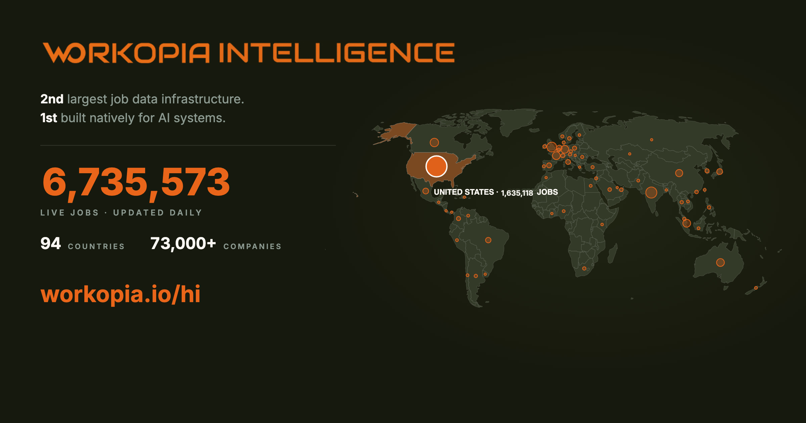

# Canada New Grad, Entry-Level & Internship Jobs 2026 — Updated Daily

Track the latest Canada **graduate schemes, entry-level roles, apprenticeships and internships** across Tech, Finance, Healthcare, Trades, Sales & Retail and Business & Admin. 698 hand-picked roles below — part of **7.9M+ active job ads sourced straight from employer career pages, refreshed daily, zero third-party scraping.**

Maintained by [**Workopia**](https://workopia.io/browsejobs/ca?utm_source=github&utm_medium=repo&utm_campaign=canada-new-grad-internship-jobs) — the world's 2nd largest job database, 94 countries, 2,517 cities.

🙏 **Spotted a wrong or closed role? [Open an issue](../../issues/new/choose) — see the [contribution guide](./CONTRIBUTING.md).** 🙏

---

### Browse 698 Roles by Category

- 🎓 **[New Grad Programs](#new-grad-programs)** (80) — Internships 80 · Graduate 0 · Entry-level 0
- 💻 **[Tech](#tech)** (123) — Internships 35 · Graduate 8 · Entry-level 80
- 📊 **[Data, AI & ML](#data-ai-ml)** (82) — Internships 25 · Graduate 0 · Entry-level 57
- 💷 **[Finance, Consulting & Accounting](#finance-consulting-accounting)** (93) — Internships 10 · Graduate 3 · Entry-level 80
- 🏥 **[Healthcare](#healthcare)** (80) — Entry-level 80
- 🔧 **[Trades & Apprenticeships](#trades-apprenticeships)** (80) — Entry-level 80
- 🛍️ **[Sales & Retail](#sales-retail)** (80) — Entry-level 80
- 🗂️ **[Business & Admin](#business-admin)** (80) — Entry-level 80

---

  <h3>🔎 Want the full, always-fresh list?</h3>
  
  
<i>This page is a hand-picked slice. Search & filter all 7.9M+ live jobs by role, city, salary & date on Workopia.</i>

---

  <h3>📊 What does this role actually pay?</h3>
  
<b><a href="https://workopia.io/browsejobs/ca?utm_source=github&utm_medium=repo&utm_campaign=canada-new-grad-internship-jobs">Compare Canada graduate salaries →</a></b>

  
<i>The ranges above are a preview. Full salary estimates, methodology & role requirements — by company, city & category — on Workopia.</i>

---

  <h3>🔔 Tired of checking every day?</h3>
  
  
<i>Get alerted when new Canada graduate & entry-level roles go live.</i>

  
Or <b>Watch → Custom → Releases</b> on this repo for a weekly email digest of new roles.

---

## Legend
- 🆕 Posted in the last 2 days
- 💷 Salary as disclosed by the employer; `*` = **WORKOPIA ESTIMATE** range — full breakdown, methodology & role requirements on each role's Workopia page
- 🔥 Notable / high-growth employer
- 🔒 Closed roles move to [Inactive Listings](./README-Inactive.md)

> **Looking for something else?**
> 🔒 Closed/older roles → [Inactive Listings](./README-Inactive.md)
> 🌍 Other countries → [UK](https://github.com/workopia/UK-Graduate-Jobs) · [US](https://github.com/workopia/US-New-Grad-Internship-Jobs) · [Australia](https://github.com/workopia/Australia-Graduate-Jobs) · [Singapore](https://github.com/workopia/Singapore-Graduate-Internship-Jobs) · [France](https://github.com/workopia/France-Graduate-Apprenticeship-Jobs) · [Germany](https://github.com/workopia/Germany-Graduate-Jobs) · [Spain](https://github.com/workopia/Spain-Graduate-Internship-Jobs) · [Netherlands](https://github.com/workopia/Netherlands-Graduate-Jobs) · [Hong Kong](https://github.com/workopia/Hong-Kong-Graduate-Internship-Jobs)
> 🔎 The full live list → [all Canada jobs on Workopia](https://workopia.io/browsejobs/ca?utm_source=github&utm_medium=repo&utm_campaign=canada-new-grad-internship-jobs)

## FAQs

**Which graduate jobs & internships can I still apply for right now?**
Many structured graduate schemes and summer internships run on annual cycles — but a large share of employers recruit on a **rolling basis**, and graduate *jobs*, apprenticeships, trades, sales and entry-level roles run year-round. This list shows what's **live today**, refreshed daily.

**What's an assessment centre and how do I prepare?**
A half- to two-day mix of group exercises, presentations, in-tray tasks and interviews — usually the final stage. See [interview & assessment tips on Workopia](https://workopia.io/resources/interview-tips?utm_source=github&utm_medium=repo&utm_campaign=canada-new-grad-internship-jobs).

**How do I get alerts for new roles?**
Set a job alert on Workopia by role + city and we'll email you when new Canada roles go live — [start here](https://workopia.io/browsejobs/positions/ca/graduate-program?utm_source=github&utm_medium=repo&utm_campaign=canada-new-grad-internship-jobs).

---

## 🎓 New Grad Programs

> 💡 Can't find a "graduate" role here? Check **Entry-level** below — adjacent roles count too (a Software Engineer can apply to Backend / Full Stack / AI Engineer).

### Internships (80)

<table>
<thead><tr><th width="17%">Company</th><th width="26%">Role</th><th width="11%">Location</th><th width="13%">Salary</th><th width="19%">Key skills</th><th width="8%">Apply</th><th width="6%">Age</th></tr></thead>
<tbody>
<tr><td><strong><a href="https://workopia.io/hi/companies/solar-turbines?utm_source=github&utm_medium=repo&utm_campaign=canada-new-grad-internship-jobs">Solar Turbines</a></strong></td><td>2027 It Intern 🆕</td><td>San Diego</td><td><a href="https://workopia.io/jobs/ee888291a5d3d3e9426dc80372302862?utm_source=github&utm_medium=repo&utm_campaign=canada-new-grad-internship-jobs">$22.5–40.25/hr</a></td><td>Software development, System administration</td><td><a href="https://workopia.io/jobs/ee888291a5d3d3e9426dc80372302862?utm_source=github&utm_medium=repo&utm_campaign=canada-new-grad-internship-jobs">Apply →</a></td><td>1d</td></tr>
<tr><td><strong><a href="https://workopia.io/hi/companies/bombardier?utm_source=github&utm_medium=repo&utm_campaign=canada-new-grad-internship-jobs">Bombardier</a></strong></td><td>Intern, Talent Acquisition (fall 2026) 🆕</td><td>Montreal</td><td><a href="https://workopia.io/jobs/6132bf58c11f97c222010424c3ebb2d4?utm_source=github&utm_medium=repo&utm_campaign=canada-new-grad-internship-jobs">See est. →</a></td><td>Team collaboration, Event coordination</td><td><a href="https://workopia.io/jobs/6132bf58c11f97c222010424c3ebb2d4?utm_source=github&utm_medium=repo&utm_campaign=canada-new-grad-internship-jobs">Apply →</a></td><td>1d</td></tr>
<tr><td><strong><a href="https://workopia.io/hi/companies/the-bank-of-nova-scotia?utm_source=github&utm_medium=repo&utm_campaign=canada-new-grad-internship-jobs">The Bank of Nova Scotia</a></strong></td><td>Gbm - Investment Banking Internship/co-op - Winte… 🆕</td><td>Toronto</td><td><a href="https://workopia.io/jobs/b931e171c0423b821151196a9624137b?utm_source=github&utm_medium=repo&utm_campaign=canada-new-grad-internship-jobs">See est. →</a></td><td>Financial Analysis, Valuation Models</td><td><a href="https://workopia.io/jobs/b931e171c0423b821151196a9624137b?utm_source=github&utm_medium=repo&utm_campaign=canada-new-grad-internship-jobs">Apply →</a></td><td>1d</td></tr>
<tr><td>↳</td><td>Gbm - Investment Banking Internship/co-op - Montr… 🆕</td><td>Montreal</td><td><a href="https://workopia.io/jobs/942f4f47c504e7ff158c3f0891213770?utm_source=github&utm_medium=repo&utm_campaign=canada-new-grad-internship-jobs">See est. →</a></td><td>Financial Analysis, Quantitative Skills</td><td><a href="https://workopia.io/jobs/942f4f47c504e7ff158c3f0891213770?utm_source=github&utm_medium=repo&utm_campaign=canada-new-grad-internship-jobs">Apply →</a></td><td>1d</td></tr>
<tr><td>↳</td><td>Gbm - Investment Banking Internship/co-op - Montr… 🆕</td><td>Montreal</td><td><a href="https://workopia.io/jobs/cbf6cd431b2f25a1b816554b378c183a?utm_source=github&utm_medium=repo&utm_campaign=canada-new-grad-internship-jobs">See est. →</a></td><td>Financial analysis, Valuation models</td><td><a href="https://workopia.io/jobs/cbf6cd431b2f25a1b816554b378c183a?utm_source=github&utm_medium=repo&utm_campaign=canada-new-grad-internship-jobs">Apply →</a></td><td>1d</td></tr>
<tr><td>↳</td><td>Services Bancaires Et Marchés Mondiaux Banque D'i… 🆕</td><td>Montreal</td><td><a href="https://workopia.io/jobs/22c0b70ac3d7e0ea6d852f571d3800fe?utm_source=github&utm_medium=repo&utm_campaign=canada-new-grad-internship-jobs">See est. →</a></td><td>Analyse financière, Modélisation financièr</td><td><a href="https://workopia.io/jobs/22c0b70ac3d7e0ea6d852f571d3800fe?utm_source=github&utm_medium=repo&utm_campaign=canada-new-grad-internship-jobs">Apply →</a></td><td>1d</td></tr>
<tr><td><strong><a href="https://workopia.io/hi/companies/techaroundworld-canada?utm_source=github&utm_medium=repo&utm_campaign=canada-new-grad-internship-jobs">techaroundworld Canada</a></strong></td><td>Junior Ap Advisor Intern- Contract 🆕</td><td>Canada</td><td><a href="https://workopia.io/jobs/86f68de094c0ccaf8ce41a59c4c703ba?utm_source=github&utm_medium=repo&utm_campaign=canada-new-grad-internship-jobs">$20–22/hr</a></td><td>Accounts Payable, Workday</td><td><a href="https://workopia.io/jobs/86f68de094c0ccaf8ce41a59c4c703ba?utm_source=github&utm_medium=repo&utm_campaign=canada-new-grad-internship-jobs">Apply →</a></td><td>1d</td></tr>
<tr><td><strong><a href="https://workopia.io/hi/companies/egis-in-anz?utm_source=github&utm_medium=repo&utm_campaign=canada-new-grad-internship-jobs">Egis in ANZ</a></strong></td><td>Intern, Transportation Structures</td><td>Toronto</td><td><a href="https://workopia.io/jobs/10e29a3374db753773d67eb6c34d1aba?utm_source=github&utm_medium=repo&utm_campaign=canada-new-grad-internship-jobs">See est. →</a></td><td>Civil Engineering, Structural Engineering</td><td><a href="https://workopia.io/jobs/10e29a3374db753773d67eb6c34d1aba?utm_source=github&utm_medium=repo&utm_campaign=canada-new-grad-internship-jobs">Apply →</a></td><td>2d</td></tr>
<tr><td><strong><a href="https://workopia.io/hi/companies/coty?utm_source=github&utm_medium=repo&utm_campaign=canada-new-grad-internship-jobs">Coty</a></strong></td><td>Operational Trade Marketing Intern</td><td>Toronto</td><td><a href="https://workopia.io/jobs/b9a031597c78c07ea1c598dc3222769c?utm_source=github&utm_medium=repo&utm_campaign=canada-new-grad-internship-jobs">$36,608</a></td><td>Detailed oriented, Data analysis</td><td><a href="https://workopia.io/jobs/b9a031597c78c07ea1c598dc3222769c?utm_source=github&utm_medium=repo&utm_campaign=canada-new-grad-internship-jobs">Apply →</a></td><td>2d</td></tr>
<tr><td><strong><a href="https://workopia.io/hi/companies/sap-se?utm_source=github&utm_medium=repo&utm_campaign=canada-new-grad-internship-jobs">SAP SE</a></strong></td><td>Sap Ixp Intern - Communications And Design [montr…</td><td>Montreal</td><td><a href="https://workopia.io/jobs/203134519fc90ccf3a5dba988a7a717c?utm_source=github&utm_medium=repo&utm_campaign=canada-new-grad-internship-jobs">See est. →</a></td><td>Content planning, Cross-functional colla</td><td><a href="https://workopia.io/jobs/203134519fc90ccf3a5dba988a7a717c?utm_source=github&utm_medium=repo&utm_campaign=canada-new-grad-internship-jobs">Apply →</a></td><td>2d</td></tr>
<tr><td>↳</td><td>Sap Ixp Intern - Project Management And Reporting…</td><td>Vancouver</td><td><a href="https://workopia.io/jobs/b6ce8e8fc7a3a35b8b39cee9802f21a4?utm_source=github&utm_medium=repo&utm_campaign=canada-new-grad-internship-jobs">See est. →</a></td><td>Project management exp, Data analysis skills</td><td><a href="https://workopia.io/jobs/b6ce8e8fc7a3a35b8b39cee9802f21a4?utm_source=github&utm_medium=repo&utm_campaign=canada-new-grad-internship-jobs">Apply →</a></td><td>2d</td></tr>
<tr><td><strong><a href="https://workopia.io/hi/companies/hitachi-rail?utm_source=github&utm_medium=repo&utm_campaign=canada-new-grad-internship-jobs">Hitachi Rail</a></strong></td><td>Stagiaire, Engagement Avec La Communauté</td><td>Montreal</td><td><a href="https://workopia.io/jobs/3ecf3885a4016ef9935be1c7870a1fd5?utm_source=github&utm_medium=repo&utm_campaign=canada-new-grad-internship-jobs">See est. →</a></td><td>Social media content c, Event logistics coordi</td><td><a href="https://workopia.io/jobs/3ecf3885a4016ef9935be1c7870a1fd5?utm_source=github&utm_medium=repo&utm_campaign=canada-new-grad-internship-jobs">Apply →</a></td><td>2d</td></tr>
<tr><td><strong><a href="https://workopia.io/hi/companies/hitachi-energy?utm_source=github&utm_medium=repo&utm_campaign=canada-new-grad-internship-jobs">Hitachi Energy</a></strong></td><td>Stagiaire, Engagement Avec La Communauté</td><td>Montreal</td><td><a href="https://workopia.io/jobs/0cc353b45b575d1d793bb72c20a06ff3?utm_source=github&utm_medium=repo&utm_campaign=canada-new-grad-internship-jobs">See est. →</a></td><td>Social media content c, Event coordination</td><td><a href="https://workopia.io/jobs/0cc353b45b575d1d793bb72c20a06ff3?utm_source=github&utm_medium=repo&utm_campaign=canada-new-grad-internship-jobs">Apply →</a></td><td>2d</td></tr>
<tr><td><strong><a href="https://workopia.io/hi/companies/hitachi-energy-canada-inc?utm_source=github&utm_medium=repo&utm_campaign=canada-new-grad-internship-jobs">HITACHI ENERGY CANADA INC.</a></strong></td><td>Stagiaire, Engagement Avec La Communauté</td><td>Montreal</td><td><a href="https://workopia.io/jobs/889ce3c5b7156eab2e548bb200fe73d0?utm_source=github&utm_medium=repo&utm_campaign=canada-new-grad-internship-jobs">See est. →</a></td><td>Social media content c, Event coordination</td><td><a href="https://workopia.io/jobs/889ce3c5b7156eab2e548bb200fe73d0?utm_source=github&utm_medium=repo&utm_campaign=canada-new-grad-internship-jobs">Apply →</a></td><td>2d</td></tr>
<tr><td><strong><a href="https://workopia.io/hi/companies/coty?utm_source=github&utm_medium=repo&utm_campaign=canada-new-grad-internship-jobs">Coty Inc</a></strong></td><td>Marketing Intern</td><td>Toronto</td><td><a href="https://workopia.io/jobs/331a1b3f96bd89c562c2cd7f7c05b455?utm_source=github&utm_medium=repo&utm_campaign=canada-new-grad-internship-jobs">$36,608</a></td><td>Brand Visuals, Campaign Execution</td><td><a href="https://workopia.io/jobs/331a1b3f96bd89c562c2cd7f7c05b455?utm_source=github&utm_medium=repo&utm_campaign=canada-new-grad-internship-jobs">Apply →</a></td><td>2d</td></tr>
<tr><td><strong><a href="https://workopia.io/hi/companies/abb?utm_source=github&utm_medium=repo&utm_campaign=canada-new-grad-internship-jobs">ABB Inc</a></strong></td><td>Environment, Health & Safety Intern – Fall 2026</td><td>Canada</td><td><a href="https://workopia.io/jobs/2bb5a3ac93caa2e86d1254920e935e7d?utm_source=github&utm_medium=repo&utm_campaign=canada-new-grad-internship-jobs">See est. →</a></td><td>EHS support, facility inspections</td><td><a href="https://workopia.io/jobs/2bb5a3ac93caa2e86d1254920e935e7d?utm_source=github&utm_medium=repo&utm_campaign=canada-new-grad-internship-jobs">Apply →</a></td><td>3d</td></tr>
<tr><td><strong><a href="https://workopia.io/hi/companies/baffinland?utm_source=github&utm_medium=repo&utm_campaign=canada-new-grad-internship-jobs">Baffinland</a></strong></td><td>Inuit Intern</td><td>Mary River Mine Site</td><td><a href="https://workopia.io/jobs/891b63a98b404a8009dcf0a529ce35bf?utm_source=github&utm_medium=repo&utm_campaign=canada-new-grad-internship-jobs">See est. →</a></td><td>Hands-on experience, Mentorship</td><td><a href="https://workopia.io/jobs/891b63a98b404a8009dcf0a529ce35bf?utm_source=github&utm_medium=repo&utm_campaign=canada-new-grad-internship-jobs">Apply →</a></td><td>3d</td></tr>
<tr><td><strong><a href="https://workopia.io/hi/companies/nokia?utm_source=github&utm_medium=repo&utm_campaign=canada-new-grad-internship-jobs">Nokia</a></strong></td><td>Incubation Developer Coop/intern</td><td>Ottawa</td><td><a href="https://workopia.io/jobs/4a5ed034f1d11765c7cfff71b3166345?utm_source=github&utm_medium=repo&utm_campaign=canada-new-grad-internship-jobs">See est. →</a></td><td>Automation strategies, Gen AI integration</td><td><a href="https://workopia.io/jobs/4a5ed034f1d11765c7cfff71b3166345?utm_source=github&utm_medium=repo&utm_campaign=canada-new-grad-internship-jobs">Apply →</a></td><td>3d</td></tr>
<tr><td><strong><a href="https://workopia.io/hi/companies/strategycorp-inc?utm_source=github&utm_medium=repo&utm_campaign=canada-new-grad-internship-jobs">StrategyCorp Inc.</a></strong></td><td>Intern - Strategycorp Institute Of Public Policy…</td><td>Ottawa</td><td><a href="https://workopia.io/jobs/a1a37ab146abb70157d04225ef31b3a2?utm_source=github&utm_medium=repo&utm_campaign=canada-new-grad-internship-jobs">$45,000</a></td><td>Economic impact analys, Quantitative data anal</td><td><a href="https://workopia.io/jobs/a1a37ab146abb70157d04225ef31b3a2?utm_source=github&utm_medium=repo&utm_campaign=canada-new-grad-internship-jobs">Apply →</a></td><td>3d</td></tr>
<tr><td><strong><a href="https://workopia.io/hi/companies/cscae?utm_source=github&utm_medium=repo&utm_campaign=canada-new-grad-internship-jobs">Cscae</a></strong></td><td>C-esg-100 Sustainable Development Intern</td><td>Montreal</td><td><a href="https://workopia.io/jobs/f1ffffd72b99037c07f1ac4247dc2739?utm_source=github&utm_medium=repo&utm_campaign=canada-new-grad-internship-jobs">See est. →</a></td><td>Sustainability reporti, ESG strategy</td><td><a href="https://workopia.io/jobs/f1ffffd72b99037c07f1ac4247dc2739?utm_source=github&utm_medium=repo&utm_campaign=canada-new-grad-internship-jobs">Apply →</a></td><td>4d</td></tr>
<tr><td><strong><a href="https://workopia.io/hi/companies/flightcrewready?utm_source=github&utm_medium=repo&utm_campaign=canada-new-grad-internship-jobs">Flightcrewready</a></strong></td><td>C-esg-100 Sustainable Development Intern</td><td>Montreal</td><td><a href="https://workopia.io/jobs/75a334395fcc11fa6bf75d1ad629c873?utm_source=github&utm_medium=repo&utm_campaign=canada-new-grad-internship-jobs">See est. →</a></td><td>Sustainability reporti, ESG strategy</td><td><a href="https://workopia.io/jobs/75a334395fcc11fa6bf75d1ad629c873?utm_source=github&utm_medium=repo&utm_campaign=canada-new-grad-internship-jobs">Apply →</a></td><td>4d</td></tr>
<tr><td><strong><a href="https://workopia.io/hi/companies/cae-australia?utm_source=github&utm_medium=repo&utm_campaign=canada-new-grad-internship-jobs">CAE Australia</a></strong></td><td>C-esg-100 Sustainable Development Intern</td><td>Montreal</td><td><a href="https://workopia.io/jobs/16b2f5c41e235b938e67f50b2ae77aaa?utm_source=github&utm_medium=repo&utm_campaign=canada-new-grad-internship-jobs">See est. →</a></td><td>Sustainability reporti, ESG strategy</td><td><a href="https://workopia.io/jobs/16b2f5c41e235b938e67f50b2ae77aaa?utm_source=github&utm_medium=repo&utm_campaign=canada-new-grad-internship-jobs">Apply →</a></td><td>4d</td></tr>
<tr><td><strong><a href="https://workopia.io/hi/companies/td-bank?utm_source=github&utm_medium=repo&utm_campaign=canada-new-grad-internship-jobs">TD Bank</a></strong></td><td>Intern/ Co-op Fall 2026</td><td>Toronto</td><td><a href="https://workopia.io/jobs/ddfe3cd6929e9ec6bf999d7752ac476c?utm_source=github&utm_medium=repo&utm_campaign=canada-new-grad-internship-jobs">$51,400–95,000</a></td><td>Financial/analytical s, Excellent communicatio</td><td><a href="https://workopia.io/jobs/ddfe3cd6929e9ec6bf999d7752ac476c?utm_source=github&utm_medium=repo&utm_campaign=canada-new-grad-internship-jobs">Apply →</a></td><td>4d</td></tr>
<tr><td><strong><a href="https://workopia.io/hi/companies/td?utm_source=github&utm_medium=repo&utm_campaign=canada-new-grad-internship-jobs">TD</a></strong></td><td>Intern/ Co-op Fall 2026</td><td>Toronto</td><td><a href="https://workopia.io/jobs/89feeff31c0542c95071a44a37633a16?utm_source=github&utm_medium=repo&utm_campaign=canada-new-grad-internship-jobs">$51,400–95,000</a></td><td>Financial modeling, Client support</td><td><a href="https://workopia.io/jobs/89feeff31c0542c95071a44a37633a16?utm_source=github&utm_medium=repo&utm_campaign=canada-new-grad-internship-jobs">Apply →</a></td><td>4d</td></tr>
<tr><td><strong><a href="https://workopia.io/hi/companies/emploisgevernovahydro?utm_source=github&utm_medium=repo&utm_campaign=canada-new-grad-internship-jobs">Emploisgevernovahydro</a></strong></td><td>Stagiaire À La Maintenance</td><td>Gaspé</td><td><a href="https://workopia.io/jobs/02574f136cfe61d34d0f8bca116b83eb?utm_source=github&utm_medium=repo&utm_campaign=canada-new-grad-internship-jobs">See est. →</a></td><td>Maintenance support, Production equipment i</td><td><a href="https://workopia.io/jobs/02574f136cfe61d34d0f8bca116b83eb?utm_source=github&utm_medium=repo&utm_campaign=canada-new-grad-internship-jobs">Apply →</a></td><td>4d</td></tr>
<tr><td><strong><a href="https://workopia.io/hi/companies/ge-vernova?utm_source=github&utm_medium=repo&utm_campaign=canada-new-grad-internship-jobs">GE VERNOVA</a></strong></td><td>Stagiaire À La Maintenance</td><td>Gaspé</td><td><a href="https://workopia.io/jobs/1268b0fd35ea636a4d5d44b36c5f9a29?utm_source=github&utm_medium=repo&utm_campaign=canada-new-grad-internship-jobs">See est. →</a></td><td>Maintenance support, Production equipment i</td><td><a href="https://workopia.io/jobs/1268b0fd35ea636a4d5d44b36c5f9a29?utm_source=github&utm_medium=repo&utm_campaign=canada-new-grad-internship-jobs">Apply →</a></td><td>4d</td></tr>
<tr><td><strong><a href="https://workopia.io/hi/companies/thales-group?utm_source=github&utm_medium=repo&utm_campaign=canada-new-grad-internship-jobs">Thales Group</a></strong></td><td>Stagiaire En Développement Full Stack</td><td>Montreal</td><td><a href="https://workopia.io/jobs/03bbbca9f234bc75aa73b31f6be80790?utm_source=github&utm_medium=repo&utm_campaign=canada-new-grad-internship-jobs">See est. →</a></td><td>Angular, TypeScript</td><td><a href="https://workopia.io/jobs/03bbbca9f234bc75aa73b31f6be80790?utm_source=github&utm_medium=repo&utm_campaign=canada-new-grad-internship-jobs">Apply →</a></td><td>5d</td></tr>
<tr><td>↳</td><td>Stagiaire Ivv-1</td><td>Montreal</td><td><a href="https://workopia.io/jobs/8fe7f3dd9968c7b2431a45193d92ab4e?utm_source=github&utm_medium=repo&utm_campaign=canada-new-grad-internship-jobs">See est. →</a></td><td>System testing, Test case development</td><td><a href="https://workopia.io/jobs/8fe7f3dd9968c7b2431a45193d92ab4e?utm_source=github&utm_medium=repo&utm_campaign=canada-new-grad-internship-jobs">Apply →</a></td><td>5d</td></tr>
<tr><td>↳</td><td>Stagiaire En Développement Outils & Processus Out…</td><td>Montreal</td><td><a href="https://workopia.io/jobs/206a2966ea16a0ad1decf92365657a67?utm_source=github&utm_medium=repo&utm_campaign=canada-new-grad-internship-jobs">See est. →</a></td><td>Scripting, Data consolidation</td><td><a href="https://workopia.io/jobs/206a2966ea16a0ad1decf92365657a67?utm_source=github&utm_medium=repo&utm_campaign=canada-new-grad-internship-jobs">Apply →</a></td><td>5d</td></tr>
<tr><td><strong><a href="https://workopia.io/hi/companies/mckesson?utm_source=github&utm_medium=repo&utm_campaign=canada-new-grad-internship-jobs">McKesson Corporation</a></strong></td><td>Stagiaire, Qualité Post-commercialisation – Marqu…</td><td>Montreal</td><td><a href="https://workopia.io/jobs/f98342c77a8d647432b91a6d80ea23a7?utm_source=github&utm_medium=repo&utm_campaign=canada-new-grad-internship-jobs">See est. →</a></td><td>Microsoft Suite, GMP compliance</td><td><a href="https://workopia.io/jobs/f98342c77a8d647432b91a6d80ea23a7?utm_source=github&utm_medium=repo&utm_campaign=canada-new-grad-internship-jobs">Apply →</a></td><td>5d</td></tr>
<tr><td><strong><a href="https://workopia.io/hi/companies/mckesson?utm_source=github&utm_medium=repo&utm_campaign=canada-new-grad-internship-jobs">McKesson</a></strong></td><td>Stagiaire, Qualité Post-commercialisation – Marqu… 🔥</td><td>Montreal</td><td><a href="https://workopia.io/jobs/8d8c0e471c74dac9a85ee3b99f2e722b?utm_source=github&utm_medium=repo&utm_campaign=canada-new-grad-internship-jobs">See est. →</a></td><td>Microsoft Suite, GMP compliance</td><td><a href="https://workopia.io/jobs/8d8c0e471c74dac9a85ee3b99f2e722b?utm_source=github&utm_medium=repo&utm_campaign=canada-new-grad-internship-jobs">Apply →</a></td><td>5d</td></tr>
<tr><td><strong><a href="https://workopia.io/hi/companies/smud?utm_source=github&utm_medium=repo&utm_campaign=canada-new-grad-internship-jobs">SMUD</a></strong></td><td>Treasury Intern: Year Round</td><td>Sacramento</td><td><a href="https://workopia.io/jobs/917790f0c618c5dfb6784033b9d87ea2?utm_source=github&utm_medium=repo&utm_campaign=canada-new-grad-internship-jobs">$19.91–24.25/hr</a></td><td>Microsoft Excel, Financial analysis</td><td><a href="https://workopia.io/jobs/917790f0c618c5dfb6784033b9d87ea2?utm_source=github&utm_medium=repo&utm_campaign=canada-new-grad-internship-jobs">Apply →</a></td><td>5d</td></tr>
<tr><td><strong><a href="https://workopia.io/hi/companies/watermancanyonpa?utm_source=github&utm_medium=repo&utm_campaign=canada-new-grad-internship-jobs">Watermancanyonpa</a></strong></td><td>Fall 2026 Music·team Internship</td><td>Los Angeles +5</td><td><a href="https://workopia.io/jobs/934e45a44604fc3b84e84dc80f9274ab?utm_source=github&utm_medium=repo&utm_campaign=canada-new-grad-internship-jobs">See est. →</a></td><td>In-person work, Strong communication s</td><td><a href="https://workopia.io/jobs/934e45a44604fc3b84e84dc80f9274ab?utm_source=github&utm_medium=repo&utm_campaign=canada-new-grad-internship-jobs">Apply →</a></td><td>5d</td></tr>
<tr><td>↳</td><td>Fall 2026 Internship - Golf Talent</td><td>Toronto</td><td><a href="https://workopia.io/jobs/6ac131bd97cf5bf8ea337da1f33092f9?utm_source=github&utm_medium=repo&utm_campaign=canada-new-grad-internship-jobs">See est. →</a></td><td>Microsoft Office profi, Communication skills</td><td><a href="https://workopia.io/jobs/6ac131bd97cf5bf8ea337da1f33092f9?utm_source=github&utm_medium=repo&utm_campaign=canada-new-grad-internship-jobs">Apply →</a></td><td>5d</td></tr>
<tr><td><strong><a href="https://workopia.io/hi/companies/pcl-constructors-westcoast-inc?utm_source=github&utm_medium=repo&utm_campaign=canada-new-grad-internship-jobs">PCL Constructors Westcoast Inc.</a></strong></td><td>Virtual Construction Student</td><td>Vancouver</td><td><a href="https://workopia.io/jobs/ae84a11441ffc9f3c9af91df539c1cdd?utm_source=github&utm_medium=repo&utm_campaign=canada-new-grad-internship-jobs">See est. →</a></td><td>Autodesk Revit, model coordination</td><td><a href="https://workopia.io/jobs/ae84a11441ffc9f3c9af91df539c1cdd?utm_source=github&utm_medium=repo&utm_campaign=canada-new-grad-internship-jobs">Apply →</a></td><td>5d</td></tr>
<tr><td><strong><a href="https://workopia.io/hi/companies/videotron?utm_source=github&utm_medium=repo&utm_campaign=canada-new-grad-internship-jobs">Vidéotron</a></strong></td><td>Stagiaire Informatique</td><td>Montreal</td><td><a href="https://workopia.io/jobs/0029a7515af081a2a80df7605b20a86e?utm_source=github&utm_medium=repo&utm_campaign=canada-new-grad-internship-jobs">See est. →</a></td><td>Windows 7, 8, 10, Active Directory</td><td><a href="https://workopia.io/jobs/0029a7515af081a2a80df7605b20a86e?utm_source=github&utm_medium=repo&utm_campaign=canada-new-grad-internship-jobs">Apply →</a></td><td>6d</td></tr>
<tr><td><strong><a href="https://workopia.io/hi/companies/zurich-insurance-uk?utm_source=github&utm_medium=repo&utm_campaign=canada-new-grad-internship-jobs">Zurich Insurance UK</a></strong></td><td>Financial Lines Fall Intern/co-op (september To D…</td><td>Vancouver</td><td><a href="https://workopia.io/jobs/be9c760b265c059729027e7138a55ae5?utm_source=github&utm_medium=repo&utm_campaign=canada-new-grad-internship-jobs">See est. →</a></td><td>financial analysis, risk analysis</td><td><a href="https://workopia.io/jobs/be9c760b265c059729027e7138a55ae5?utm_source=github&utm_medium=repo&utm_campaign=canada-new-grad-internship-jobs">Apply →</a></td><td>6d</td></tr>
<tr><td><strong><a href="https://workopia.io/hi/companies/tv-sd?utm_source=github&utm_medium=repo&utm_campaign=canada-new-grad-internship-jobs">TV SD</a></strong></td><td>Intern</td><td>Ontario</td><td><a href="https://workopia.io/jobs/18d8d36660fee374dc5f535b106215b5?utm_source=github&utm_medium=repo&utm_campaign=canada-new-grad-internship-jobs">See est. →</a></td><td>—</td><td><a href="https://workopia.io/jobs/18d8d36660fee374dc5f535b106215b5?utm_source=github&utm_medium=repo&utm_campaign=canada-new-grad-internship-jobs">Apply →</a></td><td>6d</td></tr>
<tr><td><strong><a href="https://workopia.io/hi/companies/bombardier?utm_source=github&utm_medium=repo&utm_campaign=canada-new-grad-internship-jobs">Bombardier</a></strong></td><td>Intern, Design Engineering (fall 2026)</td><td>Montreal</td><td><a href="https://workopia.io/jobs/f6fc5b36f51bf4cfa7e5ccaf526613a7?utm_source=github&utm_medium=repo&utm_campaign=canada-new-grad-internship-jobs">See est. →</a></td><td>Design software profic, Engineering principles</td><td><a href="https://workopia.io/jobs/f6fc5b36f51bf4cfa7e5ccaf526613a7?utm_source=github&utm_medium=repo&utm_campaign=canada-new-grad-internship-jobs">Apply →</a></td><td>7d</td></tr>
<tr><td>↳</td><td>Intern, Project Management - Methods (fall 2026)</td><td>Montreal</td><td><a href="https://workopia.io/jobs/56a732ebb6769c705737aed9a6cf7c98?utm_source=github&utm_medium=repo&utm_campaign=canada-new-grad-internship-jobs">See est. →</a></td><td>Project Management, Team Collaboration</td><td><a href="https://workopia.io/jobs/56a732ebb6769c705737aed9a6cf7c98?utm_source=github&utm_medium=repo&utm_campaign=canada-new-grad-internship-jobs">Apply →</a></td><td>7d</td></tr>
<tr><td>↳</td><td>Intern, Project Management (fall 2026)</td><td>Montreal</td><td><a href="https://workopia.io/jobs/86b1150c5ca43037196a4ea5abd20a20?utm_source=github&utm_medium=repo&utm_campaign=canada-new-grad-internship-jobs">See est. →</a></td><td>Project Management, Team Collaboration</td><td><a href="https://workopia.io/jobs/86b1150c5ca43037196a4ea5abd20a20?utm_source=github&utm_medium=repo&utm_campaign=canada-new-grad-internship-jobs">Apply →</a></td><td>7d</td></tr>
<tr><td>↳</td><td>Intern, Project Engineering - Global 8000 (fall 2…</td><td>Montreal</td><td><a href="https://workopia.io/jobs/5cdff00e12b89134cda12badf8e001e2?utm_source=github&utm_medium=repo&utm_campaign=canada-new-grad-internship-jobs">See est. →</a></td><td>Project coordination, Engineering support</td><td><a href="https://workopia.io/jobs/5cdff00e12b89134cda12badf8e001e2?utm_source=github&utm_medium=repo&utm_campaign=canada-new-grad-internship-jobs">Apply →</a></td><td>7d</td></tr>
<tr><td>↳</td><td>Intern, Events And Immersive Experiences, Strateg…</td><td>Montreal</td><td><a href="https://workopia.io/jobs/9f4bcfb3333af97d6ac2e35484ed77cc?utm_source=github&utm_medium=repo&utm_campaign=canada-new-grad-internship-jobs">See est. →</a></td><td>Event coordination, Immersive experiences</td><td><a href="https://workopia.io/jobs/9f4bcfb3333af97d6ac2e35484ed77cc?utm_source=github&utm_medium=repo&utm_campaign=canada-new-grad-internship-jobs">Apply →</a></td><td>7d</td></tr>
<tr><td>↳</td><td>Intern, Sourcing / Corporate And Engineering Serv…</td><td>Montreal</td><td><a href="https://workopia.io/jobs/6804f4139e673fcf7f215fa2a0c9b297?utm_source=github&utm_medium=repo&utm_campaign=canada-new-grad-internship-jobs">See est. →</a></td><td>Networking opportuniti, Conferences</td><td><a href="https://workopia.io/jobs/6804f4139e673fcf7f215fa2a0c9b297?utm_source=github&utm_medium=repo&utm_campaign=canada-new-grad-internship-jobs">Apply →</a></td><td>7d</td></tr>
<tr><td>↳</td><td>Intern, Cyber Security (fall 2026)</td><td>Montreal</td><td><a href="https://workopia.io/jobs/e988374313b881e2c91ece7900cfa944?utm_source=github&utm_medium=repo&utm_campaign=canada-new-grad-internship-jobs">See est. →</a></td><td>Cyber Security, Internship</td><td><a href="https://workopia.io/jobs/e988374313b881e2c91ece7900cfa944?utm_source=github&utm_medium=repo&utm_campaign=canada-new-grad-internship-jobs">Apply →</a></td><td>7d</td></tr>
<tr><td>↳</td><td>Intern, Procurement, Development Programs (fall 2…</td><td>Montreal</td><td><a href="https://workopia.io/jobs/2bb647dcad3b646e51ad1fcb56723654?utm_source=github&utm_medium=repo&utm_campaign=canada-new-grad-internship-jobs">See est. →</a></td><td>Procurement processes, Development programs</td><td><a href="https://workopia.io/jobs/2bb647dcad3b646e51ad1fcb56723654?utm_source=github&utm_medium=repo&utm_campaign=canada-new-grad-internship-jobs">Apply →</a></td><td>7d</td></tr>
<tr><td>↳</td><td>Intern, Data Management Analyst (fall 2026)</td><td>Montreal</td><td><a href="https://workopia.io/jobs/1788021503f249e96a052e852948fb27?utm_source=github&utm_medium=repo&utm_campaign=canada-new-grad-internship-jobs">See est. →</a></td><td>Data management, Analytical skills</td><td><a href="https://workopia.io/jobs/1788021503f249e96a052e852948fb27?utm_source=github&utm_medium=repo&utm_campaign=canada-new-grad-internship-jobs">Apply →</a></td><td>7d</td></tr>
<tr><td>↳</td><td>Intern, Product Strategy (fall 2026)</td><td>Montreal</td><td><a href="https://workopia.io/jobs/4b1197a59f49939680174dfe744cab46?utm_source=github&utm_medium=repo&utm_campaign=canada-new-grad-internship-jobs">See est. →</a></td><td>Product strategy, Innovation</td><td><a href="https://workopia.io/jobs/4b1197a59f49939680174dfe744cab46?utm_source=github&utm_medium=repo&utm_campaign=canada-new-grad-internship-jobs">Apply →</a></td><td>7d</td></tr>
<tr><td>↳</td><td>Intern, Research And Technology, Program Office…</td><td>Montreal</td><td><a href="https://workopia.io/jobs/b3ed056633895563104e88c3c05f3c41?utm_source=github&utm_medium=repo&utm_campaign=canada-new-grad-internship-jobs">See est. →</a></td><td>Research, Technology</td><td><a href="https://workopia.io/jobs/b3ed056633895563104e88c3c05f3c41?utm_source=github&utm_medium=repo&utm_campaign=canada-new-grad-internship-jobs">Apply →</a></td><td>7d</td></tr>
<tr><td>↳</td><td>Intern, Research And Technology, Aircraft System…</td><td>Montreal</td><td><a href="https://workopia.io/jobs/e5ac077bc3f085124fb7ceda1e75fae4?utm_source=github&utm_medium=repo&utm_campaign=canada-new-grad-internship-jobs">See est. →</a></td><td>Research, Technology</td><td><a href="https://workopia.io/jobs/e5ac077bc3f085124fb7ceda1e75fae4?utm_source=github&utm_medium=repo&utm_campaign=canada-new-grad-internship-jobs">Apply →</a></td><td>7d</td></tr>
<tr><td>↳</td><td>Intern, Finance - Aftermarket (fall 2026)</td><td>Montreal</td><td><a href="https://workopia.io/jobs/b03e3a1edc08bf9838f9779c96311ddc?utm_source=github&utm_medium=repo&utm_campaign=canada-new-grad-internship-jobs">See est. →</a></td><td>Financial analysis, Data entry</td><td><a href="https://workopia.io/jobs/b03e3a1edc08bf9838f9779c96311ddc?utm_source=github&utm_medium=repo&utm_campaign=canada-new-grad-internship-jobs">Apply →</a></td><td>7d</td></tr>
<tr><td>↳</td><td>Intern, Accounting/finance (fall 2026)</td><td>Montreal</td><td><a href="https://workopia.io/jobs/135fcf0acd372bdfbb3d202f526e57bd?utm_source=github&utm_medium=repo&utm_campaign=canada-new-grad-internship-jobs">See est. →</a></td><td>Accounting basics, Finance fundamentals</td><td><a href="https://workopia.io/jobs/135fcf0acd372bdfbb3d202f526e57bd?utm_source=github&utm_medium=repo&utm_campaign=canada-new-grad-internship-jobs">Apply →</a></td><td>7d</td></tr>
<tr><td>↳</td><td>Intern, Supply Chain (mech & Elec. Systems) (fall…</td><td>Montreal</td><td><a href="https://workopia.io/jobs/4d75809f45be7bdf75a9647ff4c88327?utm_source=github&utm_medium=repo&utm_campaign=canada-new-grad-internship-jobs">See est. →</a></td><td>Supply Chain, Mechanical Systems</td><td><a href="https://workopia.io/jobs/4d75809f45be7bdf75a9647ff4c88327?utm_source=github&utm_medium=repo&utm_campaign=canada-new-grad-internship-jobs">Apply →</a></td><td>7d</td></tr>
<tr><td>↳</td><td>Intern, Methods Core (fall 2026)</td><td>Montreal</td><td><a href="https://workopia.io/jobs/3e4acd4bcfe5a6f43cb7828fdcc10929?utm_source=github&utm_medium=repo&utm_campaign=canada-new-grad-internship-jobs">See est. →</a></td><td>Team collaboration, Networking opportuniti</td><td><a href="https://workopia.io/jobs/3e4acd4bcfe5a6f43cb7828fdcc10929?utm_source=github&utm_medium=repo&utm_campaign=canada-new-grad-internship-jobs">Apply →</a></td><td>7d</td></tr>
<tr><td><strong><a href="https://workopia.io/hi/companies/mckesson?utm_source=github&utm_medium=repo&utm_campaign=canada-new-grad-internship-jobs">McKesson Corporation</a></strong></td><td>Stagiaire En Transport – Automne 2026 / Transport…</td><td>Montreal</td><td><a href="https://workopia.io/jobs/e39640aab4ab4e494ab317ac7b80cc3f?utm_source=github&utm_medium=repo&utm_campaign=canada-new-grad-internship-jobs">See est. →</a></td><td>Transportation operati, Data management</td><td><a href="https://workopia.io/jobs/e39640aab4ab4e494ab317ac7b80cc3f?utm_source=github&utm_medium=repo&utm_campaign=canada-new-grad-internship-jobs">Apply →</a></td><td>9d</td></tr>
<tr><td><strong><a href="https://workopia.io/hi/companies/mckesson?utm_source=github&utm_medium=repo&utm_campaign=canada-new-grad-internship-jobs">McKesson</a></strong></td><td>Stagiaire En Transport – Automne 2026 / Transport… 🔥</td><td>Montreal</td><td><a href="https://workopia.io/jobs/3ea3c497c039c667d3cdc500e577892d?utm_source=github&utm_medium=repo&utm_campaign=canada-new-grad-internship-jobs">See est. →</a></td><td>Transportation coordin, Data management</td><td><a href="https://workopia.io/jobs/3ea3c497c039c667d3cdc500e577892d?utm_source=github&utm_medium=repo&utm_campaign=canada-new-grad-internship-jobs">Apply →</a></td><td>9d</td></tr>
<tr><td><strong><a href="https://workopia.io/hi/companies/appdirect?utm_source=github&utm_medium=repo&utm_campaign=canada-new-grad-internship-jobs">Appdirect</a></strong></td><td>Stagiaire, Avantages Sociaux Et Paie (6 Mois)</td><td>Montreal</td><td><a href="https://workopia.io/jobs/6cbbb4edaea32efbc631f69762a7d231?utm_source=github&utm_medium=repo&utm_campaign=canada-new-grad-internship-jobs">See est. →</a></td><td>Payroll management, Benefits administratio</td><td><a href="https://workopia.io/jobs/6cbbb4edaea32efbc631f69762a7d231?utm_source=github&utm_medium=repo&utm_campaign=canada-new-grad-internship-jobs">Apply →</a></td><td>9d</td></tr>
<tr><td><strong><a href="https://workopia.io/hi/companies/rtx?utm_source=github&utm_medium=repo&utm_campaign=canada-new-grad-internship-jobs">RTX Corporation</a></strong></td><td>Stagiaire En Hygiene Industrielle Et Ergonomie /…</td><td>Montreal</td><td><a href="https://workopia.io/jobs/dbd9c1235ffd4a4e60dc8eb3dd716953?utm_source=github&utm_medium=repo&utm_campaign=canada-new-grad-internship-jobs">See est. →</a></td><td>Industrial hygiene ass, Contaminant sampling</td><td><a href="https://workopia.io/jobs/dbd9c1235ffd4a4e60dc8eb3dd716953?utm_source=github&utm_medium=repo&utm_campaign=canada-new-grad-internship-jobs">Apply →</a></td><td>9d</td></tr>
<tr><td>↳</td><td>Stage - Industrialisation - Automne 2026</td><td>Montreal</td><td><a href="https://workopia.io/jobs/6e930797c3a703dc2c2d4e9746eeaee4?utm_source=github&utm_medium=repo&utm_campaign=canada-new-grad-internship-jobs">See est. →</a></td><td>French communication, Project management</td><td><a href="https://workopia.io/jobs/6e930797c3a703dc2c2d4e9746eeaee4?utm_source=github&utm_medium=repo&utm_campaign=canada-new-grad-internship-jobs">Apply →</a></td><td>9d</td></tr>
<tr><td>↳</td><td>Stage- Planificateur De Production (automne 2026)…</td><td>Montreal</td><td><a href="https://workopia.io/jobs/e671fcb9a9ba6361aac23c8f1e19645a?utm_source=github&utm_medium=repo&utm_campaign=canada-new-grad-internship-jobs">See est. →</a></td><td>Production tracking to, SAP</td><td><a href="https://workopia.io/jobs/e671fcb9a9ba6361aac23c8f1e19645a?utm_source=github&utm_medium=repo&utm_campaign=canada-new-grad-internship-jobs">Apply →</a></td><td>9d</td></tr>
<tr><td>↳</td><td>Stage- Automne 2026-transformation Numerique / In…</td><td>Montreal</td><td><a href="https://workopia.io/jobs/d1be37dbc23298cb012f4e4222e92984?utm_source=github&utm_medium=repo&utm_campaign=canada-new-grad-internship-jobs">See est. →</a></td><td>PLM, MES</td><td><a href="https://workopia.io/jobs/d1be37dbc23298cb012f4e4222e92984?utm_source=github&utm_medium=repo&utm_campaign=canada-new-grad-internship-jobs">Apply →</a></td><td>9d</td></tr>
<tr><td><strong><a href="https://workopia.io/hi/companies/rtx-raytheon?utm_source=github&utm_medium=repo&utm_campaign=canada-new-grad-internship-jobs">RTX (Raytheon Technologies)</a></strong></td><td>Stage -automne 2026- Gestion Des Processus D'affa…</td><td>Montreal</td><td><a href="https://workopia.io/jobs/6b47e3e5bdfc0f1fd3e49a8f1f1344d7?utm_source=github&utm_medium=repo&utm_campaign=canada-new-grad-internship-jobs">See est. →</a></td><td>Business Process Manag, Operations Analysis</td><td><a href="https://workopia.io/jobs/6b47e3e5bdfc0f1fd3e49a8f1f1344d7?utm_source=github&utm_medium=repo&utm_campaign=canada-new-grad-internship-jobs">Apply →</a></td><td>11d</td></tr>
<tr><td><strong><a href="https://workopia.io/hi/companies/rtx-raytheon?utm_source=github&utm_medium=repo&utm_campaign=canada-new-grad-internship-jobs">RTX (Raytheon)</a></strong></td><td>Stage -automne 2026- Gestion Des Processus D'affa…</td><td>Montreal</td><td><a href="https://workopia.io/jobs/7c8afc1ff0dd144b12a0b018d1caf1df?utm_source=github&utm_medium=repo&utm_campaign=canada-new-grad-internship-jobs">See est. →</a></td><td>Business Process Manag, Root Cause Analysis</td><td><a href="https://workopia.io/jobs/7c8afc1ff0dd144b12a0b018d1caf1df?utm_source=github&utm_medium=repo&utm_campaign=canada-new-grad-internship-jobs">Apply →</a></td><td>11d</td></tr>
<tr><td><strong><a href="https://workopia.io/hi/companies/mckesson?utm_source=github&utm_medium=repo&utm_campaign=canada-new-grad-internship-jobs">McKesson Corporation</a></strong></td><td>Stagiaire En Design Graphique – Automne 2026 / Gr…</td><td>Montreal</td><td><a href="https://workopia.io/jobs/abdeb08d1f3effaddb8555b9e55997e1?utm_source=github&utm_medium=repo&utm_campaign=canada-new-grad-internship-jobs">See est. →</a></td><td>Adobe Creative Cloud, Brand Guidelines</td><td><a href="https://workopia.io/jobs/abdeb08d1f3effaddb8555b9e55997e1?utm_source=github&utm_medium=repo&utm_campaign=canada-new-grad-internship-jobs">Apply →</a></td><td>11d</td></tr>
<tr><td>↳</td><td>Stagiaire, Excellence Corporative – Automne 2026…</td><td>Montreal</td><td><a href="https://workopia.io/jobs/182293da0602f11d1c37fde3de0758f5?utm_source=github&utm_medium=repo&utm_campaign=canada-new-grad-internship-jobs">See est. →</a></td><td>Microsoft Office, Excel</td><td><a href="https://workopia.io/jobs/182293da0602f11d1c37fde3de0758f5?utm_source=github&utm_medium=repo&utm_campaign=canada-new-grad-internship-jobs">Apply →</a></td><td>11d</td></tr>
<tr><td><strong><a href="https://workopia.io/hi/companies/mckesson?utm_source=github&utm_medium=repo&utm_campaign=canada-new-grad-internship-jobs">McKesson</a></strong></td><td>Stagiaire, Excellence Corporative – Automne 2026… 🔥</td><td>Montreal</td><td><a href="https://workopia.io/jobs/862032bb0d070dc4e0fbd53288d2d5f1?utm_source=github&utm_medium=repo&utm_campaign=canada-new-grad-internship-jobs">See est. →</a></td><td>Microsoft Office, Excel</td><td><a href="https://workopia.io/jobs/862032bb0d070dc4e0fbd53288d2d5f1?utm_source=github&utm_medium=repo&utm_campaign=canada-new-grad-internship-jobs">Apply →</a></td><td>11d</td></tr>
<tr><td>↳</td><td>Operational Excellence Intern - Fall 2026 🔥</td><td>Toronto</td><td><a href="https://workopia.io/jobs/4407483ba81c238e4e3540d4db446efd?utm_source=github&utm_medium=repo&utm_campaign=canada-new-grad-internship-jobs">See est. →</a></td><td>Project management sup, Operational data analy</td><td><a href="https://workopia.io/jobs/4407483ba81c238e4e3540d4db446efd?utm_source=github&utm_medium=repo&utm_campaign=canada-new-grad-internship-jobs">Apply →</a></td><td>11d</td></tr>
<tr><td><strong><a href="https://workopia.io/hi/companies/mckesson?utm_source=github&utm_medium=repo&utm_campaign=canada-new-grad-internship-jobs">McKesson Corporation</a></strong></td><td>Stagiaire En Opérations D'approvisionnement - Aut…</td><td>Canada</td><td><a href="https://workopia.io/jobs/f10cda8abffdb97cfe4313d6f6bda4ee?utm_source=github&utm_medium=repo&utm_campaign=canada-new-grad-internship-jobs">See est. →</a></td><td>Data entry, Delivery tracking</td><td><a href="https://workopia.io/jobs/f10cda8abffdb97cfe4313d6f6bda4ee?utm_source=github&utm_medium=repo&utm_campaign=canada-new-grad-internship-jobs">Apply →</a></td><td>12d</td></tr>
<tr><td><strong><a href="https://workopia.io/hi/companies/hitachi-rail-canada-inc?utm_source=github&utm_medium=repo&utm_campaign=canada-new-grad-internship-jobs">Hitachi Rail Canada Inc.</a></strong></td><td>Life Cycle Support Intern (fall 2026, 4-8months)</td><td>Toronto</td><td><a href="https://workopia.io/jobs/e56682b5dc1548d2efe6617edbdb69eb?utm_source=github&utm_medium=repo&utm_campaign=canada-new-grad-internship-jobs">$23–30/hr</a></td><td>Project management, Customer support</td><td><a href="https://workopia.io/jobs/e56682b5dc1548d2efe6617edbdb69eb?utm_source=github&utm_medium=repo&utm_campaign=canada-new-grad-internship-jobs">Apply →</a></td><td>12d</td></tr>
<tr><td><strong>120</strong></td><td>Pharmacy Intern, Managed Care (edmonton)</td><td>Edmonton</td><td><a href="https://workopia.io/jobs/ae17175b6e1650afd47f34268bd8206e?utm_source=github&utm_medium=repo&utm_campaign=canada-new-grad-internship-jobs">See est. →</a></td><td>Microsoft desktop appl, Kroll computer system</td><td><a href="https://workopia.io/jobs/ae17175b6e1650afd47f34268bd8206e?utm_source=github&utm_medium=repo&utm_campaign=canada-new-grad-internship-jobs">Apply →</a></td><td>13d</td></tr>
<tr><td><strong><a href="https://workopia.io/hi/companies/overwaitea-food-group-ltd-partnership?utm_source=github&utm_medium=repo&utm_campaign=canada-new-grad-internship-jobs">Overwaitea Food Group Ltd Partnership</a></strong></td><td>Pharmacy Intern, Managed Care (edmonton)</td><td>Edmonton</td><td><a href="https://workopia.io/jobs/476417f1da465fc9f5007d5b761be989?utm_source=github&utm_medium=repo&utm_campaign=canada-new-grad-internship-jobs">See est. →</a></td><td>Microsoft desktop appl, Kroll computer system</td><td><a href="https://workopia.io/jobs/476417f1da465fc9f5007d5b761be989?utm_source=github&utm_medium=repo&utm_campaign=canada-new-grad-internship-jobs">Apply →</a></td><td>13d</td></tr>
<tr><td><strong><a href="https://workopia.io/hi/companies/jayhawksatkey?utm_source=github&utm_medium=repo&utm_campaign=canada-new-grad-internship-jobs">Jayhawksatkey</a></strong></td><td>Pain Portfolio Marketing Intern (12-month Interns…</td><td>Toronto</td><td><a href="https://workopia.io/jobs/5e53f6e252b51354e17e2cbdc4feda59?utm_source=github&utm_medium=repo&utm_campaign=canada-new-grad-internship-jobs">$45,000–55,000/yr</a></td><td>Marketing, Brand Management</td><td><a href="https://workopia.io/jobs/5e53f6e252b51354e17e2cbdc4feda59?utm_source=github&utm_medium=repo&utm_campaign=canada-new-grad-internship-jobs">Apply →</a></td><td>13d</td></tr>
<tr><td><strong><a href="https://workopia.io/hi/companies/len-viral?utm_source=github&utm_medium=repo&utm_campaign=canada-new-grad-internship-jobs">Len Viral</a></strong></td><td>Pain Portfolio Marketing Intern (12-month Interns…</td><td>Toronto</td><td><a href="https://workopia.io/jobs/8c05583f76ed2db9fbfdd41da5629945?utm_source=github&utm_medium=repo&utm_campaign=canada-new-grad-internship-jobs">$45,000–55,000/yr</a></td><td>Marketing concepts, Analytical thinking</td><td><a href="https://workopia.io/jobs/8c05583f76ed2db9fbfdd41da5629945?utm_source=github&utm_medium=repo&utm_campaign=canada-new-grad-internship-jobs">Apply →</a></td><td>13d</td></tr>
<tr><td><strong><a href="https://workopia.io/hi/companies/connor-clark-lunn-financial-group-cc-l?utm_source=github&utm_medium=repo&utm_campaign=canada-new-grad-internship-jobs">Connor, Clark & Lunn Financial Group (CC&L)</a></strong></td><td>Intern, Investment Analytics Engagement</td><td>Vancouver</td><td><a href="https://workopia.io/jobs/ec7c5bef6417c198ee33058c165ecd3d?utm_source=github&utm_medium=repo&utm_campaign=canada-new-grad-internship-jobs">See est. →</a></td><td>Analytical skills, Data analysis</td><td><a href="https://workopia.io/jobs/ec7c5bef6417c198ee33058c165ecd3d?utm_source=github&utm_medium=repo&utm_campaign=canada-new-grad-internship-jobs">Apply →</a></td><td>13d</td></tr>
<tr><td><strong><a href="https://workopia.io/hi/companies/valsoft-corporation?utm_source=github&utm_medium=repo&utm_campaign=canada-new-grad-internship-jobs">Valsoft Corporation</a></strong></td><td>Stagiaire En F&a / M&a Internship (automne/fall)</td><td>Montreal</td><td><a href="https://workopia.io/jobs/ac5d23c18c670ab1e7bac5c64d13d298?utm_source=github&utm_medium=repo&utm_campaign=canada-new-grad-internship-jobs">See est. →</a></td><td>Financial modeling, Commercial due diligen</td><td><a href="https://workopia.io/jobs/ac5d23c18c670ab1e7bac5c64d13d298?utm_source=github&utm_medium=repo&utm_campaign=canada-new-grad-internship-jobs">Apply →</a></td><td>2w</td></tr>
<tr><td><strong><a href="https://workopia.io/hi/companies/cineplex?utm_source=github&utm_medium=repo&utm_campaign=canada-new-grad-internship-jobs">Cineplex</a></strong></td><td>Administrative Intern - Marketing & Sales, Cinepl…</td><td>Toronto</td><td><a href="https://workopia.io/jobs/2f326980ffdcaa4e59109af9eeccc884?utm_source=github&utm_medium=repo&utm_campaign=canada-new-grad-internship-jobs">See est. →</a></td><td>Microsoft Office profi, Strong communication s</td><td><a href="https://workopia.io/jobs/2f326980ffdcaa4e59109af9eeccc884?utm_source=github&utm_medium=repo&utm_campaign=canada-new-grad-internship-jobs">Apply →</a></td><td>2w</td></tr>
<tr><td><strong><a href="https://workopia.io/hi/companies/cae-australia?utm_source=github&utm_medium=repo&utm_campaign=canada-new-grad-internship-jobs">CAE Australia</a></strong></td><td>C-mo-420 Manufacturing Operations Management Intern</td><td>Montreal</td><td><a href="https://workopia.io/jobs/12504beb823eaf1eff650aa8ddff148c?utm_source=github&utm_medium=repo&utm_campaign=canada-new-grad-internship-jobs">See est. →</a></td><td>Production supervision, Team engagement</td><td><a href="https://workopia.io/jobs/12504beb823eaf1eff650aa8ddff148c?utm_source=github&utm_medium=repo&utm_campaign=canada-new-grad-internship-jobs">Apply →</a></td><td>2w</td></tr>
<tr><td><strong><a href="https://workopia.io/hi/companies/hp?utm_source=github&utm_medium=repo&utm_campaign=canada-new-grad-internship-jobs">HP</a></strong></td><td>College Intern 🔥</td><td>Toronto</td><td><a href="https://workopia.io/jobs/3164680?utm_source=github&utm_medium=repo&utm_campaign=canada-new-grad-internship-jobs">$45,000–50,000</a></td><td>Sales data analysis, Excel proficiency</td><td><a href="https://workopia.io/jobs/3164680?utm_source=github&utm_medium=repo&utm_campaign=canada-new-grad-internship-jobs">Apply →</a></td><td>3w</td></tr>
<tr><td><strong><a href="https://workopia.io/hi/companies/sonymusicentertainment?utm_source=github&utm_medium=repo&utm_campaign=canada-new-grad-internship-jobs">Sonymusicentertainment</a></strong></td><td>Intern, Commercial Partnerships</td><td>Toronto</td><td><a href="https://workopia.io/jobs/10c667e83d47471268fe40b2d05765a6?utm_source=github&utm_medium=repo&utm_campaign=canada-new-grad-internship-jobs">$17.75/hr</a></td><td>Data analysis, Digital platform manag</td><td><a href="https://workopia.io/jobs/10c667e83d47471268fe40b2d05765a6?utm_source=github&utm_medium=repo&utm_campaign=canada-new-grad-internship-jobs">Apply →</a></td><td>3w</td></tr>
<tr><td><strong><a href="https://workopia.io/hi/companies/st-regis-hotels-resorts?utm_source=github&utm_medium=repo&utm_campaign=canada-new-grad-internship-jobs">St. Regis Hotels & Resorts</a></strong></td><td>Banquet Intern - Fall 2026</td><td>Toronto</td><td><a href="https://workopia.io/jobs/8488bb5706d95cc0c5862f6560c83882?utm_source=github&utm_medium=repo&utm_campaign=canada-new-grad-internship-jobs">See est. →</a></td><td>Hands-on experience, Hotel operations</td><td><a href="https://workopia.io/jobs/8488bb5706d95cc0c5862f6560c83882?utm_source=github&utm_medium=repo&utm_campaign=canada-new-grad-internship-jobs">Apply →</a></td><td>3w</td></tr>
</tbody>
</table>

🔎 **[Browse & filter all live Canada New Grad Programs jobs on Workopia →](https://workopia.io/browsejobs/positions/ca/graduate-program?utm_source=github&utm_medium=repo&utm_campaign=canada-new-grad-internship-jobs)**

[⬆️ Back to top](#canada-new-grad-entry-level-internship-jobs-2026)

## 💻 Tech

> 💡 Can't find a "graduate" role here? Check **Entry-level** below — adjacent roles count too (a Software Engineer can apply to Backend / Full Stack / AI Engineer).

### Internships (35)

<table>
<thead><tr><th width="17%">Company</th><th width="26%">Role</th><th width="11%">Location</th><th width="13%">Salary</th><th width="19%">Key skills</th><th width="8%">Apply</th><th width="6%">Age</th></tr></thead>
<tbody>
<tr><td><strong><a href="https://workopia.io/hi/companies/intact-financial?utm_source=github&utm_medium=repo&utm_campaign=canada-new-grad-internship-jobs">Intact Financial</a></strong></td><td>Security Analyst I – 4 Month Internship/co-op (fa… 🆕</td><td>Canada</td><td><a href="https://workopia.io/jobs/480ca4c479941b210ae9eed4cb844a7f?utm_source=github&utm_medium=repo&utm_campaign=canada-new-grad-internship-jobs">See est. →</a></td><td>Full-time, 35 hours per week</td><td><a href="https://workopia.io/jobs/480ca4c479941b210ae9eed4cb844a7f?utm_source=github&utm_medium=repo&utm_campaign=canada-new-grad-internship-jobs">Apply →</a></td><td>1d</td></tr>
<tr><td><strong><a href="https://workopia.io/hi/companies/dana?utm_source=github&utm_medium=repo&utm_campaign=canada-new-grad-internship-jobs">Dana</a></strong></td><td>Electro-magnetic Intern 🔥</td><td>Montreal</td><td><a href="https://workopia.io/jobs/c4bc7f0c8895b2333c25263809aebda3?utm_source=github&utm_medium=repo&utm_campaign=canada-new-grad-internship-jobs">$24–27.75/hr</a></td><td>Motor electromagnetic , Thermal simulation in </td><td><a href="https://workopia.io/jobs/c4bc7f0c8895b2333c25263809aebda3?utm_source=github&utm_medium=repo&utm_campaign=canada-new-grad-internship-jobs">Apply →</a></td><td>2d</td></tr>
<tr><td><strong><a href="https://workopia.io/hi/companies/globalrelay?utm_source=github&utm_medium=repo&utm_campaign=canada-new-grad-internship-jobs">Globalrelay</a></strong></td><td>Co-op C# Developer - Fall 2026</td><td>Vancouver</td><td><a href="https://workopia.io/jobs/b78b2fb7334c6f97a20a9e67a471a141?utm_source=github&utm_medium=repo&utm_campaign=canada-new-grad-internship-jobs">$42,000</a></td><td>C# programming, Object-Oriented langua</td><td><a href="https://workopia.io/jobs/b78b2fb7334c6f97a20a9e67a471a141?utm_source=github&utm_medium=repo&utm_campaign=canada-new-grad-internship-jobs">Apply →</a></td><td>5d</td></tr>
<tr><td><strong><a href="https://workopia.io/hi/companies/drweng?utm_source=github&utm_medium=repo&utm_campaign=canada-new-grad-internship-jobs">Drweng</a></strong></td><td>Software Developer Intern</td><td>Montreal</td><td><a href="https://workopia.io/jobs/9e4b1a7a328377ef38be1b09f6140a62?utm_source=github&utm_medium=repo&utm_campaign=canada-new-grad-internship-jobs">See est. →</a></td><td>Object-oriented design, Data structures</td><td><a href="https://workopia.io/jobs/9e4b1a7a328377ef38be1b09f6140a62?utm_source=github&utm_medium=repo&utm_campaign=canada-new-grad-internship-jobs">Apply →</a></td><td>6d</td></tr>
<tr><td><strong><a href="https://workopia.io/hi/companies/bombardier?utm_source=github&utm_medium=repo&utm_campaign=canada-new-grad-internship-jobs">Bombardier</a></strong></td><td>Intern, Stress Analysis, Challenger And Global Pr…</td><td>Montreal</td><td><a href="https://workopia.io/jobs/9cd8069919b5bc34896747a1904c5790?utm_source=github&utm_medium=repo&utm_campaign=canada-new-grad-internship-jobs">See est. →</a></td><td>Stress analysis, Aerospace engineering</td><td><a href="https://workopia.io/jobs/9cd8069919b5bc34896747a1904c5790?utm_source=github&utm_medium=repo&utm_campaign=canada-new-grad-internship-jobs">Apply →</a></td><td>7d</td></tr>
<tr><td><strong><a href="https://workopia.io/hi/companies/dana?utm_source=github&utm_medium=repo&utm_campaign=canada-new-grad-internship-jobs">Dana</a></strong></td><td>Eng_co-op/intern/trainee 🔥</td><td>Montreal</td><td><a href="https://workopia.io/jobs/2a0275962a8b84c491e19633234f21f3?utm_source=github&utm_medium=repo&utm_campaign=canada-new-grad-internship-jobs">See est. →</a></td><td>CAD software, Geometric Dimensioning</td><td><a href="https://workopia.io/jobs/2a0275962a8b84c491e19633234f21f3?utm_source=github&utm_medium=repo&utm_campaign=canada-new-grad-internship-jobs">Apply →</a></td><td>8d</td></tr>
<tr><td>↳</td><td>Advanced Engineering Intern 🔥</td><td>Montreal</td><td><a href="https://workopia.io/jobs/e7a88778400b19d26a4f727ae606a474?utm_source=github&utm_medium=repo&utm_campaign=canada-new-grad-internship-jobs">See est. →</a></td><td>CAD software, GD&T knowledge</td><td><a href="https://workopia.io/jobs/e7a88778400b19d26a4f727ae606a474?utm_source=github&utm_medium=repo&utm_campaign=canada-new-grad-internship-jobs">Apply →</a></td><td>8d</td></tr>
<tr><td><strong><a href="https://workopia.io/hi/companies/fm1047-ca?utm_source=github&utm_medium=repo&utm_campaign=canada-new-grad-internship-jobs">fm1047.ca</a></strong></td><td>It Support Intern</td><td>Toronto</td><td><a href="https://workopia.io/jobs/1a354ea1848c184908253a5b022441db?utm_source=github&utm_medium=repo&utm_campaign=canada-new-grad-internship-jobs">See est. →</a></td><td>Windows 10/11, Google Suite</td><td><a href="https://workopia.io/jobs/1a354ea1848c184908253a5b022441db?utm_source=github&utm_medium=repo&utm_campaign=canada-new-grad-internship-jobs">Apply →</a></td><td>9d</td></tr>
<tr><td><strong><a href="https://workopia.io/hi/companies/tmx-group?utm_source=github&utm_medium=repo&utm_campaign=canada-new-grad-internship-jobs">TMX Group</a></strong></td><td>It Support Intern</td><td>Toronto</td><td><a href="https://workopia.io/jobs/0b7b7af5ecf0dbb3e1df283d99f39767?utm_source=github&utm_medium=repo&utm_campaign=canada-new-grad-internship-jobs">See est. →</a></td><td>Windows 10/11, Google Suite</td><td><a href="https://workopia.io/jobs/0b7b7af5ecf0dbb3e1df283d99f39767?utm_source=github&utm_medium=repo&utm_campaign=canada-new-grad-internship-jobs">Apply →</a></td><td>9d</td></tr>
<tr><td><strong><a href="https://workopia.io/hi/companies/cdcc-ca?utm_source=github&utm_medium=repo&utm_campaign=canada-new-grad-internship-jobs">cdcc.ca</a></strong></td><td>It Support Intern</td><td>Toronto</td><td><a href="https://workopia.io/jobs/c143d07c245bd8585596e6d3f0b5853f?utm_source=github&utm_medium=repo&utm_campaign=canada-new-grad-internship-jobs">See est. →</a></td><td>Windows 10/11, Google Suite</td><td><a href="https://workopia.io/jobs/c143d07c245bd8585596e6d3f0b5853f?utm_source=github&utm_medium=repo&utm_campaign=canada-new-grad-internship-jobs">Apply →</a></td><td>9d</td></tr>
<tr><td><strong><a href="https://workopia.io/hi/companies/sap-se?utm_source=github&utm_medium=repo&utm_campaign=canada-new-grad-internship-jobs">SAP SE</a></strong></td><td>Sap Ixp Intern - Application Lifecycle Management…</td><td>Toronto</td><td><a href="https://workopia.io/jobs/727fb18ecaa960ce21989ecb3065f20d?utm_source=github&utm_medium=repo&utm_campaign=canada-new-grad-internship-jobs">See est. →</a></td><td>SAP Cloud ALM expertis, Problem-solving skills</td><td><a href="https://workopia.io/jobs/727fb18ecaa960ce21989ecb3065f20d?utm_source=github&utm_medium=repo&utm_campaign=canada-new-grad-internship-jobs">Apply →</a></td><td>9d</td></tr>
<tr><td><strong><a href="https://workopia.io/hi/companies/hitachi-rail?utm_source=github&utm_medium=repo&utm_campaign=canada-new-grad-internship-jobs">Hitachi Rail</a></strong></td><td>Stagiaire En Hvdc – Ingénieur En Électricité – Ma…</td><td>Montreal</td><td><a href="https://workopia.io/jobs/4dda35b2f347911206a809c5138b7a41?utm_source=github&utm_medium=repo&utm_campaign=canada-new-grad-internship-jobs">See est. →</a></td><td>HVDC systems, RMS/EMT tools</td><td><a href="https://workopia.io/jobs/4dda35b2f347911206a809c5138b7a41?utm_source=github&utm_medium=repo&utm_campaign=canada-new-grad-internship-jobs">Apply →</a></td><td>12d</td></tr>
<tr><td><strong><a href="https://workopia.io/hi/companies/hitachi-energy-canada-inc?utm_source=github&utm_medium=repo&utm_campaign=canada-new-grad-internship-jobs">HITACHI ENERGY CANADA INC.</a></strong></td><td>Stagiaire En Hvdc – Ingénieur En Électricité – Ma…</td><td>Montreal</td><td><a href="https://workopia.io/jobs/dbfe0c2b678a363481a0272d40fbc1d2?utm_source=github&utm_medium=repo&utm_campaign=canada-new-grad-internship-jobs">See est. →</a></td><td>HVDC Systems, RMS/EMT Tools</td><td><a href="https://workopia.io/jobs/dbfe0c2b678a363481a0272d40fbc1d2?utm_source=github&utm_medium=repo&utm_campaign=canada-new-grad-internship-jobs">Apply →</a></td><td>12d</td></tr>
<tr><td><strong><a href="https://workopia.io/hi/companies/abb?utm_source=github&utm_medium=repo&utm_campaign=canada-new-grad-internship-jobs">ABB UK</a></strong></td><td>Electrical Engineering Intern</td><td>Montreal</td><td><a href="https://workopia.io/jobs/897cfe21948047f4d0e1dfd98cfedd02?utm_source=github&utm_medium=repo&utm_campaign=canada-new-grad-internship-jobs">See est. →</a></td><td>Testing of winch contr, SIL 3 brake control sy</td><td><a href="https://workopia.io/jobs/897cfe21948047f4d0e1dfd98cfedd02?utm_source=github&utm_medium=repo&utm_campaign=canada-new-grad-internship-jobs">Apply →</a></td><td>13d</td></tr>
<tr><td><strong><a href="https://workopia.io/hi/companies/abb?utm_source=github&utm_medium=repo&utm_campaign=canada-new-grad-internship-jobs">ABB Ltd</a></strong></td><td>Electrical Engineering Intern</td><td>Montreal</td><td><a href="https://workopia.io/jobs/8e31cc935b8b98385182a06262d3fe09?utm_source=github&utm_medium=repo&utm_campaign=canada-new-grad-internship-jobs">See est. →</a></td><td>Testing of winch contr, SIL 3 brake control sy</td><td><a href="https://workopia.io/jobs/8e31cc935b8b98385182a06262d3fe09?utm_source=github&utm_medium=repo&utm_campaign=canada-new-grad-internship-jobs">Apply →</a></td><td>13d</td></tr>
<tr><td><strong><a href="https://workopia.io/hi/companies/sonymusicentertainment?utm_source=github&utm_medium=repo&utm_campaign=canada-new-grad-internship-jobs">Sonymusicentertainment</a></strong></td><td>Intern, It Support</td><td>Toronto</td><td><a href="https://workopia.io/jobs/ba304808ffb854c1f39cc0eaa184d22c?utm_source=github&utm_medium=repo&utm_campaign=canada-new-grad-internship-jobs">$17.75/hr</a></td><td>technical support, system maintenance</td><td><a href="https://workopia.io/jobs/ba304808ffb854c1f39cc0eaa184d22c?utm_source=github&utm_medium=repo&utm_campaign=canada-new-grad-internship-jobs">Apply →</a></td><td>3w</td></tr>
<tr><td><strong><a href="https://workopia.io/hi/companies/hitachi-rail?utm_source=github&utm_medium=repo&utm_campaign=canada-new-grad-internship-jobs">Hitachi Rail</a></strong></td><td>Stagiaire – Chargé De Projet Manufacturier (profi…</td><td>Montreal</td><td><a href="https://workopia.io/jobs/9e42635af1d90d0f656496abd633877c?utm_source=github&utm_medium=repo&utm_campaign=canada-new-grad-internship-jobs">See est. →</a></td><td>CAD software proficien, project coordination</td><td><a href="https://workopia.io/jobs/9e42635af1d90d0f656496abd633877c?utm_source=github&utm_medium=repo&utm_campaign=canada-new-grad-internship-jobs">Apply →</a></td><td>3w</td></tr>
<tr><td><strong><a href="https://workopia.io/hi/companies/playshoptitans?utm_source=github&utm_medium=repo&utm_campaign=canada-new-grad-internship-jobs">Playshoptitans</a></strong></td><td>Software Engineer (gameplay) Co-op</td><td>Vancouver</td><td><a href="https://workopia.io/jobs/f6f9340bb9f76f7465a5488d5dfb50bd?utm_source=github&utm_medium=repo&utm_campaign=canada-new-grad-internship-jobs">See est. →</a></td><td>Gameplay development, Code quality</td><td><a href="https://workopia.io/jobs/f6f9340bb9f76f7465a5488d5dfb50bd?utm_source=github&utm_medium=repo&utm_campaign=canada-new-grad-internship-jobs">Apply →</a></td><td>4w</td></tr>
<tr><td><strong><a href="https://workopia.io/hi/companies/raytheon-australia?utm_source=github&utm_medium=repo&utm_campaign=canada-new-grad-internship-jobs">Raytheon Australia</a></strong></td><td>Stage - Automne 2026 - Ingénierie De Client / Int…</td><td>Montreal</td><td><a href="https://workopia.io/jobs/9f89619d5d7140f457232859cd087466?utm_source=github&utm_medium=repo&utm_campaign=canada-new-grad-internship-jobs">See est. →</a></td><td>Customer Engineering, Data Analysis</td><td><a href="https://workopia.io/jobs/9f89619d5d7140f457232859cd087466?utm_source=github&utm_medium=repo&utm_campaign=canada-new-grad-internship-jobs">Apply →</a></td><td>4w</td></tr>
<tr><td>↳</td><td>Stage Automne 2026 - Supervision Proactive De La…</td><td>Montreal</td><td><a href="https://workopia.io/jobs/35be0f70663848777eac7601eb1d869d?utm_source=github&utm_medium=repo&utm_campaign=canada-new-grad-internship-jobs">See est. →</a></td><td>Engine performance mon, Data analysis</td><td><a href="https://workopia.io/jobs/35be0f70663848777eac7601eb1d869d?utm_source=github&utm_medium=repo&utm_campaign=canada-new-grad-internship-jobs">Apply →</a></td><td>4w</td></tr>
<tr><td><strong><a href="https://workopia.io/hi/companies/hitachi-vantara?utm_source=github&utm_medium=repo&utm_campaign=canada-new-grad-internship-jobs">Hitachi Vantara</a></strong></td><td>Stagiaire – Chargé De Projet Manufacturier (profi…</td><td>Montreal</td><td><a href="https://workopia.io/jobs/16e529f3b5e40f19e88ad7a926b6262c?utm_source=github&utm_medium=repo&utm_campaign=canada-new-grad-internship-jobs">See est. →</a></td><td>CAD software, project coordination</td><td><a href="https://workopia.io/jobs/16e529f3b5e40f19e88ad7a926b6262c?utm_source=github&utm_medium=repo&utm_campaign=canada-new-grad-internship-jobs">Apply →</a></td><td>4w</td></tr>
<tr><td><strong><a href="https://workopia.io/hi/companies/hitachi-metals?utm_source=github&utm_medium=repo&utm_campaign=canada-new-grad-internship-jobs">Hitachi Metals</a></strong></td><td>Stagiaire En Maintenance</td><td>Montreal</td><td><a href="https://workopia.io/jobs/6c5e56ccc60dd431d712d178cdc38f64?utm_source=github&utm_medium=repo&utm_campaign=canada-new-grad-internship-jobs">See est. →</a></td><td>Bilingual: French and , MS Project</td><td><a href="https://workopia.io/jobs/6c5e56ccc60dd431d712d178cdc38f64?utm_source=github&utm_medium=repo&utm_campaign=canada-new-grad-internship-jobs">Apply →</a></td><td>4w</td></tr>
<tr><td><strong><a href="https://workopia.io/hi/companies/pcl-constructors-inc?utm_source=github&utm_medium=repo&utm_campaign=canada-new-grad-internship-jobs">PCL Constructors Inc</a></strong></td><td>Engineering/technical Student</td><td>Montreal</td><td><a href="https://workopia.io/jobs/17cf3181df380e14a759c31e54ae3600?utm_source=github&utm_medium=repo&utm_campaign=canada-new-grad-internship-jobs">See est. →</a></td><td>Coordinate work with s, Maintain quality and u</td><td><a href="https://workopia.io/jobs/17cf3181df380e14a759c31e54ae3600?utm_source=github&utm_medium=repo&utm_campaign=canada-new-grad-internship-jobs">Apply →</a></td><td>4w</td></tr>
<tr><td><strong><a href="https://workopia.io/hi/companies/cae?utm_source=github&utm_medium=repo&utm_campaign=canada-new-grad-internship-jobs">CAE Inc</a></strong></td><td>C-ge-055 - Software Developer Intern– Operating S…</td><td>Montreal</td><td><a href="https://workopia.io/jobs/2bed986f659a394687959fd06dfe0140?utm_source=github&utm_medium=repo&utm_campaign=canada-new-grad-internship-jobs">See est. →</a></td><td>Windows and Linux soft, software integration</td><td><a href="https://workopia.io/jobs/2bed986f659a394687959fd06dfe0140?utm_source=github&utm_medium=repo&utm_campaign=canada-new-grad-internship-jobs">Apply →</a></td><td>5w</td></tr>
<tr><td>↳</td><td>C-ge-951 Software Developer Intern</td><td>Montreal</td><td><a href="https://workopia.io/jobs/3110ba1c0435f606c898fff4734b6963?utm_source=github&utm_medium=repo&utm_campaign=canada-new-grad-internship-jobs">See est. →</a></td><td>C programming, C++ programming</td><td><a href="https://workopia.io/jobs/3110ba1c0435f606c898fff4734b6963?utm_source=github&utm_medium=repo&utm_campaign=canada-new-grad-internship-jobs">Apply →</a></td><td>5w</td></tr>
<tr><td><strong><a href="https://workopia.io/hi/companies/aecon-group?utm_source=github&utm_medium=repo&utm_campaign=canada-new-grad-internship-jobs">Aecon Group</a></strong></td><td>Co-op Engineering Student</td><td>Montreal</td><td><a href="https://workopia.io/jobs/740500f3624ca87df0f9e388753d7386?utm_source=github&utm_medium=repo&utm_campaign=canada-new-grad-internship-jobs">$23–25/hr</a></td><td>Site-based work, Project management</td><td><a href="https://workopia.io/jobs/740500f3624ca87df0f9e388753d7386?utm_source=github&utm_medium=repo&utm_campaign=canada-new-grad-internship-jobs">Apply →</a></td><td>5w</td></tr>
<tr><td><strong><a href="https://workopia.io/hi/companies/rtx?utm_source=github&utm_medium=repo&utm_campaign=canada-new-grad-internship-jobs">RTX Corporation</a></strong></td><td>Stage Automne 2026 - Supervision Proactive De La…</td><td>Montreal</td><td><a href="https://workopia.io/jobs/1a800db035e9261444b9077256b75347?utm_source=github&utm_medium=repo&utm_campaign=canada-new-grad-internship-jobs">See est. →</a></td><td>Engine data analysis f, Performance monitoring</td><td><a href="https://workopia.io/jobs/1a800db035e9261444b9077256b75347?utm_source=github&utm_medium=repo&utm_campaign=canada-new-grad-internship-jobs">Apply →</a></td><td>6w</td></tr>
<tr><td>↳</td><td>Stage Automne 2026 - Génie Manufacturier / Intern…</td><td>Montreal</td><td><a href="https://workopia.io/jobs/314edb0411b3d32fb2a75ab3ab5a93b1?utm_source=github&utm_medium=repo&utm_campaign=canada-new-grad-internship-jobs">See est. →</a></td><td>Eligible to work in Ca, Enrolled in Canadian u</td><td><a href="https://workopia.io/jobs/314edb0411b3d32fb2a75ab3ab5a93b1?utm_source=github&utm_medium=repo&utm_campaign=canada-new-grad-internship-jobs">Apply →</a></td><td>6w</td></tr>
<tr><td>↳</td><td>Stage - Automne 2026 - Ingénieur Client Et Nouvea…</td><td>Montreal</td><td><a href="https://workopia.io/jobs/841bdb3ab92bd9c2eecc2945e42e3963?utm_source=github&utm_medium=repo&utm_campaign=canada-new-grad-internship-jobs">See est. →</a></td><td>Mechanical engineering, Eligible to work in Ca</td><td><a href="https://workopia.io/jobs/841bdb3ab92bd9c2eecc2945e42e3963?utm_source=github&utm_medium=repo&utm_campaign=canada-new-grad-internship-jobs">Apply →</a></td><td>6w</td></tr>
<tr><td>↳</td><td>Stage - Automne 2026 - Ingénierie De Client / Int…</td><td>Montreal</td><td><a href="https://workopia.io/jobs/c062502bfd2ac47b7f74cf0bbf774a19?utm_source=github&utm_medium=repo&utm_campaign=canada-new-grad-internship-jobs">See est. →</a></td><td>Pursuing Mechanical, I, Eligible to work in Ca</td><td><a href="https://workopia.io/jobs/c062502bfd2ac47b7f74cf0bbf774a19?utm_source=github&utm_medium=repo&utm_campaign=canada-new-grad-internship-jobs">Apply →</a></td><td>6w</td></tr>
<tr><td><strong><a href="https://workopia.io/hi/companies/vantage-data-centers?utm_source=github&utm_medium=repo&utm_campaign=canada-new-grad-internship-jobs">Vantage Data Centers</a></strong></td><td>Critical Facility Operation Intern, Na</td><td>Montreal</td><td><a href="https://workopia.io/jobs/a14197ca761380814fea240fa7a44485?utm_source=github&utm_medium=repo&utm_campaign=canada-new-grad-internship-jobs">See est. →</a></td><td>Read electrical and me, Microsoft Office suite</td><td><a href="https://workopia.io/jobs/a14197ca761380814fea240fa7a44485?utm_source=github&utm_medium=repo&utm_campaign=canada-new-grad-internship-jobs">Apply →</a></td><td>6w</td></tr>
<tr><td><strong><a href="https://workopia.io/hi/companies/pratt-whitney-canada?utm_source=github&utm_medium=repo&utm_campaign=canada-new-grad-internship-jobs">Pratt & Whitney Canada</a></strong></td><td>Stage- Automne 2026- Stagiaire En Industrialisati…</td><td>Montreal</td><td><a href="https://workopia.io/jobs/79a107a62e0522ed77181a7480be662b?utm_source=github&utm_medium=repo&utm_campaign=canada-new-grad-internship-jobs">See est. →</a></td><td>Eligible to work in Ca, Enrolled in Canadian u</td><td><a href="https://workopia.io/jobs/79a107a62e0522ed77181a7480be662b?utm_source=github&utm_medium=repo&utm_campaign=canada-new-grad-internship-jobs">Apply →</a></td><td>6w</td></tr>
<tr><td>↳</td><td>Stage - Automne 2026 - Ingénierie Et Technologie…</td><td>Montreal</td><td><a href="https://workopia.io/jobs/4258558e273e9de5ce1d00fbb65560a2?utm_source=github&utm_medium=repo&utm_campaign=canada-new-grad-internship-jobs">See est. →</a></td><td>Mechanical Engineering, Eligible to work in Ca</td><td><a href="https://workopia.io/jobs/4258558e273e9de5ce1d00fbb65560a2?utm_source=github&utm_medium=repo&utm_campaign=canada-new-grad-internship-jobs">Apply →</a></td><td>7w</td></tr>
<tr><td>↳</td><td>Stage - Automne 2026 - Projet Fabrication Additiv…</td><td>Montreal</td><td><a href="https://workopia.io/jobs/3b2d467cf674b018551e33f154f87752?utm_source=github&utm_medium=repo&utm_campaign=canada-new-grad-internship-jobs">See est. →</a></td><td>3D modeling with CATIA, Experience in additive</td><td><a href="https://workopia.io/jobs/3b2d467cf674b018551e33f154f87752?utm_source=github&utm_medium=repo&utm_campaign=canada-new-grad-internship-jobs">Apply →</a></td><td>7w</td></tr>
<tr><td>↳</td><td>Stage - Automne 2026 - Ingenierie Du Developpemen…</td><td>Montreal</td><td><a href="https://workopia.io/jobs/1530aa7f2f162f1a4c9734bb8ffe34e5?utm_source=github&utm_medium=repo&utm_campaign=canada-new-grad-internship-jobs">See est. →</a></td><td>Mechanical drafting kn, Geometric tolerancing </td><td><a href="https://workopia.io/jobs/1530aa7f2f162f1a4c9734bb8ffe34e5?utm_source=github&utm_medium=repo&utm_campaign=canada-new-grad-internship-jobs">Apply →</a></td><td>7w</td></tr>
</tbody>
</table>

### Graduate (8)

<table>
<thead><tr><th width="17%">Company</th><th width="26%">Role</th><th width="11%">Location</th><th width="13%">Salary</th><th width="19%">Key skills</th><th width="8%">Apply</th><th width="6%">Age</th></tr></thead>
<tbody>
<tr><td><strong><a href="https://workopia.io/hi/companies/capital-one-canada?utm_source=github&utm_medium=repo&utm_campaign=canada-new-grad-internship-jobs">Capital One Canada</a></strong></td><td>Associate, Software Engineer, New Grad Card Expan…</td><td>Toronto</td><td><a href="https://workopia.io/jobs/b8c9567bde63c26479382eb6c7721d8c?utm_source=github&utm_medium=repo&utm_campaign=canada-new-grad-internship-jobs">$100,000</a></td><td>Agile teams, CI/CD pipelines</td><td><a href="https://workopia.io/jobs/b8c9567bde63c26479382eb6c7721d8c?utm_source=github&utm_medium=repo&utm_campaign=canada-new-grad-internship-jobs">Apply →</a></td><td>4d</td></tr>
<tr><td><strong><a href="https://workopia.io/hi/companies/faros?utm_source=github&utm_medium=repo&utm_campaign=canada-new-grad-internship-jobs">Faros</a></strong></td><td>Software Engineer - New Grad</td><td>San Mateo</td><td><a href="https://workopia.io/jobs/ba36dd2f49f8ae15368b3170d300688d?utm_source=github&utm_medium=repo&utm_campaign=canada-new-grad-internship-jobs">C$73k–129k*</a></td><td>LLM APIs experience, embeddings and vector </td><td><a href="https://workopia.io/jobs/ba36dd2f49f8ae15368b3170d300688d?utm_source=github&utm_medium=repo&utm_campaign=canada-new-grad-internship-jobs">Apply →</a></td><td>11d</td></tr>
<tr><td><strong><a href="https://workopia.io/hi/companies/franmarbuscompany?utm_source=github&utm_medium=repo&utm_campaign=canada-new-grad-internship-jobs">Franmarbuscompany</a></strong></td><td>Software Engineer Av Hil Platform And Services (e…</td><td>Sunnyvale</td><td><a href="https://workopia.io/jobs/e23394222efc258fc20d5ee89b819f54?utm_source=github&utm_medium=repo&utm_campaign=canada-new-grad-internship-jobs">$119,250–150,850</a></td><td>Python, C++</td><td><a href="https://workopia.io/jobs/e23394222efc258fc20d5ee89b819f54?utm_source=github&utm_medium=repo&utm_campaign=canada-new-grad-internship-jobs">Apply →</a></td><td>13d</td></tr>
<tr><td><strong><a href="https://workopia.io/hi/companies/capital-one-financial?utm_source=github&utm_medium=repo&utm_campaign=canada-new-grad-internship-jobs">Capital One Financial</a></strong></td><td>Associate, Software Engineer, New Grad Card Expan…</td><td>Toronto</td><td><a href="https://workopia.io/jobs/c847215e506aa903da9c302aa180682d?utm_source=github&utm_medium=repo&utm_campaign=canada-new-grad-internship-jobs">$100,000</a></td><td>Agile teams, CI/CD pipelines</td><td><a href="https://workopia.io/jobs/c847215e506aa903da9c302aa180682d?utm_source=github&utm_medium=repo&utm_campaign=canada-new-grad-internship-jobs">Apply →</a></td><td>2w</td></tr>
<tr><td><strong><a href="https://workopia.io/hi/companies/capital-one-financial?utm_source=github&utm_medium=repo&utm_campaign=canada-new-grad-internship-jobs">Capital One Financial Corporation</a></strong></td><td>Associate, Software Engineer, New Grad Card Expan…</td><td>Toronto</td><td><a href="https://workopia.io/jobs/08295835f5075c5c813ade11800f5edf?utm_source=github&utm_medium=repo&utm_campaign=canada-new-grad-internship-jobs">$100,000</a></td><td>Agile teams, CI/CD pipelines</td><td><a href="https://workopia.io/jobs/08295835f5075c5c813ade11800f5edf?utm_source=github&utm_medium=repo&utm_campaign=canada-new-grad-internship-jobs">Apply →</a></td><td>2w</td></tr>
<tr><td><strong><a href="https://workopia.io/hi/companies/aveva-group?utm_source=github&utm_medium=repo&utm_campaign=canada-new-grad-internship-jobs">AVEVA Group</a></strong></td><td>Cloud Operations & Infrastructure Graduate - Canada</td><td>Calgary</td><td><a href="https://workopia.io/jobs/1e701a548d5ec8dbd9cd779d693a43dc?utm_source=github&utm_medium=repo&utm_campaign=canada-new-grad-internship-jobs">C$73k–129k*</a></td><td>Computer Science or En, Graduating by June 202</td><td><a href="https://workopia.io/jobs/1e701a548d5ec8dbd9cd779d693a43dc?utm_source=github&utm_medium=repo&utm_campaign=canada-new-grad-internship-jobs">Apply →</a></td><td>8w</td></tr>
<tr><td><strong><a href="https://workopia.io/hi/companies/aveva-solutions-ltd?utm_source=github&utm_medium=repo&utm_campaign=canada-new-grad-internship-jobs">AVEVA Solutions Ltd</a></strong></td><td>Cloud Operations & Infrastructure Graduate - Canada</td><td>Calgary</td><td><a href="https://workopia.io/jobs/d67acdb2b2dd0ec7dd98462bae0d719f?utm_source=github&utm_medium=repo&utm_campaign=canada-new-grad-internship-jobs">C$73k–129k*</a></td><td>Pursuing Computer Scie, Graduating by June 202</td><td><a href="https://workopia.io/jobs/d67acdb2b2dd0ec7dd98462bae0d719f?utm_source=github&utm_medium=repo&utm_campaign=canada-new-grad-internship-jobs">Apply →</a></td><td>8w</td></tr>
<tr><td><strong><a href="https://workopia.io/hi/companies/aveva-group?utm_source=github&utm_medium=repo&utm_campaign=canada-new-grad-internship-jobs">AVEVA Group plc</a></strong></td><td>Cloud Operations & Infrastructure Graduate - Canada</td><td>Calgary</td><td><a href="https://workopia.io/jobs/304286694d2921c810bffdb4e3fc2cd8?utm_source=github&utm_medium=repo&utm_campaign=canada-new-grad-internship-jobs">C$73k–129k*</a></td><td>Computer Science or En, Graduating by June 202</td><td><a href="https://workopia.io/jobs/304286694d2921c810bffdb4e3fc2cd8?utm_source=github&utm_medium=repo&utm_campaign=canada-new-grad-internship-jobs">Apply →</a></td><td>8w</td></tr>
</tbody>
</table>

### Entry-level (80)

<table>
<thead><tr><th width="17%">Company</th><th width="26%">Role</th><th width="11%">Location</th><th width="13%">Salary</th><th width="19%">Key skills</th><th width="8%">Apply</th><th width="6%">Age</th></tr></thead>
<tbody>
<tr><td><strong><a href="https://workopia.io/hi/companies/general-motors?utm_source=github&utm_medium=repo&utm_campaign=canada-new-grad-internship-jobs">General Motors</a></strong></td><td>Vehicle Motion Estimation Sw Developer 🆕 🔥</td><td>Toronto</td><td><a href="https://workopia.io/jobs/a9ba545a374677feb8ecc74a89bb7abd?utm_source=github&utm_medium=repo&utm_campaign=canada-new-grad-internship-jobs">$90,900–136,400</a></td><td>C programming, Simulink</td><td><a href="https://workopia.io/jobs/a9ba545a374677feb8ecc74a89bb7abd?utm_source=github&utm_medium=repo&utm_campaign=canada-new-grad-internship-jobs">Apply →</a></td><td>1d</td></tr>
<tr><td><strong><a href="https://workopia.io/hi/companies/jobgether?utm_source=github&utm_medium=repo&utm_campaign=canada-new-grad-internship-jobs">Jobgether</a></strong></td><td>Technical Webflow Developer / Frontend Engineer</td><td>Canada</td><td><a href="https://workopia.io/jobs/c80e048353320659c8f41f224ddefccf?utm_source=github&utm_medium=repo&utm_campaign=canada-new-grad-internship-jobs">C$73k–129k*</a></td><td>Frontend engineering, Webflow expertise</td><td><a href="https://workopia.io/jobs/c80e048353320659c8f41f224ddefccf?utm_source=github&utm_medium=repo&utm_campaign=canada-new-grad-internship-jobs">Apply →</a></td><td>2d</td></tr>
<tr><td><strong><a href="https://workopia.io/hi/companies/roche?utm_source=github&utm_medium=repo&utm_campaign=canada-new-grad-internship-jobs">Roche UK</a></strong></td><td>Software Engineer</td><td>Toronto</td><td><a href="https://workopia.io/jobs/75184cc76f4d34e999665f482b606a90?utm_source=github&utm_medium=repo&utm_campaign=canada-new-grad-internship-jobs">C$73k–129k*</a></td><td>Python programming, C/C++</td><td><a href="https://workopia.io/jobs/75184cc76f4d34e999665f482b606a90?utm_source=github&utm_medium=repo&utm_campaign=canada-new-grad-internship-jobs">Apply →</a></td><td>3d</td></tr>
<tr><td><strong><a href="https://workopia.io/hi/companies/healthsciencejobs-ch?utm_source=github&utm_medium=repo&utm_campaign=canada-new-grad-internship-jobs">healthsciencejobs.ch</a></strong></td><td>Software Engineer</td><td>Toronto</td><td><a href="https://workopia.io/jobs/cab3db8109b5bc4603e43b7e0b23e23f?utm_source=github&utm_medium=repo&utm_campaign=canada-new-grad-internship-jobs">C$73k–129k*</a></td><td>Python programming, C/C++</td><td><a href="https://workopia.io/jobs/cab3db8109b5bc4603e43b7e0b23e23f?utm_source=github&utm_medium=repo&utm_campaign=canada-new-grad-internship-jobs">Apply →</a></td><td>3d</td></tr>
<tr><td><strong><a href="https://workopia.io/hi/companies/baxi-ie?utm_source=github&utm_medium=repo&utm_campaign=canada-new-grad-internship-jobs">baxi.ie</a></strong></td><td>Bilingual Technical Support Specialist (french &…</td><td>Canada</td><td><a href="https://workopia.io/jobs/cf56b926a863fa9752888a8dc840c7fb?utm_source=github&utm_medium=repo&utm_campaign=canada-new-grad-internship-jobs">$57,664–86,496</a></td><td>Bilingual in English a, Technical troubleshoot</td><td><a href="https://workopia.io/jobs/cf56b926a863fa9752888a8dc840c7fb?utm_source=github&utm_medium=repo&utm_campaign=canada-new-grad-internship-jobs">Apply →</a></td><td>3d</td></tr>
<tr><td><strong><a href="https://workopia.io/hi/companies/baxter-healthcare-pty-aus?utm_source=github&utm_medium=repo&utm_campaign=canada-new-grad-internship-jobs">BAXTER HEALTHCARE PTY AUS</a></strong></td><td>Bilingual Technical Support Specialist (french &…</td><td>Canada</td><td><a href="https://workopia.io/jobs/c7ff8a8d74c1108be852b99231f9c423?utm_source=github&utm_medium=repo&utm_campaign=canada-new-grad-internship-jobs">$57,664–86,496</a></td><td>Bilingual English and , Technical troubleshoot</td><td><a href="https://workopia.io/jobs/c7ff8a8d74c1108be852b99231f9c423?utm_source=github&utm_medium=repo&utm_campaign=canada-new-grad-internship-jobs">Apply →</a></td><td>3d</td></tr>
<tr><td><strong><a href="https://workopia.io/hi/companies/retirementworld?utm_source=github&utm_medium=repo&utm_campaign=canada-new-grad-internship-jobs">Retirement World</a></strong></td><td>Software Engineer 1</td><td>Toronto</td><td><a href="https://workopia.io/jobs/271a4582b895fc6f7df6542cdfa38f6b?utm_source=github&utm_medium=repo&utm_campaign=canada-new-grad-internship-jobs">C$73k–129k*</a></td><td>JavaScript, NodeJS</td><td><a href="https://workopia.io/jobs/271a4582b895fc6f7df6542cdfa38f6b?utm_source=github&utm_medium=repo&utm_campaign=canada-new-grad-internship-jobs">Apply →</a></td><td>3d</td></tr>
<tr><td><strong><a href="https://workopia.io/hi/companies/checkfront?utm_source=github&utm_medium=repo&utm_campaign=canada-new-grad-internship-jobs">Checkfront</a></strong></td><td>Staff Software Engineer</td><td>Canada</td><td><a href="https://workopia.io/jobs/60c07401bdb3a060b7456df598eff0a7?utm_source=github&utm_medium=repo&utm_campaign=canada-new-grad-internship-jobs">$150,000–210,000</a></td><td>technical leadership, product-focused engine</td><td><a href="https://workopia.io/jobs/60c07401bdb3a060b7456df598eff0a7?utm_source=github&utm_medium=repo&utm_campaign=canada-new-grad-internship-jobs">Apply →</a></td><td>3d</td></tr>
<tr><td><strong><a href="https://workopia.io/hi/companies/cal-it-group?utm_source=github&utm_medium=repo&utm_campaign=canada-new-grad-internship-jobs">CAL IT Group</a></strong></td><td>Technical Support Specialist - On-site In Laguna…</td><td>Laguna Niguel +1</td><td><a href="https://workopia.io/jobs/64c7d2fec6ddd6944db22263e7d9fcd7?utm_source=github&utm_medium=repo&utm_campaign=canada-new-grad-internship-jobs">C$73k–129k*</a></td><td>Windows support, Mac support</td><td><a href="https://workopia.io/jobs/64c7d2fec6ddd6944db22263e7d9fcd7?utm_source=github&utm_medium=repo&utm_campaign=canada-new-grad-internship-jobs">Apply →</a></td><td>3d</td></tr>
<tr><td><strong><a href="https://workopia.io/hi/companies/jobgether?utm_source=github&utm_medium=repo&utm_campaign=canada-new-grad-internship-jobs">Jobgether</a></strong></td><td>Dotnetcore Developers</td><td>Canada</td><td><a href="https://workopia.io/jobs/e1c56592f37a6ec56fe759d992ecd1db?utm_source=github&utm_medium=repo&utm_campaign=canada-new-grad-internship-jobs">C$73k–129k*</a></td><td>API development, system architecture</td><td><a href="https://workopia.io/jobs/e1c56592f37a6ec56fe759d992ecd1db?utm_source=github&utm_medium=repo&utm_campaign=canada-new-grad-internship-jobs">Apply →</a></td><td>3d</td></tr>
<tr><td>↳</td><td>Software Engineer Iii</td><td>Canada</td><td><a href="https://workopia.io/jobs/c76b51c7f513f1e19405acbb10326d5b?utm_source=github&utm_medium=repo&utm_campaign=canada-new-grad-internship-jobs">C$73k–129k*</a></td><td>Frontend engineering e, Technical leadership</td><td><a href="https://workopia.io/jobs/c76b51c7f513f1e19405acbb10326d5b?utm_source=github&utm_medium=repo&utm_campaign=canada-new-grad-internship-jobs">Apply →</a></td><td>3d</td></tr>
<tr><td>↳</td><td>Software Craftsperson/node.js/react.js/ai</td><td>Canada</td><td><a href="https://workopia.io/jobs/aefba8b4e55f2e5f84311ade1ec49f80?utm_source=github&utm_medium=repo&utm_campaign=canada-new-grad-internship-jobs">C$73k–129k*</a></td><td>Node.js, React.js</td><td><a href="https://workopia.io/jobs/aefba8b4e55f2e5f84311ade1ec49f80?utm_source=github&utm_medium=repo&utm_campaign=canada-new-grad-internship-jobs">Apply →</a></td><td>3d</td></tr>
<tr><td><strong><a href="https://workopia.io/hi/companies/evenup?utm_source=github&utm_medium=repo&utm_campaign=canada-new-grad-internship-jobs">EvenUp</a></strong></td><td>Software Engineer, Docgen</td><td>Toronto</td><td><a href="https://workopia.io/jobs/7c53fa92ce6cb215fffb3134fe6c287b?utm_source=github&utm_medium=repo&utm_campaign=canada-new-grad-internship-jobs">C$73k–129k*</a></td><td>Python, Go</td><td><a href="https://workopia.io/jobs/7c53fa92ce6cb215fffb3134fe6c287b?utm_source=github&utm_medium=repo&utm_campaign=canada-new-grad-internship-jobs">Apply →</a></td><td>4d</td></tr>
<tr><td><strong><a href="https://workopia.io/hi/companies/jobgether?utm_source=github&utm_medium=repo&utm_campaign=canada-new-grad-internship-jobs">Jobgether</a></strong></td><td>Software Engineer (java)</td><td>Canada</td><td><a href="https://workopia.io/jobs/5cde4736c9525d82a1e4537adae937c6?utm_source=github&utm_medium=repo&utm_campaign=canada-new-grad-internship-jobs">C$73k–129k*</a></td><td>Java, Microservices</td><td><a href="https://workopia.io/jobs/5cde4736c9525d82a1e4537adae937c6?utm_source=github&utm_medium=repo&utm_campaign=canada-new-grad-internship-jobs">Apply →</a></td><td>4d</td></tr>
<tr><td><strong><a href="https://workopia.io/hi/companies/coveoen?utm_source=github&utm_medium=repo&utm_campaign=canada-new-grad-internship-jobs">Coveoen</a></strong></td><td>It Helpdesk Specialist</td><td>Canada</td><td><a href="https://workopia.io/jobs/0f8cf8ba4020a18d1094e114bc990d1a?utm_source=github&utm_medium=repo&utm_campaign=canada-new-grad-internship-jobs">C$73k–129k*</a></td><td>First-level technical , Windows and macOS expe</td><td><a href="https://workopia.io/jobs/0f8cf8ba4020a18d1094e114bc990d1a?utm_source=github&utm_medium=repo&utm_campaign=canada-new-grad-internship-jobs">Apply →</a></td><td>5d</td></tr>
<tr><td><strong><a href="https://workopia.io/hi/companies/tenstorrent?utm_source=github&utm_medium=repo&utm_campaign=canada-new-grad-internship-jobs">Tenstorrent</a></strong></td><td>Software Engineer, Tt-distributed</td><td>Toronto</td><td><a href="https://workopia.io/jobs/96459780651f006ba15dababeca1541b?utm_source=github&utm_medium=repo&utm_campaign=canada-new-grad-internship-jobs">$100,000–500,000</a></td><td>C or C++, systems programming</td><td><a href="https://workopia.io/jobs/96459780651f006ba15dababeca1541b?utm_source=github&utm_medium=repo&utm_campaign=canada-new-grad-internship-jobs">Apply →</a></td><td>5d</td></tr>
<tr><td><strong><a href="https://workopia.io/hi/companies/jobgether?utm_source=github&utm_medium=repo&utm_campaign=canada-new-grad-internship-jobs">Jobgether</a></strong></td><td>Security Analyst – Information Technology</td><td>Canada</td><td><a href="https://workopia.io/jobs/66ec31c3ad9fda9906ec2e906370eee9?utm_source=github&utm_medium=repo&utm_campaign=canada-new-grad-internship-jobs">C$73k–129k*</a></td><td>cybersecurity operatio, security incident resp</td><td><a href="https://workopia.io/jobs/66ec31c3ad9fda9906ec2e906370eee9?utm_source=github&utm_medium=repo&utm_campaign=canada-new-grad-internship-jobs">Apply →</a></td><td>5d</td></tr>
<tr><td>↳</td><td>Emergency Call Handling Ng911 Support Specialist</td><td>Canada</td><td><a href="https://workopia.io/jobs/9f0d8cd269ace6237f964fdd69e3661b?utm_source=github&utm_medium=repo&utm_campaign=canada-new-grad-internship-jobs">C$73k–129k*</a></td><td>troubleshooting comple, hardware networking</td><td><a href="https://workopia.io/jobs/9f0d8cd269ace6237f964fdd69e3661b?utm_source=github&utm_medium=repo&utm_campaign=canada-new-grad-internship-jobs">Apply →</a></td><td>5d</td></tr>
<tr><td>↳</td><td>Software Engineer Ii, Backend (ml Training & Serv…</td><td>Canada</td><td><a href="https://workopia.io/jobs/441c00d57ce06b3ad43b968fe7fed1de?utm_source=github&utm_medium=repo&utm_campaign=canada-new-grad-internship-jobs">C$73k–129k*</a></td><td>distributed systems, ML infrastructure</td><td><a href="https://workopia.io/jobs/441c00d57ce06b3ad43b968fe7fed1de?utm_source=github&utm_medium=repo&utm_campaign=canada-new-grad-internship-jobs">Apply →</a></td><td>5d</td></tr>
<tr><td><strong><a href="https://workopia.io/hi/companies/td?utm_source=github&utm_medium=repo&utm_campaign=canada-new-grad-internship-jobs">TD</a></strong></td><td>Software Engineer Ii- Salesforce</td><td>Toronto</td><td><a href="https://workopia.io/jobs/be0b14116b26ed6bf6eb219796709607?utm_source=github&utm_medium=repo&utm_campaign=canada-new-grad-internship-jobs">$81,600–115,200</a></td><td>Salesforce development, Apex</td><td><a href="https://workopia.io/jobs/be0b14116b26ed6bf6eb219796709607?utm_source=github&utm_medium=repo&utm_campaign=canada-new-grad-internship-jobs">Apply →</a></td><td>6d</td></tr>
<tr><td><strong><a href="https://workopia.io/hi/companies/td-bank?utm_source=github&utm_medium=repo&utm_campaign=canada-new-grad-internship-jobs">TD Bank</a></strong></td><td>Software Engineer Ii- Salesforce</td><td>Toronto</td><td><a href="https://workopia.io/jobs/65b206f79d5dad69c21f9043586662f0?utm_source=github&utm_medium=repo&utm_campaign=canada-new-grad-internship-jobs">$81,600–115,200</a></td><td>Salesforce development, Apex</td><td><a href="https://workopia.io/jobs/65b206f79d5dad69c21f9043586662f0?utm_source=github&utm_medium=repo&utm_campaign=canada-new-grad-internship-jobs">Apply →</a></td><td>6d</td></tr>
<tr><td><strong><a href="https://workopia.io/hi/companies/cae-australia?utm_source=github&utm_medium=repo&utm_campaign=canada-new-grad-internship-jobs">CAE Australia</a></strong></td><td>It Security Analyst</td><td>Canada</td><td><a href="https://workopia.io/jobs/889a6b71223abf0b4281926a2929517d?utm_source=github&utm_medium=repo&utm_campaign=canada-new-grad-internship-jobs">C$73k–129k*</a></td><td>SIEM, IDS/IPS</td><td><a href="https://workopia.io/jobs/889a6b71223abf0b4281926a2929517d?utm_source=github&utm_medium=repo&utm_campaign=canada-new-grad-internship-jobs">Apply →</a></td><td>6d</td></tr>
<tr><td><strong><a href="https://workopia.io/hi/companies/doordashusa?utm_source=github&utm_medium=repo&utm_campaign=canada-new-grad-internship-jobs">DoorDash USA</a></strong></td><td>Software Engineer I, Entry-level (graduation Date…</td><td>New York +4</td><td><a href="https://workopia.io/jobs/37985f662eace3aa11054c880dabcac1?utm_source=github&utm_medium=repo&utm_campaign=canada-new-grad-internship-jobs">$107,400</a></td><td>Object-oriented progra, Database experience</td><td><a href="https://workopia.io/jobs/37985f662eace3aa11054c880dabcac1?utm_source=github&utm_medium=repo&utm_campaign=canada-new-grad-internship-jobs">Apply →</a></td><td>6d</td></tr>
<tr><td><strong><a href="https://workopia.io/hi/companies/jobgether?utm_source=github&utm_medium=repo&utm_campaign=canada-new-grad-internship-jobs">Jobgether</a></strong></td><td>Staff Software Engineer - Ai Marketing</td><td>Canada</td><td><a href="https://workopia.io/jobs/08a37992bfea877ba3b815a8fc80977b?utm_source=github&utm_medium=repo&utm_campaign=canada-new-grad-internship-jobs">C$73k–129k*</a></td><td>AI-driven engineering, scalable platforms</td><td><a href="https://workopia.io/jobs/08a37992bfea877ba3b815a8fc80977b?utm_source=github&utm_medium=repo&utm_campaign=canada-new-grad-internship-jobs">Apply →</a></td><td>6d</td></tr>
<tr><td>↳</td><td>Backend Infrastructure Engineer</td><td>Canada</td><td><a href="https://workopia.io/jobs/1cd5963c69c9a78620bff4d43ab4d831?utm_source=github&utm_medium=repo&utm_campaign=canada-new-grad-internship-jobs">C$73k–129k*</a></td><td>Reliable infrastructur, Scalable systems</td><td><a href="https://workopia.io/jobs/1cd5963c69c9a78620bff4d43ab4d831?utm_source=github&utm_medium=repo&utm_campaign=canada-new-grad-internship-jobs">Apply →</a></td><td>6d</td></tr>
<tr><td>↳</td><td>Growth Engineer, Support Engineering</td><td>Canada</td><td><a href="https://workopia.io/jobs/427ad3c9acf9b7b5d33037e5f19a2221?utm_source=github&utm_medium=repo&utm_campaign=canada-new-grad-internship-jobs">C$73k–129k*</a></td><td>Full-stack engineering, Support innovation</td><td><a href="https://workopia.io/jobs/427ad3c9acf9b7b5d33037e5f19a2221?utm_source=github&utm_medium=repo&utm_campaign=canada-new-grad-internship-jobs">Apply →</a></td><td>6d</td></tr>
<tr><td><strong><a href="https://workopia.io/hi/companies/gft-technologies-canada-inc?utm_source=github&utm_medium=repo&utm_campaign=canada-new-grad-internship-jobs">GFT Technologies Canada Inc</a></strong></td><td>Desarrollador/a Java Microservicios</td><td>B</td><td><a href="https://workopia.io/jobs/8bc4b73a627ac9adc1d1f1a359b0e122?utm_source=github&utm_medium=repo&utm_campaign=canada-new-grad-internship-jobs">C$73k–129k*</a></td><td>Java, Microservices</td><td><a href="https://workopia.io/jobs/8bc4b73a627ac9adc1d1f1a359b0e122?utm_source=github&utm_medium=repo&utm_campaign=canada-new-grad-internship-jobs">Apply →</a></td><td>7d</td></tr>
<tr><td><strong><a href="https://workopia.io/hi/companies/amazon?utm_source=github&utm_medium=repo&utm_campaign=canada-new-grad-internship-jobs">Amazon</a></strong></td><td>Software Development Engineer, Alexa Edge AI</td><td>Toronto</td><td><a href="https://workopia.io/jobs/53e638f8fd356cce93bbdeffef535d60?utm_source=github&utm_medium=repo&utm_campaign=canada-new-grad-internship-jobs">C$73k–129k*</a></td><td>cloud-native architect, microservices</td><td><a href="https://workopia.io/jobs/53e638f8fd356cce93bbdeffef535d60?utm_source=github&utm_medium=repo&utm_campaign=canada-new-grad-internship-jobs">Apply →</a></td><td>7d</td></tr>
<tr><td>↳</td><td>Software Development Engineer, Route 53 DevEx and…</td><td>Vancouver</td><td><a href="https://workopia.io/jobs/8c747d70a168e430376cd7a336c899a1?utm_source=github&utm_medium=repo&utm_campaign=canada-new-grad-internship-jobs">C$73k–129k*</a></td><td>Full stack development, Modern frontend framew</td><td><a href="https://workopia.io/jobs/8c747d70a168e430376cd7a336c899a1?utm_source=github&utm_medium=repo&utm_campaign=canada-new-grad-internship-jobs">Apply →</a></td><td>7d</td></tr>
<tr><td><strong><a href="https://workopia.io/hi/companies/the-bank-of-nova-scotia?utm_source=github&utm_medium=repo&utm_campaign=canada-new-grad-internship-jobs">The Bank of Nova Scotia</a></strong></td><td>Software Engineer</td><td>Toronto</td><td><a href="https://workopia.io/jobs/b5ab38c6562ae73b1b126664bcd5c9e7?utm_source=github&utm_medium=repo&utm_campaign=canada-new-grad-internship-jobs">C$73k–129k*</a></td><td>Software Development, Problem Solving</td><td><a href="https://workopia.io/jobs/b5ab38c6562ae73b1b126664bcd5c9e7?utm_source=github&utm_medium=repo&utm_campaign=canada-new-grad-internship-jobs">Apply →</a></td><td>7d</td></tr>
<tr><td>↳</td><td>Associate Platform Engineer</td><td>Toronto</td><td><a href="https://workopia.io/jobs/fb0654be87ebc28123f47e33e95fce7a?utm_source=github&utm_medium=repo&utm_campaign=canada-new-grad-internship-jobs">C$73k–129k*</a></td><td>ReactJS, NodeJS</td><td><a href="https://workopia.io/jobs/fb0654be87ebc28123f47e33e95fce7a?utm_source=github&utm_medium=repo&utm_campaign=canada-new-grad-internship-jobs">Apply →</a></td><td>7d</td></tr>
<tr><td>↳</td><td>Software Engineer, Payments Integration & Moderni…</td><td>Toronto</td><td><a href="https://workopia.io/jobs/e6a198cf6050a5ccc9b4b5dbf3a152bc?utm_source=github&utm_medium=repo&utm_campaign=canada-new-grad-internship-jobs">C$73k–129k*</a></td><td>IBM tools (FTM, Websph, Java/Spring</td><td><a href="https://workopia.io/jobs/e6a198cf6050a5ccc9b4b5dbf3a152bc?utm_source=github&utm_medium=repo&utm_campaign=canada-new-grad-internship-jobs">Apply →</a></td><td>7d</td></tr>
<tr><td>↳</td><td>Software Engineer, Global Payments Engineering</td><td>Toronto</td><td><a href="https://workopia.io/jobs/8dd048f8c26c31eec9c1731d7b95f69c?utm_source=github&utm_medium=repo&utm_campaign=canada-new-grad-internship-jobs">C$73k–129k*</a></td><td>ReactJS, NodeJS</td><td><a href="https://workopia.io/jobs/8dd048f8c26c31eec9c1731d7b95f69c?utm_source=github&utm_medium=repo&utm_campaign=canada-new-grad-internship-jobs">Apply →</a></td><td>7d</td></tr>
<tr><td><strong><a href="https://workopia.io/hi/companies/gocanvas?utm_source=github&utm_medium=repo&utm_campaign=canada-new-grad-internship-jobs">GoCanvas</a></strong></td><td>Technical Support Specialist</td><td>Canada</td><td><a href="https://workopia.io/jobs/8afc11f8600c8f475e2483856fbc4659?utm_source=github&utm_medium=repo&utm_campaign=canada-new-grad-internship-jobs">C$73k–129k*</a></td><td>Customer support exper, iPad and device applic</td><td><a href="https://workopia.io/jobs/8afc11f8600c8f475e2483856fbc4659?utm_source=github&utm_medium=repo&utm_campaign=canada-new-grad-internship-jobs">Apply →</a></td><td>9d</td></tr>
<tr><td><strong><a href="https://workopia.io/hi/companies/jobgether?utm_source=github&utm_medium=repo&utm_campaign=canada-new-grad-internship-jobs">Jobgether</a></strong></td><td>Software Engineer P2p</td><td>Canada</td><td><a href="https://workopia.io/jobs/291613c00a271345b4e556cc67dbe6e7?utm_source=github&utm_medium=repo&utm_campaign=canada-new-grad-internship-jobs">C$73k–129k*</a></td><td>Decentralized technolo, Peer-to-peer systems</td><td><a href="https://workopia.io/jobs/291613c00a271345b4e556cc67dbe6e7?utm_source=github&utm_medium=repo&utm_campaign=canada-new-grad-internship-jobs">Apply →</a></td><td>10d</td></tr>
<tr><td><strong><a href="https://workopia.io/hi/companies/td-ameritrade?utm_source=github&utm_medium=repo&utm_campaign=canada-new-grad-internship-jobs">TD Ameritrade</a></strong></td><td>Associate Software Engineer</td><td>Toronto</td><td><a href="https://workopia.io/jobs/e5b20be95d239aae04262060d9b02da1?utm_source=github&utm_medium=repo&utm_campaign=canada-new-grad-internship-jobs">$59,500–84,000</a></td><td>Software Development, Code Maintenance</td><td><a href="https://workopia.io/jobs/e5b20be95d239aae04262060d9b02da1?utm_source=github&utm_medium=repo&utm_campaign=canada-new-grad-internship-jobs">Apply →</a></td><td>10d</td></tr>
<tr><td><strong><a href="https://workopia.io/hi/companies/jobgether?utm_source=github&utm_medium=repo&utm_campaign=canada-new-grad-internship-jobs">Jobgether</a></strong></td><td>Backend Engineer (ruby), Ai Engineering: Agent Ob…</td><td>Canada</td><td><a href="https://workopia.io/jobs/ec49db4c8b3c980f4dc15ea40836f7ef?utm_source=github&utm_medium=repo&utm_campaign=canada-new-grad-internship-jobs">C$73k–129k*</a></td><td>Ruby, APIs</td><td><a href="https://workopia.io/jobs/ec49db4c8b3c980f4dc15ea40836f7ef?utm_source=github&utm_medium=repo&utm_campaign=canada-new-grad-internship-jobs">Apply →</a></td><td>10d</td></tr>
<tr><td><strong><a href="https://workopia.io/hi/companies/marsh-mclennan-companies-inc?utm_source=github&utm_medium=repo&utm_campaign=canada-new-grad-internship-jobs">Marsh & McLennan Companies Inc</a></strong></td><td>It Product Support Specialist</td><td>Toronto</td><td><a href="https://workopia.io/jobs/6100834c3e8957cb7fbdecffe749986d?utm_source=github&utm_medium=repo&utm_campaign=canada-new-grad-internship-jobs">$70,500–112,900</a></td><td>Level 2 support, Database management</td><td><a href="https://workopia.io/jobs/6100834c3e8957cb7fbdecffe749986d?utm_source=github&utm_medium=repo&utm_campaign=canada-new-grad-internship-jobs">Apply →</a></td><td>11d</td></tr>
<tr><td><strong><a href="https://workopia.io/hi/companies/alterastg?utm_source=github&utm_medium=repo&utm_campaign=canada-new-grad-internship-jobs">Alterastg</a></strong></td><td>Infrastructure Support Analyst</td><td>Canada</td><td><a href="https://workopia.io/jobs/cc1f2cd6ab56e676494db9d4d590047d?utm_source=github&utm_medium=repo&utm_campaign=canada-new-grad-internship-jobs">$65,000–75,000/yr</a></td><td>Application deployment, Software installation</td><td><a href="https://workopia.io/jobs/cc1f2cd6ab56e676494db9d4d590047d?utm_source=github&utm_medium=repo&utm_campaign=canada-new-grad-internship-jobs">Apply →</a></td><td>11d</td></tr>
<tr><td><strong><a href="https://workopia.io/hi/companies/amazon?utm_source=github&utm_medium=repo&utm_campaign=canada-new-grad-internship-jobs">Amazon</a></strong></td><td>Software Development Engineer 2, Amazon Kids, Ama…</td><td>Toronto</td><td><a href="https://workopia.io/jobs/39a512a4ce3d539d7cb61490e50891f4?utm_source=github&utm_medium=repo&utm_campaign=canada-new-grad-internship-jobs">C$73k–129k*</a></td><td>Full stack development, Backend services</td><td><a href="https://workopia.io/jobs/39a512a4ce3d539d7cb61490e50891f4?utm_source=github&utm_medium=repo&utm_campaign=canada-new-grad-internship-jobs">Apply →</a></td><td>11d</td></tr>
<tr><td>↳</td><td>Software Development Engineer, Alexa Connections</td><td>Vancouver</td><td><a href="https://workopia.io/jobs/aafa6707bcd8bd75b14297b09da0422a?utm_source=github&utm_medium=repo&utm_campaign=canada-new-grad-internship-jobs">C$73k–129k*</a></td><td>Agentic AI, LLM best practices</td><td><a href="https://workopia.io/jobs/aafa6707bcd8bd75b14297b09da0422a?utm_source=github&utm_medium=repo&utm_campaign=canada-new-grad-internship-jobs">Apply →</a></td><td>11d</td></tr>
<tr><td>↳</td><td>Software Development Engineer, Alexa Screen Exper…</td><td>Vancouver</td><td><a href="https://workopia.io/jobs/fb17a747b5650145b289e8b757356ae9?utm_source=github&utm_medium=repo&utm_campaign=canada-new-grad-internship-jobs">C$73k–129k*</a></td><td>React, TypeScript</td><td><a href="https://workopia.io/jobs/fb17a747b5650145b289e8b757356ae9?utm_source=github&utm_medium=repo&utm_campaign=canada-new-grad-internship-jobs">Apply →</a></td><td>11d</td></tr>
<tr><td><strong><a href="https://workopia.io/hi/companies/proofpoint?utm_source=github&utm_medium=repo&utm_campaign=canada-new-grad-internship-jobs">Proofpoint</a></strong></td><td>Contract Product Support Engineer</td><td>Canada</td><td><a href="https://workopia.io/jobs/002af8a1320bd8b95a3638c6996c8db6?utm_source=github&utm_medium=repo&utm_campaign=canada-new-grad-internship-jobs">C$73k–129k*</a></td><td>Email administration a, Active Directory (AD)</td><td><a href="https://workopia.io/jobs/002af8a1320bd8b95a3638c6996c8db6?utm_source=github&utm_medium=repo&utm_campaign=canada-new-grad-internship-jobs">Apply →</a></td><td>11d</td></tr>
<tr><td><strong><a href="https://workopia.io/hi/companies/jobgether?utm_source=github&utm_medium=repo&utm_campaign=canada-new-grad-internship-jobs">Jobgether</a></strong></td><td>Technical Support Engineer</td><td>Canada</td><td><a href="https://workopia.io/jobs/d167cfed5086fc121e32c1c590cb1f93?utm_source=github&utm_medium=repo&utm_campaign=canada-new-grad-internship-jobs">C$73k–129k*</a></td><td>Troubleshoot complex t, Scripting skills</td><td><a href="https://workopia.io/jobs/d167cfed5086fc121e32c1c590cb1f93?utm_source=github&utm_medium=repo&utm_campaign=canada-new-grad-internship-jobs">Apply →</a></td><td>11d</td></tr>
<tr><td><strong>ProntoForms</strong></td><td>Software Engineer</td><td>Ottawa</td><td><a href="https://workopia.io/jobs/1b6a8e0c95f21522348626dc5aa7652f?utm_source=github&utm_medium=repo&utm_campaign=canada-new-grad-internship-jobs">$100,000–135,000</a></td><td>Full-stack development, React and TypeScript</td><td><a href="https://workopia.io/jobs/1b6a8e0c95f21522348626dc5aa7652f?utm_source=github&utm_medium=repo&utm_campaign=canada-new-grad-internship-jobs">Apply →</a></td><td>12d</td></tr>
<tr><td><strong><a href="https://workopia.io/hi/companies/amazon?utm_source=github&utm_medium=repo&utm_campaign=canada-new-grad-internship-jobs">Amazon</a></strong></td><td>Software Development Engineer, AWS Amazon Connect…</td><td>Vancouver</td><td><a href="https://workopia.io/jobs/7441044729fe8a12593acc1c0711e00d?utm_source=github&utm_medium=repo&utm_campaign=canada-new-grad-internship-jobs">C$73k–129k*</a></td><td>AI, ML</td><td><a href="https://workopia.io/jobs/7441044729fe8a12593acc1c0711e00d?utm_source=github&utm_medium=repo&utm_campaign=canada-new-grad-internship-jobs">Apply →</a></td><td>12d</td></tr>
<tr><td>↳</td><td>Software Engineer, SCOT-Fulfillment Optimization…</td><td>Vancouver</td><td><a href="https://workopia.io/jobs/21923729d40b6ce5c58d89bba9954209?utm_source=github&utm_medium=repo&utm_campaign=canada-new-grad-internship-jobs">C$73k–129k*</a></td><td>distributed systems, optimization problems</td><td><a href="https://workopia.io/jobs/21923729d40b6ce5c58d89bba9954209?utm_source=github&utm_medium=repo&utm_campaign=canada-new-grad-internship-jobs">Apply →</a></td><td>12d</td></tr>
<tr><td>↳</td><td>Software Engineer, SCOT-Fulfillment Optimization</td><td>Vancouver</td><td><a href="https://workopia.io/jobs/9a58f92bb5472f1159d9df403485f7da?utm_source=github&utm_medium=repo&utm_campaign=canada-new-grad-internship-jobs">C$73k–129k*</a></td><td>distributed systems, optimization problems</td><td><a href="https://workopia.io/jobs/9a58f92bb5472f1159d9df403485f7da?utm_source=github&utm_medium=repo&utm_campaign=canada-new-grad-internship-jobs">Apply →</a></td><td>12d</td></tr>
<tr><td>↳</td><td>Software Development Engineer , Amazon Customer S…</td><td>Vancouver</td><td><a href="https://workopia.io/jobs/bad39cbfb220f00fc4ff5af4eefb788b?utm_source=github&utm_medium=repo&utm_campaign=canada-new-grad-internship-jobs">C$73k–129k*</a></td><td>Data infrastructure, Machine Learning platf</td><td><a href="https://workopia.io/jobs/bad39cbfb220f00fc4ff5af4eefb788b?utm_source=github&utm_medium=repo&utm_campaign=canada-new-grad-internship-jobs">Apply →</a></td><td>12d</td></tr>
<tr><td><strong><a href="https://workopia.io/hi/companies/jobgether?utm_source=github&utm_medium=repo&utm_campaign=canada-new-grad-internship-jobs">Jobgether</a></strong></td><td>C# Engineer</td><td>Canada</td><td><a href="https://workopia.io/jobs/ee5dc0aabf9967c93a6fd267c79f9e79?utm_source=github&utm_medium=repo&utm_campaign=canada-new-grad-internship-jobs">C$73k–129k*</a></td><td>C# development, Microsoft technologies</td><td><a href="https://workopia.io/jobs/ee5dc0aabf9967c93a6fd267c79f9e79?utm_source=github&utm_medium=repo&utm_campaign=canada-new-grad-internship-jobs">Apply →</a></td><td>12d</td></tr>
<tr><td><strong><a href="https://workopia.io/hi/companies/the-cigna-group?utm_source=github&utm_medium=repo&utm_campaign=canada-new-grad-internship-jobs">The Cigna Group</a></strong></td><td>It Service Desk Analyst - Express Scripts Canada</td><td>Toronto</td><td><a href="https://workopia.io/jobs/c27b88ba3bc3f4c9c537b21e38062d5d?utm_source=github&utm_medium=repo&utm_campaign=canada-new-grad-internship-jobs">$59,700–64,700</a></td><td>ITIL best practices, customer support</td><td><a href="https://workopia.io/jobs/c27b88ba3bc3f4c9c537b21e38062d5d?utm_source=github&utm_medium=repo&utm_campaign=canada-new-grad-internship-jobs">Apply →</a></td><td>13d</td></tr>
<tr><td><strong><a href="https://workopia.io/hi/companies/express-scripts?utm_source=github&utm_medium=repo&utm_campaign=canada-new-grad-internship-jobs">Express Scripts</a></strong></td><td>It Service Desk Analyst - Express Scripts Canada</td><td>Toronto</td><td><a href="https://workopia.io/jobs/680ae13690397abc6548cada44710ef6?utm_source=github&utm_medium=repo&utm_campaign=canada-new-grad-internship-jobs">$59,700–64,700</a></td><td>ITIL best practices, customer support</td><td><a href="https://workopia.io/jobs/680ae13690397abc6548cada44710ef6?utm_source=github&utm_medium=repo&utm_campaign=canada-new-grad-internship-jobs">Apply →</a></td><td>13d</td></tr>
<tr><td><strong><a href="https://workopia.io/hi/companies/apple?utm_source=github&utm_medium=repo&utm_campaign=canada-new-grad-internship-jobs">Apple</a></strong></td><td>Ca-technical Specialist</td><td>Canada</td><td><a href="https://workopia.io/jobs/44c0a7f2cd0a203a9189b6c86bd292b8?utm_source=github&utm_medium=repo&utm_campaign=canada-new-grad-internship-jobs">C$73k–129k*</a></td><td>technical support, troubleshooting</td><td><a href="https://workopia.io/jobs/44c0a7f2cd0a203a9189b6c86bd292b8?utm_source=github&utm_medium=repo&utm_campaign=canada-new-grad-internship-jobs">Apply →</a></td><td>13d</td></tr>
<tr><td><strong><a href="https://workopia.io/hi/companies/amazon?utm_source=github&utm_medium=repo&utm_campaign=canada-new-grad-internship-jobs">Amazon</a></strong></td><td>Software Dev Engineer II, SDX Checkout, SDX Checkout</td><td>Vancouver</td><td><a href="https://workopia.io/jobs/55b097d19e355913f3f606a6c72002d1?utm_source=github&utm_medium=repo&utm_campaign=canada-new-grad-internship-jobs">C$73k–129k*</a></td><td>distributed systems, scalable solutions</td><td><a href="https://workopia.io/jobs/55b097d19e355913f3f606a6c72002d1?utm_source=github&utm_medium=repo&utm_campaign=canada-new-grad-internship-jobs">Apply →</a></td><td>13d</td></tr>
<tr><td><strong><a href="https://workopia.io/hi/companies/jobgether?utm_source=github&utm_medium=repo&utm_campaign=canada-new-grad-internship-jobs">Jobgether</a></strong></td><td>It Security Associate</td><td>Canada</td><td><a href="https://workopia.io/jobs/d6aa1a999bcfbd001c1cb146cf8d45b2?utm_source=github&utm_medium=repo&utm_campaign=canada-new-grad-internship-jobs">C$73k–129k*</a></td><td>cybersecurity policies, security monitoring</td><td><a href="https://workopia.io/jobs/d6aa1a999bcfbd001c1cb146cf8d45b2?utm_source=github&utm_medium=repo&utm_campaign=canada-new-grad-internship-jobs">Apply →</a></td><td>13d</td></tr>
<tr><td>↳</td><td>Information Technology - Software Engineer</td><td>Canada</td><td><a href="https://workopia.io/jobs/d46e8e07eb99b3c95d5126854c77da4c?utm_source=github&utm_medium=repo&utm_campaign=canada-new-grad-internship-jobs">C$73k–129k*</a></td><td>AI-enabled software so, enterprise-grade syste</td><td><a href="https://workopia.io/jobs/d46e8e07eb99b3c95d5126854c77da4c?utm_source=github&utm_medium=repo&utm_campaign=canada-new-grad-internship-jobs">Apply →</a></td><td>13d</td></tr>
<tr><td>↳</td><td>Python + Aws</td><td>Canada</td><td><a href="https://workopia.io/jobs/fa3815b6fb687b9c157e4ba5238d4eaa?utm_source=github&utm_medium=repo&utm_campaign=canada-new-grad-internship-jobs">C$73k–129k*</a></td><td>Python, AWS</td><td><a href="https://workopia.io/jobs/fa3815b6fb687b9c157e4ba5238d4eaa?utm_source=github&utm_medium=repo&utm_campaign=canada-new-grad-internship-jobs">Apply →</a></td><td>13d</td></tr>
<tr><td><strong><a href="https://workopia.io/hi/companies/amazon?utm_source=github&utm_medium=repo&utm_campaign=canada-new-grad-internship-jobs">Amazon</a></strong></td><td>Software Development Engineer II, SCOT-OSS, Sourc…</td><td>Toronto</td><td><a href="https://workopia.io/jobs/169ca75d51cd4cccf3f6277132bd80bb?utm_source=github&utm_medium=repo&utm_campaign=canada-new-grad-internship-jobs">C$73k–129k*</a></td><td>AWS cloud environment, web portals developmen</td><td><a href="https://workopia.io/jobs/169ca75d51cd4cccf3f6277132bd80bb?utm_source=github&utm_medium=repo&utm_campaign=canada-new-grad-internship-jobs">Apply →</a></td><td>2w</td></tr>
<tr><td><strong><a href="https://workopia.io/hi/companies/jobgether?utm_source=github&utm_medium=repo&utm_campaign=canada-new-grad-internship-jobs">Jobgether</a></strong></td><td>Software Engineer, Platform</td><td>Canada</td><td><a href="https://workopia.io/jobs/f7333cb59dc0bb717d7223b34a51f740?utm_source=github&utm_medium=repo&utm_campaign=canada-new-grad-internship-jobs">C$73k–129k*</a></td><td>Backend development, APIs</td><td><a href="https://workopia.io/jobs/f7333cb59dc0bb717d7223b34a51f740?utm_source=github&utm_medium=repo&utm_campaign=canada-new-grad-internship-jobs">Apply →</a></td><td>2w</td></tr>
<tr><td><strong><a href="https://workopia.io/hi/companies/best-buy-canada?utm_source=github&utm_medium=repo&utm_campaign=canada-new-grad-internship-jobs">Best Buy Canada</a></strong></td><td>Remote Technical Support Representative (seasonal)</td><td>Canada</td><td><a href="https://workopia.io/jobs/684db3f2fb5cdf4005c4556a8fc33688?utm_source=github&utm_medium=repo&utm_campaign=canada-new-grad-internship-jobs">$17.25–19.85/hr</a></td><td>Call center experience, Troubleshooting device</td><td><a href="https://workopia.io/jobs/684db3f2fb5cdf4005c4556a8fc33688?utm_source=github&utm_medium=repo&utm_campaign=canada-new-grad-internship-jobs">Apply →</a></td><td>2w</td></tr>
<tr><td><strong><a href="https://workopia.io/hi/companies/jobgether?utm_source=github&utm_medium=repo&utm_campaign=canada-new-grad-internship-jobs">Jobgether</a></strong></td><td>Golang Engineer</td><td>Canada</td><td><a href="https://workopia.io/jobs/cbb36dd30701595a940b91cc28f88c70?utm_source=github&utm_medium=repo&utm_campaign=canada-new-grad-internship-jobs">C$73k–129k*</a></td><td>Golang, High-performance syste</td><td><a href="https://workopia.io/jobs/cbb36dd30701595a940b91cc28f88c70?utm_source=github&utm_medium=repo&utm_campaign=canada-new-grad-internship-jobs">Apply →</a></td><td>2w</td></tr>
<tr><td>↳</td><td>Technical Support Representative (seasonal)</td><td>Canada</td><td><a href="https://workopia.io/jobs/e6caca5189be968a19284fa0c321aef3?utm_source=github&utm_medium=repo&utm_campaign=canada-new-grad-internship-jobs">C$73k–129k*</a></td><td>Remote work, Customer support</td><td><a href="https://workopia.io/jobs/e6caca5189be968a19284fa0c321aef3?utm_source=github&utm_medium=repo&utm_campaign=canada-new-grad-internship-jobs">Apply →</a></td><td>2w</td></tr>
<tr><td>↳</td><td>Software Engineer, Missions Software</td><td>Canada</td><td><a href="https://workopia.io/jobs/95142c9f05416a0e1da720bc2e6f7d96?utm_source=github&utm_medium=repo&utm_campaign=canada-new-grad-internship-jobs">C$73k–129k*</a></td><td>Backend engineering, Cloud technologies</td><td><a href="https://workopia.io/jobs/95142c9f05416a0e1da720bc2e6f7d96?utm_source=github&utm_medium=repo&utm_campaign=canada-new-grad-internship-jobs">Apply →</a></td><td>2w</td></tr>
<tr><td>↳</td><td>Security Analyst</td><td>Canada</td><td><a href="https://workopia.io/jobs/c066b8b9ef99def5fb63cf148ab9a1d3?utm_source=github&utm_medium=repo&utm_campaign=canada-new-grad-internship-jobs">C$73k–129k*</a></td><td>cybersecurity operatio, security tools</td><td><a href="https://workopia.io/jobs/c066b8b9ef99def5fb63cf148ab9a1d3?utm_source=github&utm_medium=repo&utm_campaign=canada-new-grad-internship-jobs">Apply →</a></td><td>2w</td></tr>
<tr><td><strong><a href="https://workopia.io/hi/companies/kbr?utm_source=github&utm_medium=repo&utm_campaign=canada-new-grad-internship-jobs">KBR Inc</a></strong></td><td>Help Desk Support</td><td>Coronado +1</td><td><a href="https://workopia.io/jobs/5764a67d45cf4f614ebf8680ce8b4626?utm_source=github&utm_medium=repo&utm_campaign=canada-new-grad-internship-jobs">$67,000–91,000</a></td><td>Oracle-based applicati, web-based systems</td><td><a href="https://workopia.io/jobs/5764a67d45cf4f614ebf8680ce8b4626?utm_source=github&utm_medium=repo&utm_campaign=canada-new-grad-internship-jobs">Apply →</a></td><td>2w</td></tr>
<tr><td><strong><a href="https://workopia.io/hi/companies/cibc?utm_source=github&utm_medium=repo&utm_campaign=canada-new-grad-internship-jobs">CIBC</a></strong></td><td>Software Engineer Ii - Android</td><td>Toronto</td><td><a href="https://workopia.io/jobs/6edbd5a4a25a1975092956abe6ccc41e?utm_source=github&utm_medium=repo&utm_campaign=canada-new-grad-internship-jobs">C$73k–129k*</a></td><td>Android development, Java-based backend ser</td><td><a href="https://workopia.io/jobs/6edbd5a4a25a1975092956abe6ccc41e?utm_source=github&utm_medium=repo&utm_campaign=canada-new-grad-internship-jobs">Apply →</a></td><td>2w</td></tr>
<tr><td><strong><a href="https://workopia.io/hi/companies/welltower-inc?utm_source=github&utm_medium=repo&utm_campaign=canada-new-grad-internship-jobs">Welltower Inc.</a></strong></td><td>It Support Analyst - Toronto (onsite)</td><td>Toronto</td><td><a href="https://workopia.io/jobs/0a9c4cce4247e3ad12fb9da54569e419?utm_source=github&utm_medium=repo&utm_campaign=canada-new-grad-internship-jobs">C$73k–129k*</a></td><td>technical skills, troubleshoot</td><td><a href="https://workopia.io/jobs/0a9c4cce4247e3ad12fb9da54569e419?utm_source=github&utm_medium=repo&utm_campaign=canada-new-grad-internship-jobs">Apply →</a></td><td>2w</td></tr>
<tr><td><strong><a href="https://workopia.io/hi/companies/hellofresh?utm_source=github&utm_medium=repo&utm_campaign=canada-new-grad-internship-jobs">HelloFresh</a></strong></td><td>Frontend Engineer, Consumer</td><td>Toronto</td><td><a href="https://workopia.io/jobs/fa47c8bb07dadcf569f0c39b75ec813f?utm_source=github&utm_medium=repo&utm_campaign=canada-new-grad-internship-jobs">$100,000</a></td><td>React JS, JavaScript framework</td><td><a href="https://workopia.io/jobs/fa47c8bb07dadcf569f0c39b75ec813f?utm_source=github&utm_medium=repo&utm_campaign=canada-new-grad-internship-jobs">Apply →</a></td><td>2w</td></tr>
<tr><td><strong><a href="https://workopia.io/hi/companies/jobgether?utm_source=github&utm_medium=repo&utm_campaign=canada-new-grad-internship-jobs">Jobgether</a></strong></td><td>Staff Backend Software Engineer</td><td>Canada</td><td><a href="https://workopia.io/jobs/f675c9fa5cefb8c81e5313f392a0a5b4?utm_source=github&utm_medium=repo&utm_campaign=canada-new-grad-internship-jobs">C$73k–129k*</a></td><td>distributed systems, multi-tenant architect</td><td><a href="https://workopia.io/jobs/f675c9fa5cefb8c81e5313f392a0a5b4?utm_source=github&utm_medium=repo&utm_campaign=canada-new-grad-internship-jobs">Apply →</a></td><td>2w</td></tr>
<tr><td>↳</td><td>Staff Software Engineer — Identity & Access Manag…</td><td>Canada</td><td><a href="https://workopia.io/jobs/11ff2ea65352b6c11e0d58b54a48c4b5?utm_source=github&utm_medium=repo&utm_campaign=canada-new-grad-internship-jobs">C$73k–129k*</a></td><td>OAuth 2.0, OIDC</td><td><a href="https://workopia.io/jobs/11ff2ea65352b6c11e0d58b54a48c4b5?utm_source=github&utm_medium=repo&utm_campaign=canada-new-grad-internship-jobs">Apply →</a></td><td>2w</td></tr>
<tr><td>↳</td><td>Full Stack Engineer, Link</td><td>Canada</td><td><a href="https://workopia.io/jobs/f68445216c8e016aa22d17ecd23c48f8?utm_source=github&utm_medium=repo&utm_campaign=canada-new-grad-internship-jobs">C$73k–129k*</a></td><td>full technology stack, scalable features</td><td><a href="https://workopia.io/jobs/f68445216c8e016aa22d17ecd23c48f8?utm_source=github&utm_medium=repo&utm_campaign=canada-new-grad-internship-jobs">Apply →</a></td><td>2w</td></tr>
<tr><td>↳</td><td>Software Engineer Ii / Mid-level Software Engineer</td><td>Canada</td><td><a href="https://workopia.io/jobs/233b826377388e93eaa836f9caa91112?utm_source=github&utm_medium=repo&utm_campaign=canada-new-grad-internship-jobs">C$73k–129k*</a></td><td>Backend development, Cloud-native architect</td><td><a href="https://workopia.io/jobs/233b826377388e93eaa836f9caa91112?utm_source=github&utm_medium=repo&utm_campaign=canada-new-grad-internship-jobs">Apply →</a></td><td>2w</td></tr>
<tr><td>↳</td><td>Software Engineer, Compute Infrastructure</td><td>Canada</td><td><a href="https://workopia.io/jobs/9337af94d7197ae730b2d57070ae88d8?utm_source=github&utm_medium=repo&utm_campaign=canada-new-grad-internship-jobs">C$73k–129k*</a></td><td>Kubernetes, distributed systems</td><td><a href="https://workopia.io/jobs/9337af94d7197ae730b2d57070ae88d8?utm_source=github&utm_medium=repo&utm_campaign=canada-new-grad-internship-jobs">Apply →</a></td><td>2w</td></tr>
<tr><td><strong><a href="https://workopia.io/hi/companies/td-bank-group?utm_source=github&utm_medium=repo&utm_campaign=canada-new-grad-internship-jobs">TD Bank Group</a></strong></td><td>Software Engineer I (mobile Backend Development)</td><td>Toronto</td><td><a href="https://workopia.io/jobs/c7c4be5eff597437ab346fb61fc9fe17?utm_source=github&utm_medium=repo&utm_campaign=canada-new-grad-internship-jobs">$69,700–98,400</a></td><td>REST API development, Java</td><td><a href="https://workopia.io/jobs/c7c4be5eff597437ab346fb61fc9fe17?utm_source=github&utm_medium=repo&utm_campaign=canada-new-grad-internship-jobs">Apply →</a></td><td>2w</td></tr>
<tr><td>↳</td><td>It Support Analyst, Td Securities</td><td>Toronto</td><td><a href="https://workopia.io/jobs/3d5bd3d0960fcbfe53a3fb8fa826ad86?utm_source=github&utm_medium=repo&utm_campaign=canada-new-grad-internship-jobs">$69,700–98,400</a></td><td>Google Distributed Clo, Kubernetes</td><td><a href="https://workopia.io/jobs/3d5bd3d0960fcbfe53a3fb8fa826ad86?utm_source=github&utm_medium=repo&utm_campaign=canada-new-grad-internship-jobs">Apply →</a></td><td>2w</td></tr>
<tr><td><strong><a href="https://workopia.io/hi/companies/jobgether?utm_source=github&utm_medium=repo&utm_campaign=canada-new-grad-internship-jobs">Jobgether</a></strong></td><td>Software Engineer - Engineering Productivity</td><td>Canada</td><td><a href="https://workopia.io/jobs/ae9477ec49c947d7e4a842285fb47838?utm_source=github&utm_medium=repo&utm_campaign=canada-new-grad-internship-jobs">C$73k–129k*</a></td><td>CI/CD processes, automation frameworks</td><td><a href="https://workopia.io/jobs/ae9477ec49c947d7e4a842285fb47838?utm_source=github&utm_medium=repo&utm_campaign=canada-new-grad-internship-jobs">Apply →</a></td><td>2w</td></tr>
<tr><td><strong><a href="https://workopia.io/hi/companies/pret-a-manger?utm_source=github&utm_medium=repo&utm_campaign=canada-new-grad-internship-jobs">Pret A Manger</a></strong></td><td>Help Desk Support</td><td>Coronado +1</td><td><a href="https://workopia.io/jobs/12544c229f49ebdf238be59bc9f060f6?utm_source=github&utm_medium=repo&utm_campaign=canada-new-grad-internship-jobs">$67,000–91,000</a></td><td>Oracle-based applicati, web-based systems</td><td><a href="https://workopia.io/jobs/12544c229f49ebdf238be59bc9f060f6?utm_source=github&utm_medium=repo&utm_campaign=canada-new-grad-internship-jobs">Apply →</a></td><td>2w</td></tr>
<tr><td><strong><a href="https://workopia.io/hi/companies/jobgether?utm_source=github&utm_medium=repo&utm_campaign=canada-new-grad-internship-jobs">Jobgether</a></strong></td><td>Agent De Support Technique / Technical Support Agent</td><td>Canada</td><td><a href="https://workopia.io/jobs/5aadb436fa4fdbb44f7958be1bbd2213?utm_source=github&utm_medium=repo&utm_campaign=canada-new-grad-internship-jobs">C$73k–129k*</a></td><td>Customer-focused, Problem-solving</td><td><a href="https://workopia.io/jobs/5aadb436fa4fdbb44f7958be1bbd2213?utm_source=github&utm_medium=repo&utm_campaign=canada-new-grad-internship-jobs">Apply →</a></td><td>3w</td></tr>
<tr><td><strong><a href="https://workopia.io/hi/companies/medhost?utm_source=github&utm_medium=repo&utm_campaign=canada-new-grad-internship-jobs">Medhost</a></strong></td><td>Technicien·ne Support Technique Junior</td><td>Canada</td><td><a href="https://workopia.io/jobs/b61735be55416ec6ee2548ed79d99287?utm_source=github&utm_medium=repo&utm_campaign=canada-new-grad-internship-jobs">C$73k–129k*</a></td><td>Technical support, Remote assistance</td><td><a href="https://workopia.io/jobs/b61735be55416ec6ee2548ed79d99287?utm_source=github&utm_medium=repo&utm_campaign=canada-new-grad-internship-jobs">Apply →</a></td><td>3w</td></tr>
<tr><td><strong><a href="https://workopia.io/hi/companies/marsh-mclennan?utm_source=github&utm_medium=repo&utm_campaign=canada-new-grad-internship-jobs">MARSH MCLENNAN</a></strong></td><td>It Product Support Specialist</td><td>Toronto</td><td><a href="https://workopia.io/jobs/76cdf6d65d054c1d403297468adf4114?utm_source=github&utm_medium=repo&utm_campaign=canada-new-grad-internship-jobs">$70,500–112,900</a></td><td>Level 2 support, Database management</td><td><a href="https://workopia.io/jobs/76cdf6d65d054c1d403297468adf4114?utm_source=github&utm_medium=repo&utm_campaign=canada-new-grad-internship-jobs">Apply →</a></td><td>3w</td></tr>
</tbody>
</table>

🔎 **[Browse & filter all live Canada Tech jobs on Workopia →](https://workopia.io/browsejobs/positions/ca/graduate-engineer?utm_source=github&utm_medium=repo&utm_campaign=canada-new-grad-internship-jobs)**

[⬆️ Back to top](#canada-new-grad-entry-level-internship-jobs-2026)

## 📊 Data, AI & ML

> 💡 Can't find a "graduate" role here? Check **Entry-level** below — adjacent roles count too (a Software Engineer can apply to Backend / Full Stack / AI Engineer).

### Internships (25)

<table>
<thead><tr><th width="17%">Company</th><th width="26%">Role</th><th width="11%">Location</th><th width="13%">Salary</th><th width="19%">Key skills</th><th width="8%">Apply</th><th width="6%">Age</th></tr></thead>
<tbody>
<tr><td><strong><a href="https://workopia.io/hi/companies/coty?utm_source=github&utm_medium=repo&utm_campaign=canada-new-grad-internship-jobs">Coty</a></strong></td><td>Cmi Data Intern</td><td>Toronto</td><td><a href="https://workopia.io/jobs/8612ffd301f2d057c9c0f677893514b2?utm_source=github&utm_medium=repo&utm_campaign=canada-new-grad-internship-jobs">$36,608</a></td><td>Excel, Power BI</td><td><a href="https://workopia.io/jobs/8612ffd301f2d057c9c0f677893514b2?utm_source=github&utm_medium=repo&utm_campaign=canada-new-grad-internship-jobs">Apply →</a></td><td>2d</td></tr>
<tr><td><strong><a href="https://workopia.io/hi/companies/coty?utm_source=github&utm_medium=repo&utm_campaign=canada-new-grad-internship-jobs">Coty Inc</a></strong></td><td>Cmi Data Intern</td><td>Toronto</td><td><a href="https://workopia.io/jobs/6246895162c5df2327a647c0c678e4f6?utm_source=github&utm_medium=repo&utm_campaign=canada-new-grad-internship-jobs">$36,608</a></td><td>Excel, Power BI</td><td><a href="https://workopia.io/jobs/6246895162c5df2327a647c0c678e4f6?utm_source=github&utm_medium=repo&utm_campaign=canada-new-grad-internship-jobs">Apply →</a></td><td>2d</td></tr>
<tr><td><strong><a href="https://workopia.io/hi/companies/bombardier?utm_source=github&utm_medium=repo&utm_campaign=canada-new-grad-internship-jobs">Bombardier</a></strong></td><td>Intern, Data Analyst (fall 2026)</td><td>Montreal</td><td><a href="https://workopia.io/jobs/45f0c98d97cea7b401aecd43bc29811c?utm_source=github&utm_medium=repo&utm_campaign=canada-new-grad-internship-jobs">See est. →</a></td><td>Data analysis, Problem solving</td><td><a href="https://workopia.io/jobs/45f0c98d97cea7b401aecd43bc29811c?utm_source=github&utm_medium=repo&utm_campaign=canada-new-grad-internship-jobs">Apply →</a></td><td>7d</td></tr>
<tr><td><strong><a href="https://workopia.io/hi/companies/mckesson?utm_source=github&utm_medium=repo&utm_campaign=canada-new-grad-internship-jobs">McKesson</a></strong></td><td>Data Governance Analyst Intern - Fall 2026 🔥</td><td>Toronto</td><td><a href="https://workopia.io/jobs/e4883a5f8ff1828e19e76cd2b7e559a2?utm_source=github&utm_medium=repo&utm_campaign=canada-new-grad-internship-jobs">See est. →</a></td><td>Data governance framew, Regulatory compliance</td><td><a href="https://workopia.io/jobs/e4883a5f8ff1828e19e76cd2b7e559a2?utm_source=github&utm_medium=repo&utm_campaign=canada-new-grad-internship-jobs">Apply →</a></td><td>10d</td></tr>
<tr><td><strong><a href="https://workopia.io/hi/companies/mckesson?utm_source=github&utm_medium=repo&utm_campaign=canada-new-grad-internship-jobs">McKesson Corporation</a></strong></td><td>Data Governance Analyst Intern - Fall 2026</td><td>Toronto</td><td><a href="https://workopia.io/jobs/101334ecab1ee4be1afd6f10bc79f4a7?utm_source=github&utm_medium=repo&utm_campaign=canada-new-grad-internship-jobs">See est. →</a></td><td>Data governance framew, Regulatory compliance</td><td><a href="https://workopia.io/jobs/101334ecab1ee4be1afd6f10bc79f4a7?utm_source=github&utm_medium=repo&utm_campaign=canada-new-grad-internship-jobs">Apply →</a></td><td>10d</td></tr>
<tr><td><strong><a href="https://workopia.io/hi/companies/institutehumanbiology?utm_source=github&utm_medium=repo&utm_campaign=canada-new-grad-internship-jobs">Institutehumanbiology</a></strong></td><td>2026 Fall Intern - Business / Data Analyst Intern…</td><td>Montreal</td><td><a href="https://workopia.io/jobs/e3337e3cdaf537d9fa4c2c6345945d44?utm_source=github&utm_medium=repo&utm_campaign=canada-new-grad-internship-jobs">See est. →</a></td><td>Business Requirements , Data Visualization Too</td><td><a href="https://workopia.io/jobs/e3337e3cdaf537d9fa4c2c6345945d44?utm_source=github&utm_medium=repo&utm_campaign=canada-new-grad-internship-jobs">Apply →</a></td><td>11d</td></tr>
<tr><td><strong><a href="https://workopia.io/hi/companies/roche?utm_source=github&utm_medium=repo&utm_campaign=canada-new-grad-internship-jobs">Roche UK</a></strong></td><td>2026 Fall Intern - Business / Data Analyst Intern…</td><td>Montreal</td><td><a href="https://workopia.io/jobs/1a7d953c5a1f2200905886a910565f48?utm_source=github&utm_medium=repo&utm_campaign=canada-new-grad-internship-jobs">See est. →</a></td><td>Business requirements , Data analytics</td><td><a href="https://workopia.io/jobs/1a7d953c5a1f2200905886a910565f48?utm_source=github&utm_medium=repo&utm_campaign=canada-new-grad-internship-jobs">Apply →</a></td><td>11d</td></tr>
<tr><td><strong><a href="https://workopia.io/hi/companies/healthsciencejobs-ch?utm_source=github&utm_medium=repo&utm_campaign=canada-new-grad-internship-jobs">healthsciencejobs.ch</a></strong></td><td>2026 Fall Intern - Business / Data Analyst Intern…</td><td>Montreal</td><td><a href="https://workopia.io/jobs/17731e9d51bacfe4a8eba8a3e938068b?utm_source=github&utm_medium=repo&utm_campaign=canada-new-grad-internship-jobs">See est. →</a></td><td>Business Requirements , Data Analytics</td><td><a href="https://workopia.io/jobs/17731e9d51bacfe4a8eba8a3e938068b?utm_source=github&utm_medium=repo&utm_campaign=canada-new-grad-internship-jobs">Apply →</a></td><td>11d</td></tr>
<tr><td><strong><a href="https://workopia.io/hi/companies/bmo?utm_source=github&utm_medium=repo&utm_campaign=canada-new-grad-internship-jobs">BMO</a></strong></td><td>Data Scientist, Fall 2026 ( Co-op/internship) - 1…</td><td>Toronto</td><td><a href="https://workopia.io/jobs/c337cf746e9363948eb96db489db5241?utm_source=github&utm_medium=repo&utm_campaign=canada-new-grad-internship-jobs">$50,100–93,000</a></td><td>Software Development L, Technical Specificatio</td><td><a href="https://workopia.io/jobs/c337cf746e9363948eb96db489db5241?utm_source=github&utm_medium=repo&utm_campaign=canada-new-grad-internship-jobs">Apply →</a></td><td>12d</td></tr>
<tr><td><strong><a href="https://workopia.io/hi/companies/bank-of-montreal?utm_source=github&utm_medium=repo&utm_campaign=canada-new-grad-internship-jobs">Bank of Montreal</a></strong></td><td>Data Scientist, Fall 2026 ( Co-op/internship) - 1…</td><td>Toronto</td><td><a href="https://workopia.io/jobs/30307716e73d5b8c7efb691bfbc73d22?utm_source=github&utm_medium=repo&utm_campaign=canada-new-grad-internship-jobs">$50,100–93,000</a></td><td>Software Development L, Technical Specificatio</td><td><a href="https://workopia.io/jobs/30307716e73d5b8c7efb691bfbc73d22?utm_source=github&utm_medium=repo&utm_campaign=canada-new-grad-internship-jobs">Apply →</a></td><td>12d</td></tr>
<tr><td><strong><a href="https://workopia.io/hi/companies/hitachi-rail-canada-inc?utm_source=github&utm_medium=repo&utm_campaign=canada-new-grad-internship-jobs">Hitachi Rail Canada Inc.</a></strong></td><td>Alm Scripting & Reporting Intern</td><td>Toronto</td><td><a href="https://workopia.io/jobs/69685dc73ca92e9b23bf2b7cd4986431?utm_source=github&utm_medium=repo&utm_campaign=canada-new-grad-internship-jobs">$23–30/hr</a></td><td>Power BI reporting, DAX</td><td><a href="https://workopia.io/jobs/69685dc73ca92e9b23bf2b7cd4986431?utm_source=github&utm_medium=repo&utm_campaign=canada-new-grad-internship-jobs">Apply →</a></td><td>12d</td></tr>
<tr><td><strong><a href="https://workopia.io/hi/companies/hitachi-rail?utm_source=github&utm_medium=repo&utm_campaign=canada-new-grad-internship-jobs">Hitachi Rail</a></strong></td><td>Data And Business Intelligence Analyst, Intern (f…</td><td>Scarborough</td><td><a href="https://workopia.io/jobs/f3fb9a0ccc43d4a3692b74d902c14fbb?utm_source=github&utm_medium=repo&utm_campaign=canada-new-grad-internship-jobs">$23–30/hr</a></td><td>Power BI reporting, DAX</td><td><a href="https://workopia.io/jobs/f3fb9a0ccc43d4a3692b74d902c14fbb?utm_source=github&utm_medium=repo&utm_campaign=canada-new-grad-internship-jobs">Apply →</a></td><td>4w</td></tr>
<tr><td><strong><a href="https://workopia.io/hi/companies/cae?utm_source=github&utm_medium=repo&utm_campaign=canada-new-grad-internship-jobs">CAE</a></strong></td><td>C-it-105 Data Analyst Intern</td><td>Montreal</td><td><a href="https://workopia.io/jobs/dccdb8de8ba029f0ffa7283345a83280?utm_source=github&utm_medium=repo&utm_campaign=canada-new-grad-internship-jobs">See est. →</a></td><td>Strong French and Engl, Python Java Scala SQL </td><td><a href="https://workopia.io/jobs/dccdb8de8ba029f0ffa7283345a83280?utm_source=github&utm_medium=repo&utm_campaign=canada-new-grad-internship-jobs">Apply →</a></td><td>7w</td></tr>
<tr><td><strong><a href="https://workopia.io/hi/companies/pratt-whitney-canada?utm_source=github&utm_medium=repo&utm_campaign=canada-new-grad-internship-jobs">Pratt & Whitney Canada</a></strong></td><td>Stage - Automne 2026 - Analytique Avancée, Projet…</td><td>Montreal</td><td><a href="https://workopia.io/jobs/78265106980581895fe85a44bead57a4?utm_source=github&utm_medium=repo&utm_campaign=canada-new-grad-internship-jobs">See est. →</a></td><td>Python programming exp, Machine learning profi</td><td><a href="https://workopia.io/jobs/78265106980581895fe85a44bead57a4?utm_source=github&utm_medium=repo&utm_campaign=canada-new-grad-internship-jobs">Apply →</a></td><td>7w</td></tr>
<tr><td>↳</td><td>Stage - Automne 2026 - Analyste D’affaires Et De…</td><td>Montreal</td><td><a href="https://workopia.io/jobs/e322ee0285cf417e2f05bcbb1c3427f2?utm_source=github&utm_medium=repo&utm_campaign=canada-new-grad-internship-jobs">See est. →</a></td><td>Microsoft Power Platfo, ETL pipeline implement</td><td><a href="https://workopia.io/jobs/e322ee0285cf417e2f05bcbb1c3427f2?utm_source=github&utm_medium=repo&utm_campaign=canada-new-grad-internship-jobs">Apply →</a></td><td>7w</td></tr>
<tr><td><strong><a href="https://workopia.io/hi/companies/rtx-raytheon?utm_source=github&utm_medium=repo&utm_campaign=canada-new-grad-internship-jobs">RTX (Raytheon Technologies)</a></strong></td><td>Stage - Automne - Stagiaire En Soutien Numérique…</td><td>Montreal</td><td><a href="https://workopia.io/jobs/8cd597a6e498a0fcd4a3e2f5c9b0e2cd?utm_source=github&utm_medium=repo&utm_campaign=canada-new-grad-internship-jobs">See est. →</a></td><td>Power BI dashboard dev, SQL database concepts</td><td><a href="https://workopia.io/jobs/8cd597a6e498a0fcd4a3e2f5c9b0e2cd?utm_source=github&utm_medium=repo&utm_campaign=canada-new-grad-internship-jobs">Apply →</a></td><td>7w</td></tr>
<tr><td><strong><a href="https://workopia.io/hi/companies/rtx?utm_source=github&utm_medium=repo&utm_campaign=canada-new-grad-internship-jobs">RTX Corporation</a></strong></td><td>Stage - Automne 2026 - Analyste De Données, Servi…</td><td>Montreal</td><td><a href="https://workopia.io/jobs/a7993cdba80fe4b961357f5ff448b9a9?utm_source=github&utm_medium=repo&utm_campaign=canada-new-grad-internship-jobs">See est. →</a></td><td>Power BI development s, Excel VBA proficiency </td><td><a href="https://workopia.io/jobs/a7993cdba80fe4b961357f5ff448b9a9?utm_source=github&utm_medium=repo&utm_campaign=canada-new-grad-internship-jobs">Apply →</a></td><td>8w</td></tr>
<tr><td>↳</td><td>Stage - Automne 2026 - Analytique Avancée, Projet…</td><td>Montreal</td><td><a href="https://workopia.io/jobs/8336a7975d4015512f076a332bc51fd1?utm_source=github&utm_medium=repo&utm_campaign=canada-new-grad-internship-jobs">See est. →</a></td><td>Python programming exp, Machine learning profi</td><td><a href="https://workopia.io/jobs/8336a7975d4015512f076a332bc51fd1?utm_source=github&utm_medium=repo&utm_campaign=canada-new-grad-internship-jobs">Apply →</a></td><td>8w</td></tr>
<tr><td><strong><a href="https://workopia.io/hi/companies/rtx-raytheon?utm_source=github&utm_medium=repo&utm_campaign=canada-new-grad-internship-jobs">RTX (Raytheon)</a></strong></td><td>Stage - Automne 2026 - Analyste De Données, Servi…</td><td>Montreal</td><td><a href="https://workopia.io/jobs/2399d1929ae8ec80b62c72f5b6f09c5c?utm_source=github&utm_medium=repo&utm_campaign=canada-new-grad-internship-jobs">See est. →</a></td><td>Power BI development s, Excel VBA proficiency </td><td><a href="https://workopia.io/jobs/2399d1929ae8ec80b62c72f5b6f09c5c?utm_source=github&utm_medium=repo&utm_campaign=canada-new-grad-internship-jobs">Apply →</a></td><td>8w</td></tr>
<tr><td>↳</td><td>Stage - Automne 2026 - Analytique Avancée, Projet…</td><td>Montreal</td><td><a href="https://workopia.io/jobs/bd8316732fa542208dcc124bcee29268?utm_source=github&utm_medium=repo&utm_campaign=canada-new-grad-internship-jobs">See est. →</a></td><td>Python programming exp, Machine learning profi</td><td><a href="https://workopia.io/jobs/bd8316732fa542208dcc124bcee29268?utm_source=github&utm_medium=repo&utm_campaign=canada-new-grad-internship-jobs">Apply →</a></td><td>8w</td></tr>
<tr><td>↳</td><td>Stage - Automne - Stagiaire En Soutien Numérique…</td><td>Montreal</td><td><a href="https://workopia.io/jobs/0a2aaa5c8559d704e55135f56b8d5b98?utm_source=github&utm_medium=repo&utm_campaign=canada-new-grad-internship-jobs">See est. →</a></td><td>Power BI dashboard dev, SQL and database conce</td><td><a href="https://workopia.io/jobs/0a2aaa5c8559d704e55135f56b8d5b98?utm_source=github&utm_medium=repo&utm_campaign=canada-new-grad-internship-jobs">Apply →</a></td><td>8w</td></tr>
<tr><td>↳</td><td>Stage - Automne 2026 - Analyste D’affaires Et De…</td><td>Montreal</td><td><a href="https://workopia.io/jobs/68d277e70c17a145bee33c0fc167cb0e?utm_source=github&utm_medium=repo&utm_campaign=canada-new-grad-internship-jobs">See est. →</a></td><td>Microsoft Power Platfo, ETL pipeline implement</td><td><a href="https://workopia.io/jobs/68d277e70c17a145bee33c0fc167cb0e?utm_source=github&utm_medium=repo&utm_campaign=canada-new-grad-internship-jobs">Apply →</a></td><td>8w</td></tr>
<tr><td><strong>325</strong></td><td>C-it-105 Data Analyst Intern</td><td>Montreal</td><td><a href="https://workopia.io/jobs/eb10e9983534e97c3479504c8879904f?utm_source=github&utm_medium=repo&utm_campaign=canada-new-grad-internship-jobs">See est. →</a></td><td>Pursuing university de, Strong knowledge of Fr</td><td><a href="https://workopia.io/jobs/eb10e9983534e97c3479504c8879904f?utm_source=github&utm_medium=repo&utm_campaign=canada-new-grad-internship-jobs">Apply →</a></td><td>8w</td></tr>
<tr><td><strong><a href="https://workopia.io/hi/companies/cae-australia?utm_source=github&utm_medium=repo&utm_campaign=canada-new-grad-internship-jobs">CAE Australia</a></strong></td><td>C-it-105 Data Analyst Intern</td><td>Montreal</td><td><a href="https://workopia.io/jobs/3bc7c1f240d0775ea9507943a88ffd4f?utm_source=github&utm_medium=repo&utm_campaign=canada-new-grad-internship-jobs">See est. →</a></td><td>Strong knowledge of Fr, Experience with Python</td><td><a href="https://workopia.io/jobs/3bc7c1f240d0775ea9507943a88ffd4f?utm_source=github&utm_medium=repo&utm_campaign=canada-new-grad-internship-jobs">Apply →</a></td><td>8w</td></tr>
<tr><td><strong>298</strong></td><td>C-it-105 Data Analyst Intern</td><td>Montreal</td><td><a href="https://workopia.io/jobs/b60c2595e4036d8c20c39cc357f94438?utm_source=github&utm_medium=repo&utm_campaign=canada-new-grad-internship-jobs">See est. →</a></td><td>Strong knowledge of Fr, Experience with Python</td><td><a href="https://workopia.io/jobs/b60c2595e4036d8c20c39cc357f94438?utm_source=github&utm_medium=repo&utm_campaign=canada-new-grad-internship-jobs">Apply →</a></td><td>8w</td></tr>
</tbody>
</table>

### Entry-level (57)

<table>
<thead><tr><th width="17%">Company</th><th width="26%">Role</th><th width="11%">Location</th><th width="13%">Salary</th><th width="19%">Key skills</th><th width="8%">Apply</th><th width="6%">Age</th></tr></thead>
<tbody>
<tr><td><strong><a href="https://workopia.io/hi/companies/bmo?utm_source=github&utm_medium=repo&utm_campaign=canada-new-grad-internship-jobs">BMO</a></strong></td><td>Vice President, Ai Engineer 🆕</td><td>Toronto</td><td><a href="https://workopia.io/jobs/3a5c3d01fdf5a0b48a6f6d4768343a45?utm_source=github&utm_medium=repo&utm_campaign=canada-new-grad-internship-jobs">$120,000–150,000</a></td><td>Agentic AI, Generative AI</td><td><a href="https://workopia.io/jobs/3a5c3d01fdf5a0b48a6f6d4768343a45?utm_source=github&utm_medium=repo&utm_campaign=canada-new-grad-internship-jobs">Apply →</a></td><td>1d</td></tr>
<tr><td><strong><a href="https://workopia.io/hi/companies/bank-of-montreal?utm_source=github&utm_medium=repo&utm_campaign=canada-new-grad-internship-jobs">Bank of Montreal</a></strong></td><td>Vice President, Ai Engineer 🆕</td><td>Toronto</td><td><a href="https://workopia.io/jobs/4172d00817540e082398b21b593b5db8?utm_source=github&utm_medium=repo&utm_campaign=canada-new-grad-internship-jobs">$120,000–150,000</a></td><td>Agentic AI, Generative AI</td><td><a href="https://workopia.io/jobs/4172d00817540e082398b21b593b5db8?utm_source=github&utm_medium=repo&utm_campaign=canada-new-grad-internship-jobs">Apply →</a></td><td>1d</td></tr>
<tr><td><strong><a href="https://workopia.io/hi/companies/bombardier?utm_source=github&utm_medium=repo&utm_campaign=canada-new-grad-internship-jobs">Bombardier</a></strong></td><td>Analyst, Business Intelligence (bi) 🆕</td><td>Montreal</td><td><a href="https://workopia.io/jobs/710a68d16aa224392faeaa8a1cd44779?utm_source=github&utm_medium=repo&utm_campaign=canada-new-grad-internship-jobs">C$55k–85k*</a></td><td>Data analysis, BI tools</td><td><a href="https://workopia.io/jobs/710a68d16aa224392faeaa8a1cd44779?utm_source=github&utm_medium=repo&utm_campaign=canada-new-grad-internship-jobs">Apply →</a></td><td>1d</td></tr>
<tr><td><strong><a href="https://workopia.io/hi/companies/the-bank-of-nova-scotia?utm_source=github&utm_medium=repo&utm_campaign=canada-new-grad-internship-jobs">The Bank of Nova Scotia</a></strong></td><td>Data Scientist - Ai/ml 🆕</td><td>Toronto</td><td><a href="https://workopia.io/jobs/3c5fd01c20c47fa29957b7ef298513e4?utm_source=github&utm_medium=repo&utm_campaign=canada-new-grad-internship-jobs">C$55k–85k*</a></td><td>Python coding, Large Language Models </td><td><a href="https://workopia.io/jobs/3c5fd01c20c47fa29957b7ef298513e4?utm_source=github&utm_medium=repo&utm_campaign=canada-new-grad-internship-jobs">Apply →</a></td><td>1d</td></tr>
<tr><td><strong><a href="https://workopia.io/hi/companies/semtech?utm_source=github&utm_medium=repo&utm_campaign=canada-new-grad-internship-jobs">Semtech</a></strong></td><td>Salesforce Qa & Data Analyst Co-op 🆕</td><td>Burlington</td><td><a href="https://workopia.io/jobs/7775a27da20f9cded8721880d341a6eb?utm_source=github&utm_medium=repo&utm_campaign=canada-new-grad-internship-jobs">$26–28.5/hr</a></td><td>Salesforce testing, data validation</td><td><a href="https://workopia.io/jobs/7775a27da20f9cded8721880d341a6eb?utm_source=github&utm_medium=repo&utm_campaign=canada-new-grad-internship-jobs">Apply →</a></td><td>1d</td></tr>
<tr><td><strong><a href="https://workopia.io/hi/companies/jobgether?utm_source=github&utm_medium=repo&utm_campaign=canada-new-grad-internship-jobs">Jobgether</a></strong></td><td>Ai/nlp/data Engineer</td><td>Canada</td><td><a href="https://workopia.io/jobs/fe6133a4f537512d48bf54838588dff8?utm_source=github&utm_medium=repo&utm_campaign=canada-new-grad-internship-jobs">C$55k–85k*</a></td><td>Machine learning model, Data pipelines</td><td><a href="https://workopia.io/jobs/fe6133a4f537512d48bf54838588dff8?utm_source=github&utm_medium=repo&utm_campaign=canada-new-grad-internship-jobs">Apply →</a></td><td>2d</td></tr>
<tr><td><strong><a href="https://workopia.io/hi/companies/boston-consulting-group?utm_source=github&utm_medium=repo&utm_campaign=canada-new-grad-internship-jobs">Boston Consulting Group</a></strong></td><td>Forward Deployed Ai Engineer, Canada - Bcg X</td><td>Toronto</td><td><a href="https://workopia.io/jobs/6ba070700b5d044b23049f8ed48be113?utm_source=github&utm_medium=repo&utm_campaign=canada-new-grad-internship-jobs">$100,000</a></td><td>Software development, Large-scale data analy</td><td><a href="https://workopia.io/jobs/6ba070700b5d044b23049f8ed48be113?utm_source=github&utm_medium=repo&utm_campaign=canada-new-grad-internship-jobs">Apply →</a></td><td>3d</td></tr>
<tr><td>↳</td><td>Forward Deployed Ai Scientist, Canada - Bcg X</td><td>Toronto</td><td><a href="https://workopia.io/jobs/7cf71736aa4bf87d1e628ece820a8711?utm_source=github&utm_medium=repo&utm_campaign=canada-new-grad-internship-jobs">$100,000</a></td><td>Client-facing, Machine Learning</td><td><a href="https://workopia.io/jobs/7cf71736aa4bf87d1e628ece820a8711?utm_source=github&utm_medium=repo&utm_campaign=canada-new-grad-internship-jobs">Apply →</a></td><td>3d</td></tr>
<tr><td><strong><a href="https://workopia.io/hi/companies/fccfac?utm_source=github&utm_medium=repo&utm_campaign=canada-new-grad-internship-jobs">Fccfac</a></strong></td><td>Data Product Analyst, Customer Management Solutions</td><td>Canada</td><td><a href="https://workopia.io/jobs/ac465dff60f0cdc2ae4dce3673c372d1?utm_source=github&utm_medium=repo&utm_campaign=canada-new-grad-internship-jobs">$83,040–112,340</a></td><td>requirements managemen, user story development</td><td><a href="https://workopia.io/jobs/ac465dff60f0cdc2ae4dce3673c372d1?utm_source=github&utm_medium=repo&utm_campaign=canada-new-grad-internship-jobs">Apply →</a></td><td>5d</td></tr>
<tr><td><strong><a href="https://workopia.io/hi/companies/morningstar-ventures?utm_source=github&utm_medium=repo&utm_campaign=canada-new-grad-internship-jobs">morningstar.ventures</a></strong></td><td>Service Delivery And It Ops Data Analyst</td><td>Canada</td><td><a href="https://workopia.io/jobs/413042ca7e8727690c58eb692461e3f0?utm_source=github&utm_medium=repo&utm_campaign=canada-new-grad-internship-jobs">$60,023–102,070</a></td><td>Snowflake, Microsoft Fabric</td><td><a href="https://workopia.io/jobs/413042ca7e8727690c58eb692461e3f0?utm_source=github&utm_medium=repo&utm_campaign=canada-new-grad-internship-jobs">Apply →</a></td><td>7d</td></tr>
<tr><td><strong><a href="https://workopia.io/hi/companies/bombardier?utm_source=github&utm_medium=repo&utm_campaign=canada-new-grad-internship-jobs">Bombardier</a></strong></td><td>Analyst, Business Intelligence</td><td>Montreal</td><td><a href="https://workopia.io/jobs/959285e099afcb6e8126fd93a23c6729?utm_source=github&utm_medium=repo&utm_campaign=canada-new-grad-internship-jobs">C$55k–85k*</a></td><td>Data analysis, Business intelligence </td><td><a href="https://workopia.io/jobs/959285e099afcb6e8126fd93a23c6729?utm_source=github&utm_medium=repo&utm_campaign=canada-new-grad-internship-jobs">Apply →</a></td><td>7d</td></tr>
<tr><td><strong><a href="https://workopia.io/hi/companies/the-bank-of-nova-scotia?utm_source=github&utm_medium=repo&utm_campaign=canada-new-grad-internship-jobs">The Bank of Nova Scotia</a></strong></td><td>Data Scientist</td><td>Toronto</td><td><a href="https://workopia.io/jobs/ce526fa925b2dea1b3bfa845f08f3ef8?utm_source=github&utm_medium=repo&utm_campaign=canada-new-grad-internship-jobs">C$55k–85k*</a></td><td>Python, SQL</td><td><a href="https://workopia.io/jobs/ce526fa925b2dea1b3bfa845f08f3ef8?utm_source=github&utm_medium=repo&utm_campaign=canada-new-grad-internship-jobs">Apply →</a></td><td>7d</td></tr>
<tr><td>↳</td><td>Analyst, Static Data (gwo)</td><td>Toronto</td><td><a href="https://workopia.io/jobs/d1cf4b937ea9de799b2df85c3d163b00?utm_source=github&utm_medium=repo&utm_campaign=canada-new-grad-internship-jobs">C$55k–85k*</a></td><td>Static Data Maintenanc, Data Validation</td><td><a href="https://workopia.io/jobs/d1cf4b937ea9de799b2df85c3d163b00?utm_source=github&utm_medium=repo&utm_campaign=canada-new-grad-internship-jobs">Apply →</a></td><td>7d</td></tr>
<tr><td>↳</td><td>Scientist - Data, Global Artificial Intelligence…</td><td>Toronto</td><td><a href="https://workopia.io/jobs/6da21299a814ba52baea8a951c1e9b29?utm_source=github&utm_medium=repo&utm_campaign=canada-new-grad-internship-jobs">C$55k–85k*</a></td><td>Python coding, Large Language Models</td><td><a href="https://workopia.io/jobs/6da21299a814ba52baea8a951c1e9b29?utm_source=github&utm_medium=repo&utm_campaign=canada-new-grad-internship-jobs">Apply →</a></td><td>7d</td></tr>
<tr><td><strong><a href="https://workopia.io/hi/companies/amgen-australia-pty-ltd?utm_source=github&utm_medium=repo&utm_campaign=canada-new-grad-internship-jobs">Amgen Australia Pty Ltd</a></strong></td><td>Scientist – Digital Discovery: Biological Data Sy…</td><td>Canada</td><td><a href="https://workopia.io/jobs/7595c66a3fcd657a7ceb53ce790563c9?utm_source=github&utm_medium=repo&utm_campaign=canada-new-grad-internship-jobs">$109,255–147,815</a></td><td>Biological data system, Machine learning</td><td><a href="https://workopia.io/jobs/7595c66a3fcd657a7ceb53ce790563c9?utm_source=github&utm_medium=repo&utm_campaign=canada-new-grad-internship-jobs">Apply →</a></td><td>8d</td></tr>
<tr><td><strong><a href="https://workopia.io/hi/companies/jobgether?utm_source=github&utm_medium=repo&utm_campaign=canada-new-grad-internship-jobs">Jobgether</a></strong></td><td>Catalog Analyst</td><td>Canada</td><td><a href="https://workopia.io/jobs/9c76d6d2441e8a114afb0f7495283b28?utm_source=github&utm_medium=repo&utm_campaign=canada-new-grad-internship-jobs">C$55k–85k*</a></td><td>Data analysis, Data accuracy</td><td><a href="https://workopia.io/jobs/9c76d6d2441e8a114afb0f7495283b28?utm_source=github&utm_medium=repo&utm_campaign=canada-new-grad-internship-jobs">Apply →</a></td><td>10d</td></tr>
<tr><td><strong><a href="https://workopia.io/hi/companies/amazon?utm_source=github&utm_medium=repo&utm_campaign=canada-new-grad-internship-jobs">Amazon</a></strong></td><td>Business Intelligence Engineer II, SCOT - Forecas…</td><td>Toronto</td><td><a href="https://workopia.io/jobs/de0da1f311179d42235615b9f4ad75a3?utm_source=github&utm_medium=repo&utm_campaign=canada-new-grad-internship-jobs">C$55k–85k*</a></td><td>Demand Forecasting, Data Analysis</td><td><a href="https://workopia.io/jobs/de0da1f311179d42235615b9f4ad75a3?utm_source=github&utm_medium=repo&utm_campaign=canada-new-grad-internship-jobs">Apply →</a></td><td>11d</td></tr>
<tr><td><strong><a href="https://workopia.io/hi/companies/jobgether?utm_source=github&utm_medium=repo&utm_campaign=canada-new-grad-internship-jobs">Jobgether</a></strong></td><td>Data Analytics And Visualization Engineer</td><td>Canada</td><td><a href="https://workopia.io/jobs/d1505a94ef1dbbdb15f14898891b75ea?utm_source=github&utm_medium=repo&utm_campaign=canada-new-grad-internship-jobs">C$55k–85k*</a></td><td>Data processing, Visualization experien</td><td><a href="https://workopia.io/jobs/d1505a94ef1dbbdb15f14898891b75ea?utm_source=github&utm_medium=repo&utm_campaign=canada-new-grad-internship-jobs">Apply →</a></td><td>11d</td></tr>
<tr><td>↳</td><td>Ai-native Product Engineer</td><td>Canada</td><td><a href="https://workopia.io/jobs/4437be531c3455d16725af4c871d7b65?utm_source=github&utm_medium=repo&utm_campaign=canada-new-grad-internship-jobs">C$55k–85k*</a></td><td>product thinking, technical leadership</td><td><a href="https://workopia.io/jobs/4437be531c3455d16725af4c871d7b65?utm_source=github&utm_medium=repo&utm_campaign=canada-new-grad-internship-jobs">Apply →</a></td><td>12d</td></tr>
<tr><td><strong><a href="https://workopia.io/hi/companies/amazon?utm_source=github&utm_medium=repo&utm_campaign=canada-new-grad-internship-jobs">Amazon</a></strong></td><td>Business Intelligence Engineer I, SCOT-Forecastin…</td><td>Toronto</td><td><a href="https://workopia.io/jobs/65fa371f58e2c829251a93303ec71279?utm_source=github&utm_medium=repo&utm_campaign=canada-new-grad-internship-jobs">C$55k–85k*</a></td><td>Data analysis, Forecasting tools</td><td><a href="https://workopia.io/jobs/65fa371f58e2c829251a93303ec71279?utm_source=github&utm_medium=repo&utm_campaign=canada-new-grad-internship-jobs">Apply →</a></td><td>13d</td></tr>
<tr><td><strong><a href="https://workopia.io/hi/companies/zafin?utm_source=github&utm_medium=repo&utm_campaign=canada-new-grad-internship-jobs">Zafin</a></strong></td><td>Ai Engineer Ll</td><td>Toronto</td><td><a href="https://workopia.io/jobs/b98a67acd331ab6807e2b4652173159d?utm_source=github&utm_medium=repo&utm_campaign=canada-new-grad-internship-jobs">C$55k–85k*</a></td><td>AI/LLM expertise, Data engineering capab</td><td><a href="https://workopia.io/jobs/b98a67acd331ab6807e2b4652173159d?utm_source=github&utm_medium=repo&utm_campaign=canada-new-grad-internship-jobs">Apply →</a></td><td>2w</td></tr>
<tr><td><strong><a href="https://workopia.io/hi/companies/allstatenewsroom?utm_source=github&utm_medium=repo&utm_campaign=canada-new-grad-internship-jobs">Allstatenewsroom</a></strong></td><td>Business Insights Analyst</td><td>Toronto</td><td><a href="https://workopia.io/jobs/6a9da90dfcd6672275c11b3ad30e6332?utm_source=github&utm_medium=repo&utm_campaign=canada-new-grad-internship-jobs">$66,200–107,150</a></td><td>Data Analysis, Power BI</td><td><a href="https://workopia.io/jobs/6a9da90dfcd6672275c11b3ad30e6332?utm_source=github&utm_medium=repo&utm_campaign=canada-new-grad-internship-jobs">Apply →</a></td><td>2w</td></tr>
<tr><td><strong><a href="https://workopia.io/hi/companies/the-allstate-corp?utm_source=github&utm_medium=repo&utm_campaign=canada-new-grad-internship-jobs">The Allstate Corporation</a></strong></td><td>Business Insights Analyst</td><td>Toronto</td><td><a href="https://workopia.io/jobs/10d2a6b02e2aa341c51796514add4799?utm_source=github&utm_medium=repo&utm_campaign=canada-new-grad-internship-jobs">$66,200–107,150</a></td><td>Data Analysis, Power BI</td><td><a href="https://workopia.io/jobs/10d2a6b02e2aa341c51796514add4799?utm_source=github&utm_medium=repo&utm_campaign=canada-new-grad-internship-jobs">Apply →</a></td><td>2w</td></tr>
<tr><td><strong><a href="https://workopia.io/hi/companies/national-general?utm_source=github&utm_medium=repo&utm_campaign=canada-new-grad-internship-jobs">National General Holdings Corp</a></strong></td><td>Business Insights Analyst</td><td>Toronto</td><td><a href="https://workopia.io/jobs/03ba64bc177cb42bef3324a9958750d9?utm_source=github&utm_medium=repo&utm_campaign=canada-new-grad-internship-jobs">$66,200–107,150</a></td><td>Data Analysis, Power BI</td><td><a href="https://workopia.io/jobs/03ba64bc177cb42bef3324a9958750d9?utm_source=github&utm_medium=repo&utm_campaign=canada-new-grad-internship-jobs">Apply →</a></td><td>2w</td></tr>
<tr><td><strong><a href="https://workopia.io/hi/companies/retirementworld?utm_source=github&utm_medium=repo&utm_campaign=canada-new-grad-internship-jobs">Retirement World</a></strong></td><td>Analyst Small Business Credit Cards</td><td>Toronto</td><td><a href="https://workopia.io/jobs/17da3c08b2c5ab4ee375f5c6347b49d6?utm_source=github&utm_medium=repo&utm_campaign=canada-new-grad-internship-jobs">C$55k–85k*</a></td><td>Undergraduate degree i, Strong problem-solving</td><td><a href="https://workopia.io/jobs/17da3c08b2c5ab4ee375f5c6347b49d6?utm_source=github&utm_medium=repo&utm_campaign=canada-new-grad-internship-jobs">Apply →</a></td><td>2w</td></tr>
<tr><td><strong><a href="https://workopia.io/hi/companies/chnetwork?utm_source=github&utm_medium=repo&utm_campaign=canada-new-grad-internship-jobs">Chnetwork</a></strong></td><td>Analyste Junior(e) De Données – Opérations Mode</td><td>Montreal</td><td><a href="https://workopia.io/jobs/ad0d8651874230b78b7d7cd7d8c6ac43?utm_source=github&utm_medium=repo&utm_campaign=canada-new-grad-internship-jobs">C$55k–85k*</a></td><td>Data Analysis, Excel</td><td><a href="https://workopia.io/jobs/ad0d8651874230b78b7d7cd7d8c6ac43?utm_source=github&utm_medium=repo&utm_campaign=canada-new-grad-internship-jobs">Apply →</a></td><td>2w</td></tr>
<tr><td><strong><a href="https://workopia.io/hi/companies/crowdstrike?utm_source=github&utm_medium=repo&utm_campaign=canada-new-grad-internship-jobs">CrowdStrike UK</a></strong></td><td>Sandbox Agentic Engineer (remote, Can)</td><td>Canada</td><td><a href="https://workopia.io/jobs/e9984521d4c75ea94ff33547c51bb9e7?utm_source=github&utm_medium=repo&utm_campaign=canada-new-grad-internship-jobs">$115,000–165,000/yr</a></td><td>LLM-based agents, prompt engineering</td><td><a href="https://workopia.io/jobs/e9984521d4c75ea94ff33547c51bb9e7?utm_source=github&utm_medium=repo&utm_campaign=canada-new-grad-internship-jobs">Apply →</a></td><td>3w</td></tr>
<tr><td><strong><a href="https://workopia.io/hi/companies/jobgether?utm_source=github&utm_medium=repo&utm_campaign=canada-new-grad-internship-jobs">Jobgether</a></strong></td><td>Clinical Data Scientist</td><td>Canada</td><td><a href="https://workopia.io/jobs/3d6d719262de9b02b2e3fb3a72d1e17d?utm_source=github&utm_medium=repo&utm_campaign=canada-new-grad-internship-jobs">C$55k–85k*</a></td><td>Clinical data analysis, Medical device innovat</td><td><a href="https://workopia.io/jobs/3d6d719262de9b02b2e3fb3a72d1e17d?utm_source=github&utm_medium=repo&utm_campaign=canada-new-grad-internship-jobs">Apply →</a></td><td>3w</td></tr>
<tr><td>↳</td><td>Data Scientist</td><td>Canada</td><td><a href="https://workopia.io/jobs/effb4a40da236acea02eba512d9da6b6?utm_source=github&utm_medium=repo&utm_campaign=canada-new-grad-internship-jobs">C$55k–85k*</a></td><td>Machine learning syste, Python-based developme</td><td><a href="https://workopia.io/jobs/effb4a40da236acea02eba512d9da6b6?utm_source=github&utm_medium=repo&utm_campaign=canada-new-grad-internship-jobs">Apply →</a></td><td>3w</td></tr>
<tr><td><strong><a href="https://workopia.io/hi/companies/air-transat?utm_source=github&utm_medium=repo&utm_campaign=canada-new-grad-internship-jobs">Air Transat</a></strong></td><td>Analyste En Science Des Données Marketing</td><td>Montreal</td><td><a href="https://workopia.io/jobs/3c9c479b6a5e228ff228298f249fbbfc?utm_source=github&utm_medium=repo&utm_campaign=canada-new-grad-internship-jobs">C$55k–85k*</a></td><td>Marketing measurement, Statistical analysis</td><td><a href="https://workopia.io/jobs/3c9c479b6a5e228ff228298f249fbbfc?utm_source=github&utm_medium=repo&utm_campaign=canada-new-grad-internship-jobs">Apply →</a></td><td>3w</td></tr>
<tr><td><strong><a href="https://workopia.io/hi/companies/jobgether?utm_source=github&utm_medium=repo&utm_campaign=canada-new-grad-internship-jobs">Jobgether</a></strong></td><td>Ai Engineer (remote, International)</td><td>Canada</td><td><a href="https://workopia.io/jobs/dde893f7d47cae97269d2ac58d542976?utm_source=github&utm_medium=repo&utm_campaign=canada-new-grad-internship-jobs">C$55k–85k*</a></td><td>Large language models, Real-time data</td><td><a href="https://workopia.io/jobs/dde893f7d47cae97269d2ac58d542976?utm_source=github&utm_medium=repo&utm_campaign=canada-new-grad-internship-jobs">Apply →</a></td><td>3w</td></tr>
<tr><td><strong><a href="https://workopia.io/hi/companies/canadiantirecarrieres?utm_source=github&utm_medium=repo&utm_campaign=canada-new-grad-internship-jobs">Canadiantirecarrieres</a></strong></td><td>Business Data Analyst</td><td>Toronto</td><td><a href="https://workopia.io/jobs/aefcf0a0652d5adfe4e6c947fa3ab8d5?utm_source=github&utm_medium=repo&utm_campaign=canada-new-grad-internship-jobs">$53,000–88,000</a></td><td>PL/SQL, data governance</td><td><a href="https://workopia.io/jobs/aefcf0a0652d5adfe4e6c947fa3ab8d5?utm_source=github&utm_medium=repo&utm_campaign=canada-new-grad-internship-jobs">Apply →</a></td><td>3w</td></tr>
<tr><td><strong><a href="https://workopia.io/hi/companies/bmo-global-asset-management?utm_source=github&utm_medium=repo&utm_campaign=canada-new-grad-internship-jobs">BMO Global Asset Management</a></strong></td><td>Vice President, Ai Engineer</td><td>Toronto</td><td><a href="https://workopia.io/jobs/b57acf60fa030a6b0655bd3ff4f69cd3?utm_source=github&utm_medium=repo&utm_campaign=canada-new-grad-internship-jobs">$120,000–150,000</a></td><td>Agentic AI, Generative AI</td><td><a href="https://workopia.io/jobs/b57acf60fa030a6b0655bd3ff4f69cd3?utm_source=github&utm_medium=repo&utm_campaign=canada-new-grad-internship-jobs">Apply →</a></td><td>3w</td></tr>
<tr><td><strong><a href="https://workopia.io/hi/companies/marsh-mclennan?utm_source=github&utm_medium=repo&utm_campaign=canada-new-grad-internship-jobs">MARSH MCLENNAN</a></strong></td><td>Oliver Wyman - Data & Analytics - Analyst - Toronto</td><td>Toronto</td><td><a href="https://workopia.io/jobs/5ef2aa0c199e90d5f5b9fd612f73baa3?utm_source=github&utm_medium=repo&utm_campaign=canada-new-grad-internship-jobs">C$55k–85k*</a></td><td>Data-driven mindset, Proficiency with numbe</td><td><a href="https://workopia.io/jobs/5ef2aa0c199e90d5f5b9fd612f73baa3?utm_source=github&utm_medium=repo&utm_campaign=canada-new-grad-internship-jobs">Apply →</a></td><td>3w</td></tr>
<tr><td><strong><a href="https://workopia.io/hi/companies/manulife-financial?utm_source=github&utm_medium=repo&utm_campaign=canada-new-grad-internship-jobs">Manulife Financial Inc</a></strong></td><td>Gen Ai Engineer</td><td>Toronto</td><td><a href="https://workopia.io/jobs/071ece3ceb3e8440bdb17401bb7c25bc?utm_source=github&utm_medium=repo&utm_campaign=canada-new-grad-internship-jobs">$86,100–136,100</a></td><td>Generative AI concepts, Data indexing and chun</td><td><a href="https://workopia.io/jobs/071ece3ceb3e8440bdb17401bb7c25bc?utm_source=github&utm_medium=repo&utm_campaign=canada-new-grad-internship-jobs">Apply →</a></td><td>3w</td></tr>
<tr><td><strong>vetshired.us</strong></td><td>Ai Software Engineer</td><td>Canada</td><td><a href="https://workopia.io/jobs/e87e05cf1c3e754a0a38cd461bca3e9a?utm_source=github&utm_medium=repo&utm_campaign=canada-new-grad-internship-jobs">C$55k–85k*</a></td><td>Python, LLMs</td><td><a href="https://workopia.io/jobs/e87e05cf1c3e754a0a38cd461bca3e9a?utm_source=github&utm_medium=repo&utm_campaign=canada-new-grad-internship-jobs">Apply →</a></td><td>3w</td></tr>
<tr><td><strong><a href="https://workopia.io/hi/companies/desjardins-general-insurance?utm_source=github&utm_medium=repo&utm_campaign=canada-new-grad-internship-jobs">Desjardins General Insurance</a></strong></td><td>Analyste, Valorisation Des Données</td><td>Canada</td><td><a href="https://workopia.io/jobs/475baef356d8acdc2122f27ca5a3fad9?utm_source=github&utm_medium=repo&utm_campaign=canada-new-grad-internship-jobs">C$55k–85k*</a></td><td>Data Extraction, Data Analysis</td><td><a href="https://workopia.io/jobs/475baef356d8acdc2122f27ca5a3fad9?utm_source=github&utm_medium=repo&utm_campaign=canada-new-grad-internship-jobs">Apply →</a></td><td>3w</td></tr>
<tr><td><strong><a href="https://workopia.io/hi/companies/canadian-tire?utm_source=github&utm_medium=repo&utm_campaign=canada-new-grad-internship-jobs">Canadian Tire</a></strong></td><td>Business Data Analyst</td><td>Toronto</td><td><a href="https://workopia.io/jobs/223f7372c156741869c8fc4a657aab1a?utm_source=github&utm_medium=repo&utm_campaign=canada-new-grad-internship-jobs">$53,000–88,000</a></td><td>PL/SQL, data governance</td><td><a href="https://workopia.io/jobs/223f7372c156741869c8fc4a657aab1a?utm_source=github&utm_medium=repo&utm_campaign=canada-new-grad-internship-jobs">Apply →</a></td><td>3w</td></tr>
<tr><td><strong><a href="https://workopia.io/hi/companies/cibc?utm_source=github&utm_medium=repo&utm_campaign=canada-new-grad-internship-jobs">CIBC</a></strong></td><td>Analytics & Business Intelligence Specialist, Cam</td><td>Toronto</td><td><a href="https://workopia.io/jobs/849e8f57b759389a312da67f8a80357f?utm_source=github&utm_medium=repo&utm_campaign=canada-new-grad-internship-jobs">C$55k–85k*</a></td><td>SAS, SQL</td><td><a href="https://workopia.io/jobs/849e8f57b759389a312da67f8a80357f?utm_source=github&utm_medium=repo&utm_campaign=canada-new-grad-internship-jobs">Apply →</a></td><td>3w</td></tr>
<tr><td><strong><a href="https://workopia.io/hi/companies/sanofi?utm_source=github&utm_medium=repo&utm_campaign=canada-new-grad-internship-jobs">Sanofi</a></strong></td><td>Digital Strategy Analyst</td><td>Toronto</td><td><a href="https://workopia.io/jobs/833635e650ef442b1fe52c021cb6b090?utm_source=github&utm_medium=repo&utm_campaign=canada-new-grad-internship-jobs">C$55k–85k*</a></td><td>Digital strategy, AI workflows</td><td><a href="https://workopia.io/jobs/833635e650ef442b1fe52c021cb6b090?utm_source=github&utm_medium=repo&utm_campaign=canada-new-grad-internship-jobs">Apply →</a></td><td>3w</td></tr>
<tr><td><strong><a href="https://workopia.io/hi/companies/ontario-teachers-pension-plan-board?utm_source=github&utm_medium=repo&utm_campaign=canada-new-grad-internship-jobs">Ontario Teachers' Pension Plan Board</a></strong></td><td>Data Scientist</td><td>Toronto</td><td><a href="https://workopia.io/jobs/3f90d21d39911fe351fb9e2033de439c?utm_source=github&utm_medium=repo&utm_campaign=canada-new-grad-internship-jobs">$105,000–155,000</a></td><td>Machine learning, Statistical modeling</td><td><a href="https://workopia.io/jobs/3f90d21d39911fe351fb9e2033de439c?utm_source=github&utm_medium=repo&utm_campaign=canada-new-grad-internship-jobs">Apply →</a></td><td>3w</td></tr>
<tr><td><strong><a href="https://workopia.io/hi/companies/retirementworld?utm_source=github&utm_medium=repo&utm_campaign=canada-new-grad-internship-jobs">Retirement World</a></strong></td><td>Data Scientist, Ai Model Risk</td><td>Toronto</td><td><a href="https://workopia.io/jobs/bd49ccacda7503de21e4565049f588c9?utm_source=github&utm_medium=repo&utm_campaign=canada-new-grad-internship-jobs">C$55k–85k*</a></td><td>Passionate about learn, Strong communication s</td><td><a href="https://workopia.io/jobs/bd49ccacda7503de21e4565049f588c9?utm_source=github&utm_medium=repo&utm_campaign=canada-new-grad-internship-jobs">Apply →</a></td><td>4w</td></tr>
<tr><td>↳</td><td>Data Scientist, Global Aml Transaction Monitoring</td><td>Toronto</td><td><a href="https://workopia.io/jobs/685c056e1ed6396ca9dbc3104bec2009?utm_source=github&utm_medium=repo&utm_campaign=canada-new-grad-internship-jobs">C$55k–85k*</a></td><td>Python, SQL or HIVE databases</td><td><a href="https://workopia.io/jobs/685c056e1ed6396ca9dbc3104bec2009?utm_source=github&utm_medium=repo&utm_campaign=canada-new-grad-internship-jobs">Apply →</a></td><td>4w</td></tr>
<tr><td>↳</td><td>Analyst, Data Sourcing</td><td>Toronto</td><td><a href="https://workopia.io/jobs/c249afe72d3c31d216e59bd18f39e198?utm_source=github&utm_medium=repo&utm_campaign=canada-new-grad-internship-jobs">C$55k–85k*</a></td><td>Experience with data l, Understanding of data </td><td><a href="https://workopia.io/jobs/c249afe72d3c31d216e59bd18f39e198?utm_source=github&utm_medium=repo&utm_campaign=canada-new-grad-internship-jobs">Apply →</a></td><td>4w</td></tr>
<tr><td>↳</td><td>Data Analyst - Client Data Analytics-1</td><td>Toronto</td><td><a href="https://workopia.io/jobs/1bde187a5719b536a6d97a34ff674d6b?utm_source=github&utm_medium=repo&utm_campaign=canada-new-grad-internship-jobs">C$55k–85k*</a></td><td>Data Quality Control, Regulatory Compliance</td><td><a href="https://workopia.io/jobs/1bde187a5719b536a6d97a34ff674d6b?utm_source=github&utm_medium=repo&utm_campaign=canada-new-grad-internship-jobs">Apply →</a></td><td>4w</td></tr>
<tr><td>↳</td><td>Data Scientist, Aml Analytics</td><td>Toronto</td><td><a href="https://workopia.io/jobs/31fb9a3c0f62421d5a3445d4146b4c79?utm_source=github&utm_medium=repo&utm_campaign=canada-new-grad-internship-jobs">C$55k–85k*</a></td><td>Python, SQL databases</td><td><a href="https://workopia.io/jobs/31fb9a3c0f62421d5a3445d4146b4c79?utm_source=github&utm_medium=repo&utm_campaign=canada-new-grad-internship-jobs">Apply →</a></td><td>4w</td></tr>
<tr><td><strong><a href="https://workopia.io/hi/companies/jobgether?utm_source=github&utm_medium=repo&utm_campaign=canada-new-grad-internship-jobs">Jobgether</a></strong></td><td>Data Visualization Specialist ( Part - Time)</td><td>Canada</td><td><a href="https://workopia.io/jobs/2d8e939e0d6398a870f434067eaa69da?utm_source=github&utm_medium=repo&utm_campaign=canada-new-grad-internship-jobs">C$55k–85k*</a></td><td>Data visualization, Product strategy</td><td><a href="https://workopia.io/jobs/2d8e939e0d6398a870f434067eaa69da?utm_source=github&utm_medium=repo&utm_campaign=canada-new-grad-internship-jobs">Apply →</a></td><td>4w</td></tr>
<tr><td><strong><a href="https://workopia.io/hi/companies/fiera-capital?utm_source=github&utm_medium=repo&utm_campaign=canada-new-grad-internship-jobs">Fiera Capital</a></strong></td><td>Ai Developer</td><td>Montreal</td><td><a href="https://workopia.io/jobs/897aabab08b803e48818ed6353ff9de3?utm_source=github&utm_medium=repo&utm_campaign=canada-new-grad-internship-jobs">C$55k–85k*</a></td><td>Production-grade Pytho, Generative AI / LLM so</td><td><a href="https://workopia.io/jobs/897aabab08b803e48818ed6353ff9de3?utm_source=github&utm_medium=repo&utm_campaign=canada-new-grad-internship-jobs">Apply →</a></td><td>4w</td></tr>
<tr><td><strong><a href="https://workopia.io/hi/companies/sia-partners?utm_source=github&utm_medium=repo&utm_campaign=canada-new-grad-internship-jobs">Sia Partners</a></strong></td><td>Conseiller(ère) En Data Science</td><td>Montreal</td><td><a href="https://workopia.io/jobs/4cc647ac72cd57ea588691c06a3adce8?utm_source=github&utm_medium=repo&utm_campaign=canada-new-grad-internship-jobs">C$55k–85k*</a></td><td>Machine learning, Statistical modeling</td><td><a href="https://workopia.io/jobs/4cc647ac72cd57ea588691c06a3adce8?utm_source=github&utm_medium=repo&utm_campaign=canada-new-grad-internship-jobs">Apply →</a></td><td>5w</td></tr>
<tr><td><strong><a href="https://workopia.io/hi/companies/jobgether?utm_source=github&utm_medium=repo&utm_campaign=canada-new-grad-internship-jobs">Jobgether</a></strong></td><td>Business Intelligence Analyst</td><td>Canada</td><td><a href="https://workopia.io/jobs/4aab4c1060be0793a6b5ac98bae94008?utm_source=github&utm_medium=repo&utm_campaign=canada-new-grad-internship-jobs">C$55k–85k*</a></td><td>Business intelligence , Cloud data ecosystem k</td><td><a href="https://workopia.io/jobs/4aab4c1060be0793a6b5ac98bae94008?utm_source=github&utm_medium=repo&utm_campaign=canada-new-grad-internship-jobs">Apply →</a></td><td>6w</td></tr>
<tr><td><strong><a href="https://workopia.io/hi/companies/commission-de-la-construction-du-quebec?utm_source=github&utm_medium=repo&utm_campaign=canada-new-grad-internship-jobs">Commission de la construction du Québec</a></strong></td><td>Analyste Programmeur(se) Bi</td><td>Montreal</td><td><a href="https://workopia.io/jobs/111188424057e0ac13e1a84770615857?utm_source=github&utm_medium=repo&utm_campaign=canada-new-grad-internship-jobs">C$55k–85k*</a></td><td>Microsoft SSIS and SSA, Power BI and Data Fact</td><td><a href="https://workopia.io/jobs/111188424057e0ac13e1a84770615857?utm_source=github&utm_medium=repo&utm_campaign=canada-new-grad-internship-jobs">Apply →</a></td><td>6w</td></tr>
<tr><td><strong><a href="https://workopia.io/hi/companies/bounteous?utm_source=github&utm_medium=repo&utm_campaign=canada-new-grad-internship-jobs">Bounteous</a></strong></td><td>Applied Ai Engineer</td><td>Montreal</td><td><a href="https://workopia.io/jobs/15d3147360effd6318263216248a418b?utm_source=github&utm_medium=repo&utm_campaign=canada-new-grad-internship-jobs">C$55k–85k*</a></td><td>GenAI systems in produ, Full-stack engineering</td><td><a href="https://workopia.io/jobs/15d3147360effd6318263216248a418b?utm_source=github&utm_medium=repo&utm_campaign=canada-new-grad-internship-jobs">Apply →</a></td><td>6w</td></tr>
<tr><td><strong><a href="https://workopia.io/hi/companies/everflow?utm_source=github&utm_medium=repo&utm_campaign=canada-new-grad-internship-jobs">Everflow</a></strong></td><td>Software Engineer, Ai Platform</td><td>Montreal</td><td><a href="https://workopia.io/jobs/dab9beb1737265321b22ad0000653e6b?utm_source=github&utm_medium=repo&utm_campaign=canada-new-grad-internship-jobs">$100,000–110,000</a></td><td>Google Cloud Platform , Vertex AI integration </td><td><a href="https://workopia.io/jobs/dab9beb1737265321b22ad0000653e6b?utm_source=github&utm_medium=repo&utm_campaign=canada-new-grad-internship-jobs">Apply →</a></td><td>6w</td></tr>
<tr><td>↳</td><td>Ingénieur Logiciel, Plateforme D'ia</td><td>Montreal</td><td><a href="https://workopia.io/jobs/53d559dfb63b9b87012948f4a25f5d0b?utm_source=github&utm_medium=repo&utm_campaign=canada-new-grad-internship-jobs">$100,000–110,000</a></td><td>Google Cloud Platform , Vertex AI and Gemini i</td><td><a href="https://workopia.io/jobs/53d559dfb63b9b87012948f4a25f5d0b?utm_source=github&utm_medium=repo&utm_campaign=canada-new-grad-internship-jobs">Apply →</a></td><td>6w</td></tr>
<tr><td><strong><a href="https://workopia.io/hi/companies/valtech?utm_source=github&utm_medium=repo&utm_campaign=canada-new-grad-internship-jobs">Valtech</a></strong></td><td>Ingénieur(e) Forward Deployed, Google Cloud, Expe…</td><td>Montreal</td><td><a href="https://workopia.io/jobs/9809ef09303e7ee2813493025089c8dc?utm_source=github&utm_medium=repo&utm_campaign=canada-new-grad-internship-jobs">C$55k–85k*</a></td><td>Google Cloud expertise, Vertex AI and Gemini m</td><td><a href="https://workopia.io/jobs/9809ef09303e7ee2813493025089c8dc?utm_source=github&utm_medium=repo&utm_campaign=canada-new-grad-internship-jobs">Apply →</a></td><td>7w</td></tr>
<tr><td>↳</td><td>Forward Deployed Engineer, Google Cloud, Ai Expert</td><td>Montreal</td><td><a href="https://workopia.io/jobs/6991b94df0c28904d12372bfb4671e2a?utm_source=github&utm_medium=repo&utm_campaign=canada-new-grad-internship-jobs">C$55k–85k*</a></td><td>Deep expertise in Goog, Experience shipping ag</td><td><a href="https://workopia.io/jobs/6991b94df0c28904d12372bfb4671e2a?utm_source=github&utm_medium=repo&utm_campaign=canada-new-grad-internship-jobs">Apply →</a></td><td>7w</td></tr>
<tr><td><strong><a href="https://workopia.io/hi/companies/ericsson?utm_source=github&utm_medium=repo&utm_campaign=canada-new-grad-internship-jobs">Ericsson</a></strong></td><td>Analytics Solution Designer</td><td>Montreal</td><td><a href="https://workopia.io/jobs/784051?utm_source=github&utm_medium=repo&utm_campaign=canada-new-grad-internship-jobs">C$55k–85k*</a></td><td>SQL and database exper, Python scripting profi</td><td><a href="https://workopia.io/jobs/784051?utm_source=github&utm_medium=repo&utm_campaign=canada-new-grad-internship-jobs">Apply →</a></td><td>8w</td></tr>
</tbody>
</table>

🔎 **[Browse & filter all live Canada Data, AI & ML jobs on Workopia →](https://workopia.io/browsejobs/positions/ca/data-analyst?utm_source=github&utm_medium=repo&utm_campaign=canada-new-grad-internship-jobs)**

[⬆️ Back to top](#canada-new-grad-entry-level-internship-jobs-2026)

## 💷 Finance, Consulting & Accounting

> 💡 Can't find a "graduate" role here? Check **Entry-level** below — adjacent roles count too (a Software Engineer can apply to Backend / Full Stack / AI Engineer).

### Internships (10)

<table>
<thead><tr><th width="17%">Company</th><th width="26%">Role</th><th width="11%">Location</th><th width="13%">Salary</th><th width="19%">Key skills</th><th width="8%">Apply</th><th width="6%">Age</th></tr></thead>
<tbody>
<tr><td><strong><a href="https://workopia.io/hi/companies/the-bank-of-nova-scotia?utm_source=github&utm_medium=repo&utm_campaign=canada-new-grad-internship-jobs">The Bank of Nova Scotia</a></strong></td><td>Gbm - Investment Banking (mining) Internship/co-o… 🆕</td><td>Toronto</td><td><a href="https://workopia.io/jobs/14514dfc03e6334d08b91e018247772d?utm_source=github&utm_medium=repo&utm_campaign=canada-new-grad-internship-jobs">See est. →</a></td><td>Financial analysis, Valuation models</td><td><a href="https://workopia.io/jobs/14514dfc03e6334d08b91e018247772d?utm_source=github&utm_medium=repo&utm_campaign=canada-new-grad-internship-jobs">Apply →</a></td><td>1d</td></tr>
<tr><td><strong><a href="https://workopia.io/hi/companies/flightcrewready?utm_source=github&utm_medium=repo&utm_campaign=canada-new-grad-internship-jobs">Flightcrewready</a></strong></td><td>C-cst-112 Business Analyst Intern</td><td>Montreal</td><td><a href="https://workopia.io/jobs/8aa980fc7dac6c56f2ba95abdd06bf02?utm_source=github&utm_medium=repo&utm_campaign=canada-new-grad-internship-jobs">See est. →</a></td><td>Power BI dashboards, data visualization</td><td><a href="https://workopia.io/jobs/8aa980fc7dac6c56f2ba95abdd06bf02?utm_source=github&utm_medium=repo&utm_campaign=canada-new-grad-internship-jobs">Apply →</a></td><td>2d</td></tr>
<tr><td><strong><a href="https://workopia.io/hi/companies/cscae?utm_source=github&utm_medium=repo&utm_campaign=canada-new-grad-internship-jobs">Cscae</a></strong></td><td>C-cst-112 Business Analyst Intern</td><td>Montreal</td><td><a href="https://workopia.io/jobs/320dc26ea0c3f56ccae4de88cf34cd61?utm_source=github&utm_medium=repo&utm_campaign=canada-new-grad-internship-jobs">See est. →</a></td><td>Power BI dashboards, data visualization</td><td><a href="https://workopia.io/jobs/320dc26ea0c3f56ccae4de88cf34cd61?utm_source=github&utm_medium=repo&utm_campaign=canada-new-grad-internship-jobs">Apply →</a></td><td>2d</td></tr>
<tr><td><strong><a href="https://workopia.io/hi/companies/bmo?utm_source=github&utm_medium=repo&utm_campaign=canada-new-grad-internship-jobs">BMO</a></strong></td><td>Operations Analyst, Fall 2026 (co-op/internship)…</td><td>Canada</td><td><a href="https://workopia.io/jobs/bd14c02330642783ba49c065b7ced80a?utm_source=github&utm_medium=repo&utm_campaign=canada-new-grad-internship-jobs">$50,100–93,000</a></td><td>IT Operations, Incident Management</td><td><a href="https://workopia.io/jobs/bd14c02330642783ba49c065b7ced80a?utm_source=github&utm_medium=repo&utm_campaign=canada-new-grad-internship-jobs">Apply →</a></td><td>2d</td></tr>
<tr><td><strong><a href="https://workopia.io/hi/companies/bombardier?utm_source=github&utm_medium=repo&utm_campaign=canada-new-grad-internship-jobs">Bombardier</a></strong></td><td>Intern, Digital Innovation Office - Business Anal…</td><td>Montreal</td><td><a href="https://workopia.io/jobs/e7669a64ad04520b8ccf9247c657e060?utm_source=github&utm_medium=repo&utm_campaign=canada-new-grad-internship-jobs">See est. →</a></td><td>Business analysis, Data interpretation</td><td><a href="https://workopia.io/jobs/e7669a64ad04520b8ccf9247c657e060?utm_source=github&utm_medium=repo&utm_campaign=canada-new-grad-internship-jobs">Apply →</a></td><td>7d</td></tr>
<tr><td><strong><a href="https://workopia.io/hi/companies/mckesson?utm_source=github&utm_medium=repo&utm_campaign=canada-new-grad-internship-jobs">McKesson Corporation</a></strong></td><td>Product Business Analyst Intern - Fall 2026</td><td>Toronto</td><td><a href="https://workopia.io/jobs/4fbf6b5a592373200168badc0bdf1ab2?utm_source=github&utm_medium=repo&utm_campaign=canada-new-grad-internship-jobs">See est. →</a></td><td>Agile product developm, Healthcare technology</td><td><a href="https://workopia.io/jobs/4fbf6b5a592373200168badc0bdf1ab2?utm_source=github&utm_medium=repo&utm_campaign=canada-new-grad-internship-jobs">Apply →</a></td><td>11d</td></tr>
<tr><td><strong><a href="https://workopia.io/hi/companies/mckesson?utm_source=github&utm_medium=repo&utm_campaign=canada-new-grad-internship-jobs">McKesson</a></strong></td><td>Product Business Analyst Intern - Fall 2026 🔥</td><td>Toronto</td><td><a href="https://workopia.io/jobs/f0ba54c1db1f4f3b9cea2f8e31f5cd03?utm_source=github&utm_medium=repo&utm_campaign=canada-new-grad-internship-jobs">See est. →</a></td><td>Agile product developm, Healthcare technology</td><td><a href="https://workopia.io/jobs/f0ba54c1db1f4f3b9cea2f8e31f5cd03?utm_source=github&utm_medium=repo&utm_campaign=canada-new-grad-internship-jobs">Apply →</a></td><td>11d</td></tr>
<tr><td><strong><a href="https://workopia.io/hi/companies/hitachi-rail-canada-inc?utm_source=github&utm_medium=repo&utm_campaign=canada-new-grad-internship-jobs">Hitachi Rail Canada Inc.</a></strong></td><td>Business Analyst (engineering) Intern (fall 2026…</td><td>Toronto</td><td><a href="https://workopia.io/jobs/2518a05b2cf8a5d0861579b177b1b22b?utm_source=github&utm_medium=repo&utm_campaign=canada-new-grad-internship-jobs">See est. →</a></td><td>Data-driven decision-m, Business Intelligence </td><td><a href="https://workopia.io/jobs/2518a05b2cf8a5d0861579b177b1b22b?utm_source=github&utm_medium=repo&utm_campaign=canada-new-grad-internship-jobs">Apply →</a></td><td>12d</td></tr>
<tr><td><strong><a href="https://workopia.io/hi/companies/td-ameritrade?utm_source=github&utm_medium=repo&utm_campaign=canada-new-grad-internship-jobs">TD Ameritrade</a></strong></td><td>Business Management Analyst Intern/co-op (fall 20…</td><td>Toronto</td><td><a href="https://workopia.io/jobs/839c163003d9c988da7cdf3070083de3?utm_source=github&utm_medium=repo&utm_campaign=canada-new-grad-internship-jobs">See est. →</a></td><td>Excel, PowerPoint</td><td><a href="https://workopia.io/jobs/839c163003d9c988da7cdf3070083de3?utm_source=github&utm_medium=repo&utm_campaign=canada-new-grad-internship-jobs">Apply →</a></td><td>3w</td></tr>
<tr><td><strong>325</strong></td><td>C-fin-300 Treasury Analyst Intern</td><td>Montreal</td><td><a href="https://workopia.io/jobs/ed46952d6840e7f909d533579728280f?utm_source=github&utm_medium=repo&utm_campaign=canada-new-grad-internship-jobs">See est. →</a></td><td>Office tools proficien, French and English flu</td><td><a href="https://workopia.io/jobs/ed46952d6840e7f909d533579728280f?utm_source=github&utm_medium=repo&utm_campaign=canada-new-grad-internship-jobs">Apply →</a></td><td>5w</td></tr>
</tbody>
</table>

### Graduate (3)

<table>
<thead><tr><th width="17%">Company</th><th width="26%">Role</th><th width="11%">Location</th><th width="13%">Salary</th><th width="19%">Key skills</th><th width="8%">Apply</th><th width="6%">Age</th></tr></thead>
<tbody>
<tr><td><strong><a href="https://workopia.io/hi/companies/boston-consulting-group?utm_source=github&utm_medium=repo&utm_campaign=canada-new-grad-internship-jobs">Boston Consulting Group</a></strong></td><td>Consultant, Us Campus, Canada</td><td>SEARCH</td><td><a href="https://workopia.io/jobs/94d0c892de38f66f056960c2a2c6c529?utm_source=github&utm_medium=repo&utm_campaign=canada-new-grad-internship-jobs">$199,500</a></td><td>Problem solving, Client interaction</td><td><a href="https://workopia.io/jobs/94d0c892de38f66f056960c2a2c6c529?utm_source=github&utm_medium=repo&utm_campaign=canada-new-grad-internship-jobs">Apply →</a></td><td>3d</td></tr>
<tr><td><strong><a href="https://workopia.io/hi/companies/mercer?utm_source=github&utm_medium=repo&utm_campaign=canada-new-grad-internship-jobs">Mercer</a></strong></td><td>Mercer / Actuarial Analyst – Retirement & Health…</td><td>Toronto</td><td><a href="https://workopia.io/jobs/7187f253126b9745910db3628e014b7c?utm_source=github&utm_medium=repo&utm_campaign=canada-new-grad-internship-jobs">C$45k–95k*</a></td><td>Excel proficiency, MS-Office skills</td><td><a href="https://workopia.io/jobs/7187f253126b9745910db3628e014b7c?utm_source=github&utm_medium=repo&utm_campaign=canada-new-grad-internship-jobs">Apply →</a></td><td>3w</td></tr>
<tr><td><strong><a href="https://workopia.io/hi/companies/marsh?utm_source=github&utm_medium=repo&utm_campaign=canada-new-grad-internship-jobs">Marsh</a></strong></td><td>Mercer / Actuarial Analyst – Retirement & Health…</td><td>Toronto</td><td><a href="https://workopia.io/jobs/ed676dafd593d1c11fe8ecfed5b1912c?utm_source=github&utm_medium=repo&utm_campaign=canada-new-grad-internship-jobs">C$45k–95k*</a></td><td>Excel proficiency, MS-Office skills</td><td><a href="https://workopia.io/jobs/ed676dafd593d1c11fe8ecfed5b1912c?utm_source=github&utm_medium=repo&utm_campaign=canada-new-grad-internship-jobs">Apply →</a></td><td>3w</td></tr>
</tbody>
</table>

### Entry-level (80)

<table>
<thead><tr><th width="17%">Company</th><th width="26%">Role</th><th width="11%">Location</th><th width="13%">Salary</th><th width="19%">Key skills</th><th width="8%">Apply</th><th width="6%">Age</th></tr></thead>
<tbody>
<tr><td><strong><a href="https://workopia.io/hi/companies/bombardier?utm_source=github&utm_medium=repo&utm_campaign=canada-new-grad-internship-jobs">Bombardier</a></strong></td><td>Business Process Analyst 🆕</td><td>Montreal</td><td><a href="https://workopia.io/jobs/d8fd74ce9b21fbdfebb01659df6a1205?utm_source=github&utm_medium=repo&utm_campaign=canada-new-grad-internship-jobs">C$45k–95k*</a></td><td>Process improvement, Workflow analysis</td><td><a href="https://workopia.io/jobs/d8fd74ce9b21fbdfebb01659df6a1205?utm_source=github&utm_medium=repo&utm_campaign=canada-new-grad-internship-jobs">Apply →</a></td><td>1d</td></tr>
<tr><td><strong><a href="https://workopia.io/hi/companies/the-bank-of-nova-scotia?utm_source=github&utm_medium=repo&utm_campaign=canada-new-grad-internship-jobs">The Bank of Nova Scotia</a></strong></td><td>Analyst, Corporate Credit Risk Analytics (bilingual) 🆕</td><td>Toronto</td><td><a href="https://workopia.io/jobs/6d0d917e5581b9952b6b9739c6aa9533?utm_source=github&utm_medium=repo&utm_campaign=canada-new-grad-internship-jobs">C$45k–95k*</a></td><td>Financial statements a, Credit risk assessment</td><td><a href="https://workopia.io/jobs/6d0d917e5581b9952b6b9739c6aa9533?utm_source=github&utm_medium=repo&utm_campaign=canada-new-grad-internship-jobs">Apply →</a></td><td>1d</td></tr>
<tr><td>↳</td><td>Business Advisor Prince Albert - Sk 🆕</td><td>Prince Albert</td><td><a href="https://workopia.io/jobs/132cb22f819a8c894952dee3c147fafe?utm_source=github&utm_medium=repo&utm_campaign=canada-new-grad-internship-jobs">C$45k–95k*</a></td><td>customer-centric, relationship building</td><td><a href="https://workopia.io/jobs/132cb22f819a8c894952dee3c147fafe?utm_source=github&utm_medium=repo&utm_campaign=canada-new-grad-internship-jobs">Apply →</a></td><td>1d</td></tr>
<tr><td>↳</td><td>Ai Business Analyst - Global Wealth Management Ai… 🆕</td><td>Toronto</td><td><a href="https://workopia.io/jobs/4a8dc6a55730b143c22962ff002b4d0e?utm_source=github&utm_medium=repo&utm_campaign=canada-new-grad-internship-jobs">C$45k–95k*</a></td><td>Business process analy, Agile working models</td><td><a href="https://workopia.io/jobs/4a8dc6a55730b143c22962ff002b4d0e?utm_source=github&utm_medium=repo&utm_campaign=canada-new-grad-internship-jobs">Apply →</a></td><td>1d</td></tr>
<tr><td>↳</td><td>Technical Business Analyst 🆕</td><td>Toronto</td><td><a href="https://workopia.io/jobs/cd06bfa121eed41dac5da8a7a6079a76?utm_source=github&utm_medium=repo&utm_campaign=canada-new-grad-internship-jobs">C$45k–95k*</a></td><td>SQL, Python</td><td><a href="https://workopia.io/jobs/cd06bfa121eed41dac5da8a7a6079a76?utm_source=github&utm_medium=repo&utm_campaign=canada-new-grad-internship-jobs">Apply →</a></td><td>1d</td></tr>
<tr><td>↳</td><td>Business Analyst, Business Initiatives - Scotia J… 🆕</td><td>Toronto</td><td><a href="https://workopia.io/jobs/fe456b6848b3efbb4ca613a5d6616739?utm_source=github&utm_medium=repo&utm_campaign=canada-new-grad-internship-jobs">C$45k–95k*</a></td><td>Project management, Data analysis</td><td><a href="https://workopia.io/jobs/fe456b6848b3efbb4ca613a5d6616739?utm_source=github&utm_medium=repo&utm_campaign=canada-new-grad-internship-jobs">Apply →</a></td><td>1d</td></tr>
<tr><td>↳</td><td>Portfolio Analyst, Investment Solutions - Toronto 🆕</td><td>Toronto</td><td><a href="https://workopia.io/jobs/0f58a4d79a6cca6d95c4d7fdd6afdc46?utm_source=github&utm_medium=repo&utm_campaign=canada-new-grad-internship-jobs">C$45k–95k*</a></td><td>MS Excel, Portfolio Analytics</td><td><a href="https://workopia.io/jobs/0f58a4d79a6cca6d95c4d7fdd6afdc46?utm_source=github&utm_medium=repo&utm_campaign=canada-new-grad-internship-jobs">Apply →</a></td><td>1d</td></tr>
<tr><td>↳</td><td>Analyst (gwo) 🆕</td><td>Toronto</td><td><a href="https://workopia.io/jobs/b2b47331b449a7f87f792935a2532ef2?utm_source=github&utm_medium=repo&utm_campaign=canada-new-grad-internship-jobs">C$45k–95k*</a></td><td>OTC derivatives, trade confirmation pro</td><td><a href="https://workopia.io/jobs/b2b47331b449a7f87f792935a2532ef2?utm_source=github&utm_medium=repo&utm_campaign=canada-new-grad-internship-jobs">Apply →</a></td><td>1d</td></tr>
<tr><td>↳</td><td>Business Analysis Specialist Market Risk 🆕</td><td>Toronto</td><td><a href="https://workopia.io/jobs/90e8c9fab81eaa88bb5c3d8d7175ecc1?utm_source=github&utm_medium=repo&utm_campaign=canada-new-grad-internship-jobs">C$45k–95k*</a></td><td>FRTB Market Risk aggre, Atoti application</td><td><a href="https://workopia.io/jobs/90e8c9fab81eaa88bb5c3d8d7175ecc1?utm_source=github&utm_medium=repo&utm_campaign=canada-new-grad-internship-jobs">Apply →</a></td><td>1d</td></tr>
<tr><td>↳</td><td>Business Advisor - Bovaird & Mountainash, Brampto… 🆕</td><td>Toronto</td><td><a href="https://workopia.io/jobs/22155f8bb21ad42d005d5b3d3abecd37?utm_source=github&utm_medium=repo&utm_campaign=canada-new-grad-internship-jobs">C$45k–95k*</a></td><td>Customer relationship , Business development</td><td><a href="https://workopia.io/jobs/22155f8bb21ad42d005d5b3d3abecd37?utm_source=github&utm_medium=repo&utm_campaign=canada-new-grad-internship-jobs">Apply →</a></td><td>1d</td></tr>
<tr><td>↳</td><td>Business Advisor - Bloorcourt Village, Toronto, On 🆕</td><td>Toronto</td><td><a href="https://workopia.io/jobs/ef574deb4d8b9120f25fda7d51be64bd?utm_source=github&utm_medium=repo&utm_campaign=canada-new-grad-internship-jobs">C$45k–95k*</a></td><td>customer-centric, relationship building</td><td><a href="https://workopia.io/jobs/ef574deb4d8b9120f25fda7d51be64bd?utm_source=github&utm_medium=repo&utm_campaign=canada-new-grad-internship-jobs">Apply →</a></td><td>1d</td></tr>
<tr><td>↳</td><td>Business Advisor - Regional Opportunities (scarbo… 🆕</td><td>Scarborough</td><td><a href="https://workopia.io/jobs/9157840fe4197a28a7b9910b22c89cac?utm_source=github&utm_medium=repo&utm_campaign=canada-new-grad-internship-jobs">C$45k–95k*</a></td><td>Customer-centric, Small business experti</td><td><a href="https://workopia.io/jobs/9157840fe4197a28a7b9910b22c89cac?utm_source=github&utm_medium=repo&utm_campaign=canada-new-grad-internship-jobs">Apply →</a></td><td>1d</td></tr>
<tr><td>↳</td><td>Business Advisor - Regional Opportunities (missis… 🆕</td><td>Toronto</td><td><a href="https://workopia.io/jobs/396174a0aa0a444c7f4153b64e22fccf?utm_source=github&utm_medium=repo&utm_campaign=canada-new-grad-internship-jobs">C$45k–95k*</a></td><td>Customer-centric, Relationship building</td><td><a href="https://workopia.io/jobs/396174a0aa0a444c7f4153b64e22fccf?utm_source=github&utm_medium=repo&utm_campaign=canada-new-grad-internship-jobs">Apply →</a></td><td>1d</td></tr>
<tr><td>↳</td><td>Business Analyst, It&s Project, Finance Reporting 🆕</td><td>Toronto</td><td><a href="https://workopia.io/jobs/7e5398c8b434ce16893c48a5e74b9723?utm_source=github&utm_medium=repo&utm_campaign=canada-new-grad-internship-jobs">C$45k–95k*</a></td><td>Financial reporting, Budgeting and forecast</td><td><a href="https://workopia.io/jobs/7e5398c8b434ce16893c48a5e74b9723?utm_source=github&utm_medium=repo&utm_campaign=canada-new-grad-internship-jobs">Apply →</a></td><td>1d</td></tr>
<tr><td>↳</td><td>Business Advisor - Regional Opportunities (north… 🆕</td><td>Toronto</td><td><a href="https://workopia.io/jobs/51fda55ff8eed6fe3994fbb8ab8d6282?utm_source=github&utm_medium=repo&utm_campaign=canada-new-grad-internship-jobs">C$45k–95k*</a></td><td>Customer relationship , Small business experti</td><td><a href="https://workopia.io/jobs/51fda55ff8eed6fe3994fbb8ab8d6282?utm_source=github&utm_medium=repo&utm_campaign=canada-new-grad-internship-jobs">Apply →</a></td><td>1d</td></tr>
<tr><td><strong>agropurcareers.us</strong></td><td>Analyste Financier</td><td>Canada</td><td><a href="https://workopia.io/jobs/093f9b337171ba1307ccd8c01e7dde0e?utm_source=github&utm_medium=repo&utm_campaign=canada-new-grad-internship-jobs">C$45k–95k*</a></td><td>Financial reporting, Budgeting</td><td><a href="https://workopia.io/jobs/093f9b337171ba1307ccd8c01e7dde0e?utm_source=github&utm_medium=repo&utm_campaign=canada-new-grad-internship-jobs">Apply →</a></td><td>2d</td></tr>
<tr><td><strong><a href="https://workopia.io/hi/companies/mx-career-site?utm_source=github&utm_medium=repo&utm_campaign=canada-new-grad-internship-jobs">MX Career Site</a></strong></td><td>Contract Compliance Officer</td><td>Toronto</td><td><a href="https://workopia.io/jobs/f53c4bb93f3933710a13b2a634934846?utm_source=github&utm_medium=repo&utm_campaign=canada-new-grad-internship-jobs">$93,798</a></td><td>contract compliance, regulatory inspections</td><td><a href="https://workopia.io/jobs/f53c4bb93f3933710a13b2a634934846?utm_source=github&utm_medium=repo&utm_campaign=canada-new-grad-internship-jobs">Apply →</a></td><td>2d</td></tr>
<tr><td><strong><a href="https://workopia.io/hi/companies/metrolinx?utm_source=github&utm_medium=repo&utm_campaign=canada-new-grad-internship-jobs">Metrolinx</a></strong></td><td>Contract Compliance Officer</td><td>Canada</td><td><a href="https://workopia.io/jobs/495c07fa248506803f02323292c0b6ad?utm_source=github&utm_medium=repo&utm_campaign=canada-new-grad-internship-jobs">C$45k–95k*</a></td><td>contract compliance, railway corridor maint</td><td><a href="https://workopia.io/jobs/495c07fa248506803f02323292c0b6ad?utm_source=github&utm_medium=repo&utm_campaign=canada-new-grad-internship-jobs">Apply →</a></td><td>2d</td></tr>
<tr><td><strong><a href="https://workopia.io/hi/companies/connor-clark-lunn-financial-group-cc-l?utm_source=github&utm_medium=repo&utm_campaign=canada-new-grad-internship-jobs">Connor, Clark & Lunn Financial Group (CC&L)</a></strong></td><td>Analyst, Retail Portfolio Operations</td><td>Toronto</td><td><a href="https://workopia.io/jobs/e220d09724b140d26a5d7d28364220e0?utm_source=github&utm_medium=repo&utm_campaign=canada-new-grad-internship-jobs">$68,500–80,000</a></td><td>Maintaining and reconc, Working with external </td><td><a href="https://workopia.io/jobs/e220d09724b140d26a5d7d28364220e0?utm_source=github&utm_medium=repo&utm_campaign=canada-new-grad-internship-jobs">Apply →</a></td><td>2d</td></tr>
<tr><td><strong><a href="https://workopia.io/hi/companies/cibc-capital-markets?utm_source=github&utm_medium=repo&utm_campaign=canada-new-grad-internship-jobs">CIBC Capital Markets</a></strong></td><td>Analyst, Global Investment Banking (mining)</td><td>Toronto</td><td><a href="https://workopia.io/jobs/577d0484d6ce0aeb92ecb59279ab8421?utm_source=github&utm_medium=repo&utm_campaign=canada-new-grad-internship-jobs">$105,000</a></td><td>Mergers & Acquisitions, Financial Modeling</td><td><a href="https://workopia.io/jobs/577d0484d6ce0aeb92ecb59279ab8421?utm_source=github&utm_medium=repo&utm_campaign=canada-new-grad-internship-jobs">Apply →</a></td><td>2d</td></tr>
<tr><td><strong><a href="https://workopia.io/hi/companies/cibc?utm_source=github&utm_medium=repo&utm_campaign=canada-new-grad-internship-jobs">CIBC</a></strong></td><td>Analyst, Global Investment Banking (mining)</td><td>Toronto</td><td><a href="https://workopia.io/jobs/68b1cbf5311139a1db5168fc05e99b96?utm_source=github&utm_medium=repo&utm_campaign=canada-new-grad-internship-jobs">$105,000</a></td><td>Mergers & Acquisitions, Financial Modeling</td><td><a href="https://workopia.io/jobs/68b1cbf5311139a1db5168fc05e99b96?utm_source=github&utm_medium=repo&utm_campaign=canada-new-grad-internship-jobs">Apply →</a></td><td>2d</td></tr>
<tr><td><strong><a href="https://workopia.io/hi/companies/td?utm_source=github&utm_medium=repo&utm_campaign=canada-new-grad-internship-jobs">TD</a></strong></td><td>Investment Banking Analyst, Financial Institution…</td><td>Toronto</td><td><a href="https://workopia.io/jobs/b733235be9062c8414957a6218577f5b?utm_source=github&utm_medium=repo&utm_campaign=canada-new-grad-internship-jobs">$100,000–110,000</a></td><td>Strong financial/analy, Excellent communicatio</td><td><a href="https://workopia.io/jobs/b733235be9062c8414957a6218577f5b?utm_source=github&utm_medium=repo&utm_campaign=canada-new-grad-internship-jobs">Apply →</a></td><td>2d</td></tr>
<tr><td><strong><a href="https://workopia.io/hi/companies/td-bank?utm_source=github&utm_medium=repo&utm_campaign=canada-new-grad-internship-jobs">TD Bank</a></strong></td><td>Investment Banking Analyst, Financial Institution…</td><td>Toronto</td><td><a href="https://workopia.io/jobs/caf20bc18b6be807d9a3473b95528237?utm_source=github&utm_medium=repo&utm_campaign=canada-new-grad-internship-jobs">$100,000–110,000</a></td><td>Strong financial/analy, Excellent communicatio</td><td><a href="https://workopia.io/jobs/caf20bc18b6be807d9a3473b95528237?utm_source=github&utm_medium=repo&utm_campaign=canada-new-grad-internship-jobs">Apply →</a></td><td>2d</td></tr>
<tr><td><strong><a href="https://workopia.io/hi/companies/jobgether?utm_source=github&utm_medium=repo&utm_campaign=canada-new-grad-internship-jobs">Jobgether</a></strong></td><td>Aml Business Analyst</td><td>Canada</td><td><a href="https://workopia.io/jobs/4514253be8f5b7a4338cddafb2543fea?utm_source=github&utm_medium=repo&utm_campaign=canada-new-grad-internship-jobs">C$45k–95k*</a></td><td>AML operations, transaction analysis</td><td><a href="https://workopia.io/jobs/4514253be8f5b7a4338cddafb2543fea?utm_source=github&utm_medium=repo&utm_campaign=canada-new-grad-internship-jobs">Apply →</a></td><td>2d</td></tr>
<tr><td><strong><a href="https://workopia.io/hi/companies/bank-of-america-merrill-lynch?utm_source=github&utm_medium=repo&utm_campaign=canada-new-grad-internship-jobs">Bank of America Merrill Lynch</a></strong></td><td>Business Solutions Advisor - Silicon Valley Marke…</td><td>Hayward +2</td><td><a href="https://workopia.io/jobs/dab8d82833957e601d9668dc6cea3848?utm_source=github&utm_medium=repo&utm_campaign=canada-new-grad-internship-jobs">$26–34.67/hr</a></td><td>Business-to-business s, Small business banking</td><td><a href="https://workopia.io/jobs/dab8d82833957e601d9668dc6cea3848?utm_source=github&utm_medium=repo&utm_campaign=canada-new-grad-internship-jobs">Apply →</a></td><td>3d</td></tr>
<tr><td><strong><a href="https://workopia.io/hi/companies/bank-of-america?utm_source=github&utm_medium=repo&utm_campaign=canada-new-grad-internship-jobs">Bank of America</a></strong></td><td>Business Solutions Advisor - Silicon Valley Marke… 🔥</td><td>Hayward +2</td><td><a href="https://workopia.io/jobs/95847161d913ea878f36a6624796a0ce?utm_source=github&utm_medium=repo&utm_campaign=canada-new-grad-internship-jobs">$26–34.67/hr</a></td><td>Business-to-business s, Small business banking</td><td><a href="https://workopia.io/jobs/95847161d913ea878f36a6624796a0ce?utm_source=github&utm_medium=repo&utm_campaign=canada-new-grad-internship-jobs">Apply →</a></td><td>3d</td></tr>
<tr><td><strong><a href="https://workopia.io/hi/companies/citi?utm_source=github&utm_medium=repo&utm_campaign=canada-new-grad-internship-jobs">Citi</a></strong></td><td>Nam Canada Corporate Banking, 2027 Full Time Anal…</td><td>Montreal</td><td><a href="https://workopia.io/jobs/a7fbe7b9aa709ae2c51dfe1bd36a2ba0?utm_source=github&utm_medium=repo&utm_campaign=canada-new-grad-internship-jobs">$67,210–93,790</a></td><td>Capital structure anal, Risk management</td><td><a href="https://workopia.io/jobs/a7fbe7b9aa709ae2c51dfe1bd36a2ba0?utm_source=github&utm_medium=repo&utm_campaign=canada-new-grad-internship-jobs">Apply →</a></td><td>3d</td></tr>
<tr><td><strong><a href="https://workopia.io/hi/companies/workforcity?utm_source=github&utm_medium=repo&utm_campaign=canada-new-grad-internship-jobs">Workforcity</a></strong></td><td>Nam Canada Corporate Banking, 2027 Full Time Anal…</td><td>Montreal</td><td><a href="https://workopia.io/jobs/5b73aa276b6d5e3bb4f7b9764a66ec3b?utm_source=github&utm_medium=repo&utm_campaign=canada-new-grad-internship-jobs">$67,210–93,790</a></td><td>Capital structure anal, Risk management</td><td><a href="https://workopia.io/jobs/5b73aa276b6d5e3bb4f7b9764a66ec3b?utm_source=github&utm_medium=repo&utm_campaign=canada-new-grad-internship-jobs">Apply →</a></td><td>3d</td></tr>
<tr><td><strong><a href="https://workopia.io/hi/companies/citi?utm_source=github&utm_medium=repo&utm_campaign=canada-new-grad-internship-jobs">Citi</a></strong></td><td>Banking - Corporate Banking Corporates, Full Time…</td><td>Toronto</td><td><a href="https://workopia.io/jobs/bdcd7b0ff320b1ee55c76fbb36440a8b?utm_source=github&utm_medium=repo&utm_campaign=canada-new-grad-internship-jobs">$120,000</a></td><td>Financial modeling, Data analysis</td><td><a href="https://workopia.io/jobs/bdcd7b0ff320b1ee55c76fbb36440a8b?utm_source=github&utm_medium=repo&utm_campaign=canada-new-grad-internship-jobs">Apply →</a></td><td>3d</td></tr>
<tr><td><strong><a href="https://workopia.io/hi/companies/workforcity?utm_source=github&utm_medium=repo&utm_campaign=canada-new-grad-internship-jobs">Workforcity</a></strong></td><td>Banking - Corporate Banking Corporates, Full Time…</td><td>Toronto</td><td><a href="https://workopia.io/jobs/98bc8b70c4912a07f588b7cb0fade4ce?utm_source=github&utm_medium=repo&utm_campaign=canada-new-grad-internship-jobs">$120,000</a></td><td>Financial modeling, Data analysis</td><td><a href="https://workopia.io/jobs/98bc8b70c4912a07f588b7cb0fade4ce?utm_source=github&utm_medium=repo&utm_campaign=canada-new-grad-internship-jobs">Apply →</a></td><td>3d</td></tr>
<tr><td><strong><a href="https://workopia.io/hi/companies/mx-career-site?utm_source=github&utm_medium=repo&utm_campaign=canada-new-grad-internship-jobs">MX Career Site</a></strong></td><td>Business Analyst, Payroll</td><td>Toronto</td><td><a href="https://workopia.io/jobs/4264ee9719db1d763a150105a19e2a47?utm_source=github&utm_medium=repo&utm_campaign=canada-new-grad-internship-jobs">$82,683</a></td><td>Oracle HCM system, Payroll operations</td><td><a href="https://workopia.io/jobs/4264ee9719db1d763a150105a19e2a47?utm_source=github&utm_medium=repo&utm_campaign=canada-new-grad-internship-jobs">Apply →</a></td><td>3d</td></tr>
<tr><td><strong><a href="https://workopia.io/hi/companies/tenstorrent?utm_source=github&utm_medium=repo&utm_campaign=canada-new-grad-internship-jobs">Tenstorrent</a></strong></td><td>Trade Compliance Specialist</td><td>Toronto</td><td><a href="https://workopia.io/jobs/421f0522ead0c377388792198a312531?utm_source=github&utm_medium=repo&utm_campaign=canada-new-grad-internship-jobs">C$45k–95k*</a></td><td>export compliance, import compliance</td><td><a href="https://workopia.io/jobs/421f0522ead0c377388792198a312531?utm_source=github&utm_medium=repo&utm_campaign=canada-new-grad-internship-jobs">Apply →</a></td><td>3d</td></tr>
<tr><td><strong><a href="https://workopia.io/hi/companies/axis-capital?utm_source=github&utm_medium=repo&utm_campaign=canada-new-grad-internship-jobs">Axis Capital</a></strong></td><td>Operations Analyst</td><td>Princeton +5</td><td><a href="https://workopia.io/jobs/c7092caa33b67ff839b462e1f26b435a?utm_source=github&utm_medium=repo&utm_campaign=canada-new-grad-internship-jobs">$65,000–75,000</a></td><td>Python development, Power Automate</td><td><a href="https://workopia.io/jobs/c7092caa33b67ff839b462e1f26b435a?utm_source=github&utm_medium=repo&utm_campaign=canada-new-grad-internship-jobs">Apply →</a></td><td>3d</td></tr>
<tr><td><strong><a href="https://workopia.io/hi/companies/td?utm_source=github&utm_medium=repo&utm_campaign=canada-new-grad-internship-jobs">TD</a></strong></td><td>Analyst, Tdam</td><td>Toronto</td><td><a href="https://workopia.io/jobs/85ea26d88a33cd987d52cb13230c191b?utm_source=github&utm_medium=repo&utm_campaign=canada-new-grad-internship-jobs">$80,000–120,000</a></td><td>Quantitative analysis, Derivative products</td><td><a href="https://workopia.io/jobs/85ea26d88a33cd987d52cb13230c191b?utm_source=github&utm_medium=repo&utm_campaign=canada-new-grad-internship-jobs">Apply →</a></td><td>4d</td></tr>
<tr><td><strong><a href="https://workopia.io/hi/companies/td-bank?utm_source=github&utm_medium=repo&utm_campaign=canada-new-grad-internship-jobs">TD Bank</a></strong></td><td>Analyst, Tdam</td><td>Toronto</td><td><a href="https://workopia.io/jobs/a51d3f851b47e7a87bfcc1f33c8509e3?utm_source=github&utm_medium=repo&utm_campaign=canada-new-grad-internship-jobs">$80,000–120,000</a></td><td>Derivative products, Quantitative analysis</td><td><a href="https://workopia.io/jobs/a51d3f851b47e7a87bfcc1f33c8509e3?utm_source=github&utm_medium=repo&utm_campaign=canada-new-grad-internship-jobs">Apply →</a></td><td>4d</td></tr>
<tr><td><strong><a href="https://workopia.io/hi/companies/td?utm_source=github&utm_medium=repo&utm_campaign=canada-new-grad-internship-jobs">TD</a></strong></td><td>Analyst, Prime Services (5148)</td><td>Toronto</td><td><a href="https://workopia.io/jobs/228c4a459b5e4c785143730d9ff65822?utm_source=github&utm_medium=repo&utm_campaign=canada-new-grad-internship-jobs">C$45k–95k*</a></td><td>Risk reporting, Portfolio analysis</td><td><a href="https://workopia.io/jobs/228c4a459b5e4c785143730d9ff65822?utm_source=github&utm_medium=repo&utm_campaign=canada-new-grad-internship-jobs">Apply →</a></td><td>4d</td></tr>
<tr><td><strong><a href="https://workopia.io/hi/companies/td-bank?utm_source=github&utm_medium=repo&utm_campaign=canada-new-grad-internship-jobs">TD Bank</a></strong></td><td>Analyst, Prime Services (5148)</td><td>Toronto</td><td><a href="https://workopia.io/jobs/b62377686da0a052fbfeaeb85be07710?utm_source=github&utm_medium=repo&utm_campaign=canada-new-grad-internship-jobs">C$45k–95k*</a></td><td>Risk reporting, Portfolio analysis</td><td><a href="https://workopia.io/jobs/b62377686da0a052fbfeaeb85be07710?utm_source=github&utm_medium=repo&utm_campaign=canada-new-grad-internship-jobs">Apply →</a></td><td>4d</td></tr>
<tr><td><strong><a href="https://workopia.io/hi/companies/valsoft-corporation?utm_source=github&utm_medium=repo&utm_campaign=canada-new-grad-internship-jobs">Valsoft Corporation</a></strong></td><td>Analyste Financier(ère) / Financial Analyst</td><td>Montreal</td><td><a href="https://workopia.io/jobs/e33b39e7a545b218296071a597c56ca2?utm_source=github&utm_medium=repo&utm_campaign=canada-new-grad-internship-jobs">C$74k–104k*</a></td><td>Microsoft Excel, financial reporting</td><td><a href="https://workopia.io/jobs/e33b39e7a545b218296071a597c56ca2?utm_source=github&utm_medium=repo&utm_campaign=canada-new-grad-internship-jobs">Apply →</a></td><td>4d</td></tr>
<tr><td><strong><a href="https://workopia.io/hi/companies/uap-inc?utm_source=github&utm_medium=repo&utm_campaign=canada-new-grad-internship-jobs">UAP Inc.</a></strong></td><td>Analyste Junior En Fusion Et Acquisition</td><td>Montreal</td><td><a href="https://workopia.io/jobs/e889e9acf91dac76cb62d3bbe9824e5f?utm_source=github&utm_medium=repo&utm_campaign=canada-new-grad-internship-jobs">C$45k–95k*</a></td><td>Financial Modeling, Excel Proficiency</td><td><a href="https://workopia.io/jobs/e889e9acf91dac76cb62d3bbe9824e5f?utm_source=github&utm_medium=repo&utm_campaign=canada-new-grad-internship-jobs">Apply →</a></td><td>4d</td></tr>
<tr><td><strong><a href="https://workopia.io/hi/companies/partnerre?utm_source=github&utm_medium=repo&utm_campaign=canada-new-grad-internship-jobs">PartnerRe</a></strong></td><td>Life And Health Actuaries - North America</td><td>Toronto</td><td><a href="https://workopia.io/jobs/41440ad42d41b306a54a91184e186f5a?utm_source=github&utm_medium=repo&utm_campaign=canada-new-grad-internship-jobs">C$45k–95k*</a></td><td>Actuarial modeling, Life insurance analysi</td><td><a href="https://workopia.io/jobs/41440ad42d41b306a54a91184e186f5a?utm_source=github&utm_medium=repo&utm_campaign=canada-new-grad-internship-jobs">Apply →</a></td><td>4d</td></tr>
<tr><td><strong><a href="https://workopia.io/hi/companies/jobgether?utm_source=github&utm_medium=repo&utm_campaign=canada-new-grad-internship-jobs">Jobgether</a></strong></td><td>Trade Compliance Advisor</td><td>Canada</td><td><a href="https://workopia.io/jobs/b72e835f3ff30101244d9ccff628148d?utm_source=github&utm_medium=repo&utm_campaign=canada-new-grad-internship-jobs">C$45k–95k*</a></td><td>customs regulations, import processes</td><td><a href="https://workopia.io/jobs/b72e835f3ff30101244d9ccff628148d?utm_source=github&utm_medium=repo&utm_campaign=canada-new-grad-internship-jobs">Apply →</a></td><td>4d</td></tr>
<tr><td><strong><a href="https://workopia.io/hi/companies/rsm?utm_source=github&utm_medium=repo&utm_campaign=canada-new-grad-internship-jobs">RSM UK</a></strong></td><td>Business Tax Services Associate - Fall 2026</td><td>Canada</td><td><a href="https://workopia.io/jobs/da0f32ea7a4ce68e56a25561bc201ce5?utm_source=github&utm_medium=repo&utm_campaign=canada-new-grad-internship-jobs">$57,200–68,250</a></td><td>Prepare tax returns, Work with teams</td><td><a href="https://workopia.io/jobs/da0f32ea7a4ce68e56a25561bc201ce5?utm_source=github&utm_medium=repo&utm_campaign=canada-new-grad-internship-jobs">Apply →</a></td><td>5d</td></tr>
<tr><td><strong><a href="https://workopia.io/hi/companies/rsmcanada?utm_source=github&utm_medium=repo&utm_campaign=canada-new-grad-internship-jobs">Rsmcanada</a></strong></td><td>Business Tax Services Associate - Fall 2026</td><td>Canada</td><td><a href="https://workopia.io/jobs/f595edd154c48c8be8c0e9e113248b16?utm_source=github&utm_medium=repo&utm_campaign=canada-new-grad-internship-jobs">$57,200–68,250</a></td><td>Prepare tax returns, Work with teams</td><td><a href="https://workopia.io/jobs/f595edd154c48c8be8c0e9e113248b16?utm_source=github&utm_medium=repo&utm_campaign=canada-new-grad-internship-jobs">Apply →</a></td><td>5d</td></tr>
<tr><td><strong><a href="https://workopia.io/hi/companies/metrolinx?utm_source=github&utm_medium=repo&utm_campaign=canada-new-grad-internship-jobs">Metrolinx</a></strong></td><td>Business Analyst, Payroll</td><td>Canada</td><td><a href="https://workopia.io/jobs/d0b3a3b2684308461dc4a3bd00a9d0ee?utm_source=github&utm_medium=repo&utm_campaign=canada-new-grad-internship-jobs">C$45k–95k*</a></td><td>Oracle HCM, Payroll Operations</td><td><a href="https://workopia.io/jobs/d0b3a3b2684308461dc4a3bd00a9d0ee?utm_source=github&utm_medium=repo&utm_campaign=canada-new-grad-internship-jobs">Apply →</a></td><td>5d</td></tr>
<tr><td><strong><a href="https://workopia.io/hi/companies/virtual-care-provider?utm_source=github&utm_medium=repo&utm_campaign=canada-new-grad-internship-jobs">Virtual Care Provider</a></strong></td><td>Analyst, Insurance & Risk Management</td><td>Toronto</td><td><a href="https://workopia.io/jobs/0f5a19abf0eea9591ef324e43cf090d3?utm_source=github&utm_medium=repo&utm_campaign=canada-new-grad-internship-jobs">C$45k–95k*</a></td><td>Claims management, Insurance program perf</td><td><a href="https://workopia.io/jobs/0f5a19abf0eea9591ef324e43cf090d3?utm_source=github&utm_medium=repo&utm_campaign=canada-new-grad-internship-jobs">Apply →</a></td><td>5d</td></tr>
<tr><td><strong><a href="https://workopia.io/hi/companies/extendicare-holyrood?utm_source=github&utm_medium=repo&utm_campaign=canada-new-grad-internship-jobs">Extendicare Holyrood</a></strong></td><td>Analyst, Insurance & Risk Management</td><td>Toronto</td><td><a href="https://workopia.io/jobs/2f20741389e5af194bb62772cd2f27dc?utm_source=github&utm_medium=repo&utm_campaign=canada-new-grad-internship-jobs">C$45k–95k*</a></td><td>Claims management, Insurance program perf</td><td><a href="https://workopia.io/jobs/2f20741389e5af194bb62772cd2f27dc?utm_source=github&utm_medium=repo&utm_campaign=canada-new-grad-internship-jobs">Apply →</a></td><td>5d</td></tr>
<tr><td><strong><a href="https://workopia.io/hi/companies/poka?utm_source=github&utm_medium=repo&utm_campaign=canada-new-grad-internship-jobs">Poka</a></strong></td><td>Accounting Analyst</td><td>Quebec</td><td><a href="https://workopia.io/jobs/cb4ecea0b14bd0ea31e9c96366a1be5f?utm_source=github&utm_medium=repo&utm_campaign=canada-new-grad-internship-jobs">C$45k–95k*</a></td><td>Financial accounting, Revenue recognition</td><td><a href="https://workopia.io/jobs/cb4ecea0b14bd0ea31e9c96366a1be5f?utm_source=github&utm_medium=repo&utm_campaign=canada-new-grad-internship-jobs">Apply →</a></td><td>5d</td></tr>
<tr><td><strong><a href="https://workopia.io/hi/companies/jobgether?utm_source=github&utm_medium=repo&utm_campaign=canada-new-grad-internship-jobs">Jobgether</a></strong></td><td>Enterprise Risk Management (erm) Credit Risk Spec…</td><td>Canada</td><td><a href="https://workopia.io/jobs/8ee9d254e9e5f97aada8ad220509bdbb?utm_source=github&utm_medium=repo&utm_campaign=canada-new-grad-internship-jobs">C$45k–95k*</a></td><td>Murex Front Office, MX.3 platforms</td><td><a href="https://workopia.io/jobs/8ee9d254e9e5f97aada8ad220509bdbb?utm_source=github&utm_medium=repo&utm_campaign=canada-new-grad-internship-jobs">Apply →</a></td><td>5d</td></tr>
<tr><td><strong><a href="https://workopia.io/hi/companies/dollarama-inc?utm_source=github&utm_medium=repo&utm_campaign=canada-new-grad-internship-jobs">Dollarama Inc</a></strong></td><td>Conseiller, Conformité Consommateurs</td><td>Mont</td><td><a href="https://workopia.io/jobs/4fdcbf3ccaf939fe9000cd07257be93f?utm_source=github&utm_medium=repo&utm_campaign=canada-new-grad-internship-jobs">C$45k–95k*</a></td><td>Conformité réglementai, Évaluation des risques</td><td><a href="https://workopia.io/jobs/4fdcbf3ccaf939fe9000cd07257be93f?utm_source=github&utm_medium=repo&utm_campaign=canada-new-grad-internship-jobs">Apply →</a></td><td>5d</td></tr>
<tr><td><strong><a href="https://workopia.io/hi/companies/foresters-financial?utm_source=github&utm_medium=repo&utm_campaign=canada-new-grad-internship-jobs">Foresters Financial</a></strong></td><td>Actuarial Analyst</td><td>Canada</td><td><a href="https://workopia.io/jobs/4986cb9cebe904112444686eb4fac91f?utm_source=github&utm_medium=repo&utm_campaign=canada-new-grad-internship-jobs">$59,000–84,700</a></td><td>IFRS17 reporting, actuarial software</td><td><a href="https://workopia.io/jobs/4986cb9cebe904112444686eb4fac91f?utm_source=github&utm_medium=repo&utm_campaign=canada-new-grad-internship-jobs">Apply →</a></td><td>5d</td></tr>
<tr><td><strong><a href="https://workopia.io/hi/companies/td-bank?utm_source=github&utm_medium=repo&utm_campaign=canada-new-grad-internship-jobs">TD Bank</a></strong></td><td>Market Risk Specialist (5113)</td><td>Toronto</td><td><a href="https://workopia.io/jobs/2577fd7801604ec593d342cb8fc076c5?utm_source=github&utm_medium=repo&utm_campaign=canada-new-grad-internship-jobs">C$45k–95k*</a></td><td>Market Risk Oversight, XVA Desk Management</td><td><a href="https://workopia.io/jobs/2577fd7801604ec593d342cb8fc076c5?utm_source=github&utm_medium=repo&utm_campaign=canada-new-grad-internship-jobs">Apply →</a></td><td>6d</td></tr>
<tr><td><strong><a href="https://workopia.io/hi/companies/vancity?utm_source=github&utm_medium=repo&utm_campaign=canada-new-grad-internship-jobs">Vancity</a></strong></td><td>Member Contact Operations Analyst (12-month Contr…</td><td>Central City Surrey</td><td><a href="https://workopia.io/jobs/c4e97c958b1ec97b627551a9bfd0738d?utm_source=github&utm_medium=repo&utm_campaign=canada-new-grad-internship-jobs">C$45k–95k*</a></td><td>Data-driven insights, Operational reports</td><td><a href="https://workopia.io/jobs/c4e97c958b1ec97b627551a9bfd0738d?utm_source=github&utm_medium=repo&utm_campaign=canada-new-grad-internship-jobs">Apply →</a></td><td>6d</td></tr>
<tr><td><strong><a href="https://workopia.io/hi/companies/city-of-toronto?utm_source=github&utm_medium=repo&utm_campaign=canada-new-grad-internship-jobs">City of Toronto</a></strong></td><td>Business Analyst</td><td>Toronto</td><td><a href="https://workopia.io/jobs/96122f91b349bd268120c1d1e2c26115?utm_source=github&utm_medium=repo&utm_campaign=canada-new-grad-internship-jobs">$87,800–116,745</a></td><td>SAP Ariba modules, project management met</td><td><a href="https://workopia.io/jobs/96122f91b349bd268120c1d1e2c26115?utm_source=github&utm_medium=repo&utm_campaign=canada-new-grad-internship-jobs">Apply →</a></td><td>6d</td></tr>
<tr><td>↳</td><td>Budget & Financial Analyst</td><td>Toronto</td><td><a href="https://workopia.io/jobs/3d7d03ce17830091be0529d774faee81?utm_source=github&utm_medium=repo&utm_campaign=canada-new-grad-internship-jobs">$95,566–132,880</a></td><td>budget management, financial analysis</td><td><a href="https://workopia.io/jobs/3d7d03ce17830091be0529d774faee81?utm_source=github&utm_medium=repo&utm_campaign=canada-new-grad-internship-jobs">Apply →</a></td><td>6d</td></tr>
<tr><td>↳</td><td>Business Analyst Finance & Treasury Services (pol…</td><td>Toronto</td><td><a href="https://workopia.io/jobs/2fb05bfeb0a25da77a2d010a640bec65?utm_source=github&utm_medium=repo&utm_campaign=canada-new-grad-internship-jobs">$89,337–120,831</a></td><td>Financial information , Microsoft Office Appli</td><td><a href="https://workopia.io/jobs/2fb05bfeb0a25da77a2d010a640bec65?utm_source=github&utm_medium=repo&utm_campaign=canada-new-grad-internship-jobs">Apply →</a></td><td>6d</td></tr>
<tr><td><strong><a href="https://workopia.io/hi/companies/retirementworld?utm_source=github&utm_medium=repo&utm_campaign=canada-new-grad-internship-jobs">Retirement World</a></strong></td><td>Analyst, Mid-market Mergers & Acquisitions</td><td>Toronto</td><td><a href="https://workopia.io/jobs/6ca5cb42c282b57b267d6a004fc5e734?utm_source=github&utm_medium=repo&utm_campaign=canada-new-grad-internship-jobs">C$45k–95k*</a></td><td>Financial modeling, Excel skills</td><td><a href="https://workopia.io/jobs/6ca5cb42c282b57b267d6a004fc5e734?utm_source=github&utm_medium=repo&utm_campaign=canada-new-grad-internship-jobs">Apply →</a></td><td>7d</td></tr>
<tr><td><strong><a href="https://workopia.io/hi/companies/teck-resources-ltd?utm_source=github&utm_medium=repo&utm_campaign=canada-new-grad-internship-jobs">Teck Resources Ltd</a></strong></td><td>Sap/ariba Business Analyst (contract)</td><td>Vancouver</td><td><a href="https://workopia.io/jobs/60c83947bbba2a7249ed0f90dc54cf4e?utm_source=github&utm_medium=repo&utm_campaign=canada-new-grad-internship-jobs">C$45k–95k*</a></td><td>SAP experience, ARIBA experience</td><td><a href="https://workopia.io/jobs/60c83947bbba2a7249ed0f90dc54cf4e?utm_source=github&utm_medium=repo&utm_campaign=canada-new-grad-internship-jobs">Apply →</a></td><td>7d</td></tr>
<tr><td><strong><a href="https://workopia.io/hi/companies/bombardier?utm_source=github&utm_medium=repo&utm_campaign=canada-new-grad-internship-jobs">Bombardier</a></strong></td><td>Financial Analyst, Procurement Finance</td><td>Montreal</td><td><a href="https://workopia.io/jobs/d57bfccaea72ef99a0e506d9cf351666?utm_source=github&utm_medium=repo&utm_campaign=canada-new-grad-internship-jobs">C$45k–95k*</a></td><td>Financial reporting, Procurement finance</td><td><a href="https://workopia.io/jobs/d57bfccaea72ef99a0e506d9cf351666?utm_source=github&utm_medium=repo&utm_campaign=canada-new-grad-internship-jobs">Apply →</a></td><td>7d</td></tr>
<tr><td>↳</td><td>Financial Analyst, Bombardier Toronto Site</td><td>Toronto</td><td><a href="https://workopia.io/jobs/dcb85d06cfd4be7afa39149509764c56?utm_source=github&utm_medium=repo&utm_campaign=canada-new-grad-internship-jobs">C$45k–95k*</a></td><td>Financial modeling, Budgeting</td><td><a href="https://workopia.io/jobs/dcb85d06cfd4be7afa39149509764c56?utm_source=github&utm_medium=repo&utm_campaign=canada-new-grad-internship-jobs">Apply →</a></td><td>7d</td></tr>
<tr><td>↳</td><td>Financial Analyst, Labor & Overhead Center Of Exc…</td><td>Montreal</td><td><a href="https://workopia.io/jobs/6cc76c9092f27d0ce5a847e6039bb127?utm_source=github&utm_medium=repo&utm_campaign=canada-new-grad-internship-jobs">C$45k–95k*</a></td><td>Financial modeling, Budgeting</td><td><a href="https://workopia.io/jobs/6cc76c9092f27d0ce5a847e6039bb127?utm_source=github&utm_medium=repo&utm_campaign=canada-new-grad-internship-jobs">Apply →</a></td><td>7d</td></tr>
<tr><td><strong><a href="https://workopia.io/hi/companies/the-bank-of-nova-scotia?utm_source=github&utm_medium=repo&utm_campaign=canada-new-grad-internship-jobs">The Bank of Nova Scotia</a></strong></td><td>Business Analyst</td><td>Toronto</td><td><a href="https://workopia.io/jobs/6df85d5c43cb9cbec757ba887bbd31ea?utm_source=github&utm_medium=repo&utm_campaign=canada-new-grad-internship-jobs">C$45k–95k*</a></td><td>Microsoft Office suite, BI Tool</td><td><a href="https://workopia.io/jobs/6df85d5c43cb9cbec757ba887bbd31ea?utm_source=github&utm_medium=repo&utm_campaign=canada-new-grad-internship-jobs">Apply →</a></td><td>7d</td></tr>
<tr><td>↳</td><td>Analyst, Investment Banking - Corporate Finance A…</td><td>Toronto</td><td><a href="https://workopia.io/jobs/59b49a6a6a61f1b2da752a49bf427766?utm_source=github&utm_medium=repo&utm_campaign=canada-new-grad-internship-jobs">C$45k–95k*</a></td><td>Financial modeling, Credit analysis</td><td><a href="https://workopia.io/jobs/59b49a6a6a61f1b2da752a49bf427766?utm_source=github&utm_medium=repo&utm_campaign=canada-new-grad-internship-jobs">Apply →</a></td><td>7d</td></tr>
<tr><td>↳</td><td>Business Advisor - Village Green Branch - Vernon, Bc</td><td>Vernon</td><td><a href="https://workopia.io/jobs/4c1ab6a1201282f305259cbfd4de2daf?utm_source=github&utm_medium=repo&utm_campaign=canada-new-grad-internship-jobs">C$45k–95k*</a></td><td>Customer-centric, Small business relatio</td><td><a href="https://workopia.io/jobs/4c1ab6a1201282f305259cbfd4de2daf?utm_source=github&utm_medium=repo&utm_campaign=canada-new-grad-internship-jobs">Apply →</a></td><td>7d</td></tr>
<tr><td>↳</td><td>Business Advisor - Brampton, On</td><td>Toronto</td><td><a href="https://workopia.io/jobs/2844bd9aa6bc64555803cca308467236?utm_source=github&utm_medium=repo&utm_campaign=canada-new-grad-internship-jobs">C$45k–95k*</a></td><td>Customer relationship , Business development</td><td><a href="https://workopia.io/jobs/2844bd9aa6bc64555803cca308467236?utm_source=github&utm_medium=repo&utm_campaign=canada-new-grad-internship-jobs">Apply →</a></td><td>7d</td></tr>
<tr><td>↳</td><td>Ai Business Analyst</td><td>Toronto</td><td><a href="https://workopia.io/jobs/1efce4d72ca746aa30b860b4157a9b1d?utm_source=github&utm_medium=repo&utm_campaign=canada-new-grad-internship-jobs">C$45k–95k*</a></td><td>Business process analy, Agile working models</td><td><a href="https://workopia.io/jobs/1efce4d72ca746aa30b860b4157a9b1d?utm_source=github&utm_medium=repo&utm_campaign=canada-new-grad-internship-jobs">Apply →</a></td><td>7d</td></tr>
<tr><td>↳</td><td>Data Platform Risk And Operations Analyst</td><td>Toronto</td><td><a href="https://workopia.io/jobs/8d4b90d2cbab28786a154033d5494f38?utm_source=github&utm_medium=repo&utm_campaign=canada-new-grad-internship-jobs">C$45k–95k*</a></td><td>risk analysis, data visualization</td><td><a href="https://workopia.io/jobs/8d4b90d2cbab28786a154033d5494f38?utm_source=github&utm_medium=repo&utm_campaign=canada-new-grad-internship-jobs">Apply →</a></td><td>7d</td></tr>
<tr><td><strong><a href="https://workopia.io/hi/companies/aecon-group?utm_source=github&utm_medium=repo&utm_campaign=canada-new-grad-internship-jobs">Aecon Group</a></strong></td><td>Business Analyst, Co-op</td><td>Toronto</td><td><a href="https://workopia.io/jobs/d84d94a3a405f897ccc6ea6b56f899c6?utm_source=github&utm_medium=repo&utm_campaign=canada-new-grad-internship-jobs">$20–25/hr</a></td><td>Cross-functional colla, Process compliance aud</td><td><a href="https://workopia.io/jobs/d84d94a3a405f897ccc6ea6b56f899c6?utm_source=github&utm_medium=repo&utm_campaign=canada-new-grad-internship-jobs">Apply →</a></td><td>8d</td></tr>
<tr><td><strong><a href="https://workopia.io/hi/companies/wawanesa-mutual-insurance?utm_source=github&utm_medium=repo&utm_campaign=canada-new-grad-internship-jobs">Wawanesa Mutual Insurance</a></strong></td><td>Actuarial Expert - Pricing Modeling</td><td>Montreal</td><td><a href="https://workopia.io/jobs/4a02ee729fc95ef6fbe7c4ec72273d0d?utm_source=github&utm_medium=repo&utm_campaign=canada-new-grad-internship-jobs">$135,000–170,000</a></td><td>Advanced analytical to, Data interpretation</td><td><a href="https://workopia.io/jobs/4a02ee729fc95ef6fbe7c4ec72273d0d?utm_source=github&utm_medium=repo&utm_campaign=canada-new-grad-internship-jobs">Apply →</a></td><td>8d</td></tr>
<tr><td><strong><a href="https://workopia.io/hi/companies/domtar?utm_source=github&utm_medium=repo&utm_campaign=canada-new-grad-internship-jobs">Domtar</a></strong></td><td>Business Analyst, It Operations Liaison</td><td>Montreal</td><td><a href="https://workopia.io/jobs/ed83b39e6167bfc476c8bc872880becb?utm_source=github&utm_medium=repo&utm_campaign=canada-new-grad-internship-jobs">C$45k–95k*</a></td><td>Business requirements , Functional specificati</td><td><a href="https://workopia.io/jobs/ed83b39e6167bfc476c8bc872880becb?utm_source=github&utm_medium=repo&utm_campaign=canada-new-grad-internship-jobs">Apply →</a></td><td>8d</td></tr>
<tr><td><strong><a href="https://workopia.io/hi/companies/desjardins-general-insurance?utm_source=github&utm_medium=repo&utm_campaign=canada-new-grad-internship-jobs">Desjardins General Insurance</a></strong></td><td>Analyste En Financement - Marché Commercial Et In…</td><td>Montreal</td><td><a href="https://workopia.io/jobs/79aa7d4b94eac425bc22eafa8a17b4e3?utm_source=github&utm_medium=repo&utm_campaign=canada-new-grad-internship-jobs">C$45k–95k*</a></td><td>Financial Analysis, Credit Risk Assessment</td><td><a href="https://workopia.io/jobs/79aa7d4b94eac425bc22eafa8a17b4e3?utm_source=github&utm_medium=repo&utm_campaign=canada-new-grad-internship-jobs">Apply →</a></td><td>8d</td></tr>
<tr><td><strong><a href="https://workopia.io/hi/companies/lcbowarehousejobs?utm_source=github&utm_medium=repo&utm_campaign=canada-new-grad-internship-jobs">Lcbowarehousejobs</a></strong></td><td>Auditor (acting/contract)</td><td>Toronto</td><td><a href="https://workopia.io/jobs/7629d66d3ae60d24ea1755892da15602?utm_source=github&utm_medium=repo&utm_campaign=canada-new-grad-internship-jobs">$66,671–113,578</a></td><td>risk-based auditing, process documentation</td><td><a href="https://workopia.io/jobs/7629d66d3ae60d24ea1755892da15602?utm_source=github&utm_medium=repo&utm_campaign=canada-new-grad-internship-jobs">Apply →</a></td><td>9d</td></tr>
<tr><td><strong><a href="https://workopia.io/hi/companies/mufg-oceania?utm_source=github&utm_medium=repo&utm_campaign=canada-new-grad-internship-jobs">MUFG Oceania</a></strong></td><td>Analyst, Treasury</td><td>Canada</td><td><a href="https://workopia.io/jobs/f541903c832a05b980a73965982d9019?utm_source=github&utm_medium=repo&utm_campaign=canada-new-grad-internship-jobs">C$45k–95k*</a></td><td>Business Unit Risk Man, Financial Analysis</td><td><a href="https://workopia.io/jobs/f541903c832a05b980a73965982d9019?utm_source=github&utm_medium=repo&utm_campaign=canada-new-grad-internship-jobs">Apply →</a></td><td>9d</td></tr>
<tr><td><strong><a href="https://workopia.io/hi/companies/944game-inc?utm_source=github&utm_medium=repo&utm_campaign=canada-new-grad-internship-jobs">944game Inc</a></strong></td><td>Business Analyst, Hr Technology</td><td>Santa Clara</td><td><a href="https://workopia.io/jobs/74da3c04128f85d00b5f25b0a26ab8f4?utm_source=github&utm_medium=repo&utm_campaign=canada-new-grad-internship-jobs">$106,000–146,000</a></td><td>Workday capabilities, HR Centers of Excellen</td><td><a href="https://workopia.io/jobs/74da3c04128f85d00b5f25b0a26ab8f4?utm_source=github&utm_medium=repo&utm_campaign=canada-new-grad-internship-jobs">Apply →</a></td><td>10d</td></tr>
<tr><td><strong><a href="https://workopia.io/hi/companies/purestorage?utm_source=github&utm_medium=repo&utm_campaign=canada-new-grad-internship-jobs">Pure Storage</a></strong></td><td>Business Analyst, Product Analytics</td><td>Santa Clara</td><td><a href="https://workopia.io/jobs/cd7f0e7d5250489bc0f121c9889f47bd?utm_source=github&utm_medium=repo&utm_campaign=canada-new-grad-internship-jobs">$99,000–150,000</a></td><td>SQL fluency, forecasting models</td><td><a href="https://workopia.io/jobs/cd7f0e7d5250489bc0f121c9889f47bd?utm_source=github&utm_medium=repo&utm_campaign=canada-new-grad-internship-jobs">Apply →</a></td><td>11d</td></tr>
<tr><td><strong><a href="https://workopia.io/hi/companies/high-liner-foods?utm_source=github&utm_medium=repo&utm_campaign=canada-new-grad-internship-jobs">High Liner Foods</a></strong></td><td>Financial Analyst, Commercial Fp&a</td><td>Toronto</td><td><a href="https://workopia.io/jobs/e2f9704ea95649cd21f514a9d7a3b8f4?utm_source=github&utm_medium=repo&utm_campaign=canada-new-grad-internship-jobs">C$45k–95k*</a></td><td>forecasting, budgeting</td><td><a href="https://workopia.io/jobs/e2f9704ea95649cd21f514a9d7a3b8f4?utm_source=github&utm_medium=repo&utm_campaign=canada-new-grad-internship-jobs">Apply →</a></td><td>11d</td></tr>
<tr><td><strong><a href="https://workopia.io/hi/companies/canadiantirecareers?utm_source=github&utm_medium=repo&utm_campaign=canada-new-grad-internship-jobs">Canadiantirecareers</a></strong></td><td>Business Analyst (two Open Roles)</td><td>Canada</td><td><a href="https://workopia.io/jobs/ca3d6d29104666f7f8fc0fdf2a99f9b6?utm_source=github&utm_medium=repo&utm_campaign=canada-new-grad-internship-jobs">$53,000–88,000/yr</a></td><td>Data migration, Data integration pipel</td><td><a href="https://workopia.io/jobs/ca3d6d29104666f7f8fc0fdf2a99f9b6?utm_source=github&utm_medium=repo&utm_campaign=canada-new-grad-internship-jobs">Apply →</a></td><td>11d</td></tr>
<tr><td><strong><a href="https://workopia.io/hi/companies/jobgether?utm_source=github&utm_medium=repo&utm_campaign=canada-new-grad-internship-jobs">Jobgether</a></strong></td><td>Accountant</td><td>Canada</td><td><a href="https://workopia.io/jobs/3eb1db3f4c2ce407129bcebea7588146?utm_source=github&utm_medium=repo&utm_campaign=canada-new-grad-internship-jobs">C$45k–95k*</a></td><td>Detail-oriented, Problem-solving</td><td><a href="https://workopia.io/jobs/3eb1db3f4c2ce407129bcebea7588146?utm_source=github&utm_medium=repo&utm_campaign=canada-new-grad-internship-jobs">Apply →</a></td><td>11d</td></tr>
<tr><td>↳</td><td>Credit Risk Strategy And Analytics</td><td>Canada</td><td><a href="https://workopia.io/jobs/9239d03d3884e80fda3085ba3668d646?utm_source=github&utm_medium=repo&utm_campaign=canada-new-grad-internship-jobs">C$45k–95k*</a></td><td>Data assets, Lending risk framework</td><td><a href="https://workopia.io/jobs/9239d03d3884e80fda3085ba3668d646?utm_source=github&utm_medium=repo&utm_campaign=canada-new-grad-internship-jobs">Apply →</a></td><td>11d</td></tr>
<tr><td><strong><a href="https://workopia.io/hi/companies/td?utm_source=github&utm_medium=repo&utm_campaign=canada-new-grad-internship-jobs">TD</a></strong></td><td>Financial Crime Risk Investigative Analyst</td><td>Toronto</td><td><a href="https://workopia.io/jobs/4b90509ca63008a662449c7362964d5d?utm_source=github&utm_medium=repo&utm_campaign=canada-new-grad-internship-jobs">$52,700–74,400</a></td><td>AML/ATF knowledge, transactional analysis</td><td><a href="https://workopia.io/jobs/4b90509ca63008a662449c7362964d5d?utm_source=github&utm_medium=repo&utm_campaign=canada-new-grad-internship-jobs">Apply →</a></td><td>12d</td></tr>
<tr><td>↳</td><td>Financial Crime Risk Investigation Support Office…</td><td>Toronto</td><td><a href="https://workopia.io/jobs/a960bf32382ae594b74918cbbfa8837d?utm_source=github&utm_medium=repo&utm_campaign=canada-new-grad-internship-jobs">$47,200–66,600</a></td><td>EFTR Reporting, Data Remediation</td><td><a href="https://workopia.io/jobs/a960bf32382ae594b74918cbbfa8837d?utm_source=github&utm_medium=repo&utm_campaign=canada-new-grad-internship-jobs">Apply →</a></td><td>12d</td></tr>
</tbody>
</table>

🔎 **[Browse & filter all live Canada Finance, Consulting & Accounting jobs on Workopia →](https://workopia.io/browsejobs/positions/ca/graduate-analyst?utm_source=github&utm_medium=repo&utm_campaign=canada-new-grad-internship-jobs)**

[⬆️ Back to top](#canada-new-grad-entry-level-internship-jobs-2026)

## 🏥 Healthcare

> 🏥 Healthcare is qualification-gated — newly-qualified nurses, pharmacists, care & allied-health staff apply directly to the role.

### Newly-qualified & entry-level (80)

<table>
<thead><tr><th width="17%">Company</th><th width="26%">Role</th><th width="11%">Location</th><th width="13%">Salary</th><th width="19%">Key skills</th><th width="8%">Apply</th><th width="6%">Age</th></tr></thead>
<tbody>
<tr><td><strong><a href="https://workopia.io/hi/companies/winnipeg-regional-health-authority?utm_source=github&utm_medium=repo&utm_campaign=canada-new-grad-internship-jobs">Winnipeg Regional Health Authority</a></strong></td><td>Registered Nurse - Repost 🆕</td><td>Carman</td><td><a href="https://workopia.io/jobs/dde329eff8c072f4982be1c4ecde222d?utm_source=github&utm_medium=repo&utm_campaign=canada-new-grad-internship-jobs">C$63k–94k*</a></td><td>People-centered care, Collaborative environm</td><td><a href="https://workopia.io/jobs/dde329eff8c072f4982be1c4ecde222d?utm_source=github&utm_medium=repo&utm_campaign=canada-new-grad-internship-jobs">Apply →</a></td><td>1d</td></tr>
<tr><td>↳</td><td>General Duty Nurse (n2) - Medicine - Repost 🆕</td><td>Winnipeg</td><td><a href="https://workopia.io/jobs/0425d5c448f3aec74093ebbcf34f5225?utm_source=github&utm_medium=repo&utm_campaign=canada-new-grad-internship-jobs">C$63k–94k*</a></td><td>Professional nursing s, Leadership role</td><td><a href="https://workopia.io/jobs/0425d5c448f3aec74093ebbcf34f5225?utm_source=github&utm_medium=repo&utm_campaign=canada-new-grad-internship-jobs">Apply →</a></td><td>1d</td></tr>
<tr><td>↳</td><td>Registered Nurse (n2) - Emergency - Repost 🆕</td><td>Winnipeg</td><td><a href="https://workopia.io/jobs/76f6a1e3fd7b16bd6dc73669b504b17f?utm_source=github&utm_medium=repo&utm_campaign=canada-new-grad-internship-jobs">C$63k–94k*</a></td><td>Emergency care, Patient care</td><td><a href="https://workopia.io/jobs/76f6a1e3fd7b16bd6dc73669b504b17f?utm_source=github&utm_medium=repo&utm_campaign=canada-new-grad-internship-jobs">Apply →</a></td><td>1d</td></tr>
<tr><td>↳</td><td>Resident Assistant-repost 🆕</td><td>Carman</td><td><a href="https://workopia.io/jobs/dea6be98bcd69942592c94a11ac2e773?utm_source=github&utm_medium=repo&utm_campaign=canada-new-grad-internship-jobs">C$63k–94k*</a></td><td>Assisting with activit, Providing resident car</td><td><a href="https://workopia.io/jobs/dea6be98bcd69942592c94a11ac2e773?utm_source=github&utm_medium=repo&utm_campaign=canada-new-grad-internship-jobs">Apply →</a></td><td>1d</td></tr>
<tr><td><strong><a href="https://workopia.io/hi/companies/southlake-regional-health-centre?utm_source=github&utm_medium=repo&utm_campaign=canada-new-grad-internship-jobs">Southlake Regional Health Centre</a></strong></td><td>Registered Nurse (rn) - Cvicu Sponsorship - Tft 🆕</td><td>Toronto</td><td><a href="https://workopia.io/jobs/316514841e13744ee69a6d57da760d9c?utm_source=github&utm_medium=repo&utm_campaign=canada-new-grad-internship-jobs">C$63k–94k*</a></td><td>Clinical excellence, Collaborative teamwork</td><td><a href="https://workopia.io/jobs/316514841e13744ee69a6d57da760d9c?utm_source=github&utm_medium=repo&utm_campaign=canada-new-grad-internship-jobs">Apply →</a></td><td>1d</td></tr>
<tr><td><strong><a href="https://workopia.io/hi/companies/hennick-humber-hospital?utm_source=github&utm_medium=repo&utm_campaign=canada-new-grad-internship-jobs">Hennick Humber Hospital</a></strong></td><td>Registered Nurse Mother Baby Unit 🆕</td><td>Toronto</td><td><a href="https://workopia.io/jobs/07a8b943dc996743a0705dd415364291?utm_source=github&utm_medium=repo&utm_campaign=canada-new-grad-internship-jobs">C$63k–94k*</a></td><td>patient care, assessment</td><td><a href="https://workopia.io/jobs/07a8b943dc996743a0705dd415364291?utm_source=github&utm_medium=repo&utm_campaign=canada-new-grad-internship-jobs">Apply →</a></td><td>1d</td></tr>
<tr><td><strong><a href="https://workopia.io/hi/companies/chartwell-retirement-residences?utm_source=github&utm_medium=repo&utm_campaign=canada-new-grad-internship-jobs">Chartwell Retirement Residences</a></strong></td><td>Guest Attendant 🆕</td><td>Dundas</td><td><a href="https://workopia.io/jobs/05012973778c4e9cb103ab2dc57d6a63?utm_source=github&utm_medium=repo&utm_campaign=canada-new-grad-internship-jobs">C$63k–94k*</a></td><td>Caregiving, Personalized care</td><td><a href="https://workopia.io/jobs/05012973778c4e9cb103ab2dc57d6a63?utm_source=github&utm_medium=repo&utm_campaign=canada-new-grad-internship-jobs">Apply →</a></td><td>1d</td></tr>
<tr><td><strong><a href="https://workopia.io/hi/companies/extendicarevistaparklodge?utm_source=github&utm_medium=repo&utm_campaign=canada-new-grad-internship-jobs">Extendicarevistaparklodge</a></strong></td><td>Rpn</td><td>Canada</td><td><a href="https://workopia.io/jobs/192740d06ade042594369acbcd4f4cf4?utm_source=github&utm_medium=repo&utm_campaign=canada-new-grad-internship-jobs">C$63k–94k*</a></td><td>Patient care, Clinical skills</td><td><a href="https://workopia.io/jobs/192740d06ade042594369acbcd4f4cf4?utm_source=github&utm_medium=repo&utm_campaign=canada-new-grad-internship-jobs">Apply →</a></td><td>2d</td></tr>
<tr><td><strong><a href="https://workopia.io/hi/companies/extendicareriversideplace?utm_source=github&utm_medium=repo&utm_campaign=canada-new-grad-internship-jobs">Extendicareriversideplace</a></strong></td><td>Registered Nurse (rn) - Part Time/casual - Halibu…</td><td>Haliburton</td><td><a href="https://workopia.io/jobs/8831f66c0f48bdd9d51dfc19608ac502?utm_source=github&utm_medium=repo&utm_campaign=canada-new-grad-internship-jobs">C$63k–94k*</a></td><td>interdisciplinary team, care plan development</td><td><a href="https://workopia.io/jobs/8831f66c0f48bdd9d51dfc19608ac502?utm_source=github&utm_medium=repo&utm_campaign=canada-new-grad-internship-jobs">Apply →</a></td><td>2d</td></tr>
<tr><td>↳</td><td>Rpn</td><td>Canada</td><td><a href="https://workopia.io/jobs/49f471ccb34c4321fa94c768602a9569?utm_source=github&utm_medium=repo&utm_campaign=canada-new-grad-internship-jobs">C$63k–94k*</a></td><td>Patient care, Clinical skills</td><td><a href="https://workopia.io/jobs/49f471ccb34c4321fa94c768602a9569?utm_source=github&utm_medium=repo&utm_campaign=canada-new-grad-internship-jobs">Apply →</a></td><td>2d</td></tr>
<tr><td><strong><a href="https://workopia.io/hi/companies/extendicarevistaparklodge?utm_source=github&utm_medium=repo&utm_campaign=canada-new-grad-internship-jobs">Extendicarevistaparklodge</a></strong></td><td>Registered Nurse (rn) - Part Time/casual - Halibu…</td><td>Haliburton</td><td><a href="https://workopia.io/jobs/dc56fb03af59f0b8d7dc7b3d15b9120c?utm_source=github&utm_medium=repo&utm_campaign=canada-new-grad-internship-jobs">C$63k–94k*</a></td><td>interdisciplinary team, resident care planning</td><td><a href="https://workopia.io/jobs/dc56fb03af59f0b8d7dc7b3d15b9120c?utm_source=github&utm_medium=repo&utm_campaign=canada-new-grad-internship-jobs">Apply →</a></td><td>2d</td></tr>
<tr><td><strong><a href="https://workopia.io/hi/companies/extendicareriversideplace?utm_source=github&utm_medium=repo&utm_campaign=canada-new-grad-internship-jobs">Extendicareriversideplace</a></strong></td><td>Registered Nurse (rn) - Part Time (pt) - Tuxedo V…</td><td>Canada</td><td><a href="https://workopia.io/jobs/cb3feaeb1542246a4800d97cd63b7933?utm_source=github&utm_medium=repo&utm_campaign=canada-new-grad-internship-jobs">C$63k–94k*</a></td><td>Direct resident care, Medication administrat</td><td><a href="https://workopia.io/jobs/cb3feaeb1542246a4800d97cd63b7933?utm_source=github&utm_medium=repo&utm_campaign=canada-new-grad-internship-jobs">Apply →</a></td><td>2d</td></tr>
<tr><td><strong><a href="https://workopia.io/hi/companies/extendicarevistaparklodge?utm_source=github&utm_medium=repo&utm_campaign=canada-new-grad-internship-jobs">Extendicarevistaparklodge</a></strong></td><td>Registered Nurse (rn) - Part Time (pt) - Tuxedo V…</td><td>Canada</td><td><a href="https://workopia.io/jobs/014eeac47087a34af46e36cbca634c9f?utm_source=github&utm_medium=repo&utm_campaign=canada-new-grad-internship-jobs">C$63k–94k*</a></td><td>Direct resident care, Medication administrat</td><td><a href="https://workopia.io/jobs/014eeac47087a34af46e36cbca634c9f?utm_source=github&utm_medium=repo&utm_campaign=canada-new-grad-internship-jobs">Apply →</a></td><td>2d</td></tr>
<tr><td>↳</td><td>Personal Support Worker (psw) - Casual - Haliburton</td><td>Haliburton</td><td><a href="https://workopia.io/jobs/fe1355a169ca61c332ed413a227deea0?utm_source=github&utm_medium=repo&utm_campaign=canada-new-grad-internship-jobs">C$63k–94k*</a></td><td>Direct care, Resident support</td><td><a href="https://workopia.io/jobs/fe1355a169ca61c332ed413a227deea0?utm_source=github&utm_medium=repo&utm_campaign=canada-new-grad-internship-jobs">Apply →</a></td><td>2d</td></tr>
<tr><td><strong><a href="https://workopia.io/hi/companies/extendicare?utm_source=github&utm_medium=repo&utm_campaign=canada-new-grad-internship-jobs">Extendicare</a></strong></td><td>Personal Support Worker (psw) - Casual - Haliburton</td><td>Haliburton</td><td><a href="https://workopia.io/jobs/af445dadf63bfa29ecb39be3bae211db?utm_source=github&utm_medium=repo&utm_campaign=canada-new-grad-internship-jobs">C$63k–94k*</a></td><td>Assist residents with , Perform physical tasks</td><td><a href="https://workopia.io/jobs/af445dadf63bfa29ecb39be3bae211db?utm_source=github&utm_medium=repo&utm_campaign=canada-new-grad-internship-jobs">Apply →</a></td><td>2d</td></tr>
<tr><td><strong><a href="https://workopia.io/hi/companies/health-science-north?utm_source=github&utm_medium=repo&utm_campaign=canada-new-grad-internship-jobs">Health Science North</a></strong></td><td>Registered Nurse - Various Opportunities</td><td>Sudbury</td><td><a href="https://workopia.io/jobs/7ef185e668fa5f78b89a6cce6088f3f6?utm_source=github&utm_medium=repo&utm_campaign=canada-new-grad-internship-jobs">$41.15–58.98/hr</a></td><td>Multidisciplinary team, Exemplary patient care</td><td><a href="https://workopia.io/jobs/7ef185e668fa5f78b89a6cce6088f3f6?utm_source=github&utm_medium=repo&utm_campaign=canada-new-grad-internship-jobs">Apply →</a></td><td>2d</td></tr>
<tr><td>↳</td><td>Registered Nurse - Kapuskasing</td><td>Kapuskasing</td><td><a href="https://workopia.io/jobs/40c7cf172ea09086993bd8aff81c813f?utm_source=github&utm_medium=repo&utm_campaign=canada-new-grad-internship-jobs">$41.15–58.98/hr</a></td><td>Hemodialysis, Peritoneal Dialysis</td><td><a href="https://workopia.io/jobs/40c7cf172ea09086993bd8aff81c813f?utm_source=github&utm_medium=repo&utm_campaign=canada-new-grad-internship-jobs">Apply →</a></td><td>2d</td></tr>
<tr><td>↳</td><td>Registered Practical Nurse</td><td>Kapuskasing</td><td><a href="https://workopia.io/jobs/35a2b695729ad8320aa3c0b9b731a43a?utm_source=github&utm_medium=repo&utm_campaign=canada-new-grad-internship-jobs">$34.14–38.16/hr</a></td><td>Hemodialysis care, Collaboration with RN</td><td><a href="https://workopia.io/jobs/35a2b695729ad8320aa3c0b9b731a43a?utm_source=github&utm_medium=repo&utm_campaign=canada-new-grad-internship-jobs">Apply →</a></td><td>2d</td></tr>
<tr><td>↳</td><td>Registered Nurse - New Liskeard</td><td>New Liskeard</td><td><a href="https://workopia.io/jobs/96f2ce67dea9b175f286d292985a93d4?utm_source=github&utm_medium=repo&utm_campaign=canada-new-grad-internship-jobs">$41.15–58.98/hr</a></td><td>Hemodialysis, Peritoneal Dialysis</td><td><a href="https://workopia.io/jobs/96f2ce67dea9b175f286d292985a93d4?utm_source=github&utm_medium=repo&utm_campaign=canada-new-grad-internship-jobs">Apply →</a></td><td>2d</td></tr>
<tr><td>↳</td><td>Pharmacy Technician (tech Iii) X5</td><td>Canada</td><td><a href="https://workopia.io/jobs/b15f86069b9c64b370c6774ef6ad2cab?utm_source=github&utm_medium=repo&utm_campaign=canada-new-grad-internship-jobs">$32.31–37.27/hr</a></td><td>Medication distributio, Sterile compound prepa</td><td><a href="https://workopia.io/jobs/b15f86069b9c64b370c6774ef6ad2cab?utm_source=github&utm_medium=repo&utm_campaign=canada-new-grad-internship-jobs">Apply →</a></td><td>2d</td></tr>
<tr><td>↳</td><td>Nursing Graduate Guarantee Opportunities For Regi…</td><td>Sudbury</td><td><a href="https://workopia.io/jobs/8f7af94c67af6f3c54aa380a7468384b?utm_source=github&utm_medium=repo&utm_campaign=canada-new-grad-internship-jobs">$41.15/hr</a></td><td>Full-time employment, Transition from theory</td><td><a href="https://workopia.io/jobs/8f7af94c67af6f3c54aa380a7468384b?utm_source=github&utm_medium=repo&utm_campaign=canada-new-grad-internship-jobs">Apply →</a></td><td>2d</td></tr>
<tr><td>↳</td><td>Pharmacy Technician (tech Iii)</td><td>Canada</td><td><a href="https://workopia.io/jobs/f175cb5d0c55271e1368630ed26967a4?utm_source=github&utm_medium=repo&utm_campaign=canada-new-grad-internship-jobs">$32.31–37.27/hr</a></td><td>medication distributio, sterile and non-steril</td><td><a href="https://workopia.io/jobs/f175cb5d0c55271e1368630ed26967a4?utm_source=github&utm_medium=repo&utm_campaign=canada-new-grad-internship-jobs">Apply →</a></td><td>2d</td></tr>
<tr><td>↳</td><td>Pharmacist Intern</td><td>Canada</td><td><a href="https://workopia.io/jobs/21c4998a03142eb626ac78fa379b73d4?utm_source=github&utm_medium=repo&utm_campaign=canada-new-grad-internship-jobs">$37.34/hr</a></td><td>Clinical pharmaceutica, Medication reconciliat</td><td><a href="https://workopia.io/jobs/21c4998a03142eb626ac78fa379b73d4?utm_source=github&utm_medium=repo&utm_campaign=canada-new-grad-internship-jobs">Apply →</a></td><td>2d</td></tr>
<tr><td><strong><a href="https://workopia.io/hi/companies/mcgill-university?utm_source=github&utm_medium=repo&utm_campaign=canada-new-grad-internship-jobs">McGill University</a></strong></td><td>Research Assistant 1</td><td>Montreal</td><td><a href="https://workopia.io/jobs/da842f0e71cdfd4c4bc6002b5af6e25c?utm_source=github&utm_medium=repo&utm_campaign=canada-new-grad-internship-jobs">$30.54/hr</a></td><td>pedagogical tools, qualitative research m</td><td><a href="https://workopia.io/jobs/da842f0e71cdfd4c4bc6002b5af6e25c?utm_source=github&utm_medium=repo&utm_campaign=canada-new-grad-internship-jobs">Apply →</a></td><td>2d</td></tr>
<tr><td><strong>304</strong></td><td>Research Assistant 1</td><td>Montreal</td><td><a href="https://workopia.io/jobs/59a3dd2ec705bd8e7fb7aa89e8d87a83?utm_source=github&utm_medium=repo&utm_campaign=canada-new-grad-internship-jobs">$30.54/hr</a></td><td>qualitative research m, teamwork tools develop</td><td><a href="https://workopia.io/jobs/59a3dd2ec705bd8e7fb7aa89e8d87a83?utm_source=github&utm_medium=repo&utm_campaign=canada-new-grad-internship-jobs">Apply →</a></td><td>2d</td></tr>
<tr><td><strong><a href="https://workopia.io/hi/companies/extendicarevistaparklodge?utm_source=github&utm_medium=repo&utm_campaign=canada-new-grad-internship-jobs">Extendicarevistaparklodge</a></strong></td><td>Registered Nurse (rn) - Part Time - Cobourg</td><td>Peterborough</td><td><a href="https://workopia.io/jobs/72404f3ceb46816a970793c0f762f196?utm_source=github&utm_medium=repo&utm_campaign=canada-new-grad-internship-jobs">C$63k–94k*</a></td><td>interdisciplinary team, resident care planning</td><td><a href="https://workopia.io/jobs/72404f3ceb46816a970793c0f762f196?utm_source=github&utm_medium=repo&utm_campaign=canada-new-grad-internship-jobs">Apply →</a></td><td>3d</td></tr>
<tr><td><strong><a href="https://workopia.io/hi/companies/virtual-care-provider?utm_source=github&utm_medium=repo&utm_campaign=canada-new-grad-internship-jobs">Virtual Care Provider</a></strong></td><td>Registered Nurse (rn) - Part Time - Cobourg</td><td>Peterborough</td><td><a href="https://workopia.io/jobs/6577f38161f39c626ebcad14f18ce4c0?utm_source=github&utm_medium=repo&utm_campaign=canada-new-grad-internship-jobs">C$63k–94k*</a></td><td>Current registration a, Experience working wit</td><td><a href="https://workopia.io/jobs/6577f38161f39c626ebcad14f18ce4c0?utm_source=github&utm_medium=repo&utm_campaign=canada-new-grad-internship-jobs">Apply →</a></td><td>3d</td></tr>
<tr><td><strong><a href="https://workopia.io/hi/companies/extendicareriversideplace?utm_source=github&utm_medium=repo&utm_campaign=canada-new-grad-internship-jobs">Extendicareriversideplace</a></strong></td><td>Registered Nurse (rn) - Part Time - Cobourg</td><td>Peterborough</td><td><a href="https://workopia.io/jobs/7e643dfe45149c47b3ca3d40b1572cf4?utm_source=github&utm_medium=repo&utm_campaign=canada-new-grad-internship-jobs">C$63k–94k*</a></td><td>Current registration a, Experience working wit</td><td><a href="https://workopia.io/jobs/7e643dfe45149c47b3ca3d40b1572cf4?utm_source=github&utm_medium=repo&utm_campaign=canada-new-grad-internship-jobs">Apply →</a></td><td>3d</td></tr>
<tr><td><strong><a href="https://workopia.io/hi/companies/healthcareers-sk-2?utm_source=github&utm_medium=repo&utm_campaign=canada-new-grad-internship-jobs">HealthCareers SK 2</a></strong></td><td>Nurse A - Registered Nurse General Duty Nurse</td><td>Prince Albert</td><td><a href="https://workopia.io/jobs/e6ba2b472bcd89ab45cbfdcc7bc29349?utm_source=github&utm_medium=repo&utm_campaign=canada-new-grad-internship-jobs">C$63k–94k*</a></td><td>Patient care, Clinical assessment</td><td><a href="https://workopia.io/jobs/e6ba2b472bcd89ab45cbfdcc7bc29349?utm_source=github&utm_medium=repo&utm_campaign=canada-new-grad-internship-jobs">Apply →</a></td><td>3d</td></tr>
<tr><td>↳</td><td>Nurse A - Registered Nurse Registered Psych Nurse</td><td>Midale</td><td><a href="https://workopia.io/jobs/65f90716d3c72daf9cc7bfd4740951f3?utm_source=github&utm_medium=repo&utm_campaign=canada-new-grad-internship-jobs">C$63k–94k*</a></td><td>Patient care, Multi-disciplinary tea</td><td><a href="https://workopia.io/jobs/65f90716d3c72daf9cc7bfd4740951f3?utm_source=github&utm_medium=repo&utm_campaign=canada-new-grad-internship-jobs">Apply →</a></td><td>3d</td></tr>
<tr><td>↳</td><td>Nurse B - Public Health Nurse</td><td>Lloydminster</td><td><a href="https://workopia.io/jobs/9f38528a56dc4c4f689cedc0f4fec6c3?utm_source=github&utm_medium=repo&utm_campaign=canada-new-grad-internship-jobs">C$63k–94k*</a></td><td>Public health experien, Field hours</td><td><a href="https://workopia.io/jobs/9f38528a56dc4c4f689cedc0f4fec6c3?utm_source=github&utm_medium=repo&utm_campaign=canada-new-grad-internship-jobs">Apply →</a></td><td>3d</td></tr>
<tr><td>↳</td><td>Continuing Care Assistant</td><td>North Battleford</td><td><a href="https://workopia.io/jobs/513ab43c30e495ca3b7b5e1e06d0d129?utm_source=github&utm_medium=repo&utm_campaign=canada-new-grad-internship-jobs">C$63k–94k*</a></td><td>Casual FTE, 24 hours per 3 week pe</td><td><a href="https://workopia.io/jobs/513ab43c30e495ca3b7b5e1e06d0d129?utm_source=github&utm_medium=repo&utm_campaign=canada-new-grad-internship-jobs">Apply →</a></td><td>3d</td></tr>
<tr><td><strong><a href="https://workopia.io/hi/companies/the-salvation-army-canada-and-bermuda?utm_source=github&utm_medium=repo&utm_campaign=canada-new-grad-internship-jobs">The Salvation Army Canada and Bermuda</a></strong></td><td>Relief Residential Counsellor, Community Supporte…</td><td>Canada</td><td><a href="https://workopia.io/jobs/36336b38f27cd41ffbe1a209eb4dc650?utm_source=github&utm_medium=repo&utm_campaign=canada-new-grad-internship-jobs">C$63k–94k*</a></td><td>Residential support, Person-directed plans</td><td><a href="https://workopia.io/jobs/36336b38f27cd41ffbe1a209eb4dc650?utm_source=github&utm_medium=repo&utm_campaign=canada-new-grad-internship-jobs">Apply →</a></td><td>3d</td></tr>
<tr><td><strong><a href="https://workopia.io/hi/companies/international-sos?utm_source=github&utm_medium=repo&utm_campaign=canada-new-grad-internship-jobs">International SOS</a></strong></td><td>Registered Nurse</td><td>Edmonton</td><td><a href="https://workopia.io/jobs/717270d475d3bc2bdabeb8643f5212b1?utm_source=github&utm_medium=repo&utm_campaign=canada-new-grad-internship-jobs">C$63k–94k*</a></td><td>Work experience as a R, ACLS certification</td><td><a href="https://workopia.io/jobs/717270d475d3bc2bdabeb8643f5212b1?utm_source=github&utm_medium=repo&utm_campaign=canada-new-grad-internship-jobs">Apply →</a></td><td>3d</td></tr>
<tr><td><strong><a href="https://workopia.io/hi/companies/extendicarevistaparklodge?utm_source=github&utm_medium=repo&utm_campaign=canada-new-grad-internship-jobs">Extendicarevistaparklodge</a></strong></td><td>Registered Nurse</td><td>Canada</td><td><a href="https://workopia.io/jobs/33d01e5f4ce5a52df2a9ea91eebb1a10?utm_source=github&utm_medium=repo&utm_campaign=canada-new-grad-internship-jobs">C$63k–94k*</a></td><td>Patient care, Nursing standards</td><td><a href="https://workopia.io/jobs/33d01e5f4ce5a52df2a9ea91eebb1a10?utm_source=github&utm_medium=repo&utm_campaign=canada-new-grad-internship-jobs">Apply →</a></td><td>3d</td></tr>
<tr><td><strong><a href="https://workopia.io/hi/companies/extendicareriversideplace?utm_source=github&utm_medium=repo&utm_campaign=canada-new-grad-internship-jobs">Extendicareriversideplace</a></strong></td><td>Registered Nurse</td><td>Canada</td><td><a href="https://workopia.io/jobs/f7bb9319ba87183175c35d31223098f5?utm_source=github&utm_medium=repo&utm_campaign=canada-new-grad-internship-jobs">C$63k–94k*</a></td><td>Patient care, Nursing standards</td><td><a href="https://workopia.io/jobs/f7bb9319ba87183175c35d31223098f5?utm_source=github&utm_medium=repo&utm_campaign=canada-new-grad-internship-jobs">Apply →</a></td><td>3d</td></tr>
<tr><td><strong><a href="https://workopia.io/hi/companies/my-medical-sales-jobs?utm_source=github&utm_medium=repo&utm_campaign=canada-new-grad-internship-jobs">My Medical Sales Jobs</a></strong></td><td>Clinical Trial Nurse - Per Diem Walnut Creek, Ca</td><td>Walnut Creek</td><td><a href="https://workopia.io/jobs/6cce41c84ed41818aad51250b51bb6da?utm_source=github&utm_medium=repo&utm_campaign=canada-new-grad-internship-jobs">$50–60/hr</a></td><td>In-home patient visits, Clinical data collecti</td><td><a href="https://workopia.io/jobs/6cce41c84ed41818aad51250b51bb6da?utm_source=github&utm_medium=repo&utm_campaign=canada-new-grad-internship-jobs">Apply →</a></td><td>3d</td></tr>
<tr><td><strong><a href="https://workopia.io/hi/companies/cytiva?utm_source=github&utm_medium=repo&utm_campaign=canada-new-grad-internship-jobs">Cytiva</a></strong></td><td>Cell Biology R&d Co-op</td><td>Vancouver</td><td><a href="https://workopia.io/jobs/28cc60ea7df7a38ea927ec49a7b7c4d8?utm_source=github&utm_medium=repo&utm_campaign=canada-new-grad-internship-jobs">C$40,000–50,000/yr</a></td><td>Cell culture technique, Cell-based assays</td><td><a href="https://workopia.io/jobs/28cc60ea7df7a38ea927ec49a7b7c4d8?utm_source=github&utm_medium=repo&utm_campaign=canada-new-grad-internship-jobs">Apply →</a></td><td>3d</td></tr>
<tr><td><strong><a href="https://workopia.io/hi/companies/ubctoday-ubc-ca?utm_source=github&utm_medium=repo&utm_campaign=canada-new-grad-internship-jobs">ubctoday.ubc.ca</a></strong></td><td>Research Assistant</td><td>Vancouver</td><td><a href="https://workopia.io/jobs/91ed9bea8c0541c3902612ba13911563?utm_source=github&utm_medium=repo&utm_campaign=canada-new-grad-internship-jobs">$4,704–5,547/mo</a></td><td>clinical assessments, participant recruitmen</td><td><a href="https://workopia.io/jobs/91ed9bea8c0541c3902612ba13911563?utm_source=github&utm_medium=repo&utm_campaign=canada-new-grad-internship-jobs">Apply →</a></td><td>3d</td></tr>
<tr><td><strong><a href="https://workopia.io/hi/companies/ubc?utm_source=github&utm_medium=repo&utm_campaign=canada-new-grad-internship-jobs">UBC</a></strong></td><td>Research Assistant</td><td>Vancouver</td><td><a href="https://workopia.io/jobs/254923a6477e84549e4601e508f62901?utm_source=github&utm_medium=repo&utm_campaign=canada-new-grad-internship-jobs">$4,704–5,547/mo</a></td><td>Clinical research, Participant recruitmen</td><td><a href="https://workopia.io/jobs/254923a6477e84549e4601e508f62901?utm_source=github&utm_medium=repo&utm_campaign=canada-new-grad-internship-jobs">Apply →</a></td><td>3d</td></tr>
<tr><td>↳</td><td>Moraes Lab - Research Assistant Technician 4</td><td>Vancouver</td><td><a href="https://workopia.io/jobs/40c25b04b275f7e9158d1d5fa0da2822?utm_source=github&utm_medium=repo&utm_campaign=canada-new-grad-internship-jobs">$5,378–6,308/mo</a></td><td>Design and perform com, Operate digital fabric</td><td><a href="https://workopia.io/jobs/40c25b04b275f7e9158d1d5fa0da2822?utm_source=github&utm_medium=repo&utm_campaign=canada-new-grad-internship-jobs">Apply →</a></td><td>3d</td></tr>
<tr><td><strong><a href="https://workopia.io/hi/companies/ubctoday-ubc-ca?utm_source=github&utm_medium=repo&utm_campaign=canada-new-grad-internship-jobs">ubctoday.ubc.ca</a></strong></td><td>Moraes Lab - Research Assistant Technician 4</td><td>Vancouver</td><td><a href="https://workopia.io/jobs/2124bdd7c92401d384fa7dc115193db8?utm_source=github&utm_medium=repo&utm_campaign=canada-new-grad-internship-jobs">$5,378–6,308/mo</a></td><td>Design and perform com, Operate and troublesho</td><td><a href="https://workopia.io/jobs/2124bdd7c92401d384fa7dc115193db8?utm_source=github&utm_medium=repo&utm_campaign=canada-new-grad-internship-jobs">Apply →</a></td><td>3d</td></tr>
<tr><td><strong><a href="https://workopia.io/hi/companies/southlake-regional-health-centre?utm_source=github&utm_medium=repo&utm_campaign=canada-new-grad-internship-jobs">Southlake Regional Health Centre</a></strong></td><td>Registered Nurse (rn) - Cicu Sponsorship (pt Comm…</td><td>Toronto</td><td><a href="https://workopia.io/jobs/89696b18d51616b9b7bfdd84c2ac1c21?utm_source=github&utm_medium=repo&utm_campaign=canada-new-grad-internship-jobs">$41.15–58.98/hr</a></td><td>Clinical excellence, Collaborative teamwork</td><td><a href="https://workopia.io/jobs/89696b18d51616b9b7bfdd84c2ac1c21?utm_source=github&utm_medium=repo&utm_campaign=canada-new-grad-internship-jobs">Apply →</a></td><td>3d</td></tr>
<tr><td>↳</td><td>Registered Nurse (rn) - Cicu - Sponsorship - Ft</td><td>Toronto</td><td><a href="https://workopia.io/jobs/77a84b0a42ddf48013d2ad65973e0052?utm_source=github&utm_medium=repo&utm_campaign=canada-new-grad-internship-jobs">C$63k–94k*</a></td><td>Clinical excellence, Collaborative teamwork</td><td><a href="https://workopia.io/jobs/77a84b0a42ddf48013d2ad65973e0052?utm_source=github&utm_medium=repo&utm_campaign=canada-new-grad-internship-jobs">Apply →</a></td><td>3d</td></tr>
<tr><td><strong><a href="https://workopia.io/hi/companies/hennick-humber-hospital?utm_source=github&utm_medium=repo&utm_campaign=canada-new-grad-internship-jobs">Hennick Humber Hospital</a></strong></td><td>Registered Nurse, 10 East &amp; West Inpatient Su…</td><td>Toronto</td><td><a href="https://workopia.io/jobs/c4fe4ad50ad415278d1fc655b56ec03f?utm_source=github&utm_medium=repo&utm_campaign=canada-new-grad-internship-jobs">$41.15–58.98/hr</a></td><td>12 hour rotating shift, surgical patients care</td><td><a href="https://workopia.io/jobs/c4fe4ad50ad415278d1fc655b56ec03f?utm_source=github&utm_medium=repo&utm_campaign=canada-new-grad-internship-jobs">Apply →</a></td><td>3d</td></tr>
<tr><td>↳</td><td>Registered Nurse, 11 East &amp; West Inpatient Su…</td><td>Toronto</td><td><a href="https://workopia.io/jobs/88e5c720e06c54361ad6acac15cb1842?utm_source=github&utm_medium=repo&utm_campaign=canada-new-grad-internship-jobs">$41.15–58.98/hr</a></td><td>12 hour rotating shift, surgical patients care</td><td><a href="https://workopia.io/jobs/88e5c720e06c54361ad6acac15cb1842?utm_source=github&utm_medium=repo&utm_campaign=canada-new-grad-internship-jobs">Apply →</a></td><td>3d</td></tr>
<tr><td><strong><a href="https://workopia.io/hi/companies/halton-region?utm_source=github&utm_medium=repo&utm_campaign=canada-new-grad-internship-jobs">Halton Region</a></strong></td><td>Registered Practical Nurse (casual)</td><td>Guelph</td><td><a href="https://workopia.io/jobs/0ca5176376685661584c93b985cfedf7?utm_source=github&utm_medium=repo&utm_campaign=canada-new-grad-internship-jobs">$40.69–42.16/hr</a></td><td>Front line staff suppo, Effective communicatio</td><td><a href="https://workopia.io/jobs/0ca5176376685661584c93b985cfedf7?utm_source=github&utm_medium=repo&utm_campaign=canada-new-grad-internship-jobs">Apply →</a></td><td>3d</td></tr>
<tr><td>↳</td><td>Registered Nurse (casual)</td><td>Guelph</td><td><a href="https://workopia.io/jobs/8ab2b40c01e3cd08c05b23463586965b?utm_source=github&utm_medium=repo&utm_campaign=canada-new-grad-internship-jobs">$39.07–56/hr</a></td><td>Leadership skills, Communication skills</td><td><a href="https://workopia.io/jobs/8ab2b40c01e3cd08c05b23463586965b?utm_source=github&utm_medium=repo&utm_campaign=canada-new-grad-internship-jobs">Apply →</a></td><td>3d</td></tr>
<tr><td><strong><a href="https://workopia.io/hi/companies/extendicareriversideplace?utm_source=github&utm_medium=repo&utm_campaign=canada-new-grad-internship-jobs">Extendicareriversideplace</a></strong></td><td>Registered Nurse (rn)-casual-mayerthorpe</td><td>Mayerthorpe</td><td><a href="https://workopia.io/jobs/6e743b04ee540a8f7e4addec83a836a6?utm_source=github&utm_medium=repo&utm_campaign=canada-new-grad-internship-jobs">C$63k–94k*</a></td><td>Care planning, Leadership</td><td><a href="https://workopia.io/jobs/6e743b04ee540a8f7e4addec83a836a6?utm_source=github&utm_medium=repo&utm_campaign=canada-new-grad-internship-jobs">Apply →</a></td><td>4d</td></tr>
<tr><td><strong><a href="https://workopia.io/hi/companies/extendicarevistaparklodge?utm_source=github&utm_medium=repo&utm_campaign=canada-new-grad-internship-jobs">Extendicarevistaparklodge</a></strong></td><td>Registered Nurse (rn)-casual-mayerthorpe</td><td>Mayerthorpe</td><td><a href="https://workopia.io/jobs/5daf6d17b2f7bc969f3b31faaf2fc2e2?utm_source=github&utm_medium=repo&utm_campaign=canada-new-grad-internship-jobs">C$63k–94k*</a></td><td>Team collaboration, Care planning</td><td><a href="https://workopia.io/jobs/5daf6d17b2f7bc969f3b31faaf2fc2e2?utm_source=github&utm_medium=repo&utm_campaign=canada-new-grad-internship-jobs">Apply →</a></td><td>4d</td></tr>
<tr><td><strong><a href="https://workopia.io/hi/companies/virtual-care-provider?utm_source=github&utm_medium=repo&utm_campaign=canada-new-grad-internship-jobs">Virtual Care Provider</a></strong></td><td>Registered Nurse (rn)-casual-mayerthorpe</td><td>Mayerthorpe</td><td><a href="https://workopia.io/jobs/14c7f3544508f9bc684e1c2181df5fdc?utm_source=github&utm_medium=repo&utm_campaign=canada-new-grad-internship-jobs">C$63k–94k*</a></td><td>Interdisciplinary team, Care plan development</td><td><a href="https://workopia.io/jobs/14c7f3544508f9bc684e1c2181df5fdc?utm_source=github&utm_medium=repo&utm_campaign=canada-new-grad-internship-jobs">Apply →</a></td><td>4d</td></tr>
<tr><td><strong><a href="https://workopia.io/hi/companies/extendicare-mayerthorpe?utm_source=github&utm_medium=repo&utm_campaign=canada-new-grad-internship-jobs">Extendicare Mayerthorpe</a></strong></td><td>Casual Health Care Aide / Care Aide - Extendicare…</td><td>Mayerthorpe</td><td><a href="https://workopia.io/jobs/7623d8272681a7d5c1e8c0badb70a495?utm_source=github&utm_medium=repo&utm_campaign=canada-new-grad-internship-jobs">C$63k–94k*</a></td><td>Direct care to residen, Mobility assistance</td><td><a href="https://workopia.io/jobs/7623d8272681a7d5c1e8c0badb70a495?utm_source=github&utm_medium=repo&utm_campaign=canada-new-grad-internship-jobs">Apply →</a></td><td>4d</td></tr>
<tr><td><strong><a href="https://workopia.io/hi/companies/whcrecruit?utm_source=github&utm_medium=repo&utm_campaign=canada-new-grad-internship-jobs">Whcrecruit</a></strong></td><td>Registered Nurse - Medicine (gmch) #2026-158</td><td>Guelph</td><td><a href="https://workopia.io/jobs/7d2d57d44a8d982e1c5402186d728f8b?utm_source=github&utm_medium=repo&utm_campaign=canada-new-grad-internship-jobs">$41.15–58.98/hr</a></td><td>Current College of Nur, BCLS & ACLS certificat</td><td><a href="https://workopia.io/jobs/7d2d57d44a8d982e1c5402186d728f8b?utm_source=github&utm_medium=repo&utm_campaign=canada-new-grad-internship-jobs">Apply →</a></td><td>4d</td></tr>
<tr><td>↳</td><td>Registered Nurse - Medicine (gmch) #2026-157</td><td>Guelph</td><td><a href="https://workopia.io/jobs/864aa63fcf6f8e7f1093f684cc224249?utm_source=github&utm_medium=repo&utm_campaign=canada-new-grad-internship-jobs">$41.15–58.98/hr</a></td><td>Current College of Nur, BCLS & ACLS certificat</td><td><a href="https://workopia.io/jobs/864aa63fcf6f8e7f1093f684cc224249?utm_source=github&utm_medium=repo&utm_campaign=canada-new-grad-internship-jobs">Apply →</a></td><td>4d</td></tr>
<tr><td><strong><a href="https://workopia.io/hi/companies/trillium-health-partners?utm_source=github&utm_medium=repo&utm_campaign=canada-new-grad-internship-jobs">Trillium Health Partners</a></strong></td><td>Registered Nurse -cvh Ip Oncology</td><td>Toronto</td><td><a href="https://workopia.io/jobs/8088ac08eab8307b6b2eacf98c3cd6d2?utm_source=github&utm_medium=repo&utm_campaign=canada-new-grad-internship-jobs">$41.15–58.98/hr</a></td><td>12 Hour Shifts, Night Shift Rotation</td><td><a href="https://workopia.io/jobs/8088ac08eab8307b6b2eacf98c3cd6d2?utm_source=github&utm_medium=repo&utm_campaign=canada-new-grad-internship-jobs">Apply →</a></td><td>4d</td></tr>
<tr><td><strong><a href="https://workopia.io/hi/companies/centre-of-genomics-and-policy?utm_source=github&utm_medium=repo&utm_campaign=canada-new-grad-internship-jobs">Centre of Genomics and Policy</a></strong></td><td>Research Assistant 2</td><td>Montreal</td><td><a href="https://workopia.io/jobs/8ec2af33d2e50728a7f1b80037f1dd00?utm_source=github&utm_medium=repo&utm_campaign=canada-new-grad-internship-jobs">$32.15/hr</a></td><td>Epitaxy, Nanofabrication</td><td><a href="https://workopia.io/jobs/8ec2af33d2e50728a7f1b80037f1dd00?utm_source=github&utm_medium=repo&utm_campaign=canada-new-grad-internship-jobs">Apply →</a></td><td>4d</td></tr>
<tr><td><strong><a href="https://workopia.io/hi/companies/mcgill-sport-medicine-clinic?utm_source=github&utm_medium=repo&utm_campaign=canada-new-grad-internship-jobs">McGill Sport Medicine Clinic</a></strong></td><td>Research Assistant 2</td><td>Montreal</td><td><a href="https://workopia.io/jobs/cdba67e941ad4facbd534a2e25873805?utm_source=github&utm_medium=repo&utm_campaign=canada-new-grad-internship-jobs">$32.15/hr</a></td><td>epitaxy, nanofabrication</td><td><a href="https://workopia.io/jobs/cdba67e941ad4facbd534a2e25873805?utm_source=github&utm_medium=repo&utm_campaign=canada-new-grad-internship-jobs">Apply →</a></td><td>4d</td></tr>
<tr><td><strong><a href="https://workopia.io/hi/companies/mcgillcampusstore-ca?utm_source=github&utm_medium=repo&utm_campaign=canada-new-grad-internship-jobs">mcgillcampusstore.ca</a></strong></td><td>Research Assistant 2</td><td>Montreal</td><td><a href="https://workopia.io/jobs/5510597906bf6f259b5f3c2a78ad9133?utm_source=github&utm_medium=repo&utm_campaign=canada-new-grad-internship-jobs">$32.15/hr</a></td><td>epitaxy, nanofabrication</td><td><a href="https://workopia.io/jobs/5510597906bf6f259b5f3c2a78ad9133?utm_source=github&utm_medium=repo&utm_campaign=canada-new-grad-internship-jobs">Apply →</a></td><td>4d</td></tr>
<tr><td><strong><a href="https://workopia.io/hi/companies/virtual-care-provider?utm_source=github&utm_medium=repo&utm_campaign=canada-new-grad-internship-jobs">Virtual Care Provider</a></strong></td><td>Casual Rn</td><td>Canada</td><td><a href="https://workopia.io/jobs/d230de5871a2471b4e33dde2f4626a71?utm_source=github&utm_medium=repo&utm_campaign=canada-new-grad-internship-jobs">C$63k–94k*</a></td><td>Patient care, Nursing standards</td><td><a href="https://workopia.io/jobs/d230de5871a2471b4e33dde2f4626a71?utm_source=github&utm_medium=repo&utm_campaign=canada-new-grad-internship-jobs">Apply →</a></td><td>5d</td></tr>
<tr><td><strong><a href="https://workopia.io/hi/companies/extendicare-the-meadows?utm_source=github&utm_medium=repo&utm_campaign=canada-new-grad-internship-jobs">Extendicare The Meadows</a></strong></td><td>Casual Rn</td><td>Canada</td><td><a href="https://workopia.io/jobs/b98980d463d5bf9c2f3b54403b0752c7?utm_source=github&utm_medium=repo&utm_campaign=canada-new-grad-internship-jobs">C$63k–94k*</a></td><td>Resident/patient care, Nursing standards</td><td><a href="https://workopia.io/jobs/b98980d463d5bf9c2f3b54403b0752c7?utm_source=github&utm_medium=repo&utm_campaign=canada-new-grad-internship-jobs">Apply →</a></td><td>5d</td></tr>
<tr><td><strong><a href="https://workopia.io/hi/companies/virtual-care-provider?utm_source=github&utm_medium=repo&utm_campaign=canada-new-grad-internship-jobs">Virtual Care Provider</a></strong></td><td>Rpn Casual Mississauga</td><td>Toronto</td><td><a href="https://workopia.io/jobs/46f7e242d687e30ba2e2be3451a60ca0?utm_source=github&utm_medium=repo&utm_campaign=canada-new-grad-internship-jobs">C$63k–94k*</a></td><td>Nursing standards, Patient care</td><td><a href="https://workopia.io/jobs/46f7e242d687e30ba2e2be3451a60ca0?utm_source=github&utm_medium=repo&utm_campaign=canada-new-grad-internship-jobs">Apply →</a></td><td>5d</td></tr>
<tr><td><strong><a href="https://workopia.io/hi/companies/bridgecrestpa?utm_source=github&utm_medium=repo&utm_campaign=canada-new-grad-internship-jobs">Bridgecrestpa</a></strong></td><td>Rn (noc) Part Time - Arlington Gardens</td><td>Riverside</td><td><a href="https://workopia.io/jobs/bc7474843c35ffd7c666afef5999952a?utm_source=github&utm_medium=repo&utm_campaign=canada-new-grad-internship-jobs">$44–50/hr</a></td><td>Compassionate care, Clinical outcomes</td><td><a href="https://workopia.io/jobs/bc7474843c35ffd7c666afef5999952a?utm_source=github&utm_medium=repo&utm_campaign=canada-new-grad-internship-jobs">Apply →</a></td><td>5d</td></tr>
<tr><td><strong><a href="https://workopia.io/hi/companies/william-osler-health-system?utm_source=github&utm_medium=repo&utm_campaign=canada-new-grad-internship-jobs">William Osler Health System</a></strong></td><td>Registered Nurse - Brampton - Labour And Delivery</td><td>Toronto</td><td><a href="https://workopia.io/jobs/ac975dd7f4969f4e8fdb9e8dd5e79218?utm_source=github&utm_medium=repo&utm_campaign=canada-new-grad-internship-jobs">$41.15–58.98/hr</a></td><td>patient-centered care, inter-professional tea</td><td><a href="https://workopia.io/jobs/ac975dd7f4969f4e8fdb9e8dd5e79218?utm_source=github&utm_medium=repo&utm_campaign=canada-new-grad-internship-jobs">Apply →</a></td><td>5d</td></tr>
<tr><td><strong><a href="https://workopia.io/hi/companies/loblaw-companies?utm_source=github&utm_medium=repo&utm_campaign=canada-new-grad-internship-jobs">Loblaw Companies</a></strong></td><td>Pharmacist</td><td>Canada</td><td><a href="https://workopia.io/jobs/b41f9ff380a2f93cfbccf05d69309adf?utm_source=github&utm_medium=repo&utm_campaign=canada-new-grad-internship-jobs">$48–60/hr</a></td><td>customer service, prescription dispensin</td><td><a href="https://workopia.io/jobs/b41f9ff380a2f93cfbccf05d69309adf?utm_source=github&utm_medium=repo&utm_campaign=canada-new-grad-internship-jobs">Apply →</a></td><td>5d</td></tr>
<tr><td><strong><a href="https://workopia.io/hi/companies/bridgecrestpa?utm_source=github&utm_medium=repo&utm_campaign=canada-new-grad-internship-jobs">Bridgecrestpa</a></strong></td><td>Healthcare Aide/nursing Assistant</td><td>San Francisco</td><td><a href="https://workopia.io/jobs/2571cfb4d31e7bd37deff5def7f6d9c8?utm_source=github&utm_medium=repo&utm_campaign=canada-new-grad-internship-jobs">$21/hr</a></td><td>Assisting with activit, Observing residents an</td><td><a href="https://workopia.io/jobs/2571cfb4d31e7bd37deff5def7f6d9c8?utm_source=github&utm_medium=repo&utm_campaign=canada-new-grad-internship-jobs">Apply →</a></td><td>5d</td></tr>
<tr><td><strong><a href="https://workopia.io/hi/companies/hanfordpa?utm_source=github&utm_medium=repo&utm_campaign=canada-new-grad-internship-jobs">Hanfordpa</a></strong></td><td>Healthcare Aide/nursing Assistant</td><td>San Francisco</td><td><a href="https://workopia.io/jobs/8da3ac7808e9bdbb5d12b90da92e7d08?utm_source=github&utm_medium=repo&utm_campaign=canada-new-grad-internship-jobs">$21/hr</a></td><td>Assisting with activit, Observing residents an</td><td><a href="https://workopia.io/jobs/8da3ac7808e9bdbb5d12b90da92e7d08?utm_source=github&utm_medium=repo&utm_campaign=canada-new-grad-internship-jobs">Apply →</a></td><td>5d</td></tr>
<tr><td><strong><a href="https://workopia.io/hi/companies/evanterracepa?utm_source=github&utm_medium=repo&utm_campaign=canada-new-grad-internship-jobs">Evanterracepa</a></strong></td><td>Healthcare Aide/nursing Assistant</td><td>San Francisco</td><td><a href="https://workopia.io/jobs/f9476e1d96b3e9ec12f8eaf0c2281e7f?utm_source=github&utm_medium=repo&utm_campaign=canada-new-grad-internship-jobs">$21/hr</a></td><td>Assisting with activit, Observing residents an</td><td><a href="https://workopia.io/jobs/f9476e1d96b3e9ec12f8eaf0c2281e7f?utm_source=github&utm_medium=repo&utm_campaign=canada-new-grad-internship-jobs">Apply →</a></td><td>5d</td></tr>
<tr><td><strong><a href="https://workopia.io/hi/companies/william-osler-health-system?utm_source=github&utm_medium=repo&utm_campaign=canada-new-grad-internship-jobs">William Osler Health System</a></strong></td><td>Registered Practical Nurse - Clinical Resource Team</td><td>Toronto</td><td><a href="https://workopia.io/jobs/bd257c63be065a19f2c8895abee54437?utm_source=github&utm_medium=repo&utm_campaign=canada-new-grad-internship-jobs">$36.08–39.02/hr</a></td><td>float to units, acute medical experien</td><td><a href="https://workopia.io/jobs/bd257c63be065a19f2c8895abee54437?utm_source=github&utm_medium=repo&utm_campaign=canada-new-grad-internship-jobs">Apply →</a></td><td>5d</td></tr>
<tr><td><strong><a href="https://workopia.io/hi/companies/virtual-care-provider?utm_source=github&utm_medium=repo&utm_campaign=canada-new-grad-internship-jobs">Virtual Care Provider</a></strong></td><td>Registered Nurse (rn) - Temporary Part Time (pt)…</td><td>Canada</td><td><a href="https://workopia.io/jobs/084d430fc3119b4e9215f0136575a4fb?utm_source=github&utm_medium=repo&utm_campaign=canada-new-grad-internship-jobs">C$63k–94k*</a></td><td>Direct resident care, Medication administrat</td><td><a href="https://workopia.io/jobs/084d430fc3119b4e9215f0136575a4fb?utm_source=github&utm_medium=repo&utm_campaign=canada-new-grad-internship-jobs">Apply →</a></td><td>5d</td></tr>
<tr><td><strong><a href="https://workopia.io/hi/companies/summit-place-ltc?utm_source=github&utm_medium=repo&utm_campaign=canada-new-grad-internship-jobs">Summit Place LTC</a></strong></td><td>Registered Nurse - Part Time (pt) - Tuxedo Villa</td><td>Canada</td><td><a href="https://workopia.io/jobs/d2156b77ebc1033343254fa8a50b1119?utm_source=github&utm_medium=repo&utm_campaign=canada-new-grad-internship-jobs">C$63k–94k*</a></td><td>Direct resident care, Medication administrat</td><td><a href="https://workopia.io/jobs/d2156b77ebc1033343254fa8a50b1119?utm_source=github&utm_medium=repo&utm_campaign=canada-new-grad-internship-jobs">Apply →</a></td><td>5d</td></tr>
<tr><td>↳</td><td>Registered Nurse (rn) - Temporary Part Time (pt)…</td><td>Canada</td><td><a href="https://workopia.io/jobs/642aa54ded4d7ef5dbc13a8ca77c3c46?utm_source=github&utm_medium=repo&utm_campaign=canada-new-grad-internship-jobs">C$63k–94k*</a></td><td>Direct resident care, Medication administrat</td><td><a href="https://workopia.io/jobs/642aa54ded4d7ef5dbc13a8ca77c3c46?utm_source=github&utm_medium=repo&utm_campaign=canada-new-grad-internship-jobs">Apply →</a></td><td>5d</td></tr>
<tr><td><strong><a href="https://workopia.io/hi/companies/amica-senior-lifestyles?utm_source=github&utm_medium=repo&utm_campaign=canada-new-grad-internship-jobs">Amica Senior Lifestyles</a></strong></td><td>Registered Practical Nurse</td><td>London</td><td><a href="https://workopia.io/jobs/7d6e07f9250e11db39b36fc021dda8b7?utm_source=github&utm_medium=repo&utm_campaign=canada-new-grad-internship-jobs">$29.75/hr</a></td><td>Providing resident car, Holistic wellness appr</td><td><a href="https://workopia.io/jobs/7d6e07f9250e11db39b36fc021dda8b7?utm_source=github&utm_medium=repo&utm_campaign=canada-new-grad-internship-jobs">Apply →</a></td><td>5d</td></tr>
<tr><td><strong><a href="https://workopia.io/hi/companies/isc-ubc-ca?utm_source=github&utm_medium=repo&utm_campaign=canada-new-grad-internship-jobs">isc.ubc.ca</a></strong></td><td>Research Assistant, Digital Emergency Medicine</td><td>Vancouver</td><td><a href="https://workopia.io/jobs/7e2f72caa6393be4aaf983ec7a1690ea?utm_source=github&utm_medium=repo&utm_campaign=canada-new-grad-internship-jobs">$4,464–5,310/mo</a></td><td>Conducts literature se, Assists with data coll</td><td><a href="https://workopia.io/jobs/7e2f72caa6393be4aaf983ec7a1690ea?utm_source=github&utm_medium=repo&utm_campaign=canada-new-grad-internship-jobs">Apply →</a></td><td>5d</td></tr>
<tr><td><strong><a href="https://workopia.io/hi/companies/ubctoday-ubc-ca?utm_source=github&utm_medium=repo&utm_campaign=canada-new-grad-internship-jobs">ubctoday.ubc.ca</a></strong></td><td>Research Assistant/technician 3</td><td>Vancouver</td><td><a href="https://workopia.io/jobs/ed3d3d1360e9588e814030e2cd0cfadf?utm_source=github&utm_medium=repo&utm_campaign=canada-new-grad-internship-jobs">$4,704–5,547/mo</a></td><td>Animal surgery, Glucose testing</td><td><a href="https://workopia.io/jobs/ed3d3d1360e9588e814030e2cd0cfadf?utm_source=github&utm_medium=repo&utm_campaign=canada-new-grad-internship-jobs">Apply →</a></td><td>5d</td></tr>
<tr><td>↳</td><td>Research Assistant, Digital Emergency Medicine</td><td>Vancouver</td><td><a href="https://workopia.io/jobs/ad174cf3c2084eab140a2ed5ef475e6f?utm_source=github&utm_medium=repo&utm_campaign=canada-new-grad-internship-jobs">$4,464–5,310/mo</a></td><td>Digital health project, Quantitative and quali</td><td><a href="https://workopia.io/jobs/ad174cf3c2084eab140a2ed5ef475e6f?utm_source=github&utm_medium=repo&utm_campaign=canada-new-grad-internship-jobs">Apply →</a></td><td>5d</td></tr>
<tr><td><strong><a href="https://workopia.io/hi/companies/shnfoundation?utm_source=github&utm_medium=repo&utm_campaign=canada-new-grad-internship-jobs">Shnfoundation</a></strong></td><td>Pharmacy Technician - Pharmacy (talent Pool, 2026)</td><td>Scarborough</td><td><a href="https://workopia.io/jobs/8e43b8d5de54669c8a9f452ed2163469?utm_source=github&utm_medium=repo&utm_campaign=canada-new-grad-internship-jobs">C$63k–94k*</a></td><td>Unit-dose dispensing, Compounding medication</td><td><a href="https://workopia.io/jobs/8e43b8d5de54669c8a9f452ed2163469?utm_source=github&utm_medium=repo&utm_campaign=canada-new-grad-internship-jobs">Apply →</a></td><td>5d</td></tr>
<tr><td><strong><a href="https://workopia.io/hi/companies/extendicare-new-orchard-lodge-inc?utm_source=github&utm_medium=repo&utm_campaign=canada-new-grad-internship-jobs">Extendicare New Orchard Lodge Inc</a></strong></td><td>Registered Nurse (rn) - Casual - Limestone Ridge</td><td>Kingston</td><td><a href="https://workopia.io/jobs/8e87bed667cbba2b69dd7d8238376542?utm_source=github&utm_medium=repo&utm_campaign=canada-new-grad-internship-jobs">C$63k–94k*</a></td><td>Team collaboration, Care planning</td><td><a href="https://workopia.io/jobs/8e87bed667cbba2b69dd7d8238376542?utm_source=github&utm_medium=repo&utm_campaign=canada-new-grad-internship-jobs">Apply →</a></td><td>6d</td></tr>
<tr><td><strong><a href="https://workopia.io/hi/companies/extendicare-west-oak-village?utm_source=github&utm_medium=repo&utm_campaign=canada-new-grad-internship-jobs">Extendicare West Oak Village</a></strong></td><td>Registered Nurse (rn) - Casual - Limestone Ridge</td><td>Kingston</td><td><a href="https://workopia.io/jobs/2393d03143e08e486ed2926eaec92af1?utm_source=github&utm_medium=repo&utm_campaign=canada-new-grad-internship-jobs">C$63k–94k*</a></td><td>Interdisciplinary coll, Care plan development</td><td><a href="https://workopia.io/jobs/2393d03143e08e486ed2926eaec92af1?utm_source=github&utm_medium=repo&utm_campaign=canada-new-grad-internship-jobs">Apply →</a></td><td>6d</td></tr>
<tr><td><strong><a href="https://workopia.io/hi/companies/trillium-health-partners?utm_source=github&utm_medium=repo&utm_campaign=canada-new-grad-internship-jobs">Trillium Health Partners</a></strong></td><td>Registered Nurse -cvh 2c General Medicine</td><td>Toronto</td><td><a href="https://workopia.io/jobs/1a3d025c569204a877d9cfd6c7ed142e?utm_source=github&utm_medium=repo&utm_campaign=canada-new-grad-internship-jobs">$41.15–58.98/hr</a></td><td>12-hour shifts, telemetry experience</td><td><a href="https://workopia.io/jobs/1a3d025c569204a877d9cfd6c7ed142e?utm_source=github&utm_medium=repo&utm_campaign=canada-new-grad-internship-jobs">Apply →</a></td><td>6d</td></tr>
<tr><td>↳</td><td>Registered Nurse (full Time)</td><td>Toronto</td><td><a href="https://workopia.io/jobs/ef4d763cb0442f63574c5f4d57666212?utm_source=github&utm_medium=repo&utm_campaign=canada-new-grad-internship-jobs">C$63k–94k*</a></td><td>Emergency care, Interdisciplinary coll</td><td><a href="https://workopia.io/jobs/ef4d763cb0442f63574c5f4d57666212?utm_source=github&utm_medium=repo&utm_campaign=canada-new-grad-internship-jobs">Apply →</a></td><td>6d</td></tr>
</tbody>
</table>

🔎 **[Browse & filter all live Canada Healthcare jobs on Workopia →](https://workopia.io/browsejobs/positions/ca/registered-nurse?utm_source=github&utm_medium=repo&utm_campaign=canada-new-grad-internship-jobs)**

[⬆️ Back to top](#canada-new-grad-entry-level-internship-jobs-2026)

## 🔧 Trades & Apprenticeships

> 💡 These are entry-level, hire-year-round roles — apply directly; no graduate-scheme deadline.

### Entry-level (80)

<table>
<thead><tr><th width="17%">Company</th><th width="26%">Role</th><th width="11%">Location</th><th width="13%">Salary</th><th width="19%">Key skills</th><th width="8%">Apply</th><th width="6%">Age</th></tr></thead>
<tbody>
<tr><td><strong><a href="https://workopia.io/hi/companies/gategroup?utm_source=github&utm_medium=repo&utm_campaign=canada-new-grad-internship-jobs">Gategroup</a></strong></td><td>Maintenance Technician 🆕</td><td>Canada</td><td><a href="https://workopia.io/jobs/6bc394f3b8b87b3f7e4c49df41adc52f?utm_source=github&utm_medium=repo&utm_campaign=canada-new-grad-internship-jobs">A$36.9/hr</a></td><td>General repairs, Equipment repairs</td><td><a href="https://workopia.io/jobs/6bc394f3b8b87b3f7e4c49df41adc52f?utm_source=github&utm_medium=repo&utm_campaign=canada-new-grad-internship-jobs">Apply →</a></td><td>1d</td></tr>
<tr><td><strong><a href="https://workopia.io/hi/companies/voith?utm_source=github&utm_medium=repo&utm_campaign=canada-new-grad-internship-jobs">Voith</a></strong></td><td>Service Technician 🆕</td><td>Toronto</td><td><a href="https://workopia.io/jobs/76b90b171d65a1449235b219ac395012?utm_source=github&utm_medium=repo&utm_campaign=canada-new-grad-internship-jobs">C$33k–71k*</a></td><td>Technical skills, Problem-solving</td><td><a href="https://workopia.io/jobs/76b90b171d65a1449235b219ac395012?utm_source=github&utm_medium=repo&utm_campaign=canada-new-grad-internship-jobs">Apply →</a></td><td>1d</td></tr>
<tr><td><strong><a href="https://workopia.io/hi/companies/tc-energy?utm_source=github&utm_medium=repo&utm_campaign=canada-new-grad-internship-jobs">TC Energy</a></strong></td><td>Warehouse Technician 🆕</td><td>Edmonton</td><td><a href="https://workopia.io/jobs/39610fceeb34df649585ffb8b99db538?utm_source=github&utm_medium=repo&utm_campaign=canada-new-grad-internship-jobs">C$33k–71k*</a></td><td>Data integrity, Inventory management</td><td><a href="https://workopia.io/jobs/39610fceeb34df649585ffb8b99db538?utm_source=github&utm_medium=repo&utm_campaign=canada-new-grad-internship-jobs">Apply →</a></td><td>1d</td></tr>
<tr><td><strong><a href="https://workopia.io/hi/companies/city-of-toronto?utm_source=github&utm_medium=repo&utm_campaign=canada-new-grad-internship-jobs">City of Toronto</a></strong></td><td>Maintenance Mechanic Facilities Ops 🆕</td><td>Toronto</td><td><a href="https://workopia.io/jobs/283b55470a992654b42bc4409fa553f7?utm_source=github&utm_medium=repo&utm_campaign=canada-new-grad-internship-jobs">$38.88/hr</a></td><td>Gas equipment installa, HVAC maintenance</td><td><a href="https://workopia.io/jobs/283b55470a992654b42bc4409fa553f7?utm_source=github&utm_medium=repo&utm_campaign=canada-new-grad-internship-jobs">Apply →</a></td><td>1d</td></tr>
<tr><td><strong><a href="https://workopia.io/hi/companies/the-timken-company?utm_source=github&utm_medium=repo&utm_campaign=canada-new-grad-internship-jobs">The Timken Company</a></strong></td><td>Field Service Technician - Qc 🆕</td><td>Montreal</td><td><a href="https://workopia.io/jobs/10bdb095f06e2d87c26269a17b2a1f67?utm_source=github&utm_medium=repo&utm_campaign=canada-new-grad-internship-jobs">C$33k–71k*</a></td><td>Mechanical knowledge, Welding and fabricatio</td><td><a href="https://workopia.io/jobs/10bdb095f06e2d87c26269a17b2a1f67?utm_source=github&utm_medium=repo&utm_campaign=canada-new-grad-internship-jobs">Apply →</a></td><td>1d</td></tr>
<tr><td><strong><a href="https://workopia.io/hi/companies/province-of-nova-scotia?utm_source=github&utm_medium=repo&utm_campaign=canada-new-grad-internship-jobs">Province of Nova Scotia</a></strong></td><td>Aircraft Maintenance Engineer 2-3 🆕</td><td>Shubenacadie</td><td><a href="https://workopia.io/jobs/055ff7d6514bb0e50a0681f6a163a0e9?utm_source=github&utm_medium=repo&utm_campaign=canada-new-grad-internship-jobs">C$33k–71k*</a></td><td>Aircraft inspections, Repairs and modificati</td><td><a href="https://workopia.io/jobs/055ff7d6514bb0e50a0681f6a163a0e9?utm_source=github&utm_medium=repo&utm_campaign=canada-new-grad-internship-jobs">Apply →</a></td><td>1d</td></tr>
<tr><td><strong><a href="https://workopia.io/hi/companies/ontario-power-generation-inc?utm_source=github&utm_medium=repo&utm_campaign=canada-new-grad-internship-jobs">Ontario Power Generation Inc</a></strong></td><td>Mechanical Technician- Small Modular Reactor (smr) 🆕</td><td>Toronto</td><td><a href="https://workopia.io/jobs/104264c7819221e9efea1a2a36a68e53?utm_source=github&utm_medium=repo&utm_campaign=canada-new-grad-internship-jobs">$42.82–66.22/hr</a></td><td>Emergency response, Radiation protection</td><td><a href="https://workopia.io/jobs/104264c7819221e9efea1a2a36a68e53?utm_source=github&utm_medium=repo&utm_campaign=canada-new-grad-internship-jobs">Apply →</a></td><td>1d</td></tr>
<tr><td><strong><a href="https://workopia.io/hi/companies/equinox-gold?utm_source=github&utm_medium=repo&utm_campaign=canada-new-grad-internship-jobs">Equinox Gold</a></strong></td><td>Maintenance Helper</td><td>Geraldton</td><td><a href="https://workopia.io/jobs/4b5f40732fe65a717afd377e0fe7cd28?utm_source=github&utm_medium=repo&utm_campaign=canada-new-grad-internship-jobs">C$33k–71k*</a></td><td>Basic maintenance task, Support mining operati</td><td><a href="https://workopia.io/jobs/4b5f40732fe65a717afd377e0fe7cd28?utm_source=github&utm_medium=repo&utm_campaign=canada-new-grad-internship-jobs">Apply →</a></td><td>2d</td></tr>
<tr><td><strong><a href="https://workopia.io/hi/companies/ardagh-group?utm_source=github&utm_medium=repo&utm_campaign=canada-new-grad-internship-jobs">Ardagh Group</a></strong></td><td>Onderhoudsmonteur Chemie En Randapparatuur</td><td>Oss</td><td><a href="https://workopia.io/jobs/c440bd41e0cdbe72497cb9ee85e157b5?utm_source=github&utm_medium=repo&utm_campaign=canada-new-grad-internship-jobs">C$33k–71k*</a></td><td>Chemical process knowl, Machine maintenance</td><td><a href="https://workopia.io/jobs/c440bd41e0cdbe72497cb9ee85e157b5?utm_source=github&utm_medium=repo&utm_campaign=canada-new-grad-internship-jobs">Apply →</a></td><td>2d</td></tr>
<tr><td><strong><a href="https://workopia.io/hi/companies/construction-benefits?utm_source=github&utm_medium=repo&utm_campaign=canada-new-grad-internship-jobs">Construction Benefits</a></strong></td><td>Heavy Equipment Technician / Heavy Duty Mechanic…</td><td>Fort Mckay</td><td><a href="https://workopia.io/jobs/841516b09878cf75b91a70ba0fff0318?utm_source=github&utm_medium=repo&utm_campaign=canada-new-grad-internship-jobs">C$33k–71k*</a></td><td>Heavy equipment mainte, Diesel engine repair</td><td><a href="https://workopia.io/jobs/841516b09878cf75b91a70ba0fff0318?utm_source=github&utm_medium=repo&utm_campaign=canada-new-grad-internship-jobs">Apply →</a></td><td>2d</td></tr>
<tr><td>↳</td><td>Instrumentation Technician Journeyperson - Cnrl H…</td><td>Fort McMurray</td><td><a href="https://workopia.io/jobs/497ed2bd6585cb23204d45856823c7a4?utm_source=github&utm_medium=repo&utm_campaign=canada-new-grad-internship-jobs">C$33k–71k*</a></td><td>Day schedule, 7/7 shift</td><td><a href="https://workopia.io/jobs/497ed2bd6585cb23204d45856823c7a4?utm_source=github&utm_medium=repo&utm_campaign=canada-new-grad-internship-jobs">Apply →</a></td><td>2d</td></tr>
<tr><td><strong><a href="https://workopia.io/hi/companies/kingston-resorts?utm_source=github&utm_medium=repo&utm_campaign=canada-new-grad-internship-jobs">Kingston Resorts</a></strong></td><td>Maintenance</td><td>SunOutdoors Marathon</td><td><a href="https://workopia.io/jobs/99ab57afee228c49eb1f2411f6b2298d?utm_source=github&utm_medium=repo&utm_campaign=canada-new-grad-internship-jobs">C$33k–71k*</a></td><td>Physical condition mai, Upkeep and repair of c</td><td><a href="https://workopia.io/jobs/99ab57afee228c49eb1f2411f6b2298d?utm_source=github&utm_medium=repo&utm_campaign=canada-new-grad-internship-jobs">Apply →</a></td><td>3d</td></tr>
<tr><td><strong><a href="https://workopia.io/hi/companies/healthcareers-sk-2?utm_source=github&utm_medium=repo&utm_campaign=canada-new-grad-internship-jobs">HealthCareers SK 2</a></strong></td><td>Maintenance Services Worker</td><td>Lanigan</td><td><a href="https://workopia.io/jobs/711adc8ddf2a7fbb9818ba02b7fcac33?utm_source=github&utm_medium=repo&utm_campaign=canada-new-grad-internship-jobs">C$33k–71k*</a></td><td>General maintenance, Repairs</td><td><a href="https://workopia.io/jobs/711adc8ddf2a7fbb9818ba02b7fcac33?utm_source=github&utm_medium=repo&utm_campaign=canada-new-grad-internship-jobs">Apply →</a></td><td>3d</td></tr>
<tr><td><strong><a href="https://workopia.io/hi/companies/nav-canada?utm_source=github&utm_medium=repo&utm_campaign=canada-new-grad-internship-jobs">NAV Canada</a></strong></td><td>Aircraft Maintenance Engineer (ame) – 2 Positions</td><td>Canada</td><td><a href="https://workopia.io/jobs/877cabebfa8df61d8760e045dcbdf24e?utm_source=github&utm_medium=repo&utm_campaign=canada-new-grad-internship-jobs">$88,798–110,997</a></td><td>Aircraft maintenance, Transport Canada regul</td><td><a href="https://workopia.io/jobs/877cabebfa8df61d8760e045dcbdf24e?utm_source=github&utm_medium=repo&utm_campaign=canada-new-grad-internship-jobs">Apply →</a></td><td>3d</td></tr>
<tr><td><strong><a href="https://workopia.io/hi/companies/intercity-packers?utm_source=github&utm_medium=repo&utm_campaign=canada-new-grad-internship-jobs">Intercity Packers</a></strong></td><td>Électromécanicien Anjou</td><td>Anjou</td><td><a href="https://workopia.io/jobs/6ea2fdbcb9a081cd0ebea46837ce74d4?utm_source=github&utm_medium=repo&utm_campaign=canada-new-grad-internship-jobs">C$33k–71k*</a></td><td>Machine maintenance, Electrical systems</td><td><a href="https://workopia.io/jobs/6ea2fdbcb9a081cd0ebea46837ce74d4?utm_source=github&utm_medium=repo&utm_campaign=canada-new-grad-internship-jobs">Apply →</a></td><td>3d</td></tr>
<tr><td><strong><a href="https://workopia.io/hi/companies/bgis?utm_source=github&utm_medium=repo&utm_campaign=canada-new-grad-internship-jobs">BGIS</a></strong></td><td>Fire Alarm Technician</td><td>Toronto</td><td><a href="https://workopia.io/jobs/74aebc33c66edf190b2cd79b9042fef5?utm_source=github&utm_medium=repo&utm_campaign=canada-new-grad-internship-jobs">$30.48–42/hr</a></td><td>Code-compliant testing, Fire alarm systems</td><td><a href="https://workopia.io/jobs/74aebc33c66edf190b2cd79b9042fef5?utm_source=github&utm_medium=repo&utm_campaign=canada-new-grad-internship-jobs">Apply →</a></td><td>3d</td></tr>
<tr><td><strong><a href="https://workopia.io/hi/companies/quadreal?utm_source=github&utm_medium=repo&utm_campaign=canada-new-grad-internship-jobs">QuadReal</a></strong></td><td>Maintenance Technician</td><td>Canada</td><td><a href="https://workopia.io/jobs/07e9941fa216f4ffd20925c6b37e8100?utm_source=github&utm_medium=repo&utm_campaign=canada-new-grad-internship-jobs">$22–24/hr</a></td><td>Grounds maintenance, Property repairs</td><td><a href="https://workopia.io/jobs/07e9941fa216f4ffd20925c6b37e8100?utm_source=github&utm_medium=repo&utm_campaign=canada-new-grad-internship-jobs">Apply →</a></td><td>3d</td></tr>
<tr><td><strong><a href="https://workopia.io/hi/companies/richardson-international?utm_source=github&utm_medium=repo&utm_campaign=canada-new-grad-internship-jobs">Richardson International</a></strong></td><td>Maintenance Technician</td><td>Assiniboia</td><td><a href="https://workopia.io/jobs/36ec8708694c89d0aa72a942c9fb30a5?utm_source=github&utm_medium=repo&utm_campaign=canada-new-grad-internship-jobs">C$33k–71k*</a></td><td>Mechanical repair, Electrical systems</td><td><a href="https://workopia.io/jobs/36ec8708694c89d0aa72a942c9fb30a5?utm_source=github&utm_medium=repo&utm_campaign=canada-new-grad-internship-jobs">Apply →</a></td><td>3d</td></tr>
<tr><td><strong><a href="https://workopia.io/hi/companies/the-richardson-school?utm_source=github&utm_medium=repo&utm_campaign=canada-new-grad-internship-jobs">The Richardson School</a></strong></td><td>Maintenance Technician</td><td>Assiniboia</td><td><a href="https://workopia.io/jobs/6ffb65759462de1d3a4ee19d9ecb05eb?utm_source=github&utm_medium=repo&utm_campaign=canada-new-grad-internship-jobs">C$33k–71k*</a></td><td>Mechanical repair, Facility maintenance</td><td><a href="https://workopia.io/jobs/6ffb65759462de1d3a4ee19d9ecb05eb?utm_source=github&utm_medium=repo&utm_campaign=canada-new-grad-internship-jobs">Apply →</a></td><td>3d</td></tr>
<tr><td><strong><a href="https://workopia.io/hi/companies/encore-global?utm_source=github&utm_medium=repo&utm_campaign=canada-new-grad-internship-jobs">Encore Global</a></strong></td><td>Technical Services Representative, Metro Toronto…</td><td>Toronto</td><td><a href="https://workopia.io/jobs/c73edd51d9933b13ebed95667719ce56?utm_source=github&utm_medium=repo&utm_campaign=canada-new-grad-internship-jobs">C$33k–71k*</a></td><td>Setting up equipment, Cable management</td><td><a href="https://workopia.io/jobs/c73edd51d9933b13ebed95667719ce56?utm_source=github&utm_medium=repo&utm_campaign=canada-new-grad-internship-jobs">Apply →</a></td><td>4d</td></tr>
<tr><td><strong><a href="https://workopia.io/hi/companies/cupar-district-nursing-home-inc?utm_source=github&utm_medium=repo&utm_campaign=canada-new-grad-internship-jobs">Cupar & District Nursing Home Inc.</a></strong></td><td>Maintenance Services Worker</td><td>Cupar</td><td><a href="https://workopia.io/jobs/c95becc5cf192d27593826eef8386813?utm_source=github&utm_medium=repo&utm_campaign=canada-new-grad-internship-jobs">$22.6–24.21/hr</a></td><td>General maintenance, Repair work</td><td><a href="https://workopia.io/jobs/c95becc5cf192d27593826eef8386813?utm_source=github&utm_medium=repo&utm_campaign=canada-new-grad-internship-jobs">Apply →</a></td><td>4d</td></tr>
<tr><td><strong><a href="https://workopia.io/hi/companies/z-modular?utm_source=github&utm_medium=repo&utm_campaign=canada-new-grad-internship-jobs">Z Modular</a></strong></td><td>Industrial Mechanic/millwright</td><td>Harrow</td><td><a href="https://workopia.io/jobs/b856079a22ef6768691d05c1d010d780?utm_source=github&utm_medium=repo&utm_campaign=canada-new-grad-internship-jobs">$41.25/hr</a></td><td>Mechanical maintenance, Hydraulic systems</td><td><a href="https://workopia.io/jobs/b856079a22ef6768691d05c1d010d780?utm_source=github&utm_medium=repo&utm_campaign=canada-new-grad-internship-jobs">Apply →</a></td><td>4d</td></tr>
<tr><td><strong><a href="https://workopia.io/hi/companies/the-beer-store?utm_source=github&utm_medium=repo&utm_campaign=canada-new-grad-internship-jobs">The Beer Store</a></strong></td><td>Field Service Representative</td><td>Toronto</td><td><a href="https://workopia.io/jobs/5c7d99797c1eeb695781ce436245c905?utm_source=github&utm_medium=repo&utm_campaign=canada-new-grad-internship-jobs">$18.62–23.28/hr</a></td><td>Self-starter, Basic accounting knowl</td><td><a href="https://workopia.io/jobs/5c7d99797c1eeb695781ce436245c905?utm_source=github&utm_medium=repo&utm_campaign=canada-new-grad-internship-jobs">Apply →</a></td><td>4d</td></tr>
<tr><td><strong><a href="https://workopia.io/hi/companies/sun-gro-horticulture?utm_source=github&utm_medium=repo&utm_campaign=canada-new-grad-internship-jobs">Sun Gro Horticulture</a></strong></td><td>Industrial Mechanic/millwright</td><td>Burnt Ridge</td><td><a href="https://workopia.io/jobs/d95ae8729d280f0ac47c32f2257159bb?utm_source=github&utm_medium=repo&utm_campaign=canada-new-grad-internship-jobs">C$33k–71k*</a></td><td>Facility uptime, Preventative maintenan</td><td><a href="https://workopia.io/jobs/d95ae8729d280f0ac47c32f2257159bb?utm_source=github&utm_medium=repo&utm_campaign=canada-new-grad-internship-jobs">Apply →</a></td><td>5d</td></tr>
<tr><td><strong><a href="https://workopia.io/hi/companies/fairmont-chateau-lake-louise?utm_source=github&utm_medium=repo&utm_campaign=canada-new-grad-internship-jobs">Fairmont Chateau Lake Louise</a></strong></td><td>Maintenance Technician</td><td>Lake Louise</td><td><a href="https://workopia.io/jobs/a3c5a7050f7c518efaafdf02a79f1aa8?utm_source=github&utm_medium=repo&utm_campaign=canada-new-grad-internship-jobs">$21.41–33.52/hr</a></td><td>Health and safety cons, Ability to work non-da</td><td><a href="https://workopia.io/jobs/a3c5a7050f7c518efaafdf02a79f1aa8?utm_source=github&utm_medium=repo&utm_campaign=canada-new-grad-internship-jobs">Apply →</a></td><td>5d</td></tr>
<tr><td><strong><a href="https://workopia.io/hi/companies/solventum?utm_source=github&utm_medium=repo&utm_campaign=canada-new-grad-internship-jobs">Solventum Corporation</a></strong></td><td>Field Service Representative I, Mississauga, On…</td><td>Toronto</td><td><a href="https://workopia.io/jobs/9a14d9d614d5e40b83405fef0d5cee77?utm_source=github&utm_medium=repo&utm_campaign=canada-new-grad-internship-jobs">C$33k–71k*</a></td><td>Customer service, Medical device equipme</td><td><a href="https://workopia.io/jobs/9a14d9d614d5e40b83405fef0d5cee77?utm_source=github&utm_medium=repo&utm_campaign=canada-new-grad-internship-jobs">Apply →</a></td><td>5d</td></tr>
<tr><td><strong><a href="https://workopia.io/hi/companies/pg?utm_source=github&utm_medium=repo&utm_campaign=canada-new-grad-internship-jobs">P&G</a></strong></td><td>Field Service Representative I, Mississauga, On…</td><td>Toronto</td><td><a href="https://workopia.io/jobs/ef89870c5802e4698db5c944440d9cc6?utm_source=github&utm_medium=repo&utm_campaign=canada-new-grad-internship-jobs">C$60k–111k*</a></td><td>Customer service, Medical device equipme</td><td><a href="https://workopia.io/jobs/ef89870c5802e4698db5c944440d9cc6?utm_source=github&utm_medium=repo&utm_campaign=canada-new-grad-internship-jobs">Apply →</a></td><td>5d</td></tr>
<tr><td><strong><a href="https://workopia.io/hi/companies/ambiententerprises?utm_source=github&utm_medium=repo&utm_campaign=canada-new-grad-internship-jobs">Ambiententerprises</a></strong></td><td>Service Technician - Early Careers</td><td>Vancouver</td><td><a href="https://workopia.io/jobs/b93c46b04e5b7b5b6c7b286ea28e4c6d?utm_source=github&utm_medium=repo&utm_campaign=canada-new-grad-internship-jobs">C$33k–71k*</a></td><td>Commercial HVAC system, Equipment start-up</td><td><a href="https://workopia.io/jobs/b93c46b04e5b7b5b6c7b286ea28e4c6d?utm_source=github&utm_medium=repo&utm_campaign=canada-new-grad-internship-jobs">Apply →</a></td><td>5d</td></tr>
<tr><td><strong><a href="https://workopia.io/hi/companies/henry-schein?utm_source=github&utm_medium=repo&utm_campaign=canada-new-grad-internship-jobs">Henry Schein</a></strong></td><td>Equipment Service Technician</td><td>Toronto</td><td><a href="https://workopia.io/jobs/c2c5a96c94d1d1e025c64a7b8c856ef0?utm_source=github&utm_medium=repo&utm_campaign=canada-new-grad-internship-jobs">$65,000–75,000</a></td><td>Dental equipment repai, Customer service</td><td><a href="https://workopia.io/jobs/c2c5a96c94d1d1e025c64a7b8c856ef0?utm_source=github&utm_medium=repo&utm_campaign=canada-new-grad-internship-jobs">Apply →</a></td><td>5d</td></tr>
<tr><td><strong><a href="https://workopia.io/hi/companies/aliaxis?utm_source=github&utm_medium=repo&utm_campaign=canada-new-grad-internship-jobs">Aliaxis</a></strong></td><td>Electromécanicien</td><td>Montreal</td><td><a href="https://workopia.io/jobs/693b1d976f0cca8bb583b704b29788f4?utm_source=github&utm_medium=repo&utm_campaign=canada-new-grad-internship-jobs">C$33k–71k*</a></td><td>Electrical and mechani, Preventive maintenance</td><td><a href="https://workopia.io/jobs/693b1d976f0cca8bb583b704b29788f4?utm_source=github&utm_medium=repo&utm_campaign=canada-new-grad-internship-jobs">Apply →</a></td><td>5d</td></tr>
<tr><td><strong><a href="https://workopia.io/hi/companies/likewize?utm_source=github&utm_medium=repo&utm_campaign=canada-new-grad-internship-jobs">Likewize</a></strong></td><td>Device Repair Technician</td><td>Toronto</td><td><a href="https://workopia.io/jobs/9db0f13407361286769e3629ae0ada46?utm_source=github&utm_medium=repo&utm_campaign=canada-new-grad-internship-jobs">$25/hr</a></td><td>Mobile device repair, Customer service</td><td><a href="https://workopia.io/jobs/9db0f13407361286769e3629ae0ada46?utm_source=github&utm_medium=repo&utm_campaign=canada-new-grad-internship-jobs">Apply →</a></td><td>5d</td></tr>
<tr><td>↳</td><td>Mobile Repair Technician — Toronto, Ontario</td><td>Toronto</td><td><a href="https://workopia.io/jobs/5505dc3a25127fc64e79cd29a49816d1?utm_source=github&utm_medium=repo&utm_campaign=canada-new-grad-internship-jobs">$25/hr</a></td><td>Mobile device repair, Customer interaction</td><td><a href="https://workopia.io/jobs/5505dc3a25127fc64e79cd29a49816d1?utm_source=github&utm_medium=repo&utm_campaign=canada-new-grad-internship-jobs">Apply →</a></td><td>5d</td></tr>
<tr><td><strong><a href="https://workopia.io/hi/companies/extendicare-new-orchard-lodge-inc?utm_source=github&utm_medium=repo&utm_campaign=canada-new-grad-internship-jobs">Extendicare New Orchard Lodge Inc</a></strong></td><td>Maintenance Aide</td><td>Scarborough</td><td><a href="https://workopia.io/jobs/6d7c1b0dadc58cb23b0cd3440d65a386?utm_source=github&utm_medium=repo&utm_campaign=canada-new-grad-internship-jobs">C$33k–71k*</a></td><td>General maintenance ta, Use of tools</td><td><a href="https://workopia.io/jobs/6d7c1b0dadc58cb23b0cd3440d65a386?utm_source=github&utm_medium=repo&utm_campaign=canada-new-grad-internship-jobs">Apply →</a></td><td>6d</td></tr>
<tr><td><strong><a href="https://workopia.io/hi/companies/nors-s-a?utm_source=github&utm_medium=repo&utm_campaign=canada-new-grad-internship-jobs">NORS, S.A</a></strong></td><td>Technicien De Chantier</td><td>Montreal</td><td><a href="https://workopia.io/jobs/771b70abc97c6b35185e5a84d9dd7413?utm_source=github&utm_medium=repo&utm_campaign=canada-new-grad-internship-jobs">C$33k–71k*</a></td><td>Client service orienta, Computerized diagnosti</td><td><a href="https://workopia.io/jobs/771b70abc97c6b35185e5a84d9dd7413?utm_source=github&utm_medium=repo&utm_campaign=canada-new-grad-internship-jobs">Apply →</a></td><td>6d</td></tr>
<tr><td><strong><a href="https://workopia.io/hi/companies/valspar?utm_source=github&utm_medium=repo&utm_campaign=canada-new-grad-internship-jobs">Valspar</a></strong></td><td>Technical Service Representative</td><td>Toronto</td><td><a href="https://workopia.io/jobs/ad079265efcb45a02ebcf06677b46d1b?utm_source=github&utm_medium=repo&utm_campaign=canada-new-grad-internship-jobs">C$33k–71k*</a></td><td>Customer interaction, Product application su</td><td><a href="https://workopia.io/jobs/ad079265efcb45a02ebcf06677b46d1b?utm_source=github&utm_medium=repo&utm_campaign=canada-new-grad-internship-jobs">Apply →</a></td><td>7d</td></tr>
<tr><td><strong><a href="https://workopia.io/hi/companies/sherwin-williams-2?utm_source=github&utm_medium=repo&utm_campaign=canada-new-grad-internship-jobs">Sherwin-Williams 2</a></strong></td><td>Technical Service Representative</td><td>Toronto</td><td><a href="https://workopia.io/jobs/9c5094ed6d2a4bead7e93e0fc8b85018?utm_source=github&utm_medium=repo&utm_campaign=canada-new-grad-internship-jobs">C$33k–71k*</a></td><td>Customer interaction, Product application su</td><td><a href="https://workopia.io/jobs/9c5094ed6d2a4bead7e93e0fc8b85018?utm_source=github&utm_medium=repo&utm_campaign=canada-new-grad-internship-jobs">Apply →</a></td><td>7d</td></tr>
<tr><td><strong><a href="https://workopia.io/hi/companies/sherwin-williams?utm_source=github&utm_medium=repo&utm_campaign=canada-new-grad-internship-jobs">Sherwin-Williams</a></strong></td><td>Technical Service Representative 🔥</td><td>Toronto</td><td><a href="https://workopia.io/jobs/90c45c9b53495a8936c63e47289fef26?utm_source=github&utm_medium=repo&utm_campaign=canada-new-grad-internship-jobs">C$33k–71k*</a></td><td>Customer interaction, Product application su</td><td><a href="https://workopia.io/jobs/90c45c9b53495a8936c63e47289fef26?utm_source=github&utm_medium=repo&utm_campaign=canada-new-grad-internship-jobs">Apply →</a></td><td>7d</td></tr>
<tr><td><strong><a href="https://workopia.io/hi/companies/nestle-sa?utm_source=github&utm_medium=repo&utm_campaign=canada-new-grad-internship-jobs">Nestle SA</a></strong></td><td>Mechanic</td><td>Toronto</td><td><a href="https://workopia.io/jobs/dbf9bc8c7881784f3f0c413de965772c?utm_source=github&utm_medium=repo&utm_campaign=canada-new-grad-internship-jobs">$45.09/hr</a></td><td>24/7 operation, SAP for Asset Maintena</td><td><a href="https://workopia.io/jobs/dbf9bc8c7881784f3f0c413de965772c?utm_source=github&utm_medium=repo&utm_campaign=canada-new-grad-internship-jobs">Apply →</a></td><td>7d</td></tr>
<tr><td><strong><a href="https://workopia.io/hi/companies/vail-resorts-inc?utm_source=github&utm_medium=repo&utm_campaign=canada-new-grad-internship-jobs">Vail Resorts Inc</a></strong></td><td>Fleet Maintenance</td><td>Whistler</td><td><a href="https://workopia.io/jobs/f9bb00c5cb5f8ebe7a4dffc42969378b?utm_source=github&utm_medium=repo&utm_campaign=canada-new-grad-internship-jobs">$21.53–27.42/hr</a></td><td>Mechanical skills, Vehicle maintenance</td><td><a href="https://workopia.io/jobs/f9bb00c5cb5f8ebe7a4dffc42969378b?utm_source=github&utm_medium=repo&utm_campaign=canada-new-grad-internship-jobs">Apply →</a></td><td>7d</td></tr>
<tr><td><strong><a href="https://workopia.io/hi/companies/bombardier?utm_source=github&utm_medium=repo&utm_campaign=canada-new-grad-internship-jobs">Bombardier</a></strong></td><td>Technician, Mechanical Maintenance</td><td>Montreal</td><td><a href="https://workopia.io/jobs/87ebeb11ac7df96afa758e4caf1de83e?utm_source=github&utm_medium=repo&utm_campaign=canada-new-grad-internship-jobs">C$33k–71k*</a></td><td>Mechanical maintenance, Aircraft systems</td><td><a href="https://workopia.io/jobs/87ebeb11ac7df96afa758e4caf1de83e?utm_source=github&utm_medium=repo&utm_campaign=canada-new-grad-internship-jobs">Apply →</a></td><td>7d</td></tr>
<tr><td><strong><a href="https://workopia.io/hi/companies/bmt-group?utm_source=github&utm_medium=repo&utm_campaign=canada-new-grad-internship-jobs">Bmt Group</a></strong></td><td>Maintenance Technician--prprb2</td><td>Fraser</td><td><a href="https://workopia.io/jobs/fe56e54b7460862bd7342843855aaad8?utm_source=github&utm_medium=repo&utm_campaign=canada-new-grad-internship-jobs">C$33k–71k*</a></td><td>Hand tools, Shop machinery</td><td><a href="https://workopia.io/jobs/fe56e54b7460862bd7342843855aaad8?utm_source=github&utm_medium=repo&utm_campaign=canada-new-grad-internship-jobs">Apply →</a></td><td>7d</td></tr>
<tr><td><strong><a href="https://workopia.io/hi/companies/johnson-controls?utm_source=github&utm_medium=repo&utm_campaign=canada-new-grad-internship-jobs">Johnson Controls Inc</a></strong></td><td>Mecanicien De Machines Fixes</td><td>Canada</td><td><a href="https://workopia.io/jobs/fa198ed84c91d7c9384342f6a26d4902?utm_source=github&utm_medium=repo&utm_campaign=canada-new-grad-internship-jobs">$29.43–33/hr</a></td><td>Equipment maintenance, Building management sy</td><td><a href="https://workopia.io/jobs/fa198ed84c91d7c9384342f6a26d4902?utm_source=github&utm_medium=repo&utm_campaign=canada-new-grad-internship-jobs">Apply →</a></td><td>8d</td></tr>
<tr><td><strong><a href="https://workopia.io/hi/companies/alstom-transport-sa?utm_source=github&utm_medium=repo&utm_campaign=canada-new-grad-internship-jobs">ALSTOM TRANSPORT SA</a></strong></td><td>Ouvrier Entretien</td><td>Montreal</td><td><a href="https://workopia.io/jobs/1a1a97ec236ea6b8248f1b3eeb2bc61c?utm_source=github&utm_medium=repo&utm_campaign=canada-new-grad-internship-jobs">C$33k–71k*</a></td><td>Mechanical repair, Safety compliance</td><td><a href="https://workopia.io/jobs/1a1a97ec236ea6b8248f1b3eeb2bc61c?utm_source=github&utm_medium=repo&utm_campaign=canada-new-grad-internship-jobs">Apply →</a></td><td>8d</td></tr>
<tr><td><strong><a href="https://workopia.io/hi/companies/aptargroup?utm_source=github&utm_medium=repo&utm_campaign=canada-new-grad-internship-jobs">AptarGroup</a></strong></td><td>Alternance - Technicien(ne) Méthodes Maintenance…</td><td>Vaudreuil</td><td><a href="https://workopia.io/jobs/43566be15eb53c79218eb7dea53f1391?utm_source=github&utm_medium=repo&utm_campaign=canada-new-grad-internship-jobs">C$33k–71k*</a></td><td>Industrial equipment m, Preventive maintenance</td><td><a href="https://workopia.io/jobs/43566be15eb53c79218eb7dea53f1391?utm_source=github&utm_medium=repo&utm_campaign=canada-new-grad-internship-jobs">Apply →</a></td><td>8d</td></tr>
<tr><td><strong><a href="https://workopia.io/hi/companies/timken?utm_source=github&utm_medium=repo&utm_campaign=canada-new-grad-internship-jobs">Timken</a></strong></td><td>Field Service Technician - Qc</td><td>Montreal</td><td><a href="https://workopia.io/jobs/45250e31eebc98714e7bd4d8cfb21d75?utm_source=github&utm_medium=repo&utm_campaign=canada-new-grad-internship-jobs">C$33k–71k*</a></td><td>Mechanical knowledge, Welding and fabricatio</td><td><a href="https://workopia.io/jobs/45250e31eebc98714e7bd4d8cfb21d75?utm_source=github&utm_medium=repo&utm_campaign=canada-new-grad-internship-jobs">Apply →</a></td><td>9d</td></tr>
<tr><td><strong><a href="https://workopia.io/hi/companies/best-buy-canada?utm_source=github&utm_medium=repo&utm_campaign=canada-new-grad-internship-jobs">Best Buy Canada</a></strong></td><td>Repair Technician (laptops/desktop/cellphones)</td><td>Toronto</td><td><a href="https://workopia.io/jobs/5455b66a3001be53a0faaa50104f372f?utm_source=github&utm_medium=repo&utm_campaign=canada-new-grad-internship-jobs">C$33k–71k*</a></td><td>Consumer electronics t, Device processing</td><td><a href="https://workopia.io/jobs/5455b66a3001be53a0faaa50104f372f?utm_source=github&utm_medium=repo&utm_campaign=canada-new-grad-internship-jobs">Apply →</a></td><td>9d</td></tr>
<tr><td><strong><a href="https://workopia.io/hi/companies/bunge-north-america?utm_source=github&utm_medium=repo&utm_campaign=canada-new-grad-internship-jobs">Bunge North America</a></strong></td><td>Temporary Maintenance Helper</td><td>Edmonton</td><td><a href="https://workopia.io/jobs/5ab5c172ca30fc68ef4e18d60cfe6a4d?utm_source=github&utm_medium=repo&utm_campaign=canada-new-grad-internship-jobs">$28/hr</a></td><td>mechanical support ser, safety compliance</td><td><a href="https://workopia.io/jobs/5ab5c172ca30fc68ef4e18d60cfe6a4d?utm_source=github&utm_medium=repo&utm_campaign=canada-new-grad-internship-jobs">Apply →</a></td><td>9d</td></tr>
<tr><td><strong><a href="https://workopia.io/hi/companies/rtx?utm_source=github&utm_medium=repo&utm_campaign=canada-new-grad-internship-jobs">RTX Corporation</a></strong></td><td>Électrotechnicien</td><td>Montreal</td><td><a href="https://workopia.io/jobs/9224348ff75b45d988a9f3cfb47c04ea?utm_source=github&utm_medium=repo&utm_campaign=canada-new-grad-internship-jobs">C$33k–71k*</a></td><td>Electrical maintenance, CNC controls</td><td><a href="https://workopia.io/jobs/9224348ff75b45d988a9f3cfb47c04ea?utm_source=github&utm_medium=repo&utm_campaign=canada-new-grad-internship-jobs">Apply →</a></td><td>9d</td></tr>
<tr><td>↳</td><td>Mécanicien D'entretien Industriel</td><td>Montreal</td><td><a href="https://workopia.io/jobs/5be0657e477a0948c110f8ff31a92105?utm_source=github&utm_medium=repo&utm_campaign=canada-new-grad-internship-jobs">C$33k–71k*</a></td><td>Industrial maintenance, Machine repair</td><td><a href="https://workopia.io/jobs/5be0657e477a0948c110f8ff31a92105?utm_source=github&utm_medium=repo&utm_campaign=canada-new-grad-internship-jobs">Apply →</a></td><td>9d</td></tr>
<tr><td>↳</td><td>Technicien Contrôle Et Accessoires Électronique</td><td>Montreal</td><td><a href="https://workopia.io/jobs/8dbf16881c44022cfe64780a0ff46dd4?utm_source=github&utm_medium=repo&utm_campaign=canada-new-grad-internship-jobs">C$33k–71k*</a></td><td>Predictive analysis eq, Machine safety experti</td><td><a href="https://workopia.io/jobs/8dbf16881c44022cfe64780a0ff46dd4?utm_source=github&utm_medium=repo&utm_campaign=canada-new-grad-internship-jobs">Apply →</a></td><td>9d</td></tr>
<tr><td><strong><a href="https://workopia.io/hi/companies/danfoss-as?utm_source=github&utm_medium=repo&utm_campaign=canada-new-grad-internship-jobs">Danfoss AS</a></strong></td><td>Field Service Engineer</td><td>Montreal</td><td><a href="https://workopia.io/jobs/f70c50c347799422cdab52e271eb0202?utm_source=github&utm_medium=repo&utm_campaign=canada-new-grad-internship-jobs">$65,000–100,000</a></td><td>AC drive systems, technical troubleshoot</td><td><a href="https://workopia.io/jobs/f70c50c347799422cdab52e271eb0202?utm_source=github&utm_medium=repo&utm_campaign=canada-new-grad-internship-jobs">Apply →</a></td><td>10d</td></tr>
<tr><td><strong><a href="https://workopia.io/hi/companies/marriott-international?utm_source=github&utm_medium=repo&utm_campaign=canada-new-grad-internship-jobs">Marriott International</a></strong></td><td>Maintenance</td><td>Charlottetown</td><td><a href="https://workopia.io/jobs/7fd32413335af8bf066efe64d70ecf40?utm_source=github&utm_medium=repo&utm_campaign=canada-new-grad-internship-jobs">C$33k–71k*</a></td><td>Respond to guest repai, Perform preventive mai</td><td><a href="https://workopia.io/jobs/7fd32413335af8bf066efe64d70ecf40?utm_source=github&utm_medium=repo&utm_campaign=canada-new-grad-internship-jobs">Apply →</a></td><td>11d</td></tr>
<tr><td><strong><a href="https://workopia.io/hi/companies/w-brisbane?utm_source=github&utm_medium=repo&utm_campaign=canada-new-grad-internship-jobs">W Brisbane</a></strong></td><td>Maintenance</td><td>Charlottetown</td><td><a href="https://workopia.io/jobs/ced129bd098cd1446c0b59aa9ebe5e4f?utm_source=github&utm_medium=repo&utm_campaign=canada-new-grad-internship-jobs">C$33k–71k*</a></td><td>Respond to guest repai, Perform preventive mai</td><td><a href="https://workopia.io/jobs/ced129bd098cd1446c0b59aa9ebe5e4f?utm_source=github&utm_medium=repo&utm_campaign=canada-new-grad-internship-jobs">Apply →</a></td><td>11d</td></tr>
<tr><td><strong><a href="https://workopia.io/hi/companies/st-regis-hotels-resorts?utm_source=github&utm_medium=repo&utm_campaign=canada-new-grad-internship-jobs">St. Regis Hotels & Resorts</a></strong></td><td>Maintenance</td><td>Charlottetown</td><td><a href="https://workopia.io/jobs/4f640eebdc0fd076b80b5a08fa0ad39c?utm_source=github&utm_medium=repo&utm_campaign=canada-new-grad-internship-jobs">C$33k–71k*</a></td><td>Respond to guest repai, Perform preventive mai</td><td><a href="https://workopia.io/jobs/4f640eebdc0fd076b80b5a08fa0ad39c?utm_source=github&utm_medium=repo&utm_campaign=canada-new-grad-internship-jobs">Apply →</a></td><td>11d</td></tr>
<tr><td><strong><a href="https://workopia.io/hi/companies/tc-energy?utm_source=github&utm_medium=repo&utm_campaign=canada-new-grad-internship-jobs">TC Energy</a></strong></td><td>Facilities Technician</td><td>Saskatchewan +1</td><td><a href="https://workopia.io/jobs/0d457eea3e2a8fd17c0d45e6e48e7bb1?utm_source=github&utm_medium=repo&utm_campaign=canada-new-grad-internship-jobs">C$33k–71k*</a></td><td>Industrial maintenance, Equipment operation</td><td><a href="https://workopia.io/jobs/0d457eea3e2a8fd17c0d45e6e48e7bb1?utm_source=github&utm_medium=repo&utm_campaign=canada-new-grad-internship-jobs">Apply →</a></td><td>11d</td></tr>
<tr><td><strong><a href="https://workopia.io/hi/companies/techaroundworld-canada?utm_source=github&utm_medium=repo&utm_campaign=canada-new-grad-internship-jobs">techaroundworld Canada</a></strong></td><td>Maintenance Assistant Days - Casual</td><td>Canada</td><td><a href="https://workopia.io/jobs/ec7fb501c231ae026fc69aeae295d19d?utm_source=github&utm_medium=repo&utm_campaign=canada-new-grad-internship-jobs">$22.25/hr</a></td><td>Ability to follow inst, Self-regulation</td><td><a href="https://workopia.io/jobs/ec7fb501c231ae026fc69aeae295d19d?utm_source=github&utm_medium=repo&utm_campaign=canada-new-grad-internship-jobs">Apply →</a></td><td>11d</td></tr>
<tr><td>↳</td><td>Casual Maintenance Assistant</td><td>Canada</td><td><a href="https://workopia.io/jobs/235802ef2845d4354b48ee99b5c04af9?utm_source=github&utm_medium=repo&utm_campaign=canada-new-grad-internship-jobs">C$33k–71k*</a></td><td>Ability to follow inst, Self-regulation</td><td><a href="https://workopia.io/jobs/235802ef2845d4354b48ee99b5c04af9?utm_source=github&utm_medium=repo&utm_campaign=canada-new-grad-internship-jobs">Apply →</a></td><td>11d</td></tr>
<tr><td><strong>agropurcareers.us</strong></td><td>Mécanicien De Machines Fixes</td><td>Canada</td><td><a href="https://workopia.io/jobs/b6152d08fa09980f7fc8c1a0e86e11bb?utm_source=github&utm_medium=repo&utm_campaign=canada-new-grad-internship-jobs">$40.54–42.28/hr</a></td><td>Machine maintenance, Equipment repair</td><td><a href="https://workopia.io/jobs/b6152d08fa09980f7fc8c1a0e86e11bb?utm_source=github&utm_medium=repo&utm_campaign=canada-new-grad-internship-jobs">Apply →</a></td><td>12d</td></tr>
<tr><td><strong><a href="https://workopia.io/hi/companies/kion-group?utm_source=github&utm_medium=repo&utm_campaign=canada-new-grad-internship-jobs">KION Group</a></strong></td><td>Resident Maintenance Technician</td><td>Montreal</td><td><a href="https://workopia.io/jobs/52fc18f2c4a3065321f036744a05b407?utm_source=github&utm_medium=repo&utm_campaign=canada-new-grad-internship-jobs">C$33k–71k*</a></td><td>Electronics, Electrical</td><td><a href="https://workopia.io/jobs/52fc18f2c4a3065321f036744a05b407?utm_source=github&utm_medium=repo&utm_campaign=canada-new-grad-internship-jobs">Apply →</a></td><td>12d</td></tr>
<tr><td><strong><a href="https://workopia.io/hi/companies/st-regis-hotels-resorts?utm_source=github&utm_medium=repo&utm_campaign=canada-new-grad-internship-jobs">St. Regis Hotels & Resorts</a></strong></td><td>Maintenance Helper</td><td>Toronto</td><td><a href="https://workopia.io/jobs/c862a1eb80444b564de8e10e0631e25e?utm_source=github&utm_medium=repo&utm_campaign=canada-new-grad-internship-jobs">C$33k–71k*</a></td><td>Minor plumbing repairs, Tool maintenance</td><td><a href="https://workopia.io/jobs/c862a1eb80444b564de8e10e0631e25e?utm_source=github&utm_medium=repo&utm_campaign=canada-new-grad-internship-jobs">Apply →</a></td><td>12d</td></tr>
<tr><td><strong><a href="https://workopia.io/hi/companies/the-ritz-carlton?utm_source=github&utm_medium=repo&utm_campaign=canada-new-grad-internship-jobs">The Ritz-Carlton</a></strong></td><td>Maintenance Helper</td><td>Toronto</td><td><a href="https://workopia.io/jobs/f060681debc938a9f5854668927621cd?utm_source=github&utm_medium=repo&utm_campaign=canada-new-grad-internship-jobs">C$33k–71k*</a></td><td>Minor plumbing repairs, Tool maintenance</td><td><a href="https://workopia.io/jobs/f060681debc938a9f5854668927621cd?utm_source=github&utm_medium=repo&utm_campaign=canada-new-grad-internship-jobs">Apply →</a></td><td>12d</td></tr>
<tr><td><strong><a href="https://workopia.io/hi/companies/kion?utm_source=github&utm_medium=repo&utm_campaign=canada-new-grad-internship-jobs">KION</a></strong></td><td>Resident Maintenance Technician</td><td>Montreal</td><td><a href="https://workopia.io/jobs/73324046327151b4231989a6d4f905b7?utm_source=github&utm_medium=repo&utm_campaign=canada-new-grad-internship-jobs">C$33k–71k*</a></td><td>Electronics skills, Electrical skills</td><td><a href="https://workopia.io/jobs/73324046327151b4231989a6d4f905b7?utm_source=github&utm_medium=repo&utm_campaign=canada-new-grad-internship-jobs">Apply →</a></td><td>12d</td></tr>
<tr><td><strong><a href="https://workopia.io/hi/companies/carrier-global?utm_source=github&utm_medium=repo&utm_campaign=canada-new-grad-internship-jobs">Carrier Global</a></strong></td><td>Maintenance Mechanic</td><td>Canada</td><td><a href="https://workopia.io/jobs/2e8dfc9c477bc5011597b043226b4b8e?utm_source=github&utm_medium=repo&utm_campaign=canada-new-grad-internship-jobs">$23–46/hr</a></td><td>Preventive maintenance, Equipment inspection</td><td><a href="https://workopia.io/jobs/2e8dfc9c477bc5011597b043226b4b8e?utm_source=github&utm_medium=repo&utm_campaign=canada-new-grad-internship-jobs">Apply →</a></td><td>13d</td></tr>
<tr><td><strong><a href="https://workopia.io/hi/companies/canadian-broadcasting-corporation?utm_source=github&utm_medium=repo&utm_campaign=canada-new-grad-internship-jobs">Canadian Broadcasting Corporation</a></strong></td><td>General Maintenance Technician (t & I) (on-site)</td><td>Montreal</td><td><a href="https://workopia.io/jobs/b570c0e47b00e82c58363da50e389419?utm_source=github&utm_medium=repo&utm_campaign=canada-new-grad-internship-jobs">C$33k–71k*</a></td><td>Production equipment m, Broadcasting systems r</td><td><a href="https://workopia.io/jobs/b570c0e47b00e82c58363da50e389419?utm_source=github&utm_medium=repo&utm_campaign=canada-new-grad-internship-jobs">Apply →</a></td><td>13d</td></tr>
<tr><td><strong><a href="https://workopia.io/hi/companies/shaw-communications?utm_source=github&utm_medium=repo&utm_campaign=canada-new-grad-internship-jobs">Shaw Communications</a></strong></td><td>Reliability Tech C</td><td>Dalton</td><td><a href="https://workopia.io/jobs/1c6d78392fa3e4151f3479d4f07fdddd?utm_source=github&utm_medium=repo&utm_campaign=canada-new-grad-internship-jobs">C$33k–71k*</a></td><td>Safe work practices, Precision work</td><td><a href="https://workopia.io/jobs/1c6d78392fa3e4151f3479d4f07fdddd?utm_source=github&utm_medium=repo&utm_campaign=canada-new-grad-internship-jobs">Apply →</a></td><td>13d</td></tr>
<tr><td>↳</td><td>Reliability Tech D - Night Shift</td><td>Dalton</td><td><a href="https://workopia.io/jobs/6cadb9e81eb2ba187fdf24f9f626b731?utm_source=github&utm_medium=repo&utm_campaign=canada-new-grad-internship-jobs">C$33k–71k*</a></td><td>PIT equipment maintena, preventive maintenance</td><td><a href="https://workopia.io/jobs/6cadb9e81eb2ba187fdf24f9f626b731?utm_source=github&utm_medium=repo&utm_campaign=canada-new-grad-internship-jobs">Apply →</a></td><td>13d</td></tr>
<tr><td><strong><a href="https://workopia.io/hi/companies/agropurcareers?utm_source=github&utm_medium=repo&utm_campaign=canada-new-grad-internship-jobs">Agropurcareers</a></strong></td><td>Electrical Maintenance Technician</td><td>Canada</td><td><a href="https://workopia.io/jobs/7eb22e55cfb43bd97369dc7d5853bbd3?utm_source=github&utm_medium=repo&utm_campaign=canada-new-grad-internship-jobs">$40.61/hr</a></td><td>4x10-hour shifts, Weekend coverage</td><td><a href="https://workopia.io/jobs/7eb22e55cfb43bd97369dc7d5853bbd3?utm_source=github&utm_medium=repo&utm_campaign=canada-new-grad-internship-jobs">Apply →</a></td><td>2w</td></tr>
<tr><td><strong><a href="https://workopia.io/hi/companies/whirlpool?utm_source=github&utm_medium=repo&utm_campaign=canada-new-grad-internship-jobs">Whirlpool</a></strong></td><td>Appliance Technician - All Regions 🔥</td><td>Toronto</td><td><a href="https://workopia.io/jobs//careers/job/34400270373?utm_source=github&utm_medium=repo&utm_campaign=canada-new-grad-internship-jobs">$56,000–70,000</a></td><td>Technical diagnosis, Appliance repair</td><td><a href="https://workopia.io/jobs//careers/job/34400270373?utm_source=github&utm_medium=repo&utm_campaign=canada-new-grad-internship-jobs">Apply →</a></td><td>2w</td></tr>
<tr><td><strong><a href="https://workopia.io/hi/companies/arbutus-properties?utm_source=github&utm_medium=repo&utm_campaign=canada-new-grad-internship-jobs">Arbutus Properties</a></strong></td><td>Maintenance Technician</td><td>Edmonton</td><td><a href="https://workopia.io/jobs/4a43578a384999707a45a40116da1950?utm_source=github&utm_medium=repo&utm_campaign=canada-new-grad-internship-jobs">C$33k–71k*</a></td><td>Strong mechanical apti, Physically capable</td><td><a href="https://workopia.io/jobs/4a43578a384999707a45a40116da1950?utm_source=github&utm_medium=repo&utm_campaign=canada-new-grad-internship-jobs">Apply →</a></td><td>3w</td></tr>
<tr><td><strong><a href="https://workopia.io/hi/companies/owens-illinois?utm_source=github&utm_medium=repo&utm_campaign=canada-new-grad-internship-jobs">Owens-Illinois</a></strong></td><td>Électrotechnicien</td><td>Montreal</td><td><a href="https://workopia.io/jobs/46575288c02b7d5e8ee0983dbd0fe3b3?utm_source=github&utm_medium=repo&utm_campaign=canada-new-grad-internship-jobs">$43.69–49.57/hr</a></td><td>Control system program, Electrical equipment m</td><td><a href="https://workopia.io/jobs/46575288c02b7d5e8ee0983dbd0fe3b3?utm_source=github&utm_medium=repo&utm_campaign=canada-new-grad-internship-jobs">Apply →</a></td><td>3w</td></tr>
<tr><td><strong><a href="https://workopia.io/hi/companies/o-i?utm_source=github&utm_medium=repo&utm_campaign=canada-new-grad-internship-jobs">O-I</a></strong></td><td>Électrotechnicien</td><td>Montreal</td><td><a href="https://workopia.io/jobs/0f32a512c7b006c4b0f7f855e2b6ea5c?utm_source=github&utm_medium=repo&utm_campaign=canada-new-grad-internship-jobs">$43.69–49.57/hr</a></td><td>Control system program, Electrical troubleshoo</td><td><a href="https://workopia.io/jobs/0f32a512c7b006c4b0f7f855e2b6ea5c?utm_source=github&utm_medium=repo&utm_campaign=canada-new-grad-internship-jobs">Apply →</a></td><td>3w</td></tr>
<tr><td><strong><a href="https://workopia.io/hi/companies/johnson-controls-openblue?utm_source=github&utm_medium=repo&utm_campaign=canada-new-grad-internship-jobs">Johnson Controls OpenBlue</a></strong></td><td>Mecanicien De Machines Fixes</td><td>Canada</td><td><a href="https://workopia.io/jobs/462ae376d366aefc5c31e91a3b3be961?utm_source=github&utm_medium=repo&utm_campaign=canada-new-grad-internship-jobs">$29.43–33/hr</a></td><td>HVAC maintenance, building management sy</td><td><a href="https://workopia.io/jobs/462ae376d366aefc5c31e91a3b3be961?utm_source=github&utm_medium=repo&utm_campaign=canada-new-grad-internship-jobs">Apply →</a></td><td>3w</td></tr>
<tr><td><strong><a href="https://workopia.io/hi/companies/amentum-pr?utm_source=github&utm_medium=repo&utm_campaign=canada-new-grad-internship-jobs">Amentum Pr</a></strong></td><td>General Maintenance Technician Ii-3</td><td>Canada</td><td><a href="https://workopia.io/jobs/7a72a013d9c92579a5741ea544dc3196?utm_source=github&utm_medium=repo&utm_campaign=canada-new-grad-internship-jobs">C$33k–71k*</a></td><td>Office furniture assem, Carpentry tasks</td><td><a href="https://workopia.io/jobs/7a72a013d9c92579a5741ea544dc3196?utm_source=github&utm_medium=repo&utm_campaign=canada-new-grad-internship-jobs">Apply →</a></td><td>3w</td></tr>
<tr><td><strong><a href="https://workopia.io/hi/companies/heidelbergmaterials-pl?utm_source=github&utm_medium=repo&utm_campaign=canada-new-grad-internship-jobs">heidelbergmaterials.pl</a></strong></td><td>Millwright</td><td>Canada</td><td><a href="https://workopia.io/jobs/663e36d582b9722a8d57890cd18950cf?utm_source=github&utm_medium=repo&utm_campaign=canada-new-grad-internship-jobs">$40.67/hr</a></td><td>Industrial setting, Complex mechanical sys</td><td><a href="https://workopia.io/jobs/663e36d582b9722a8d57890cd18950cf?utm_source=github&utm_medium=repo&utm_campaign=canada-new-grad-internship-jobs">Apply →</a></td><td>3w</td></tr>
<tr><td><strong><a href="https://workopia.io/hi/companies/the-ritz-carlton?utm_source=github&utm_medium=repo&utm_campaign=canada-new-grad-internship-jobs">The Ritz-Carlton</a></strong></td><td>Maintenance</td><td>Edmonton</td><td><a href="https://workopia.io/jobs/3a8819a7b2de84525658db4c7070e805?utm_source=github&utm_medium=repo&utm_campaign=canada-new-grad-internship-jobs">C$33k–71k*</a></td><td>Respond to guest repai, Perform preventive mai</td><td><a href="https://workopia.io/jobs/3a8819a7b2de84525658db4c7070e805?utm_source=github&utm_medium=repo&utm_campaign=canada-new-grad-internship-jobs">Apply →</a></td><td>3w</td></tr>
<tr><td><strong><a href="https://workopia.io/hi/companies/the-wasatch-group?utm_source=github&utm_medium=repo&utm_campaign=canada-new-grad-internship-jobs">The Wasatch Group</a></strong></td><td>Maintenance Technician - Fresno, Ca</td><td>Fresno</td><td><a href="https://workopia.io/jobs/f9acf135280c683dec2c8f0b5e0b0f54?utm_source=github&utm_medium=repo&utm_campaign=canada-new-grad-internship-jobs">$20.25–27.39/hr</a></td><td>Hands-on general maint, Ability to operate han</td><td><a href="https://workopia.io/jobs/f9acf135280c683dec2c8f0b5e0b0f54?utm_source=github&utm_medium=repo&utm_campaign=canada-new-grad-internship-jobs">Apply →</a></td><td>3w</td></tr>
<tr><td><strong><a href="https://workopia.io/hi/companies/hilton-worldwide?utm_source=github&utm_medium=repo&utm_campaign=canada-new-grad-internship-jobs">Hilton Worldwide</a></strong></td><td>Shift Mechanic</td><td>Toronto</td><td><a href="https://workopia.io/jobs/2da19aa714e93ca5d0b36d7a24c8dba3?utm_source=github&utm_medium=repo&utm_campaign=canada-new-grad-internship-jobs">C$33k–71k*</a></td><td>hotel operations, safety standards</td><td><a href="https://workopia.io/jobs/2da19aa714e93ca5d0b36d7a24c8dba3?utm_source=github&utm_medium=repo&utm_campaign=canada-new-grad-internship-jobs">Apply →</a></td><td>3w</td></tr>
<tr><td><strong><a href="https://workopia.io/hi/companies/st-regis-hotels-resorts?utm_source=github&utm_medium=repo&utm_campaign=canada-new-grad-internship-jobs">St. Regis Hotels & Resorts</a></strong></td><td>Maintenance Attendant</td><td>Montreal</td><td><a href="https://workopia.io/jobs/0df5f91fb9c36c998f150ab21537b23e?utm_source=github&utm_medium=repo&utm_campaign=canada-new-grad-internship-jobs">C$33k–71k*</a></td><td>Respond to guest repai, Perform preventive mai</td><td><a href="https://workopia.io/jobs/0df5f91fb9c36c998f150ab21537b23e?utm_source=github&utm_medium=repo&utm_campaign=canada-new-grad-internship-jobs">Apply →</a></td><td>3w</td></tr>
<tr><td><strong><a href="https://workopia.io/hi/companies/rtx-raytheon?utm_source=github&utm_medium=repo&utm_campaign=canada-new-grad-internship-jobs">RTX (Raytheon Technologies)</a></strong></td><td>Mécanicien D'entretien Industriel</td><td>Montreal</td><td><a href="https://workopia.io/jobs/62785f8140f55a4a513d7e765a891513?utm_source=github&utm_medium=repo&utm_campaign=canada-new-grad-internship-jobs">C$33k–71k*</a></td><td>Industrial mechanical , Predictive maintenance</td><td><a href="https://workopia.io/jobs/62785f8140f55a4a513d7e765a891513?utm_source=github&utm_medium=repo&utm_campaign=canada-new-grad-internship-jobs">Apply →</a></td><td>3w</td></tr>
<tr><td>↳</td><td>Technicien Contrôle Et Accessoires Électronique</td><td>Montreal</td><td><a href="https://workopia.io/jobs/96ac3607009efa65ae154a7ef780cca4?utm_source=github&utm_medium=repo&utm_campaign=canada-new-grad-internship-jobs">C$33k–71k*</a></td><td>Electrical and electro, Machine condition moni</td><td><a href="https://workopia.io/jobs/96ac3607009efa65ae154a7ef780cca4?utm_source=github&utm_medium=repo&utm_campaign=canada-new-grad-internship-jobs">Apply →</a></td><td>3w</td></tr>
</tbody>
</table>

🔎 **[Browse & filter all live Canada Trades & Apprenticeships jobs on Workopia →](https://workopia.io/browsejobs/positions/ca/maintenance-technician?utm_source=github&utm_medium=repo&utm_campaign=canada-new-grad-internship-jobs)**

[⬆️ Back to top](#canada-new-grad-entry-level-internship-jobs-2026)

## 🛍️ Sales & Retail

> 💡 These are entry-level, hire-year-round roles — apply directly; no graduate-scheme deadline.

### Entry-level (80)

<table>
<thead><tr><th width="17%">Company</th><th width="26%">Role</th><th width="11%">Location</th><th width="13%">Salary</th><th width="19%">Key skills</th><th width="8%">Apply</th><th width="6%">Age</th></tr></thead>
<tbody>
<tr><td><strong><a href="https://workopia.io/hi/companies/essilorluxottica?utm_source=github&utm_medium=repo&utm_campaign=canada-new-grad-internship-jobs">EssilorLuxottica</a></strong></td><td>Sales Associate 🆕</td><td>Toronto</td><td><a href="https://workopia.io/jobs/657c4bc94d1b085731382a59fe464c36?utm_source=github&utm_medium=repo&utm_campaign=canada-new-grad-internship-jobs">C$34k–50k*</a></td><td>Customer service, Sales targets</td><td><a href="https://workopia.io/jobs/657c4bc94d1b085731382a59fe464c36?utm_source=github&utm_medium=repo&utm_campaign=canada-new-grad-internship-jobs">Apply →</a></td><td>today</td></tr>
<tr><td><strong><a href="https://workopia.io/hi/companies/circle-k?utm_source=github&utm_medium=repo&utm_campaign=canada-new-grad-internship-jobs">Circle K</a></strong></td><td>Préposé(e) Service À La Clientèle Stage -act 🆕</td><td>Vaudreuil</td><td><a href="https://workopia.io/jobs/60aa2f8353d973658cd77d53dfd4b9d8?utm_source=github&utm_medium=repo&utm_campaign=canada-new-grad-internship-jobs">C$34k–50k*</a></td><td>Customer service, Retail environment</td><td><a href="https://workopia.io/jobs/60aa2f8353d973658cd77d53dfd4b9d8?utm_source=github&utm_medium=repo&utm_campaign=canada-new-grad-internship-jobs">Apply →</a></td><td>1d</td></tr>
<tr><td><strong><a href="https://workopia.io/hi/companies/ottobock-group?utm_source=github&utm_medium=repo&utm_campaign=canada-new-grad-internship-jobs">Ottobock Group</a></strong></td><td>Warehouse Associate 🆕</td><td>Guelph</td><td><a href="https://workopia.io/jobs/5311cd123e45c8fa5c64e2d6a26016f3?utm_source=github&utm_medium=repo&utm_campaign=canada-new-grad-internship-jobs">C$34k–50k*</a></td><td>Loading/unloading, Inventory management</td><td><a href="https://workopia.io/jobs/5311cd123e45c8fa5c64e2d6a26016f3?utm_source=github&utm_medium=repo&utm_campaign=canada-new-grad-internship-jobs">Apply →</a></td><td>1d</td></tr>
<tr><td><strong><a href="https://workopia.io/hi/companies/the-north-face?utm_source=github&utm_medium=repo&utm_campaign=canada-new-grad-internship-jobs">The North Face</a></strong></td><td>The North Face - Seasonal Sales Associate - Toron… 🆕</td><td>Toronto</td><td><a href="https://workopia.io/jobs/d0050a60d389edf1ac25c7423faf0f80?utm_source=github&utm_medium=repo&utm_campaign=canada-new-grad-internship-jobs">$18.6–20.79/hr</a></td><td>Customer engagement, Sales performance</td><td><a href="https://workopia.io/jobs/d0050a60d389edf1ac25c7423faf0f80?utm_source=github&utm_medium=repo&utm_campaign=canada-new-grad-internship-jobs">Apply →</a></td><td>1d</td></tr>
<tr><td><strong><a href="https://workopia.io/hi/companies/sofitel-melbourne-on-collins?utm_source=github&utm_medium=repo&utm_campaign=canada-new-grad-internship-jobs">Sofitel Melbourne On Collins</a></strong></td><td>Guest Service Agent (part Time) 🆕</td><td>Edmonton</td><td><a href="https://workopia.io/jobs/5428c060e8415e821b738cf3d609be81?utm_source=github&utm_medium=repo&utm_campaign=canada-new-grad-internship-jobs">$23.48–24.48/hr</a></td><td>Effective communicatio, Fast service</td><td><a href="https://workopia.io/jobs/5428c060e8415e821b738cf3d609be81?utm_source=github&utm_medium=repo&utm_campaign=canada-new-grad-internship-jobs">Apply →</a></td><td>1d</td></tr>
<tr><td><strong><a href="https://workopia.io/hi/companies/jysk-canada?utm_source=github&utm_medium=repo&utm_campaign=canada-new-grad-internship-jobs">JYSK Canada</a></strong></td><td>Sales Colleague 🆕</td><td>Edmonton</td><td><a href="https://workopia.io/jobs/ffafbbdd76e1ec8a3dc0962de3cb7332?utm_source=github&utm_medium=repo&utm_campaign=canada-new-grad-internship-jobs">C$34k–50k*</a></td><td>customer service, product knowledge</td><td><a href="https://workopia.io/jobs/ffafbbdd76e1ec8a3dc0962de3cb7332?utm_source=github&utm_medium=repo&utm_campaign=canada-new-grad-internship-jobs">Apply →</a></td><td>1d</td></tr>
<tr><td><strong><a href="https://workopia.io/hi/companies/the-bank-of-nova-scotia?utm_source=github&utm_medium=repo&utm_campaign=canada-new-grad-internship-jobs">The Bank of Nova Scotia</a></strong></td><td>Customer Experience Associate - Yorkton Main Bran… 🆕</td><td>Yorkton</td><td><a href="https://workopia.io/jobs/292071a101bdd99d4382acec89a863c5?utm_source=github&utm_medium=repo&utm_campaign=canada-new-grad-internship-jobs">C$34k–50k*</a></td><td>Proven customer servic, Flexible schedule</td><td><a href="https://workopia.io/jobs/292071a101bdd99d4382acec89a863c5?utm_source=github&utm_medium=repo&utm_campaign=canada-new-grad-internship-jobs">Apply →</a></td><td>1d</td></tr>
<tr><td>↳</td><td>Customer Experience Associate - Jane & Major Mack… 🆕</td><td>Maple</td><td><a href="https://workopia.io/jobs/7d459c06d8f3ab51a6db85d72042f7f2?utm_source=github&utm_medium=repo&utm_campaign=canada-new-grad-internship-jobs">C$34k–50k*</a></td><td>Proven customer servic, Flexible schedule</td><td><a href="https://workopia.io/jobs/7d459c06d8f3ab51a6db85d72042f7f2?utm_source=github&utm_medium=repo&utm_campaign=canada-new-grad-internship-jobs">Apply →</a></td><td>1d</td></tr>
<tr><td>↳</td><td>Customer Experience Associate - Nobleton Branch… 🆕</td><td>Nobleton</td><td><a href="https://workopia.io/jobs/83fcd13c8e27aae1532e3aa7b3caac83?utm_source=github&utm_medium=repo&utm_campaign=canada-new-grad-internship-jobs">C$34k–50k*</a></td><td>Proven customer servic, Flexible schedule</td><td><a href="https://workopia.io/jobs/83fcd13c8e27aae1532e3aa7b3caac83?utm_source=github&utm_medium=repo&utm_campaign=canada-new-grad-internship-jobs">Apply →</a></td><td>1d</td></tr>
<tr><td>↳</td><td>Customer Experience Associate (canada) 🆕</td><td>Whitehorse</td><td><a href="https://workopia.io/jobs/6e0e0bf6e586cadce02368c100836df3?utm_source=github&utm_medium=repo&utm_campaign=canada-new-grad-internship-jobs">C$34k–50k*</a></td><td>Proven customer servic, Flexible schedule</td><td><a href="https://workopia.io/jobs/6e0e0bf6e586cadce02368c100836df3?utm_source=github&utm_medium=repo&utm_campaign=canada-new-grad-internship-jobs">Apply →</a></td><td>1d</td></tr>
<tr><td>↳</td><td>Customer Experience Associate - Oshawa Main (22.5… 🆕</td><td>Toronto</td><td><a href="https://workopia.io/jobs/6909151958d95c04fbaf29b98a597fe3?utm_source=github&utm_medium=repo&utm_campaign=canada-new-grad-internship-jobs">C$34k–50k*</a></td><td>Proven customer servic, Flexible schedule</td><td><a href="https://workopia.io/jobs/6909151958d95c04fbaf29b98a597fe3?utm_source=github&utm_medium=repo&utm_campaign=canada-new-grad-internship-jobs">Apply →</a></td><td>1d</td></tr>
<tr><td>↳</td><td>Customer Experience Associate - Capstan Branch, R… 🆕</td><td>Vancouver</td><td><a href="https://workopia.io/jobs/fa4c2c46b7d618859014d86a3e6b4396?utm_source=github&utm_medium=repo&utm_campaign=canada-new-grad-internship-jobs">C$34k–50k*</a></td><td>Proven customer servic, Flexible schedule</td><td><a href="https://workopia.io/jobs/fa4c2c46b7d618859014d86a3e6b4396?utm_source=github&utm_medium=repo&utm_campaign=canada-new-grad-internship-jobs">Apply →</a></td><td>1d</td></tr>
<tr><td>↳</td><td>Insurance Sales Associate, Scotia Wealth Manageme… 🆕</td><td>Vancouver</td><td><a href="https://workopia.io/jobs/9c00aec0ae2f5f7e1c12439c4e53e417?utm_source=github&utm_medium=repo&utm_campaign=canada-new-grad-internship-jobs">C$34k–50k*</a></td><td>Insurance industry kno, Excel proficiency</td><td><a href="https://workopia.io/jobs/9c00aec0ae2f5f7e1c12439c4e53e417?utm_source=github&utm_medium=repo&utm_campaign=canada-new-grad-internship-jobs">Apply →</a></td><td>1d</td></tr>
<tr><td>↳</td><td>Customer Experience Associate - Grand Falls-winds… 🆕</td><td>Grand Falls-Windsor</td><td><a href="https://workopia.io/jobs/f1e76e99c5d8d28118febc3eada858e6?utm_source=github&utm_medium=repo&utm_campaign=canada-new-grad-internship-jobs">C$34k–50k*</a></td><td>Proven customer servic, Flexible schedule</td><td><a href="https://workopia.io/jobs/f1e76e99c5d8d28118febc3eada858e6?utm_source=github&utm_medium=repo&utm_campaign=canada-new-grad-internship-jobs">Apply →</a></td><td>1d</td></tr>
<tr><td>↳</td><td>Customer Experience Associate - Burnaby Main Bran… 🆕</td><td>Vancouver</td><td><a href="https://workopia.io/jobs/d3acce215bf3e631951ff171d7db1565?utm_source=github&utm_medium=repo&utm_campaign=canada-new-grad-internship-jobs">C$34k–50k*</a></td><td>Proven customer servic, Flexible schedule</td><td><a href="https://workopia.io/jobs/d3acce215bf3e631951ff171d7db1565?utm_source=github&utm_medium=repo&utm_campaign=canada-new-grad-internship-jobs">Apply →</a></td><td>1d</td></tr>
<tr><td>↳</td><td>Customer Experience Associate - Dufferin & Major… 🆕</td><td>Maple</td><td><a href="https://workopia.io/jobs/3e0c0f04df9cb64cb2ec04cb5dd7378c?utm_source=github&utm_medium=repo&utm_campaign=canada-new-grad-internship-jobs">C$34k–50k*</a></td><td>Proven customer servic, Flexible schedule</td><td><a href="https://workopia.io/jobs/3e0c0f04df9cb64cb2ec04cb5dd7378c?utm_source=github&utm_medium=repo&utm_campaign=canada-new-grad-internship-jobs">Apply →</a></td><td>1d</td></tr>
<tr><td>↳</td><td>Customer Experience Associate - Bovaird & Highway… 🆕</td><td>Toronto</td><td><a href="https://workopia.io/jobs/73c58e3b29f3fbf9d9ff5d42fb662e14?utm_source=github&utm_medium=repo&utm_campaign=canada-new-grad-internship-jobs">C$34k–50k*</a></td><td>Proven customer servic, Flexible schedule</td><td><a href="https://workopia.io/jobs/73c58e3b29f3fbf9d9ff5d42fb662e14?utm_source=github&utm_medium=repo&utm_campaign=canada-new-grad-internship-jobs">Apply →</a></td><td>1d</td></tr>
<tr><td>↳</td><td>Customer Experience Associate - Bayview Village C… 🆕</td><td>North York</td><td><a href="https://workopia.io/jobs/4bb10a09c535fe7f81020059ef8ffac6?utm_source=github&utm_medium=repo&utm_campaign=canada-new-grad-internship-jobs">C$34k–50k*</a></td><td>Proven customer servic, Flexible schedule</td><td><a href="https://workopia.io/jobs/4bb10a09c535fe7f81020059ef8ffac6?utm_source=github&utm_medium=repo&utm_campaign=canada-new-grad-internship-jobs">Apply →</a></td><td>1d</td></tr>
<tr><td>↳</td><td>Customer Experience Associate - Glen Abbey Branch… 🆕</td><td>Toronto</td><td><a href="https://workopia.io/jobs/870399a72264b11168f1fe452b9a13df?utm_source=github&utm_medium=repo&utm_campaign=canada-new-grad-internship-jobs">C$34k–50k*</a></td><td>customer service skill, proactive problem-solv</td><td><a href="https://workopia.io/jobs/870399a72264b11168f1fe452b9a13df?utm_source=github&utm_medium=repo&utm_campaign=canada-new-grad-internship-jobs">Apply →</a></td><td>1d</td></tr>
<tr><td>↳</td><td>Customer Experience Associate - dundas & Appleby… 🆕</td><td>Toronto</td><td><a href="https://workopia.io/jobs/868fe467db2f4a3e2f7e3641bbd3362e?utm_source=github&utm_medium=repo&utm_campaign=canada-new-grad-internship-jobs">C$34k–50k*</a></td><td>Proven customer servic, Flexible schedule</td><td><a href="https://workopia.io/jobs/868fe467db2f4a3e2f7e3641bbd3362e?utm_source=github&utm_medium=repo&utm_campaign=canada-new-grad-internship-jobs">Apply →</a></td><td>1d</td></tr>
<tr><td>↳</td><td>Customer Experience Associate - Orchard Place, Ke… 🆕</td><td>Kelowna</td><td><a href="https://workopia.io/jobs/ac8bc635370d9c9905f406818035e27f?utm_source=github&utm_medium=repo&utm_campaign=canada-new-grad-internship-jobs">C$34k–50k*</a></td><td>Proven customer servic, Flexible schedule</td><td><a href="https://workopia.io/jobs/ac8bc635370d9c9905f406818035e27f?utm_source=github&utm_medium=repo&utm_campaign=canada-new-grad-internship-jobs">Apply →</a></td><td>1d</td></tr>
<tr><td>↳</td><td>Customer Experience Associate - Prince Rupert Bra… 🆕</td><td>Prince Rupert</td><td><a href="https://workopia.io/jobs/869f6e6166c976a4aec67f2f33bad359?utm_source=github&utm_medium=repo&utm_campaign=canada-new-grad-internship-jobs">C$34k–50k*</a></td><td>Proven customer servic, Flexible schedule</td><td><a href="https://workopia.io/jobs/869f6e6166c976a4aec67f2f33bad359?utm_source=github&utm_medium=repo&utm_campaign=canada-new-grad-internship-jobs">Apply →</a></td><td>1d</td></tr>
<tr><td>↳</td><td>Customer Experience Associate - Kapuskasing, On… 🆕</td><td>Kapuskasing</td><td><a href="https://workopia.io/jobs/fe7553957dca6e779287d6db7f6e6365?utm_source=github&utm_medium=repo&utm_campaign=canada-new-grad-internship-jobs">C$34k–50k*</a></td><td>Proven customer servic, Flexible schedule</td><td><a href="https://workopia.io/jobs/fe7553957dca6e779287d6db7f6e6365?utm_source=github&utm_medium=repo&utm_campaign=canada-new-grad-internship-jobs">Apply →</a></td><td>1d</td></tr>
<tr><td>↳</td><td>Customer Experience Associate - St. Jacques Branc… 🆕</td><td>Montreal</td><td><a href="https://workopia.io/jobs/ee8e3ed34b4a0f58d8ddd554a3d3bf6b?utm_source=github&utm_medium=repo&utm_campaign=canada-new-grad-internship-jobs">C$34k–50k*</a></td><td>Proactive approach, Day to day transaction</td><td><a href="https://workopia.io/jobs/ee8e3ed34b4a0f58d8ddd554a3d3bf6b?utm_source=github&utm_medium=repo&utm_campaign=canada-new-grad-internship-jobs">Apply →</a></td><td>1d</td></tr>
<tr><td>↳</td><td>Customer Experience Associate - Port Dover 🆕</td><td>Port Dover</td><td><a href="https://workopia.io/jobs/b0da05c82f8b4573a0db94420497873f?utm_source=github&utm_medium=repo&utm_campaign=canada-new-grad-internship-jobs">C$34k–50k*</a></td><td>Proven customer servic, Flexible schedule</td><td><a href="https://workopia.io/jobs/b0da05c82f8b4573a0db94420497873f?utm_source=github&utm_medium=repo&utm_campaign=canada-new-grad-internship-jobs">Apply →</a></td><td>1d</td></tr>
<tr><td>↳</td><td>Customer Experience Associate - Nashwaaksis, Fred… 🆕</td><td>Fredericton</td><td><a href="https://workopia.io/jobs/3275c52d06e8d2d38b4e95610ebac10b?utm_source=github&utm_medium=repo&utm_campaign=canada-new-grad-internship-jobs">C$34k–50k*</a></td><td>Proven customer servic, Flexible schedule</td><td><a href="https://workopia.io/jobs/3275c52d06e8d2d38b4e95610ebac10b?utm_source=github&utm_medium=repo&utm_campaign=canada-new-grad-internship-jobs">Apply →</a></td><td>1d</td></tr>
<tr><td>↳</td><td>Customer Experience Associate, Part-time - Whitec… 🆕</td><td>Whitecourt</td><td><a href="https://workopia.io/jobs/ae0dc617ec482380722011309a9fc242?utm_source=github&utm_medium=repo&utm_campaign=canada-new-grad-internship-jobs">C$34k–50k*</a></td><td>Proven customer servic, Flexible schedule</td><td><a href="https://workopia.io/jobs/ae0dc617ec482380722011309a9fc242?utm_source=github&utm_medium=repo&utm_campaign=canada-new-grad-internship-jobs">Apply →</a></td><td>1d</td></tr>
<tr><td>↳</td><td>Customer Experience Associate - Brooks, Ab (26.25… 🆕</td><td>Brooks</td><td><a href="https://workopia.io/jobs/ebb20169e3afaf27ce618352589b1870?utm_source=github&utm_medium=repo&utm_campaign=canada-new-grad-internship-jobs">C$34k–50k*</a></td><td>Proven customer servic, Flexible schedule</td><td><a href="https://workopia.io/jobs/ebb20169e3afaf27ce618352589b1870?utm_source=github&utm_medium=repo&utm_campaign=canada-new-grad-internship-jobs">Apply →</a></td><td>1d</td></tr>
<tr><td>↳</td><td>Customer Experience Associate - Oakridge Centre B… 🆕</td><td>Vancouver</td><td><a href="https://workopia.io/jobs/7d08f13f6b70fe08f2fe90c01f175309?utm_source=github&utm_medium=repo&utm_campaign=canada-new-grad-internship-jobs">C$34k–50k*</a></td><td>Proven customer servic, Flexible schedule</td><td><a href="https://workopia.io/jobs/7d08f13f6b70fe08f2fe90c01f175309?utm_source=github&utm_medium=repo&utm_campaign=canada-new-grad-internship-jobs">Apply →</a></td><td>1d</td></tr>
<tr><td>↳</td><td>Customer Experience Associate - Bancroft Branch… 🆕</td><td>Bancroft</td><td><a href="https://workopia.io/jobs/a15183cb6a00de3d1b411a82581c7891?utm_source=github&utm_medium=repo&utm_campaign=canada-new-grad-internship-jobs">C$34k–50k*</a></td><td>customer service skill, proactive problem-solv</td><td><a href="https://workopia.io/jobs/a15183cb6a00de3d1b411a82581c7891?utm_source=github&utm_medium=repo&utm_campaign=canada-new-grad-internship-jobs">Apply →</a></td><td>1d</td></tr>
<tr><td>↳</td><td>Customer Experience Associate - Garden City Squar… 🆕</td><td>Winnipeg</td><td><a href="https://workopia.io/jobs/271a271fa89df7495ca2fc3995d30ff3?utm_source=github&utm_medium=repo&utm_campaign=canada-new-grad-internship-jobs">C$34k–50k*</a></td><td>Proven customer servic, Flexible schedule</td><td><a href="https://workopia.io/jobs/271a271fa89df7495ca2fc3995d30ff3?utm_source=github&utm_medium=repo&utm_campaign=canada-new-grad-internship-jobs">Apply →</a></td><td>1d</td></tr>
<tr><td><strong><a href="https://workopia.io/hi/companies/td?utm_source=github&utm_medium=repo&utm_campaign=canada-new-grad-internship-jobs">TD</a></strong></td><td>Customer Experience Associate - Fixed Term Contract</td><td>Sault Ste Marie</td><td><a href="https://workopia.io/jobs/b52131865a0150af76798587d4fb8ce9?utm_source=github&utm_medium=repo&utm_campaign=canada-new-grad-internship-jobs">C$34k–50k*</a></td><td>Process financial tran, Resolve customer conce</td><td><a href="https://workopia.io/jobs/b52131865a0150af76798587d4fb8ce9?utm_source=github&utm_medium=repo&utm_campaign=canada-new-grad-internship-jobs">Apply →</a></td><td>2d</td></tr>
<tr><td>↳</td><td>Customer Experience Associate - Jean Talon</td><td>Montreal</td><td><a href="https://workopia.io/jobs/78c38a78541bfea834832290dffd139e?utm_source=github&utm_medium=repo&utm_campaign=canada-new-grad-internship-jobs">C$34k–50k*</a></td><td>Financial transactions, Customer interaction</td><td><a href="https://workopia.io/jobs/78c38a78541bfea834832290dffd139e?utm_source=github&utm_medium=repo&utm_campaign=canada-new-grad-internship-jobs">Apply →</a></td><td>2d</td></tr>
<tr><td>↳</td><td>Customer Experience Associate - Duvernay, Laval…</td><td>Montreal</td><td><a href="https://workopia.io/jobs/b1f49be1f9fc6cc2b873910e86dfc8ee?utm_source=github&utm_medium=repo&utm_campaign=canada-new-grad-internship-jobs">C$34k–50k*</a></td><td>Financial transactions, Customer interaction</td><td><a href="https://workopia.io/jobs/b1f49be1f9fc6cc2b873910e86dfc8ee?utm_source=github&utm_medium=repo&utm_campaign=canada-new-grad-internship-jobs">Apply →</a></td><td>2d</td></tr>
<tr><td><strong><a href="https://workopia.io/hi/companies/chartwell-investment-partners?utm_source=github&utm_medium=repo&utm_campaign=canada-new-grad-internship-jobs">Chartwell Investment Partners</a></strong></td><td>Part-time Client Service Associate (irvine, Ca)</td><td>Irvine</td><td><a href="https://workopia.io/jobs/3d62a1ccefa494db8e1657fb2ac1ff81?utm_source=github&utm_medium=repo&utm_campaign=canada-new-grad-internship-jobs">$21,567–45,000</a></td><td>Effective communicatio, Organizational skills</td><td><a href="https://workopia.io/jobs/3d62a1ccefa494db8e1657fb2ac1ff81?utm_source=github&utm_medium=repo&utm_campaign=canada-new-grad-internship-jobs">Apply →</a></td><td>2d</td></tr>
<tr><td><strong><a href="https://workopia.io/hi/companies/bce-inc?utm_source=github&utm_medium=repo&utm_campaign=canada-new-grad-internship-jobs">BCE Inc</a></strong></td><td>Retail Sales Associate, Antigonish Mall</td><td>Antigonish</td><td><a href="https://workopia.io/jobs/eeeea18a537953b11f5f37ca10acf60d?utm_source=github&utm_medium=repo&utm_campaign=canada-new-grad-internship-jobs">C$34k–50k*</a></td><td>Customer service, Sales targets</td><td><a href="https://workopia.io/jobs/eeeea18a537953b11f5f37ca10acf60d?utm_source=github&utm_medium=repo&utm_campaign=canada-new-grad-internship-jobs">Apply →</a></td><td>2d</td></tr>
<tr><td>↳</td><td>Retail Sales Associate, Medicine Hat Mall</td><td>Medicine Hat</td><td><a href="https://workopia.io/jobs/54eac6a180ae8ce87abb1aeb46e4bc59?utm_source=github&utm_medium=repo&utm_campaign=canada-new-grad-internship-jobs">C$34k–50k*</a></td><td>Customer service, Sales targets</td><td><a href="https://workopia.io/jobs/54eac6a180ae8ce87abb1aeb46e4bc59?utm_source=github&utm_medium=repo&utm_campaign=canada-new-grad-internship-jobs">Apply →</a></td><td>2d</td></tr>
<tr><td>↳</td><td>Retail Sales Associate, Regent Mall</td><td>Fredericton</td><td><a href="https://workopia.io/jobs/3d65b847663e43ed505a6e73213ad5bd?utm_source=github&utm_medium=repo&utm_campaign=canada-new-grad-internship-jobs">C$34k–50k*</a></td><td>Customer service, Sales targets</td><td><a href="https://workopia.io/jobs/3d65b847663e43ed505a6e73213ad5bd?utm_source=github&utm_medium=repo&utm_campaign=canada-new-grad-internship-jobs">Apply →</a></td><td>2d</td></tr>
<tr><td>↳</td><td>Retail Sales Associate, Bayers Lake</td><td>Antigonish</td><td><a href="https://workopia.io/jobs/403cde6cebf5691d8dd5d8446c517358?utm_source=github&utm_medium=repo&utm_campaign=canada-new-grad-internship-jobs">C$34k–50k*</a></td><td>Customer service, Sales targets</td><td><a href="https://workopia.io/jobs/403cde6cebf5691d8dd5d8446c517358?utm_source=github&utm_medium=repo&utm_campaign=canada-new-grad-internship-jobs">Apply →</a></td><td>2d</td></tr>
<tr><td><strong><a href="https://workopia.io/hi/companies/h-m-hennes-mauritz-ab?utm_source=github&utm_medium=repo&utm_campaign=canada-new-grad-internship-jobs">H & M Hennes & Mauritz AB</a></strong></td><td>Sales Advisor</td><td>Vancouver</td><td><a href="https://workopia.io/jobs/6e56e49f438e4b61d193cc6e06c42507?utm_source=github&utm_medium=repo&utm_campaign=canada-new-grad-internship-jobs">$18.25/hr</a></td><td>Customer service, Fashion knowledge</td><td><a href="https://workopia.io/jobs/6e56e49f438e4b61d193cc6e06c42507?utm_source=github&utm_medium=repo&utm_campaign=canada-new-grad-internship-jobs">Apply →</a></td><td>2d</td></tr>
<tr><td><strong><a href="https://workopia.io/hi/companies/careersatcardinalhealth?utm_source=github&utm_medium=repo&utm_campaign=canada-new-grad-internship-jobs">Careersatcardinalhealth</a></strong></td><td>Student Warehouse Associate</td><td>Toronto</td><td><a href="https://workopia.io/jobs/84142f3cc7a3be63bea0fb5a90e8d6b0?utm_source=github&utm_medium=repo&utm_campaign=canada-new-grad-internship-jobs">$17.6/hr</a></td><td>Lifting 10lbs - 30lbs, Warehouse mobile equip</td><td><a href="https://workopia.io/jobs/84142f3cc7a3be63bea0fb5a90e8d6b0?utm_source=github&utm_medium=repo&utm_campaign=canada-new-grad-internship-jobs">Apply →</a></td><td>2d</td></tr>
<tr><td><strong><a href="https://workopia.io/hi/companies/masco?utm_source=github&utm_medium=repo&utm_campaign=canada-new-grad-internship-jobs">Masco</a></strong></td><td>Pro Sales Associate - Pointe-claire</td><td>Pointe</td><td><a href="https://workopia.io/jobs/fa2feff4d75983d18091b8cf29e5c367?utm_source=github&utm_medium=repo&utm_campaign=canada-new-grad-internship-jobs">C$34k–50k*</a></td><td>Customer service, Product knowledge</td><td><a href="https://workopia.io/jobs/fa2feff4d75983d18091b8cf29e5c367?utm_source=github&utm_medium=repo&utm_campaign=canada-new-grad-internship-jobs">Apply →</a></td><td>2d</td></tr>
<tr><td><strong><a href="https://workopia.io/hi/companies/vfc-corporation?utm_source=github&utm_medium=repo&utm_campaign=canada-new-grad-internship-jobs">VFC Corporation</a></strong></td><td>The North Face - Seasonal Sales Associate - Toron…</td><td>Toronto</td><td><a href="https://workopia.io/jobs/0a411e0e946b91680740fb69b9798760?utm_source=github&utm_medium=repo&utm_campaign=canada-new-grad-internship-jobs">$18.6–20.79/hr</a></td><td>Customer engagement, Sales performance</td><td><a href="https://workopia.io/jobs/0a411e0e946b91680740fb69b9798760?utm_source=github&utm_medium=repo&utm_campaign=canada-new-grad-internship-jobs">Apply →</a></td><td>2d</td></tr>
<tr><td><strong><a href="https://workopia.io/hi/companies/td-bank?utm_source=github&utm_medium=repo&utm_campaign=canada-new-grad-internship-jobs">TD Bank</a></strong></td><td>Customer Experience Associate - Truro</td><td>Truro</td><td><a href="https://workopia.io/jobs/988bb5aa10614e178bc8024da4da1d71?utm_source=github&utm_medium=repo&utm_campaign=canada-new-grad-internship-jobs">C$34k–50k*</a></td><td>Process financial tran, Understand customer ne</td><td><a href="https://workopia.io/jobs/988bb5aa10614e178bc8024da4da1d71?utm_source=github&utm_medium=repo&utm_campaign=canada-new-grad-internship-jobs">Apply →</a></td><td>2d</td></tr>
<tr><td><strong><a href="https://workopia.io/hi/companies/td?utm_source=github&utm_medium=repo&utm_campaign=canada-new-grad-internship-jobs">TD</a></strong></td><td>Customer Experience Associate - Truro</td><td>Truro</td><td><a href="https://workopia.io/jobs/881e5f8fe96777f9ee0babe09c09c5e0?utm_source=github&utm_medium=repo&utm_campaign=canada-new-grad-internship-jobs">C$34k–50k*</a></td><td>Process financial tran, Understand customer ne</td><td><a href="https://workopia.io/jobs/881e5f8fe96777f9ee0babe09c09c5e0?utm_source=github&utm_medium=repo&utm_campaign=canada-new-grad-internship-jobs">Apply →</a></td><td>2d</td></tr>
<tr><td><strong><a href="https://workopia.io/hi/companies/td-bank?utm_source=github&utm_medium=repo&utm_campaign=canada-new-grad-internship-jobs">TD Bank</a></strong></td><td>Customer Experience Associate- Korean Language Sk…</td><td>Vancouver</td><td><a href="https://workopia.io/jobs/28288429d5876556d62b5cabe27f7c1f?utm_source=github&utm_medium=repo&utm_campaign=canada-new-grad-internship-jobs">C$34k–50k*</a></td><td>Strong communication s, Attention to detail</td><td><a href="https://workopia.io/jobs/28288429d5876556d62b5cabe27f7c1f?utm_source=github&utm_medium=repo&utm_campaign=canada-new-grad-internship-jobs">Apply →</a></td><td>2d</td></tr>
<tr><td>↳</td><td>Customer Experience Associate- Tigrinya Language…</td><td>Vancouver</td><td><a href="https://workopia.io/jobs/f2a71a2a9f765a0ea15687d54d3d34f1?utm_source=github&utm_medium=repo&utm_campaign=canada-new-grad-internship-jobs">C$34k–50k*</a></td><td>Financial transactions, Customer interactions</td><td><a href="https://workopia.io/jobs/f2a71a2a9f765a0ea15687d54d3d34f1?utm_source=github&utm_medium=repo&utm_campaign=canada-new-grad-internship-jobs">Apply →</a></td><td>2d</td></tr>
<tr><td><strong><a href="https://workopia.io/hi/companies/td?utm_source=github&utm_medium=repo&utm_campaign=canada-new-grad-internship-jobs">TD</a></strong></td><td>Customer Experience Associate- Tigrinya Language…</td><td>Vancouver</td><td><a href="https://workopia.io/jobs/088c9e66b9006fcd035f965eb1691ab6?utm_source=github&utm_medium=repo&utm_campaign=canada-new-grad-internship-jobs">C$34k–50k*</a></td><td>Process financial tran, Resolve customer conce</td><td><a href="https://workopia.io/jobs/088c9e66b9006fcd035f965eb1691ab6?utm_source=github&utm_medium=repo&utm_campaign=canada-new-grad-internship-jobs">Apply →</a></td><td>2d</td></tr>
<tr><td>↳</td><td>Customer Experience Associate- Korean Language Sk…</td><td>Vancouver</td><td><a href="https://workopia.io/jobs/419b3d1211f3865cc040db4ee91c179e?utm_source=github&utm_medium=repo&utm_campaign=canada-new-grad-internship-jobs">C$34k–50k*</a></td><td>Strong communication s, Customer interaction</td><td><a href="https://workopia.io/jobs/419b3d1211f3865cc040db4ee91c179e?utm_source=github&utm_medium=repo&utm_campaign=canada-new-grad-internship-jobs">Apply →</a></td><td>2d</td></tr>
<tr><td><strong><a href="https://workopia.io/hi/companies/essilorluxottica?utm_source=github&utm_medium=repo&utm_campaign=canada-new-grad-internship-jobs">EssilorLuxottica SA</a></strong></td><td>Sales Associate</td><td>Montreal</td><td><a href="https://workopia.io/jobs/ef170fbf42a164ee035349c7bc376009?utm_source=github&utm_medium=repo&utm_campaign=canada-new-grad-internship-jobs">C$34k–50k*</a></td><td>Customer service, Sales experience</td><td><a href="https://workopia.io/jobs/ef170fbf42a164ee035349c7bc376009?utm_source=github&utm_medium=repo&utm_campaign=canada-new-grad-internship-jobs">Apply →</a></td><td>2d</td></tr>
<tr><td><strong><a href="https://workopia.io/hi/companies/mcarthurglen-group?utm_source=github&utm_medium=repo&utm_campaign=canada-new-grad-internship-jobs">McArthurGlen Group</a></strong></td><td>Guest Experience Advisor</td><td>Vancouver</td><td><a href="https://workopia.io/jobs/58925d1ec14004c1bab288be3012863c?utm_source=github&utm_medium=repo&utm_campaign=canada-new-grad-internship-jobs">C$34k–50k*</a></td><td>customer service, problem solving</td><td><a href="https://workopia.io/jobs/58925d1ec14004c1bab288be3012863c?utm_source=github&utm_medium=repo&utm_campaign=canada-new-grad-internship-jobs">Apply →</a></td><td>2d</td></tr>
<tr><td><strong><a href="https://workopia.io/hi/companies/sephora-uk?utm_source=github&utm_medium=repo&utm_campaign=canada-new-grad-internship-jobs">Sephora USA Inc</a></strong></td><td>Beauty Advisor - Part Time</td><td>Edmonton</td><td><a href="https://workopia.io/jobs/5f9e5ccaea58e05585aebaf033fbb297?utm_source=github&utm_medium=repo&utm_campaign=canada-new-grad-internship-jobs">C$34k–50k*</a></td><td>Excellent communicatio, Passion for beauty</td><td><a href="https://workopia.io/jobs/5f9e5ccaea58e05585aebaf033fbb297?utm_source=github&utm_medium=repo&utm_campaign=canada-new-grad-internship-jobs">Apply →</a></td><td>2d</td></tr>
<tr><td>↳</td><td>Beauty Advisor - Full Time</td><td>Edmonton</td><td><a href="https://workopia.io/jobs/1fe0c50474bb5f444286bf7afeb79f76?utm_source=github&utm_medium=repo&utm_campaign=canada-new-grad-internship-jobs">C$34k–50k*</a></td><td>Excellent communicatio, Passion for beauty</td><td><a href="https://workopia.io/jobs/1fe0c50474bb5f444286bf7afeb79f76?utm_source=github&utm_medium=repo&utm_campaign=canada-new-grad-internship-jobs">Apply →</a></td><td>2d</td></tr>
<tr><td><strong><a href="https://workopia.io/hi/companies/giant-tiger?utm_source=github&utm_medium=repo&utm_campaign=canada-new-grad-internship-jobs">Giant Tiger</a></strong></td><td>Warehouse Associate</td><td>Johnstown</td><td><a href="https://workopia.io/jobs/bf680ceaddff7fc553a99e80e8084c6a?utm_source=github&utm_medium=repo&utm_campaign=canada-new-grad-internship-jobs">$19.43/hr</a></td><td>Repetitive lifting, Safety compliance</td><td><a href="https://workopia.io/jobs/bf680ceaddff7fc553a99e80e8084c6a?utm_source=github&utm_medium=repo&utm_campaign=canada-new-grad-internship-jobs">Apply →</a></td><td>2d</td></tr>
<tr><td><strong><a href="https://workopia.io/hi/companies/bigtimberfasteners?utm_source=github&utm_medium=repo&utm_campaign=canada-new-grad-internship-jobs">Bigtimberfasteners</a></strong></td><td>Warehouse Associate</td><td>Johnstown</td><td><a href="https://workopia.io/jobs/416d63de832478e068a3089134ab0a98?utm_source=github&utm_medium=repo&utm_campaign=canada-new-grad-internship-jobs">$19.43/hr</a></td><td>repetitive lifting, safety compliance</td><td><a href="https://workopia.io/jobs/416d63de832478e068a3089134ab0a98?utm_source=github&utm_medium=repo&utm_campaign=canada-new-grad-internship-jobs">Apply →</a></td><td>2d</td></tr>
<tr><td><strong><a href="https://workopia.io/hi/companies/jobgether?utm_source=github&utm_medium=repo&utm_campaign=canada-new-grad-internship-jobs">Jobgether</a></strong></td><td>Customer Success Associate</td><td>Canada</td><td><a href="https://workopia.io/jobs/bc47c9289e545ba3df000f9a46b982d4?utm_source=github&utm_medium=repo&utm_campaign=canada-new-grad-internship-jobs">C$34k–50k*</a></td><td>Customer relationship , Technical enablement</td><td><a href="https://workopia.io/jobs/bc47c9289e545ba3df000f9a46b982d4?utm_source=github&utm_medium=repo&utm_campaign=canada-new-grad-internship-jobs">Apply →</a></td><td>2d</td></tr>
<tr><td><strong><a href="https://workopia.io/hi/companies/circle-k?utm_source=github&utm_medium=repo&utm_campaign=canada-new-grad-internship-jobs">Circle K</a></strong></td><td>Préposé(e) Au Service À La Clientèle -act</td><td>St-Apollinaire</td><td><a href="https://workopia.io/jobs/6cca447b0b8ecf290e135d9b9def6368?utm_source=github&utm_medium=repo&utm_campaign=canada-new-grad-internship-jobs">C$34k–50k*</a></td><td>Customer service, Cash handling</td><td><a href="https://workopia.io/jobs/6cca447b0b8ecf290e135d9b9def6368?utm_source=github&utm_medium=repo&utm_campaign=canada-new-grad-internship-jobs">Apply →</a></td><td>3d</td></tr>
<tr><td><strong><a href="https://workopia.io/hi/companies/wolseley?utm_source=github&utm_medium=repo&utm_campaign=canada-new-grad-internship-jobs">Wolseley UK</a></strong></td><td>Warehouse Associate</td><td>Canada</td><td><a href="https://workopia.io/jobs/da59d866edec945ac1b8596d9c4e7f28?utm_source=github&utm_medium=repo&utm_campaign=canada-new-grad-internship-jobs">C$34k–50k*</a></td><td>Previous warehouse exp, Basic computer skills</td><td><a href="https://workopia.io/jobs/da59d866edec945ac1b8596d9c4e7f28?utm_source=github&utm_medium=repo&utm_campaign=canada-new-grad-internship-jobs">Apply →</a></td><td>3d</td></tr>
<tr><td><strong><a href="https://workopia.io/hi/companies/wolseley-canada?utm_source=github&utm_medium=repo&utm_campaign=canada-new-grad-internship-jobs">Wolseley Canada</a></strong></td><td>Warehouse Associate</td><td>Canada</td><td><a href="https://workopia.io/jobs/1b6b3533606d95bd9b03a7c6c4237ccc?utm_source=github&utm_medium=repo&utm_campaign=canada-new-grad-internship-jobs">C$34k–50k*</a></td><td>Previous warehouse exp, Basic computer skills</td><td><a href="https://workopia.io/jobs/1b6b3533606d95bd9b03a7c6c4237ccc?utm_source=github&utm_medium=repo&utm_campaign=canada-new-grad-internship-jobs">Apply →</a></td><td>3d</td></tr>
<tr><td>↳</td><td>Warehouse Associate, Permanent Day Shift</td><td>Canada</td><td><a href="https://workopia.io/jobs/81d27c496a20a18f8dfd40283a80d8d7?utm_source=github&utm_medium=repo&utm_campaign=canada-new-grad-internship-jobs">C$34k–50k*</a></td><td>Previous warehouse exp, Basic computer skills</td><td><a href="https://workopia.io/jobs/81d27c496a20a18f8dfd40283a80d8d7?utm_source=github&utm_medium=repo&utm_campaign=canada-new-grad-internship-jobs">Apply →</a></td><td>3d</td></tr>
<tr><td><strong><a href="https://workopia.io/hi/companies/wolseley?utm_source=github&utm_medium=repo&utm_campaign=canada-new-grad-internship-jobs">Wolseley UK</a></strong></td><td>Warehouse Associate, Permanent Day Shift</td><td>Canada</td><td><a href="https://workopia.io/jobs/584ab8f09b9d8cd712697e25b4d22fe0?utm_source=github&utm_medium=repo&utm_campaign=canada-new-grad-internship-jobs">C$34k–50k*</a></td><td>Previous warehouse exp, Basic computer skills</td><td><a href="https://workopia.io/jobs/584ab8f09b9d8cd712697e25b4d22fe0?utm_source=github&utm_medium=repo&utm_campaign=canada-new-grad-internship-jobs">Apply →</a></td><td>3d</td></tr>
<tr><td><strong><a href="https://workopia.io/hi/companies/staples?utm_source=github&utm_medium=repo&utm_campaign=canada-new-grad-internship-jobs">Staples Inc.</a></strong></td><td>Sales Associate (technology)</td><td>Montreal</td><td><a href="https://workopia.io/jobs/c2eda775ca6a3366662c76638363534b?utm_source=github&utm_medium=repo&utm_campaign=canada-new-grad-internship-jobs">C$34k–50k*</a></td><td>Customer service, Sales</td><td><a href="https://workopia.io/jobs/c2eda775ca6a3366662c76638363534b?utm_source=github&utm_medium=repo&utm_campaign=canada-new-grad-internship-jobs">Apply →</a></td><td>3d</td></tr>
<tr><td><strong><a href="https://workopia.io/hi/companies/staples-canada?utm_source=github&utm_medium=repo&utm_campaign=canada-new-grad-internship-jobs">Staples Canada</a></strong></td><td>Sales Associate (technology)</td><td>Montreal</td><td><a href="https://workopia.io/jobs/adabe01d6dc1867c81a722873077bdc2?utm_source=github&utm_medium=repo&utm_campaign=canada-new-grad-internship-jobs">C$34k–50k*</a></td><td>Customer service, Sales</td><td><a href="https://workopia.io/jobs/adabe01d6dc1867c81a722873077bdc2?utm_source=github&utm_medium=repo&utm_campaign=canada-new-grad-internship-jobs">Apply →</a></td><td>3d</td></tr>
<tr><td><strong><a href="https://workopia.io/hi/companies/staples?utm_source=github&utm_medium=repo&utm_campaign=canada-new-grad-internship-jobs">Staples Inc.</a></strong></td><td>Sales Associate-print&services</td><td>Toronto</td><td><a href="https://workopia.io/jobs/5a6ceebb10fb73e711391462df065cc9?utm_source=github&utm_medium=repo&utm_campaign=canada-new-grad-internship-jobs">C$34k–50k*</a></td><td>Customer service, POS system</td><td><a href="https://workopia.io/jobs/5a6ceebb10fb73e711391462df065cc9?utm_source=github&utm_medium=repo&utm_campaign=canada-new-grad-internship-jobs">Apply →</a></td><td>3d</td></tr>
<tr><td><strong><a href="https://workopia.io/hi/companies/staples-canada?utm_source=github&utm_medium=repo&utm_campaign=canada-new-grad-internship-jobs">Staples Canada</a></strong></td><td>Sales Associate-print&services</td><td>Toronto</td><td><a href="https://workopia.io/jobs/6bf0377d50bab23bd59673dac0b13ff5?utm_source=github&utm_medium=repo&utm_campaign=canada-new-grad-internship-jobs">C$34k–50k*</a></td><td>Customer service, POS system</td><td><a href="https://workopia.io/jobs/6bf0377d50bab23bd59673dac0b13ff5?utm_source=github&utm_medium=repo&utm_campaign=canada-new-grad-internship-jobs">Apply →</a></td><td>3d</td></tr>
<tr><td><strong><a href="https://workopia.io/hi/companies/dogpawz?utm_source=github&utm_medium=repo&utm_campaign=canada-new-grad-internship-jobs">Dogpawz</a></strong></td><td>Warehouse Associate - Preloader</td><td>Toronto</td><td><a href="https://workopia.io/jobs/6109c88541112fee4ad4070899784ae0?utm_source=github&utm_medium=repo&utm_campaign=canada-new-grad-internship-jobs">$18.5/hr</a></td><td>Physical labor, Lift up to 70 lbs</td><td><a href="https://workopia.io/jobs/6109c88541112fee4ad4070899784ae0?utm_source=github&utm_medium=repo&utm_campaign=canada-new-grad-internship-jobs">Apply →</a></td><td>3d</td></tr>
<tr><td><strong><a href="https://workopia.io/hi/companies/united-parcel-service?utm_source=github&utm_medium=repo&utm_campaign=canada-new-grad-internship-jobs">United Parcel Service</a></strong></td><td>Warehouse Associate - Preloader</td><td>Toronto</td><td><a href="https://workopia.io/jobs/27cf74c2994ef23c0ce50cee16e2f6c7?utm_source=github&utm_medium=repo&utm_campaign=canada-new-grad-internship-jobs">$18.5/hr</a></td><td>Physical labor, Package handling</td><td><a href="https://workopia.io/jobs/27cf74c2994ef23c0ce50cee16e2f6c7?utm_source=github&utm_medium=repo&utm_campaign=canada-new-grad-internship-jobs">Apply →</a></td><td>3d</td></tr>
<tr><td><strong><a href="https://workopia.io/hi/companies/hcm-portal-ups?utm_source=github&utm_medium=repo&utm_campaign=canada-new-grad-internship-jobs">HCM Portal (UPS)</a></strong></td><td>Warehouse Associate - Preloader</td><td>Toronto</td><td><a href="https://workopia.io/jobs/cc72b6ada72c36a907146bdac2223bbc?utm_source=github&utm_medium=repo&utm_campaign=canada-new-grad-internship-jobs">$18.5/hr</a></td><td>Physical labor, Lift up to 70 lbs</td><td><a href="https://workopia.io/jobs/cc72b6ada72c36a907146bdac2223bbc?utm_source=github&utm_medium=repo&utm_campaign=canada-new-grad-internship-jobs">Apply →</a></td><td>3d</td></tr>
<tr><td><strong><a href="https://workopia.io/hi/companies/united-parcel-service?utm_source=github&utm_medium=repo&utm_campaign=canada-new-grad-internship-jobs">United Parcel Service</a></strong></td><td>Warehouse Associate Ii - Mhe</td><td>Hannon</td><td><a href="https://workopia.io/jobs/005cf6ae58cb5f4398dfc5e0b429abdf?utm_source=github&utm_medium=repo&utm_campaign=canada-new-grad-internship-jobs">$19.57–22.01/hr</a></td><td>Warehouse management s, RF scanners</td><td><a href="https://workopia.io/jobs/005cf6ae58cb5f4398dfc5e0b429abdf?utm_source=github&utm_medium=repo&utm_campaign=canada-new-grad-internship-jobs">Apply →</a></td><td>3d</td></tr>
<tr><td><strong><a href="https://workopia.io/hi/companies/hcm-portal-ups?utm_source=github&utm_medium=repo&utm_campaign=canada-new-grad-internship-jobs">HCM Portal (UPS)</a></strong></td><td>Warehouse Associate Ii - Mhe</td><td>Hannon</td><td><a href="https://workopia.io/jobs/7f35da276fe2430c2ad5bd4239a7b500?utm_source=github&utm_medium=repo&utm_campaign=canada-new-grad-internship-jobs">$19.57–22.01/hr</a></td><td>Warehouse management s, RF scanners</td><td><a href="https://workopia.io/jobs/7f35da276fe2430c2ad5bd4239a7b500?utm_source=github&utm_medium=repo&utm_campaign=canada-new-grad-internship-jobs">Apply →</a></td><td>3d</td></tr>
<tr><td><strong><a href="https://workopia.io/hi/companies/dogpawz?utm_source=github&utm_medium=repo&utm_campaign=canada-new-grad-internship-jobs">Dogpawz</a></strong></td><td>Warehouse Associate Ii - Mhe</td><td>Hannon</td><td><a href="https://workopia.io/jobs/94efd79e209b0e0d8f5bdafbf4fd9771?utm_source=github&utm_medium=repo&utm_campaign=canada-new-grad-internship-jobs">$19.57–22.01/hr</a></td><td>Warehouse management s, RF scanners</td><td><a href="https://workopia.io/jobs/94efd79e209b0e0d8f5bdafbf4fd9771?utm_source=github&utm_medium=repo&utm_campaign=canada-new-grad-internship-jobs">Apply →</a></td><td>3d</td></tr>
<tr><td><strong><a href="https://workopia.io/hi/companies/the-salvation-army-canada-and-bermuda?utm_source=github&utm_medium=repo&utm_campaign=canada-new-grad-internship-jobs">The Salvation Army Canada and Bermuda</a></strong></td><td>Donation Associate</td><td>Toronto</td><td><a href="https://workopia.io/jobs/a3ff1bc63b17bd48ed6243e5c9a495a3?utm_source=github&utm_medium=repo&utm_campaign=canada-new-grad-internship-jobs">C$34k–50k*</a></td><td>customer service, cash handling</td><td><a href="https://workopia.io/jobs/a3ff1bc63b17bd48ed6243e5c9a495a3?utm_source=github&utm_medium=repo&utm_campaign=canada-new-grad-internship-jobs">Apply →</a></td><td>3d</td></tr>
<tr><td><strong><a href="https://workopia.io/hi/companies/fidelity-national-information-services?utm_source=github&utm_medium=repo&utm_campaign=canada-new-grad-internship-jobs">Fidelity National Information Services</a></strong></td><td>Securities Operations Associate Iii (canada Ops) 🔥</td><td>Canada</td><td><a href="https://workopia.io/jobs/1c73b1acc736c04ad803293f1e0486e8?utm_source=github&utm_medium=repo&utm_campaign=canada-new-grad-internship-jobs">C$34k–50k*</a></td><td>Canada operation knowl, SMS knowledge</td><td><a href="https://workopia.io/jobs/1c73b1acc736c04ad803293f1e0486e8?utm_source=github&utm_medium=repo&utm_campaign=canada-new-grad-internship-jobs">Apply →</a></td><td>3d</td></tr>
<tr><td><strong><a href="https://workopia.io/hi/companies/worldpay-fis?utm_source=github&utm_medium=repo&utm_campaign=canada-new-grad-internship-jobs">Worldpay (FIS)</a></strong></td><td>Securities Operations Associate Iii (canada Ops)</td><td>Canada</td><td><a href="https://workopia.io/jobs/f1f8af2a51f6ac3e51ebaf5284a3a662?utm_source=github&utm_medium=repo&utm_campaign=canada-new-grad-internship-jobs">C$34k–50k*</a></td><td>Canada operation knowl, SMS knowledge</td><td><a href="https://workopia.io/jobs/f1f8af2a51f6ac3e51ebaf5284a3a662?utm_source=github&utm_medium=repo&utm_campaign=canada-new-grad-internship-jobs">Apply →</a></td><td>3d</td></tr>
<tr><td><strong><a href="https://workopia.io/hi/companies/bunzl?utm_source=github&utm_medium=repo&utm_campaign=canada-new-grad-internship-jobs">Bunzl</a></strong></td><td>Warehouse Order Selector</td><td>Toronto</td><td><a href="https://workopia.io/jobs/548618a02b84567c2566dd2d68f1739c?utm_source=github&utm_medium=repo&utm_campaign=canada-new-grad-internship-jobs">$20/hr</a></td><td>Attention to detail, Teamwork</td><td><a href="https://workopia.io/jobs/548618a02b84567c2566dd2d68f1739c?utm_source=github&utm_medium=repo&utm_campaign=canada-new-grad-internship-jobs">Apply →</a></td><td>3d</td></tr>
<tr><td><strong><a href="https://workopia.io/hi/companies/hubdmv?utm_source=github&utm_medium=repo&utm_campaign=canada-new-grad-internship-jobs">Hubdmv</a></strong></td><td>Personal Insurance Associate</td><td>Winnipeg</td><td><a href="https://workopia.io/jobs/9b4194381d454335c88173d25642071a?utm_source=github&utm_medium=repo&utm_campaign=canada-new-grad-internship-jobs">C$34k–50k*</a></td><td>Policy documentation p, Scanning and attaching</td><td><a href="https://workopia.io/jobs/9b4194381d454335c88173d25642071a?utm_source=github&utm_medium=repo&utm_campaign=canada-new-grad-internship-jobs">Apply →</a></td><td>3d</td></tr>
<tr><td><strong><a href="https://workopia.io/hi/companies/insurewisenow-info?utm_source=github&utm_medium=repo&utm_campaign=canada-new-grad-internship-jobs">insurewisenow.info</a></strong></td><td>Personal Insurance Associate</td><td>Winnipeg</td><td><a href="https://workopia.io/jobs/13982dfa09caf3a1fdc9360fad553158?utm_source=github&utm_medium=repo&utm_campaign=canada-new-grad-internship-jobs">C$34k–50k*</a></td><td>Policy documentation p, Broker Management Soft</td><td><a href="https://workopia.io/jobs/13982dfa09caf3a1fdc9360fad553158?utm_source=github&utm_medium=repo&utm_campaign=canada-new-grad-internship-jobs">Apply →</a></td><td>3d</td></tr>
<tr><td><strong><a href="https://workopia.io/hi/companies/jobsinhearst?utm_source=github&utm_medium=repo&utm_campaign=canada-new-grad-internship-jobs">Jobsinhearst</a></strong></td><td>Part-time Sales Associate</td><td>Toronto</td><td><a href="https://workopia.io/jobs/d3170961381b07f58d6a049c6c79742d?utm_source=github&utm_medium=repo&utm_campaign=canada-new-grad-internship-jobs">C$34k–50k*</a></td><td>Previous retail or cus, Working knowledge of P</td><td><a href="https://workopia.io/jobs/d3170961381b07f58d6a049c6c79742d?utm_source=github&utm_medium=repo&utm_campaign=canada-new-grad-internship-jobs">Apply →</a></td><td>3d</td></tr>
<tr><td><strong><a href="https://workopia.io/hi/companies/emploisahearst?utm_source=github&utm_medium=repo&utm_campaign=canada-new-grad-internship-jobs">Emploisahearst</a></strong></td><td>Part-time Sales Associate</td><td>Toronto</td><td><a href="https://workopia.io/jobs/193db407d77681ca3b1b7e830e133073?utm_source=github&utm_medium=repo&utm_campaign=canada-new-grad-internship-jobs">C$34k–50k*</a></td><td>Previous retail experi, POS system knowledge</td><td><a href="https://workopia.io/jobs/193db407d77681ca3b1b7e830e133073?utm_source=github&utm_medium=repo&utm_campaign=canada-new-grad-internship-jobs">Apply →</a></td><td>3d</td></tr>
<tr><td><strong><a href="https://workopia.io/hi/companies/td?utm_source=github&utm_medium=repo&utm_campaign=canada-new-grad-internship-jobs">TD</a></strong></td><td>Customer Experience Associate - St Margarets Bay</td><td>Upper Tantallon</td><td><a href="https://workopia.io/jobs/dc5317e0ac658a9fc6709f2e721e2aae?utm_source=github&utm_medium=repo&utm_campaign=canada-new-grad-internship-jobs">C$34k–50k*</a></td><td>Process financial tran, Handle customer inquir</td><td><a href="https://workopia.io/jobs/dc5317e0ac658a9fc6709f2e721e2aae?utm_source=github&utm_medium=repo&utm_campaign=canada-new-grad-internship-jobs">Apply →</a></td><td>3d</td></tr>
</tbody>
</table>

🔎 **[Browse & filter all live Canada Sales & Retail jobs on Workopia →](https://workopia.io/browsejobs/positions/ca/sales-associate?utm_source=github&utm_medium=repo&utm_campaign=canada-new-grad-internship-jobs)**

[⬆️ Back to top](#canada-new-grad-entry-level-internship-jobs-2026)

## 🗂️ Business & Admin

> 💡 These are entry-level, hire-year-round roles — apply directly; no graduate-scheme deadline.

### Entry-level (80)

<table>
<thead><tr><th width="17%">Company</th><th width="26%">Role</th><th width="11%">Location</th><th width="13%">Salary</th><th width="19%">Key skills</th><th width="8%">Apply</th><th width="6%">Age</th></tr></thead>
<tbody>
<tr><td><strong><a href="https://workopia.io/hi/companies/aecon-u-s?utm_source=github&utm_medium=repo&utm_campaign=canada-new-grad-internship-jobs">Aecon U.S.</a></strong></td><td>Coordinator, Project 🆕</td><td>Dresden</td><td><a href="https://workopia.io/jobs/7de68602f0bfb7d95991e6889701d4c1?utm_source=github&utm_medium=repo&utm_campaign=canada-new-grad-internship-jobs">$60,000–75,000/yr</a></td><td>Strong computer skills, MS Excel</td><td><a href="https://workopia.io/jobs/7de68602f0bfb7d95991e6889701d4c1?utm_source=github&utm_medium=repo&utm_campaign=canada-new-grad-internship-jobs">Apply →</a></td><td>today</td></tr>
<tr><td><strong><a href="https://workopia.io/hi/companies/city-of-vancouver?utm_source=github&utm_medium=repo&utm_campaign=canada-new-grad-internship-jobs">City of Vancouver</a></strong></td><td>Community Arts Programmer - Repost 🆕</td><td>Vancouver</td><td><a href="https://workopia.io/jobs/bd8135a92b8846a92b1c5bafa1f4e447?utm_source=github&utm_medium=repo&utm_campaign=canada-new-grad-internship-jobs">$38.08–44.82/hr</a></td><td>community-engaged arts, Indigenous community f</td><td><a href="https://workopia.io/jobs/bd8135a92b8846a92b1c5bafa1f4e447?utm_source=github&utm_medium=repo&utm_campaign=canada-new-grad-internship-jobs">Apply →</a></td><td>1d</td></tr>
<tr><td><strong><a href="https://workopia.io/hi/companies/imp-aerospace-defence?utm_source=github&utm_medium=repo&utm_campaign=canada-new-grad-internship-jobs">IMP Aerospace & Defence</a></strong></td><td>Csh Warehouse Coordinator 🆕</td><td>Gander +2</td><td><a href="https://workopia.io/jobs/592e096965926b98552e81b8b8a54596?utm_source=github&utm_medium=repo&utm_campaign=canada-new-grad-internship-jobs">C$34k–82k*</a></td><td>Material handling, Inventory management</td><td><a href="https://workopia.io/jobs/592e096965926b98552e81b8b8a54596?utm_source=github&utm_medium=repo&utm_campaign=canada-new-grad-internship-jobs">Apply →</a></td><td>1d</td></tr>
<tr><td><strong><a href="https://workopia.io/hi/companies/winnipeg-regional-health-authority?utm_source=github&utm_medium=repo&utm_campaign=canada-new-grad-internship-jobs">Winnipeg Regional Health Authority</a></strong></td><td>Administrative Secretary 2 - Repost 🆕</td><td>Winnipeg</td><td><a href="https://workopia.io/jobs/606481a5f9b81f9b2bdb9dcb0e79cffc?utm_source=github&utm_medium=repo&utm_campaign=canada-new-grad-internship-jobs">C$34k–82k*</a></td><td>Switchboard/reception, Data entry</td><td><a href="https://workopia.io/jobs/606481a5f9b81f9b2bdb9dcb0e79cffc?utm_source=github&utm_medium=repo&utm_campaign=canada-new-grad-internship-jobs">Apply →</a></td><td>1d</td></tr>
<tr><td><strong><a href="https://workopia.io/hi/companies/regional-municipality-of-waterloo?utm_source=github&utm_medium=repo&utm_campaign=canada-new-grad-internship-jobs">Regional Municipality of Waterloo</a></strong></td><td>Youth Engagement Coordinator 🆕</td><td>Kitchener</td><td><a href="https://workopia.io/jobs/04df066ea032fa5641c0a62b7ecd878c?utm_source=github&utm_medium=repo&utm_campaign=canada-new-grad-internship-jobs">$75,685–89,041</a></td><td>youth engagement progr, community partnerships</td><td><a href="https://workopia.io/jobs/04df066ea032fa5641c0a62b7ecd878c?utm_source=github&utm_medium=repo&utm_campaign=canada-new-grad-internship-jobs">Apply →</a></td><td>1d</td></tr>
<tr><td><strong><a href="https://workopia.io/hi/companies/province-of-nova-scotia?utm_source=github&utm_medium=repo&utm_campaign=canada-new-grad-internship-jobs">Province of Nova Scotia</a></strong></td><td>Administrative Assistant (secretary 1) 🆕</td><td>Sydney</td><td><a href="https://workopia.io/jobs/2b6913bf8e545e0a78e49d3e1fae19d7?utm_source=github&utm_medium=repo&utm_campaign=canada-new-grad-internship-jobs">C$34k–82k*</a></td><td>Office administration, File management</td><td><a href="https://workopia.io/jobs/2b6913bf8e545e0a78e49d3e1fae19d7?utm_source=github&utm_medium=repo&utm_campaign=canada-new-grad-internship-jobs">Apply →</a></td><td>1d</td></tr>
<tr><td>↳</td><td>Secretary 2 (disaster Financial Assistance Suppor… 🆕</td><td>Halifax</td><td><a href="https://workopia.io/jobs/e6633ebe4e7dbe4caa8d3953bbd4a64e?utm_source=github&utm_medium=repo&utm_campaign=canada-new-grad-internship-jobs">$26.41–29.54/hr</a></td><td>Disaster assistance pr, Financial documentatio</td><td><a href="https://workopia.io/jobs/e6633ebe4e7dbe4caa8d3953bbd4a64e?utm_source=github&utm_medium=repo&utm_campaign=canada-new-grad-internship-jobs">Apply →</a></td><td>1d</td></tr>
<tr><td><strong><a href="https://workopia.io/hi/companies/vision-group?utm_source=github&utm_medium=repo&utm_campaign=canada-new-grad-internship-jobs">Vision Group</a></strong></td><td>Vision Group Careers - Administrative Assistant… 🆕</td><td>White Rock</td><td><a href="https://workopia.io/jobs/7f6f2cb9f69aa4fc3db6127ebcbb7bb5?utm_source=github&utm_medium=repo&utm_campaign=canada-new-grad-internship-jobs">$22.16–25.49/hr</a></td><td>Microsoft 365, customer service</td><td><a href="https://workopia.io/jobs/7f6f2cb9f69aa4fc3db6127ebcbb7bb5?utm_source=github&utm_medium=repo&utm_campaign=canada-new-grad-internship-jobs">Apply →</a></td><td>1d</td></tr>
<tr><td><strong><a href="https://workopia.io/hi/companies/telus-health-lifeworks?utm_source=github&utm_medium=repo&utm_campaign=canada-new-grad-internship-jobs">TELUS Health/lifeworks</a></strong></td><td>Administrative Assistant - Th-2 🆕</td><td>Scarborough</td><td><a href="https://workopia.io/jobs/8823d6e1e48d155f55b1e8d83401e7e1?utm_source=github&utm_medium=repo&utm_campaign=canada-new-grad-internship-jobs">C$34k–82k*</a></td><td>Microsoft Office Suite, Attention to detail</td><td><a href="https://workopia.io/jobs/8823d6e1e48d155f55b1e8d83401e7e1?utm_source=github&utm_medium=repo&utm_campaign=canada-new-grad-internship-jobs">Apply →</a></td><td>1d</td></tr>
<tr><td>↳</td><td>Administrative Assistant - Th-1 🆕</td><td>Scarborough</td><td><a href="https://workopia.io/jobs/efef754e0968239ac8d4732c37d78932?utm_source=github&utm_medium=repo&utm_campaign=canada-new-grad-internship-jobs">C$34k–82k*</a></td><td>Microsoft Office Suite, Attention to detail</td><td><a href="https://workopia.io/jobs/efef754e0968239ac8d4732c37d78932?utm_source=github&utm_medium=repo&utm_campaign=canada-new-grad-internship-jobs">Apply →</a></td><td>1d</td></tr>
<tr><td><strong><a href="https://workopia.io/hi/companies/lifeworks?utm_source=github&utm_medium=repo&utm_campaign=canada-new-grad-internship-jobs">LifeWorks</a></strong></td><td>Administrative Assistant - Th-2 🆕</td><td>Scarborough</td><td><a href="https://workopia.io/jobs/a4f117f8ea7dc5363d2596bb359c59d1?utm_source=github&utm_medium=repo&utm_campaign=canada-new-grad-internship-jobs">C$34k–82k*</a></td><td>Microsoft Office Suite, Attention to detail</td><td><a href="https://workopia.io/jobs/a4f117f8ea7dc5363d2596bb359c59d1?utm_source=github&utm_medium=repo&utm_campaign=canada-new-grad-internship-jobs">Apply →</a></td><td>1d</td></tr>
<tr><td>↳</td><td>Administrative Assistant - Th-1 🆕</td><td>Scarborough</td><td><a href="https://workopia.io/jobs/02e208c2b7f4987920c7a915b2090719?utm_source=github&utm_medium=repo&utm_campaign=canada-new-grad-internship-jobs">C$34k–82k*</a></td><td>Word, Excel</td><td><a href="https://workopia.io/jobs/02e208c2b7f4987920c7a915b2090719?utm_source=github&utm_medium=repo&utm_campaign=canada-new-grad-internship-jobs">Apply →</a></td><td>1d</td></tr>
<tr><td><strong><a href="https://workopia.io/hi/companies/the-bank-of-nova-scotia?utm_source=github&utm_medium=repo&utm_campaign=canada-new-grad-internship-jobs">The Bank of Nova Scotia</a></strong></td><td>Scotiamcleod Administrative Support Assistant - R… 🆕</td><td>Toronto</td><td><a href="https://workopia.io/jobs/344f141152a086e94726b37518b85e8b?utm_source=github&utm_medium=repo&utm_campaign=canada-new-grad-internship-jobs">C$34k–82k*</a></td><td>Experience in the secu, Excellent verbal and w</td><td><a href="https://workopia.io/jobs/344f141152a086e94726b37518b85e8b?utm_source=github&utm_medium=repo&utm_campaign=canada-new-grad-internship-jobs">Apply →</a></td><td>1d</td></tr>
<tr><td>↳</td><td>Scotiamcleod Administrative Assistant 🆕</td><td>Calgary</td><td><a href="https://workopia.io/jobs/61a277ab12bf9c4d53b220174af62c3d?utm_source=github&utm_medium=repo&utm_campaign=canada-new-grad-internship-jobs">C$34k–82k*</a></td><td>Client service, Portfolio management</td><td><a href="https://workopia.io/jobs/61a277ab12bf9c4d53b220174af62c3d?utm_source=github&utm_medium=repo&utm_campaign=canada-new-grad-internship-jobs">Apply →</a></td><td>1d</td></tr>
<tr><td>↳</td><td>Scotiamcleod Administrative Support Assistant - N… 🆕</td><td>New Glasgow</td><td><a href="https://workopia.io/jobs/70425d6f460eab5f6b490d2aabc5fca3?utm_source=github&utm_medium=repo&utm_campaign=canada-new-grad-internship-jobs">C$34k–82k*</a></td><td>Excellent verbal and w, Strong organizational </td><td><a href="https://workopia.io/jobs/70425d6f460eab5f6b490d2aabc5fca3?utm_source=github&utm_medium=repo&utm_campaign=canada-new-grad-internship-jobs">Apply →</a></td><td>1d</td></tr>
<tr><td><strong><a href="https://workopia.io/hi/companies/ivivamedical?utm_source=github&utm_medium=repo&utm_campaign=canada-new-grad-internship-jobs">Ivivamedical</a></strong></td><td>Coordonnateur(trice) Des Services De Projets En L… 🆕</td><td>Canada</td><td><a href="https://workopia.io/jobs/c309de2e64b2d5507db3464d5936c507?utm_source=github&utm_medium=repo&utm_campaign=canada-new-grad-internship-jobs">$53,300–88,900</a></td><td>Study coordination, Protocol-specific docu</td><td><a href="https://workopia.io/jobs/c309de2e64b2d5507db3464d5936c507?utm_source=github&utm_medium=repo&utm_campaign=canada-new-grad-internship-jobs">Apply →</a></td><td>1d</td></tr>
<tr><td><strong><a href="https://workopia.io/hi/companies/iqvia?utm_source=github&utm_medium=repo&utm_campaign=canada-new-grad-internship-jobs">IQVIA UK</a></strong></td><td>Coordonnateur(trice) Des Services De Projets En L… 🆕</td><td>Canada</td><td><a href="https://workopia.io/jobs/fdc3d094038bc76f49286542833f08ff?utm_source=github&utm_medium=repo&utm_campaign=canada-new-grad-internship-jobs">$53,300–88,900</a></td><td>Study coordination, Protocol-specific docu</td><td><a href="https://workopia.io/jobs/fdc3d094038bc76f49286542833f08ff?utm_source=github&utm_medium=repo&utm_campaign=canada-new-grad-internship-jobs">Apply →</a></td><td>1d</td></tr>
<tr><td><strong><a href="https://workopia.io/hi/companies/ups?utm_source=github&utm_medium=repo&utm_campaign=canada-new-grad-internship-jobs">UPS</a></strong></td><td>Automotive General Office Assistant</td><td>Toronto</td><td><a href="https://workopia.io/jobs/1c407de3e7c9bf657b2b8abc17ecee96?utm_source=github&utm_medium=repo&utm_campaign=canada-new-grad-internship-jobs">$18.15/hr</a></td><td>Accurate typing speed , Strong proficiency in </td><td><a href="https://workopia.io/jobs/1c407de3e7c9bf657b2b8abc17ecee96?utm_source=github&utm_medium=repo&utm_campaign=canada-new-grad-internship-jobs">Apply →</a></td><td>2d</td></tr>
<tr><td><strong><a href="https://workopia.io/hi/companies/cineplex?utm_source=github&utm_medium=repo&utm_campaign=canada-new-grad-internship-jobs">Cineplex</a></strong></td><td>Assistant-gérant À Temps Partiel - Cinéma Cineple…</td><td>Montreal</td><td><a href="https://workopia.io/jobs/26bec4746df6f74fe6a5e4541962ffb4?utm_source=github&utm_medium=repo&utm_campaign=canada-new-grad-internship-jobs">C$34k–82k*</a></td><td>communication skills, organization skills</td><td><a href="https://workopia.io/jobs/26bec4746df6f74fe6a5e4541962ffb4?utm_source=github&utm_medium=repo&utm_campaign=canada-new-grad-internship-jobs">Apply →</a></td><td>2d</td></tr>
<tr><td><strong><a href="https://workopia.io/hi/companies/cineplexodeon?utm_source=github&utm_medium=repo&utm_campaign=canada-new-grad-internship-jobs">Cineplex Odeon</a></strong></td><td>Assistant-gérant À Temps Partiel - Cinéma Cineple…</td><td>Montreal</td><td><a href="https://workopia.io/jobs/18ba932aec97b0dab227f9bcbc5bb90a?utm_source=github&utm_medium=repo&utm_campaign=canada-new-grad-internship-jobs">C$34k–82k*</a></td><td>Team leadership, Guest experience manag</td><td><a href="https://workopia.io/jobs/18ba932aec97b0dab227f9bcbc5bb90a?utm_source=github&utm_medium=repo&utm_campaign=canada-new-grad-internship-jobs">Apply →</a></td><td>2d</td></tr>
<tr><td><strong><a href="https://workopia.io/hi/companies/bce-inc?utm_source=github&utm_medium=repo&utm_campaign=canada-new-grad-internship-jobs">BCE Inc</a></strong></td><td>Inventory Coordinator, Bell Mobility</td><td>Toronto</td><td><a href="https://workopia.io/jobs/e262fb6841b14ed5c6a1fbd416879eb1?utm_source=github&utm_medium=repo&utm_campaign=canada-new-grad-internship-jobs">C$34k–82k*</a></td><td>Inventory accuracy, Forecasting and replen</td><td><a href="https://workopia.io/jobs/e262fb6841b14ed5c6a1fbd416879eb1?utm_source=github&utm_medium=repo&utm_campaign=canada-new-grad-internship-jobs">Apply →</a></td><td>2d</td></tr>
<tr><td><strong><a href="https://workopia.io/hi/companies/the-brenda-strafford-foundation-ltd?utm_source=github&utm_medium=repo&utm_campaign=canada-new-grad-internship-jobs">The Brenda Strafford Foundation Ltd</a></strong></td><td>Administrative Specialist</td><td>Calgary</td><td><a href="https://workopia.io/jobs/5f548dbf2b5b4c386abf4128f16a5768?utm_source=github&utm_medium=repo&utm_campaign=canada-new-grad-internship-jobs">C$34k–82k*</a></td><td>calendar management, scheduling</td><td><a href="https://workopia.io/jobs/5f548dbf2b5b4c386abf4128f16a5768?utm_source=github&utm_medium=repo&utm_campaign=canada-new-grad-internship-jobs">Apply →</a></td><td>2d</td></tr>
<tr><td><strong><a href="https://workopia.io/hi/companies/desjardins-general-insurance?utm_source=github&utm_medium=repo&utm_campaign=canada-new-grad-internship-jobs">Desjardins General Insurance</a></strong></td><td>Assistant Ou Assistante, Gestion De Patrimoine</td><td>Montreal</td><td><a href="https://workopia.io/jobs/ba7255f798cd9b04decbf3c9e5b2e4b8?utm_source=github&utm_medium=repo&utm_campaign=canada-new-grad-internship-jobs">C$34k–82k*</a></td><td>Microsoft Office Suite, Client Service</td><td><a href="https://workopia.io/jobs/ba7255f798cd9b04decbf3c9e5b2e4b8?utm_source=github&utm_medium=repo&utm_campaign=canada-new-grad-internship-jobs">Apply →</a></td><td>2d</td></tr>
<tr><td><strong><a href="https://workopia.io/hi/companies/riocan-management-inc?utm_source=github&utm_medium=repo&utm_campaign=canada-new-grad-internship-jobs">RioCan Management Inc</a></strong></td><td>Marketing Coordinator</td><td>Toronto</td><td><a href="https://workopia.io/jobs/2df4ce6a397a88e9ea4dc900c16d41b2?utm_source=github&utm_medium=repo&utm_campaign=canada-new-grad-internship-jobs">C$34k–82k*</a></td><td>Marketing support, Marketing materials</td><td><a href="https://workopia.io/jobs/2df4ce6a397a88e9ea4dc900c16d41b2?utm_source=github&utm_medium=repo&utm_campaign=canada-new-grad-internship-jobs">Apply →</a></td><td>2d</td></tr>
<tr><td><strong><a href="https://workopia.io/hi/companies/construction-benefits?utm_source=github&utm_medium=repo&utm_campaign=canada-new-grad-internship-jobs">Construction Benefits</a></strong></td><td>Recruitment Coordinator</td><td>Calgary</td><td><a href="https://workopia.io/jobs/a3022bc05955e6e6f91efe222970176c?utm_source=github&utm_medium=repo&utm_campaign=canada-new-grad-internship-jobs">C$34k–82k*</a></td><td>Recruitment coordinati, HR support</td><td><a href="https://workopia.io/jobs/a3022bc05955e6e6f91efe222970176c?utm_source=github&utm_medium=repo&utm_campaign=canada-new-grad-internship-jobs">Apply →</a></td><td>2d</td></tr>
<tr><td>↳</td><td>Administrative Assistant - Corporate Services</td><td>Calgary</td><td><a href="https://workopia.io/jobs/b870d07ccac2a444106502633ac323a0?utm_source=github&utm_medium=repo&utm_campaign=canada-new-grad-internship-jobs">C$34k–82k*</a></td><td>Office administration, Communication skills</td><td><a href="https://workopia.io/jobs/b870d07ccac2a444106502633ac323a0?utm_source=github&utm_medium=repo&utm_campaign=canada-new-grad-internship-jobs">Apply →</a></td><td>2d</td></tr>
<tr><td><strong><a href="https://workopia.io/hi/companies/aecon-u-s?utm_source=github&utm_medium=repo&utm_campaign=canada-new-grad-internship-jobs">Aecon U.S.</a></strong></td><td>Coordinator, Project (solar)</td><td>Toronto</td><td><a href="https://workopia.io/jobs/d19c799bead1f8bb54b752ae7819ba28?utm_source=github&utm_medium=repo&utm_campaign=canada-new-grad-internship-jobs">$58,000–70,000/yr</a></td><td>Project scheduling, Construction coordinat</td><td><a href="https://workopia.io/jobs/d19c799bead1f8bb54b752ae7819ba28?utm_source=github&utm_medium=repo&utm_campaign=canada-new-grad-internship-jobs">Apply →</a></td><td>2d</td></tr>
<tr><td>↳</td><td>Project Coordinator (stouffville)</td><td>Toronto</td><td><a href="https://workopia.io/jobs/44a6a72eefdd0d98f2792698280c8d80?utm_source=github&utm_medium=repo&utm_campaign=canada-new-grad-internship-jobs">$60,000–75,000/yr</a></td><td>MS Excel, MS Project</td><td><a href="https://workopia.io/jobs/44a6a72eefdd0d98f2792698280c8d80?utm_source=github&utm_medium=repo&utm_campaign=canada-new-grad-internship-jobs">Apply →</a></td><td>2d</td></tr>
<tr><td><strong><a href="https://workopia.io/hi/companies/halliburton?utm_source=github&utm_medium=repo&utm_campaign=canada-new-grad-internship-jobs">Halliburton</a></strong></td><td>Material Coordinator (i - Iii) - Artificial Lift 🔥</td><td>Edmonton</td><td><a href="https://workopia.io/jobs/b5bb9010425760fa9ac14f0543b2df36?utm_source=github&utm_medium=repo&utm_campaign=canada-new-grad-internship-jobs">C$34k–82k*</a></td><td>Inventory management, Warehouse operations</td><td><a href="https://workopia.io/jobs/b5bb9010425760fa9ac14f0543b2df36?utm_source=github&utm_medium=repo&utm_campaign=canada-new-grad-internship-jobs">Apply →</a></td><td>2d</td></tr>
<tr><td><strong><a href="https://workopia.io/hi/companies/jobgether?utm_source=github&utm_medium=repo&utm_campaign=canada-new-grad-internship-jobs">Jobgether</a></strong></td><td>Renewals Specialist (personal Lines Insurance)</td><td>Canada</td><td><a href="https://workopia.io/jobs/0a916a04918f07a2a91027e913d8ff0e?utm_source=github&utm_medium=repo&utm_campaign=canada-new-grad-internship-jobs">C$34k–82k*</a></td><td>Customer relationship , Insurance expertise</td><td><a href="https://workopia.io/jobs/0a916a04918f07a2a91027e913d8ff0e?utm_source=github&utm_medium=repo&utm_campaign=canada-new-grad-internship-jobs">Apply →</a></td><td>2d</td></tr>
<tr><td>↳</td><td>Ai Operations Coordinator (claude)</td><td>Canada</td><td><a href="https://workopia.io/jobs/43ffd06954858bbfd66838a3538289c6?utm_source=github&utm_medium=repo&utm_campaign=canada-new-grad-internship-jobs">C$34k–82k*</a></td><td>AI innovation, process improvement</td><td><a href="https://workopia.io/jobs/43ffd06954858bbfd66838a3538289c6?utm_source=github&utm_medium=repo&utm_campaign=canada-new-grad-internship-jobs">Apply →</a></td><td>2d</td></tr>
<tr><td><strong><a href="https://workopia.io/hi/companies/myhines?utm_source=github&utm_medium=repo&utm_campaign=canada-new-grad-internship-jobs">Myhines</a></strong></td><td>Staff Assistant</td><td>Calgary</td><td><a href="https://workopia.io/jobs/5dd60188c60684b9c636ffc32bc63870?utm_source=github&utm_medium=repo&utm_campaign=canada-new-grad-internship-jobs">C$34k–82k*</a></td><td>Microsoft Office, typing skills</td><td><a href="https://workopia.io/jobs/5dd60188c60684b9c636ffc32bc63870?utm_source=github&utm_medium=repo&utm_campaign=canada-new-grad-internship-jobs">Apply →</a></td><td>2d</td></tr>
<tr><td><strong><a href="https://workopia.io/hi/companies/healthcareers-sk-2?utm_source=github&utm_medium=repo&utm_campaign=canada-new-grad-internship-jobs">HealthCareers SK 2</a></strong></td><td>Office Administrative Assistant</td><td>Rosetown</td><td><a href="https://workopia.io/jobs/d231f122d68b35cd03a30b3972934db4?utm_source=github&utm_medium=repo&utm_campaign=canada-new-grad-internship-jobs">C$34k–82k*</a></td><td>Office environment exp, Keyboarding skills</td><td><a href="https://workopia.io/jobs/d231f122d68b35cd03a30b3972934db4?utm_source=github&utm_medium=repo&utm_campaign=canada-new-grad-internship-jobs">Apply →</a></td><td>3d</td></tr>
<tr><td>↳</td><td>Nurse B - Clinical Coordinator</td><td>Prince Albert</td><td><a href="https://workopia.io/jobs/3356264cff9922d13746eb6c2cef6d11?utm_source=github&utm_medium=repo&utm_campaign=canada-new-grad-internship-jobs">C$34k–82k*</a></td><td>Clinical coordination, Patient flow managemen</td><td><a href="https://workopia.io/jobs/3356264cff9922d13746eb6c2cef6d11?utm_source=github&utm_medium=repo&utm_campaign=canada-new-grad-internship-jobs">Apply →</a></td><td>3d</td></tr>
<tr><td><strong><a href="https://workopia.io/hi/companies/pawllywood?utm_source=github&utm_medium=repo&utm_campaign=canada-new-grad-internship-jobs">Pawllywood</a></strong></td><td>Assistant(e) Gérant(e) De Boutique - Temps Plein</td><td>Canada</td><td><a href="https://workopia.io/jobs/979523c4304369b4472c493332c23e6c?utm_source=github&utm_medium=repo&utm_campaign=canada-new-grad-internship-jobs">C$34k–82k*</a></td><td>client experience, store operations</td><td><a href="https://workopia.io/jobs/979523c4304369b4472c493332c23e6c?utm_source=github&utm_medium=repo&utm_campaign=canada-new-grad-internship-jobs">Apply →</a></td><td>3d</td></tr>
<tr><td><strong><a href="https://workopia.io/hi/companies/sunriseatwolfchase?utm_source=github&utm_medium=repo&utm_campaign=canada-new-grad-internship-jobs">Sunriseatwolfchase</a></strong></td><td>Workflow Coordinator</td><td>Canada</td><td><a href="https://workopia.io/jobs/976aa9179b275f541cf7db29aaf668e6?utm_source=github&utm_medium=repo&utm_campaign=canada-new-grad-internship-jobs">C$34k–82k*</a></td><td>Attention to detail, Strong customer servic</td><td><a href="https://workopia.io/jobs/976aa9179b275f541cf7db29aaf668e6?utm_source=github&utm_medium=repo&utm_campaign=canada-new-grad-internship-jobs">Apply →</a></td><td>3d</td></tr>
<tr><td><strong><a href="https://workopia.io/hi/companies/sunlife?utm_source=github&utm_medium=repo&utm_campaign=canada-new-grad-internship-jobs">SunLife</a></strong></td><td>Workflow Coordinator</td><td>Canada</td><td><a href="https://workopia.io/jobs/c9ecb128d43522a07d7185ab61a9e8ae?utm_source=github&utm_medium=repo&utm_campaign=canada-new-grad-internship-jobs">C$34k–82k*</a></td><td>Attention to detail, Strong customer servic</td><td><a href="https://workopia.io/jobs/c9ecb128d43522a07d7185ab61a9e8ae?utm_source=github&utm_medium=repo&utm_campaign=canada-new-grad-internship-jobs">Apply →</a></td><td>3d</td></tr>
<tr><td><strong><a href="https://workopia.io/hi/companies/students-ubc-ca?utm_source=github&utm_medium=repo&utm_campaign=canada-new-grad-internship-jobs">students.ubc.ca</a></strong></td><td>Research Coordinator</td><td>Vancouver</td><td><a href="https://workopia.io/jobs/168e8eb99ff5d4395b0fb2a2d8f67497?utm_source=github&utm_medium=repo&utm_campaign=canada-new-grad-internship-jobs">$5,526–6,276/mo</a></td><td>Project management, Data analysis</td><td><a href="https://workopia.io/jobs/168e8eb99ff5d4395b0fb2a2d8f67497?utm_source=github&utm_medium=repo&utm_campaign=canada-new-grad-internship-jobs">Apply →</a></td><td>3d</td></tr>
<tr><td><strong><a href="https://workopia.io/hi/companies/retirementworld?utm_source=github&utm_medium=repo&utm_campaign=canada-new-grad-internship-jobs">Retirement World</a></strong></td><td>Recruitment Coordinator, Early Talent</td><td>Toronto</td><td><a href="https://workopia.io/jobs/f6c42d8baa0694a0c8ac0b4fa9ef9de9?utm_source=github&utm_medium=repo&utm_campaign=canada-new-grad-internship-jobs">C$34k–82k*</a></td><td>Professional experienc, MS Office proficiency</td><td><a href="https://workopia.io/jobs/f6c42d8baa0694a0c8ac0b4fa9ef9de9?utm_source=github&utm_medium=repo&utm_campaign=canada-new-grad-internship-jobs">Apply →</a></td><td>3d</td></tr>
<tr><td><strong><a href="https://workopia.io/hi/companies/fccfac?utm_source=github&utm_medium=repo&utm_campaign=canada-new-grad-internship-jobs">Fccfac</a></strong></td><td>Customer Service Centre Specialist</td><td>Canada</td><td><a href="https://workopia.io/jobs/a8614223b7bd1a1f8af83f4caa5b874d?utm_source=github&utm_medium=repo&utm_campaign=canada-new-grad-internship-jobs">$83,040–112,340</a></td><td>Lending policies, Employee coaching</td><td><a href="https://workopia.io/jobs/a8614223b7bd1a1f8af83f4caa5b874d?utm_source=github&utm_medium=repo&utm_campaign=canada-new-grad-internship-jobs">Apply →</a></td><td>3d</td></tr>
<tr><td><strong><a href="https://workopia.io/hi/companies/fcc?utm_source=github&utm_medium=repo&utm_campaign=canada-new-grad-internship-jobs">FCC</a></strong></td><td>Customer Service Centre Specialist</td><td>Canada</td><td><a href="https://workopia.io/jobs/5d6d1414423f65e8c88bb8829b609861?utm_source=github&utm_medium=repo&utm_campaign=canada-new-grad-internship-jobs">$83,040–112,340</a></td><td>Lending policies, Employee coaching</td><td><a href="https://workopia.io/jobs/5d6d1414423f65e8c88bb8829b609861?utm_source=github&utm_medium=repo&utm_campaign=canada-new-grad-internship-jobs">Apply →</a></td><td>3d</td></tr>
<tr><td><strong><a href="https://workopia.io/hi/companies/bgis?utm_source=github&utm_medium=repo&utm_campaign=canada-new-grad-internship-jobs">BGIS</a></strong></td><td>Property Services Coordinator</td><td>Kelowna</td><td><a href="https://workopia.io/jobs/0f02ef028f86ae1525b7aa727a19e95b?utm_source=github&utm_medium=repo&utm_campaign=canada-new-grad-internship-jobs">$47,118–58,897/yr</a></td><td>Work Order Management, Health and Safety Comp</td><td><a href="https://workopia.io/jobs/0f02ef028f86ae1525b7aa727a19e95b?utm_source=github&utm_medium=repo&utm_campaign=canada-new-grad-internship-jobs">Apply →</a></td><td>3d</td></tr>
<tr><td><strong><a href="https://workopia.io/hi/companies/meridian-credit-union?utm_source=github&utm_medium=repo&utm_campaign=canada-new-grad-internship-jobs">Meridian Credit Union</a></strong></td><td>Broker Channel Administrative Assistant</td><td>Canada</td><td><a href="https://workopia.io/jobs/2292820a686a864a0716d914938055b3?utm_source=github&utm_medium=repo&utm_campaign=canada-new-grad-internship-jobs">C$34k–82k*</a></td><td>Administrative support, Documentation manageme</td><td><a href="https://workopia.io/jobs/2292820a686a864a0716d914938055b3?utm_source=github&utm_medium=repo&utm_campaign=canada-new-grad-internship-jobs">Apply →</a></td><td>3d</td></tr>
<tr><td><strong><a href="https://workopia.io/hi/companies/dragonflyshipping-ca?utm_source=github&utm_medium=repo&utm_campaign=canada-new-grad-internship-jobs">dragonflyshipping.ca</a></strong></td><td>Operations Coordinator</td><td>Canada</td><td><a href="https://workopia.io/jobs/2c6350f21e7d8d910891d0aa7ae80f6e?utm_source=github&utm_medium=repo&utm_campaign=canada-new-grad-internship-jobs">C$34k–82k*</a></td><td>Warehouse operations, Package sorting</td><td><a href="https://workopia.io/jobs/2c6350f21e7d8d910891d0aa7ae80f6e?utm_source=github&utm_medium=repo&utm_campaign=canada-new-grad-internship-jobs">Apply →</a></td><td>3d</td></tr>
<tr><td><strong><a href="https://workopia.io/hi/companies/intelcom-group?utm_source=github&utm_medium=repo&utm_campaign=canada-new-grad-internship-jobs">Intelcom Group</a></strong></td><td>Operations Coordinator</td><td>Canada</td><td><a href="https://workopia.io/jobs/2d98830154667d46a4b3cb2ace828d3f?utm_source=github&utm_medium=repo&utm_campaign=canada-new-grad-internship-jobs">C$34k–82k*</a></td><td>Warehouse operations, Package sorting</td><td><a href="https://workopia.io/jobs/2d98830154667d46a4b3cb2ace828d3f?utm_source=github&utm_medium=repo&utm_campaign=canada-new-grad-internship-jobs">Apply →</a></td><td>3d</td></tr>
<tr><td><strong><a href="https://workopia.io/hi/companies/dentalcorp-ca?utm_source=github&utm_medium=repo&utm_campaign=canada-new-grad-internship-jobs">dentalcorp.ca</a></strong></td><td>Administrative Assistant - Cityplace Dental Group</td><td>Winnipeg</td><td><a href="https://workopia.io/jobs/5105559bf49f82fec9310f6b6bb11e05?utm_source=github&utm_medium=repo&utm_campaign=canada-new-grad-internship-jobs">C$34k–82k*</a></td><td>Patient interaction, Appointment scheduling</td><td><a href="https://workopia.io/jobs/5105559bf49f82fec9310f6b6bb11e05?utm_source=github&utm_medium=repo&utm_campaign=canada-new-grad-internship-jobs">Apply →</a></td><td>3d</td></tr>
<tr><td><strong><a href="https://workopia.io/hi/companies/ubc?utm_source=github&utm_medium=repo&utm_campaign=canada-new-grad-internship-jobs">UBC</a></strong></td><td>Research Coordinator</td><td>Vancouver</td><td><a href="https://workopia.io/jobs/31aa413625af9d8d9b7c46cb2905ce49?utm_source=github&utm_medium=repo&utm_campaign=canada-new-grad-internship-jobs">$5,526–7,941/mo</a></td><td>Project management, Data collection</td><td><a href="https://workopia.io/jobs/31aa413625af9d8d9b7c46cb2905ce49?utm_source=github&utm_medium=repo&utm_campaign=canada-new-grad-internship-jobs">Apply →</a></td><td>3d</td></tr>
<tr><td>↳</td><td>Administrative Coordinator</td><td>Vancouver</td><td><a href="https://workopia.io/jobs/180978ce8dd7923ac68b00d31bee9b02?utm_source=github&utm_medium=repo&utm_campaign=canada-new-grad-internship-jobs">$4,594–4,827/mo</a></td><td>High-level administrat, Confidentiality and di</td><td><a href="https://workopia.io/jobs/180978ce8dd7923ac68b00d31bee9b02?utm_source=github&utm_medium=repo&utm_campaign=canada-new-grad-internship-jobs">Apply →</a></td><td>3d</td></tr>
<tr><td>↳</td><td>Research Coordinator, Cedrn & Spsn</td><td>Vancouver</td><td><a href="https://workopia.io/jobs/a4b913969ea26092125d0398a3bd36d7?utm_source=github&utm_medium=repo&utm_campaign=canada-new-grad-internship-jobs">$5,378–6,308/mo</a></td><td>multi-site research co, epidemiological analys</td><td><a href="https://workopia.io/jobs/a4b913969ea26092125d0398a3bd36d7?utm_source=github&utm_medium=repo&utm_campaign=canada-new-grad-internship-jobs">Apply →</a></td><td>3d</td></tr>
<tr><td>↳</td><td>Administrative Assistant & Office Coordinator</td><td>Vancouver</td><td><a href="https://workopia.io/jobs/7035c0f26325145ec14a41be63aa65e2?utm_source=github&utm_medium=repo&utm_campaign=canada-new-grad-internship-jobs">$4,594–4,827/mo</a></td><td>calendar management, meeting coordination</td><td><a href="https://workopia.io/jobs/7035c0f26325145ec14a41be63aa65e2?utm_source=github&utm_medium=repo&utm_campaign=canada-new-grad-internship-jobs">Apply →</a></td><td>3d</td></tr>
<tr><td><strong><a href="https://workopia.io/hi/companies/ubctoday-ubc-ca?utm_source=github&utm_medium=repo&utm_campaign=canada-new-grad-internship-jobs">ubctoday.ubc.ca</a></strong></td><td>Administrative Coordinator</td><td>Vancouver</td><td><a href="https://workopia.io/jobs/45b7371b85eeb3891814cb3957c15c42?utm_source=github&utm_medium=repo&utm_campaign=canada-new-grad-internship-jobs">$4,594–4,827/mo</a></td><td>High-level administrat, Confidentiality manage</td><td><a href="https://workopia.io/jobs/45b7371b85eeb3891814cb3957c15c42?utm_source=github&utm_medium=repo&utm_campaign=canada-new-grad-internship-jobs">Apply →</a></td><td>3d</td></tr>
<tr><td>↳</td><td>Research Coordinator</td><td>Vancouver</td><td><a href="https://workopia.io/jobs/831dcf9d286868e583622bb5f3a07acb?utm_source=github&utm_medium=repo&utm_campaign=canada-new-grad-internship-jobs">$5,526–7,941/mo</a></td><td>Project management, Data collection and an</td><td><a href="https://workopia.io/jobs/831dcf9d286868e583622bb5f3a07acb?utm_source=github&utm_medium=repo&utm_campaign=canada-new-grad-internship-jobs">Apply →</a></td><td>3d</td></tr>
<tr><td>↳</td><td>Administrative Assistant & Office Coordinator</td><td>Vancouver</td><td><a href="https://workopia.io/jobs/d7cbe15c2181c31921993a5bdf32dec2?utm_source=github&utm_medium=repo&utm_campaign=canada-new-grad-internship-jobs">$4,594–4,827/mo</a></td><td>calendar management, meeting coordination</td><td><a href="https://workopia.io/jobs/d7cbe15c2181c31921993a5bdf32dec2?utm_source=github&utm_medium=repo&utm_campaign=canada-new-grad-internship-jobs">Apply →</a></td><td>3d</td></tr>
<tr><td><strong><a href="https://workopia.io/hi/companies/dragonflyshipping-ca?utm_source=github&utm_medium=repo&utm_campaign=canada-new-grad-internship-jobs">dragonflyshipping.ca</a></strong></td><td>Operations Coordinator - (pm)</td><td>Canada</td><td><a href="https://workopia.io/jobs/26067992a85775b26abf3054ce51eaeb?utm_source=github&utm_medium=repo&utm_campaign=canada-new-grad-internship-jobs">C$34k–82k*</a></td><td>Warehouse operations, Package sorting</td><td><a href="https://workopia.io/jobs/26067992a85775b26abf3054ce51eaeb?utm_source=github&utm_medium=repo&utm_campaign=canada-new-grad-internship-jobs">Apply →</a></td><td>3d</td></tr>
<tr><td><strong><a href="https://workopia.io/hi/companies/hatch?utm_source=github&utm_medium=repo&utm_campaign=canada-new-grad-internship-jobs">Hatch Ltd</a></strong></td><td>Construction Management Coop, Fall 2026, Water Bu</td><td>Toronto</td><td><a href="https://workopia.io/jobs/a0e862f243790c7c4b2a1199d007514a?utm_source=github&utm_medium=repo&utm_campaign=canada-new-grad-internship-jobs">C$34k–82k*</a></td><td>Construction documenta, Site inspections</td><td><a href="https://workopia.io/jobs/a0e862f243790c7c4b2a1199d007514a?utm_source=github&utm_medium=repo&utm_campaign=canada-new-grad-internship-jobs">Apply →</a></td><td>3d</td></tr>
<tr><td><strong><a href="https://workopia.io/hi/companies/liebherr-machines-bulle-sa?utm_source=github&utm_medium=repo&utm_campaign=canada-new-grad-internship-jobs">Liebherr Machines Bulle SA</a></strong></td><td>Administrateur (trice) De Service</td><td>Montreal</td><td><a href="https://workopia.io/jobs/0277815debb0313f1a6232aa5f628290?utm_source=github&utm_medium=repo&utm_campaign=canada-new-grad-internship-jobs">C$34k–82k*</a></td><td>Work order management, Invoice processing</td><td><a href="https://workopia.io/jobs/0277815debb0313f1a6232aa5f628290?utm_source=github&utm_medium=repo&utm_campaign=canada-new-grad-internship-jobs">Apply →</a></td><td>3d</td></tr>
<tr><td><strong><a href="https://workopia.io/hi/companies/desjardins-general-insurance?utm_source=github&utm_medium=repo&utm_campaign=canada-new-grad-internship-jobs">Desjardins General Insurance</a></strong></td><td>Adjoint Administratif Ou Adjointe Administrative</td><td>Charlevoix</td><td><a href="https://workopia.io/jobs/643ae14aa60d6af546779e446714b3b9?utm_source=github&utm_medium=repo&utm_campaign=canada-new-grad-internship-jobs">C$34k–82k*</a></td><td>Administrative support, Secretarial tasks</td><td><a href="https://workopia.io/jobs/643ae14aa60d6af546779e446714b3b9?utm_source=github&utm_medium=repo&utm_campaign=canada-new-grad-internship-jobs">Apply →</a></td><td>4d</td></tr>
<tr><td><strong><a href="https://workopia.io/hi/companies/trustflight-ltd?utm_source=github&utm_medium=repo&utm_campaign=canada-new-grad-internship-jobs">Trustflight Ltd</a></strong></td><td>Marketing Graduate - Content Marketing</td><td>Vancouver</td><td><a href="https://workopia.io/jobs/2678907?utm_source=github&utm_medium=repo&utm_campaign=canada-new-grad-internship-jobs">C$34k–82k*</a></td><td>Bachelor's degree, Excellent written Engl</td><td><a href="https://workopia.io/jobs/2678907?utm_source=github&utm_medium=repo&utm_campaign=canada-new-grad-internship-jobs">Apply →</a></td><td>4d</td></tr>
<tr><td><strong><a href="https://workopia.io/hi/companies/molson-canada?utm_source=github&utm_medium=repo&utm_campaign=canada-new-grad-internship-jobs">Molson Canada</a></strong></td><td>Inventory Coordinator - Temporary</td><td>Stayner</td><td><a href="https://workopia.io/jobs/30e0b85b6193d4c7d091d5e1dbb477f8?utm_source=github&utm_medium=repo&utm_campaign=canada-new-grad-internship-jobs">C$34k–82k*</a></td><td>ERP system proficiency, attention to detail</td><td><a href="https://workopia.io/jobs/30e0b85b6193d4c7d091d5e1dbb477f8?utm_source=github&utm_medium=repo&utm_campaign=canada-new-grad-internship-jobs">Apply →</a></td><td>4d</td></tr>
<tr><td><strong><a href="https://workopia.io/hi/companies/circle-k?utm_source=github&utm_medium=repo&utm_campaign=canada-new-grad-internship-jobs">Circle K</a></strong></td><td>Assistant-gérant</td><td>St-Augustin</td><td><a href="https://workopia.io/jobs/a887c0f38bc02260a11084012a6bafba?utm_source=github&utm_medium=repo&utm_campaign=canada-new-grad-internship-jobs">$17.75/hr</a></td><td>Management of personne, Customer service</td><td><a href="https://workopia.io/jobs/a887c0f38bc02260a11084012a6bafba?utm_source=github&utm_medium=repo&utm_campaign=canada-new-grad-internship-jobs">Apply →</a></td><td>5d</td></tr>
<tr><td>↳</td><td>Assistant-gérant -act</td><td>Chicoutimi</td><td><a href="https://workopia.io/jobs/6b9a3769e2a2d80f28373969293905ed?utm_source=github&utm_medium=repo&utm_campaign=canada-new-grad-internship-jobs">C$34k–82k*</a></td><td>Customer service, Cash handling</td><td><a href="https://workopia.io/jobs/6b9a3769e2a2d80f28373969293905ed?utm_source=github&utm_medium=repo&utm_campaign=canada-new-grad-internship-jobs">Apply →</a></td><td>5d</td></tr>
<tr><td><strong><a href="https://workopia.io/hi/companies/gilead-sciences?utm_source=github&utm_medium=repo&utm_campaign=canada-new-grad-internship-jobs">Gilead Sciences</a></strong></td><td>Administrative Coordinator 🔥</td><td>Foster City</td><td><a href="https://workopia.io/jobs/8934236efd0561d7025250d60182301f?utm_source=github&utm_medium=repo&utm_campaign=canada-new-grad-internship-jobs">$109,650–141,900</a></td><td>Executive support, Travel coordination</td><td><a href="https://workopia.io/jobs/8934236efd0561d7025250d60182301f?utm_source=github&utm_medium=repo&utm_campaign=canada-new-grad-internship-jobs">Apply →</a></td><td>5d</td></tr>
<tr><td><strong><a href="https://workopia.io/hi/companies/retirementworld?utm_source=github&utm_medium=repo&utm_campaign=canada-new-grad-internship-jobs">Retirement World</a></strong></td><td>Executive Assistant</td><td>Toronto</td><td><a href="https://workopia.io/jobs/caa70b2ae7dadd1a2988eaaa543e9196?utm_source=github&utm_medium=repo&utm_campaign=canada-new-grad-internship-jobs">C$34k–82k*</a></td><td>Calendar management, Correspondence prepara</td><td><a href="https://workopia.io/jobs/caa70b2ae7dadd1a2988eaaa543e9196?utm_source=github&utm_medium=repo&utm_campaign=canada-new-grad-internship-jobs">Apply →</a></td><td>5d</td></tr>
<tr><td><strong><a href="https://workopia.io/hi/companies/oerlikon?utm_source=github&utm_medium=repo&utm_campaign=canada-new-grad-internship-jobs">Oerlikon</a></strong></td><td>* Quality Coordinator *</td><td>Edmonton</td><td><a href="https://workopia.io/jobs/486e81707fe0b5a637bc718d8f94a41b?utm_source=github&utm_medium=repo&utm_campaign=canada-new-grad-internship-jobs">C$34k–82k*</a></td><td>Quality assurance, Process improvement</td><td><a href="https://workopia.io/jobs/486e81707fe0b5a637bc718d8f94a41b?utm_source=github&utm_medium=repo&utm_campaign=canada-new-grad-internship-jobs">Apply →</a></td><td>5d</td></tr>
<tr><td><strong><a href="https://workopia.io/hi/companies/brock-university?utm_source=github&utm_medium=repo&utm_campaign=canada-new-grad-internship-jobs">Brock University</a></strong></td><td>Administrative Assistant, Faculty Of Humanities</td><td>St Catharines</td><td><a href="https://workopia.io/jobs/7e3464172ee0bd71a3b2c032ea9b4721?utm_source=github&utm_medium=repo&utm_campaign=canada-new-grad-internship-jobs">$46,099–63,950</a></td><td>Frontline service, Administrative support</td><td><a href="https://workopia.io/jobs/7e3464172ee0bd71a3b2c032ea9b4721?utm_source=github&utm_medium=repo&utm_campaign=canada-new-grad-internship-jobs">Apply →</a></td><td>5d</td></tr>
<tr><td><strong><a href="https://workopia.io/hi/companies/acciona-energia?utm_source=github&utm_medium=repo&utm_campaign=canada-new-grad-internship-jobs">ACCIONA Energia</a></strong></td><td>Quality Coordinator</td><td>Canada</td><td><a href="https://workopia.io/jobs/151c5e11a299cd3fe456724ef10d49e0?utm_source=github&utm_medium=repo&utm_campaign=canada-new-grad-internship-jobs">C$34k–82k*</a></td><td>Construction quality i, Non-conformance manage</td><td><a href="https://workopia.io/jobs/151c5e11a299cd3fe456724ef10d49e0?utm_source=github&utm_medium=repo&utm_campaign=canada-new-grad-internship-jobs">Apply →</a></td><td>5d</td></tr>
<tr><td><strong>164</strong></td><td>Quality Coordinator</td><td>Canada</td><td><a href="https://workopia.io/jobs/8d82a0707444f886df5938e707843aee?utm_source=github&utm_medium=repo&utm_campaign=canada-new-grad-internship-jobs">C$34k–82k*</a></td><td>Construction quality i, Non-conformance manage</td><td><a href="https://workopia.io/jobs/8d82a0707444f886df5938e707843aee?utm_source=github&utm_medium=repo&utm_campaign=canada-new-grad-internship-jobs">Apply →</a></td><td>5d</td></tr>
<tr><td><strong><a href="https://workopia.io/hi/companies/pcl-constructors-inc?utm_source=github&utm_medium=repo&utm_campaign=canada-new-grad-internship-jobs">PCL Constructors Inc</a></strong></td><td>Payroll Coordinator (bilingual)</td><td>Quebec</td><td><a href="https://workopia.io/jobs/d46ad6144a0c73ff6d38d755ac7a6243?utm_source=github&utm_medium=repo&utm_campaign=canada-new-grad-internship-jobs">$65,000–77,000</a></td><td>Unionized payroll expe, Government legislation</td><td><a href="https://workopia.io/jobs/d46ad6144a0c73ff6d38d755ac7a6243?utm_source=github&utm_medium=repo&utm_campaign=canada-new-grad-internship-jobs">Apply →</a></td><td>5d</td></tr>
<tr><td><strong><a href="https://workopia.io/hi/companies/pcl-constructors-inc?utm_source=github&utm_medium=repo&utm_campaign=canada-new-grad-internship-jobs">PCL Constructors Inc.</a></strong></td><td>Payroll Coordinator</td><td>Edmonton</td><td><a href="https://workopia.io/jobs/7e1fbb4753cdb7c7c423edb7befd46f1?utm_source=github&utm_medium=repo&utm_campaign=canada-new-grad-internship-jobs">C$40k–59k*</a></td><td>unionized payroll expe, attention to detail</td><td><a href="https://workopia.io/jobs/7e1fbb4753cdb7c7c423edb7befd46f1?utm_source=github&utm_medium=repo&utm_campaign=canada-new-grad-internship-jobs">Apply →</a></td><td>5d</td></tr>
<tr><td><strong><a href="https://workopia.io/hi/companies/green-infrastructure-partners?utm_source=github&utm_medium=repo&utm_campaign=canada-new-grad-internship-jobs">Green Infrastructure Partners</a></strong></td><td>Administrative Assistant</td><td>Timmins</td><td><a href="https://workopia.io/jobs/dbd5b6186f1da74bbed6474d9324f292?utm_source=github&utm_medium=repo&utm_campaign=canada-new-grad-internship-jobs">$20–25/hr</a></td><td>Phone handling, Customer service</td><td><a href="https://workopia.io/jobs/dbd5b6186f1da74bbed6474d9324f292?utm_source=github&utm_medium=repo&utm_campaign=canada-new-grad-internship-jobs">Apply →</a></td><td>5d</td></tr>
<tr><td><strong><a href="https://workopia.io/hi/companies/richardson-international?utm_source=github&utm_medium=repo&utm_campaign=canada-new-grad-internship-jobs">Richardson International</a></strong></td><td>Administrative Assistant</td><td>Davidson</td><td><a href="https://workopia.io/jobs/a3afb2bb4f5d51d7dce7ca0b632a2d73?utm_source=github&utm_medium=repo&utm_campaign=canada-new-grad-internship-jobs">C$34k–82k*</a></td><td>Customer service, Office clerical work</td><td><a href="https://workopia.io/jobs/a3afb2bb4f5d51d7dce7ca0b632a2d73?utm_source=github&utm_medium=repo&utm_campaign=canada-new-grad-internship-jobs">Apply →</a></td><td>5d</td></tr>
<tr><td><strong><a href="https://workopia.io/hi/companies/dogpawz?utm_source=github&utm_medium=repo&utm_campaign=canada-new-grad-internship-jobs">Dogpawz</a></strong></td><td>Health & Safety Administrative Assistant</td><td>Lachine</td><td><a href="https://workopia.io/jobs/b75ed449c2849e62759e8979168ec920?utm_source=github&utm_medium=repo&utm_campaign=canada-new-grad-internship-jobs">$19.15/hr</a></td><td>Bilingualism in French, Strong communication s</td><td><a href="https://workopia.io/jobs/b75ed449c2849e62759e8979168ec920?utm_source=github&utm_medium=repo&utm_campaign=canada-new-grad-internship-jobs">Apply →</a></td><td>6d</td></tr>
<tr><td><strong><a href="https://workopia.io/hi/companies/hcm-portal-ups?utm_source=github&utm_medium=repo&utm_campaign=canada-new-grad-internship-jobs">HCM Portal (UPS)</a></strong></td><td>Health & Safety Administrative Assistant</td><td>Lachine</td><td><a href="https://workopia.io/jobs/07c2f09ee2ac340aebcf06d37d127d1f?utm_source=github&utm_medium=repo&utm_campaign=canada-new-grad-internship-jobs">$19.15/hr</a></td><td>Bilingual in French an, Strong administrative </td><td><a href="https://workopia.io/jobs/07c2f09ee2ac340aebcf06d37d127d1f?utm_source=github&utm_medium=repo&utm_campaign=canada-new-grad-internship-jobs">Apply →</a></td><td>6d</td></tr>
<tr><td><strong><a href="https://workopia.io/hi/companies/jobs-ups?utm_source=github&utm_medium=repo&utm_campaign=canada-new-grad-internship-jobs">Jobs Ups</a></strong></td><td>Health & Safety Administrative Assistant</td><td>Lachine</td><td><a href="https://workopia.io/jobs/d00280eab6f592add2f08c7894de3fd7?utm_source=github&utm_medium=repo&utm_campaign=canada-new-grad-internship-jobs">$19.15/hr</a></td><td>Bilingual in French an, Strong administrative </td><td><a href="https://workopia.io/jobs/d00280eab6f592add2f08c7894de3fd7?utm_source=github&utm_medium=repo&utm_campaign=canada-new-grad-internship-jobs">Apply →</a></td><td>6d</td></tr>
<tr><td><strong><a href="https://workopia.io/hi/companies/nestle?utm_source=github&utm_medium=repo&utm_campaign=canada-new-grad-internship-jobs">Nestlé</a></strong></td><td>Payroll Coordinator (12-months Contract)</td><td>North York</td><td><a href="https://workopia.io/jobs/400b663882e510bd3e834b053b80daff?utm_source=github&utm_medium=repo&utm_campaign=canada-new-grad-internship-jobs">$50,000–52,000/yr</a></td><td>Attention to detail, Compliance with regula</td><td><a href="https://workopia.io/jobs/400b663882e510bd3e834b053b80daff?utm_source=github&utm_medium=repo&utm_campaign=canada-new-grad-internship-jobs">Apply →</a></td><td>6d</td></tr>
<tr><td><strong><a href="https://workopia.io/hi/companies/city-of-toronto?utm_source=github&utm_medium=repo&utm_campaign=canada-new-grad-internship-jobs">City of Toronto</a></strong></td><td>Administrative Assistant 1</td><td>Toronto</td><td><a href="https://workopia.io/jobs/1eb59913d3c3688b3dd56279a1049812?utm_source=github&utm_medium=repo&utm_campaign=canada-new-grad-internship-jobs">$74,781–99,947</a></td><td>Senior administrative , Coordination of meetin</td><td><a href="https://workopia.io/jobs/1eb59913d3c3688b3dd56279a1049812?utm_source=github&utm_medium=repo&utm_campaign=canada-new-grad-internship-jobs">Apply →</a></td><td>6d</td></tr>
<tr><td>↳</td><td>Administrative Assistant 2</td><td>Toronto</td><td><a href="https://workopia.io/jobs/7fcdcdabf59bf8aed1a3e0500a236284?utm_source=github&utm_medium=repo&utm_campaign=canada-new-grad-internship-jobs">$64,529–83,652</a></td><td>calendar management, meeting coordination</td><td><a href="https://workopia.io/jobs/7fcdcdabf59bf8aed1a3e0500a236284?utm_source=github&utm_medium=repo&utm_campaign=canada-new-grad-internship-jobs">Apply →</a></td><td>6d</td></tr>
<tr><td><strong><a href="https://workopia.io/hi/companies/unknown-construction-1?utm_source=github&utm_medium=repo&utm_campaign=canada-new-grad-internship-jobs">Unknown Construction 1</a></strong></td><td>(asd-w) Casual School Administrative Assistant I…</td><td>Fredericton</td><td><a href="https://workopia.io/jobs/8b86d1755b3056905d9c75876610ea86?utm_source=github&utm_medium=repo&utm_campaign=canada-new-grad-internship-jobs">C$34k–82k*</a></td><td>High school diploma, Business education cou</td><td><a href="https://workopia.io/jobs/8b86d1755b3056905d9c75876610ea86?utm_source=github&utm_medium=repo&utm_campaign=canada-new-grad-internship-jobs">Apply →</a></td><td>7d</td></tr>
<tr><td>↳</td><td>(asd-w) Casual School Administrative Assistant I…</td><td>Kitchener</td><td><a href="https://workopia.io/jobs/ad24e401357635605fa8ef302a658a88?utm_source=github&utm_medium=repo&utm_campaign=canada-new-grad-internship-jobs">C$34k–82k*</a></td><td>High school diploma, Business education cou</td><td><a href="https://workopia.io/jobs/ad24e401357635605fa8ef302a658a88?utm_source=github&utm_medium=repo&utm_campaign=canada-new-grad-internship-jobs">Apply →</a></td><td>7d</td></tr>
<tr><td><strong><a href="https://workopia.io/hi/companies/the-salvation-army-canada-and-bermuda?utm_source=github&utm_medium=repo&utm_campaign=canada-new-grad-internship-jobs">The Salvation Army Canada and Bermuda</a></strong></td><td>Admin Assistant Temporary Fixed Term</td><td>Canada</td><td><a href="https://workopia.io/jobs/434d704ffcb1ac59a399396571ef167f?utm_source=github&utm_medium=repo&utm_campaign=canada-new-grad-internship-jobs">C$34k–82k*</a></td><td>Office administration, Correspondence draftin</td><td><a href="https://workopia.io/jobs/434d704ffcb1ac59a399396571ef167f?utm_source=github&utm_medium=repo&utm_campaign=canada-new-grad-internship-jobs">Apply →</a></td><td>7d</td></tr>
</tbody>
</table>

🔎 **[Browse & filter all live Canada Business & Admin jobs on Workopia →](https://workopia.io/browsejobs/positions/ca/administrative-assistant?utm_source=github&utm_medium=repo&utm_campaign=canada-new-grad-internship-jobs)**

[⬆️ Back to top](#canada-new-grad-entry-level-internship-jobs-2026)

---

## 🌍 See the bigger picture

  
  
<b><a href="https://workopia.io/hi/monitor?utm_source=github&utm_medium=repo&utm_campaign=canada-new-grad-internship-jobs">🌍 Explore the live global hiring monitor →</a></b>

📅 Updated daily · Data © Workopia, sourced from employer career pages · Roles may close before this list refreshes — confirm on the job page. Browse 7.9M+ jobs free at [workopia.io](https://workopia.io/?utm_source=github&utm_medium=repo&utm_campaign=canada-new-grad-internship-jobs).
